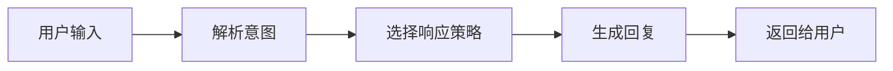
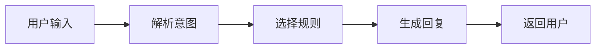
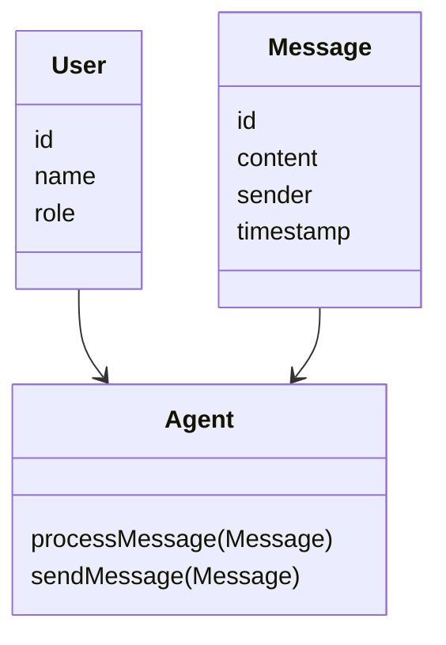
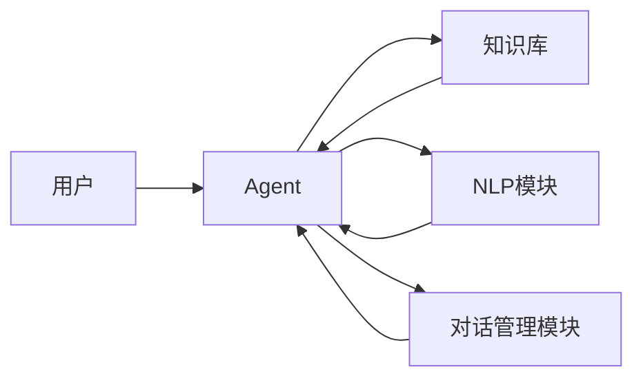
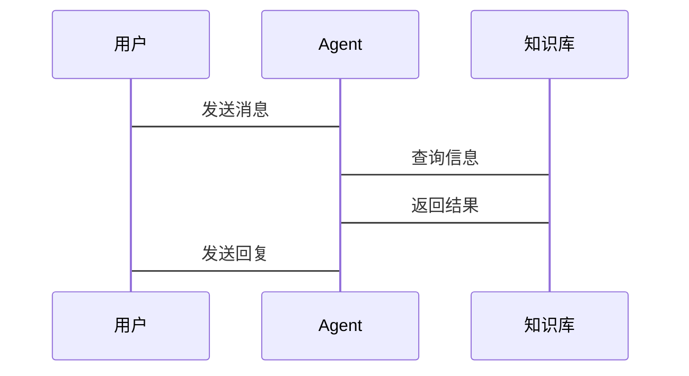

                 


# 构建企业级对话式AI Agent：提升内部沟通效率

> 关键词：企业级对话式AI Agent，内部沟通效率，自然语言处理，对话管理，知识库检索

> 摘要：本文详细探讨了构建企业级对话式AI Agent的技术细节与实现方案，从问题背景、核心概念、算法原理到系统架构设计，再到项目实战，系统性地分析了如何利用对话式AI Agent提升企业内部沟通效率。文章通过丰富的技术细节和实际案例，展示了如何通过自然语言处理、对话管理和知识库检索等技术，构建高效、智能的内部沟通工具。

---

# 第1章: 构建企业级对话式AI Agent的背景与目标

## 1.1 企业内部沟通效率的问题背景

企业在日常运营中，内部沟通效率低下是一个普遍存在的问题。传统的邮件、即时通讯工具和会议等方式存在以下痛点：

- **信息孤岛**：各部门之间的信息分散，难以快速共享和检索。
- **沟通不畅**：信息传递过程中容易出现误解，导致效率下降。
- **效率瓶颈**：寻找特定信息或协调任务时，往往需要花费大量时间。

通过引入对话式AI Agent，可以实时处理和理解员工的沟通需求，自动协调资源，提升内部协作效率。

## 1.2 对话式AI Agent的定义与目标

### 1.2.1 对话式AI Agent的定义

对话式AI Agent是一种基于自然语言处理（NLP）技术的智能系统，能够通过自然语言理解用户需求，并通过对话形式提供服务。它不同于传统的聊天机器人，具有更强的上下文理解和任务执行能力。

### 1.2.2 对话式AI Agent的核心目标

- 提供实时、智能的内部沟通支持。
- 自动处理和协调内部任务。
- 提高员工工作效率，减少沟通成本。

### 1.2.3 对话式AI Agent的边界与外延

- **边界**：专注于内部沟通和任务处理，不涉及外部服务。
- **外延**：可以与企业现有的CRM、ERP等系统集成，扩展功能。

## 1.3 本章小结

本章通过分析企业内部沟通的痛点，提出了对话式AI Agent的定义和目标，并明确了其在企业内部的应用场景。

---

# 第2章: 对话式AI Agent的核心概念与技术原理

## 2.1 对话式AI Agent的工作原理

### 2.1.1 自然语言处理（NLP）的基础原理

NLP通过处理文本数据，理解用户的意图。常见的NLP任务包括分词、句法分析、情感分析和文本生成。

**示例代码：**
```python
from transformers import pipeline
nlp = pipeline("text-classification", model="facebook/roberta-base")
result = nlp("I love this product!")
print(result)
```

### 2.1.2 对话管理与上下文理解

对话管理负责维护对话状态，确保上下文连贯。常用的方法包括基于规则的对话管理和基于强化学习的对话管理。

**示意图：**



### 2.1.3 知识库与信息检索机制

知识库存储企业内部信息，信息检索通过关键词或上下文匹配，快速获取所需数据。

**示例：**
- 用户输入：“请帮我查找上周五的会议记录。”
- 系统检索知识库，返回相关文档。

## 2.2 对话式AI Agent的技术架构

### 2.2.1 基于规则的对话系统

通过预定义规则处理对话，适用于场景简单的企业内部沟通。

### 2.2.2 基于统计模型的对话系统

利用机器学习模型，通过数据训练生成回复，效果优于规则系统。

### 2.2.3 基于深度学习的对话系统

采用如GPT等模型，生成更自然的对话回复。

## 2.3 对话式AI Agent与传统聊天机器人的区别

| 特性                | 对话式AI Agent                     | 传统聊天机器人                 |
|---------------------|------------------------------------|------------------------------|
| 功能                | 内部任务处理、信息检索             | 基本对话、信息查询             |
| 技术实现            | 深度学习、知识库检索               | 规则引擎、简单NLP             |
| 目标用户            | 企业员工                          | 普通用户                      |

## 2.4 本章小结

本章详细介绍了对话式AI Agent的核心概念和技术原理，分析了其与传统聊天机器人的区别，为后续实现奠定了基础。

---

# 第3章: 对话式AI Agent的算法原理

## 3.1 自然语言处理（NLP）的核心算法

### 3.1.1 词嵌入算法（如Word2Vec、GloVe）

**公式：**
$$ E(w_i) = \sum_{j} E(w_j) \cdot w_{i,j} $$

**示例代码：**
```python
import gensim
model = gensim.models.Word2Vec.load("word2vec.model")
print(model.wv["computer"])
```

### 3.1.2 语义理解算法（如BERT）

**公式：**
$$ \text{BERT}(x) = \text{max}(x_1, x_2, ..., x_n) $$

### 3.1.3 文本生成算法（如GPT）

**公式：**
$$ P(y|x) = \prod_{i=1}^{n} P(y_i|y_{i-1},x) $$

**示例代码：**
```python
import torch
from transformers import AutoTokenizer, AutoModelForCausalLM
tokenizer = AutoTokenizer.from_pretrained("gpt2")
model = AutoModelForCausalLM.from_pretrained("gpt2")
inputs = tokenizer("请描述一下深度学习的基本概念", return_tensors="pt")
outputs = model.generate(inputs.input_ids, max_length=50)
print(tokenizer.decode(outputs[0], skip_special_tokens=True))
```

## 3.2 对话管理算法

### 3.2.1 基于规则的对话管理

**示意图：**


### 3.2.2 基于强化学习的对话管理

**公式：**
$$ \text{奖励} = r(s', a) $$

### 3.2.3 基于记忆网络的对话管理

**公式：**
$$ m_t = \text{Lookup}(m_{t-1}, a_t) $$

## 3.3 知识库与信息检索算法

### 3.3.1 基于向量的检索算法

**公式：**
$$ \text{相似度} = \frac{\text{向量点积}}{\|\text{向量}\|} $$

**示例代码：**
```python
import numpy as np
vector1 = np.array([1, 2, 3])
vector2 = np.array([4, 5, 6])
similarity = np.dot(vector1, vector2) / (np.linalg.norm(vector1) * np.linalg.norm(vector2))
print(similarity)
```

## 3.4 本章小结

本章详细讲解了对话式AI Agent中常用的NLP算法和对话管理算法，并通过代码示例帮助读者理解实现细节。

---

# 第4章: 对话式AI Agent的系统架构设计

## 4.1 系统功能设计

**领域模型：**


## 4.2 系统架构设计

**系统架构：**


## 4.3 系统接口设计

- 用户接口：WebSocket、HTTP API
- 知识库接口：RESTful API

## 4.4 系统交互设计

**交互流程：**


## 4.5 本章小结

本章通过系统架构设计，展示了对话式AI Agent的整体结构和各模块之间的交互关系。

---

# 第5章: 对话式AI Agent的项目实战

## 5.1 环境安装

- Python 3.8+
- Transformers库
- Flask框架

## 5.2 系统核心实现

### 5.2.1 NLP模块实现

**代码示例：**
```python
from transformers import pipeline
nlp = pipeline("text-classification", model="facebook/roberta-base")
```

### 5.2.2 对话管理模块实现

**代码示例：**
```python
class DialogManager:
    def __init__(self):
        self.context = {}
    
    def process_message(self, message):
        # 处理消息并更新上下文
        pass
```

### 5.2.3 知识库检索模块实现

**代码示例：**
```python
import sqlite3
conn = sqlite3.connect("knowledge_base.db")
cursor = conn.cursor()
cursor.execute("SELECT * FROM records WHERE content LIKE '%会议记录%'")
```

## 5.3 代码应用解读与分析

- **NLP模块**：负责解析用户意图。
- **对话管理模块**：维护对话状态。
- **知识库检索模块**：提供信息支持。

## 5.4 实际案例分析

**案例：**
用户输入：“请帮我安排明天的会议。”
- 系统解析意图：安排会议。
- 系统查询日历，确认时间。
- 系统发送提醒。

## 5.5 本章小结

本章通过一个实际案例，展示了对话式AI Agent的实现过程和应用场景。

---

# 第6章: 对话式AI Agent的最佳实践与总结

## 6.1 最佳实践

- **数据质量**：确保知识库数据的准确性和完整性。
- **用户体验**：提供友好的对话界面和反馈机制。
- **系统维护**：定期更新模型和知识库。

## 6.2 小结

对话式AI Agent通过自然语言处理和知识库检索技术，显著提升了企业内部沟通效率。其核心在于理解用户需求，并通过智能对话实现任务自动化。

## 6.3 注意事项

- 对话系统需要处理歧义和模糊查询。
- 知识库需要定期更新，确保信息准确性。

## 6.4 拓展阅读

- 深度学习模型在对话系统中的应用。
- 对话式AI Agent与其他企业系统的集成。

---

# 作者

作者：AI天才研究院/AI Genius Institute & 禅与计算机程序设计艺术 /Zen And The Art of Computer Programming

