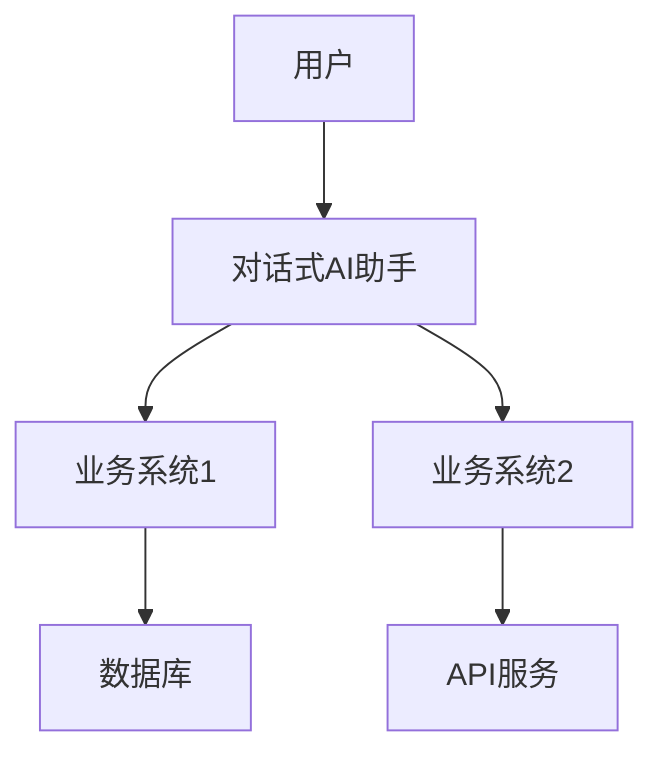
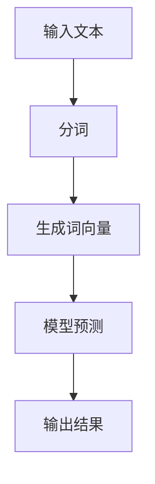
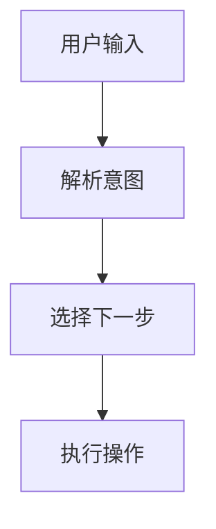
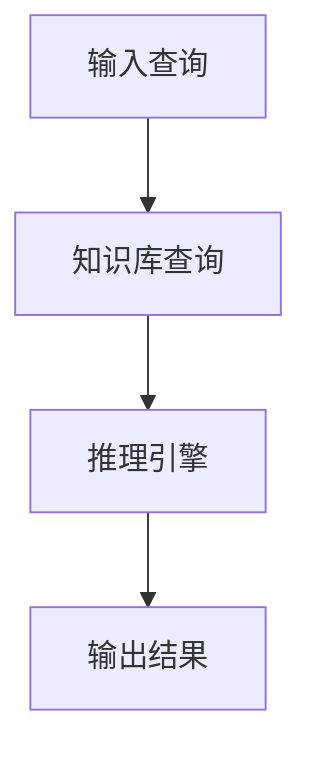
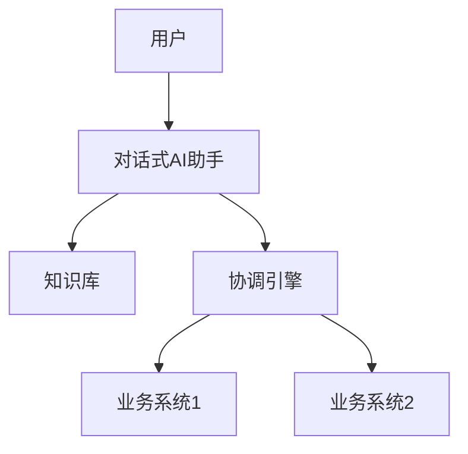

                 


# 《构建企业级对话式AI助手：跨系统业务流程自动化与协调》

## 关键词：对话式AI助手、跨系统业务流程、自动化、系统集成、知识表示、自然语言处理

## 摘要：  
本文详细探讨了构建企业级对话式AI助手的核心技术与实现方法，重点分析了跨系统业务流程自动化与协调的关键问题。通过结合自然语言处理、对话管理、知识表示与推理等技术，本文提出了一个创新的系统架构，展示了如何实现多系统间的高效协同。文章还提供了具体的算法实现、系统设计和项目实战案例，帮助读者深入理解并掌握构建此类系统的技能。

---

# 第一部分: 背景介绍与核心概念

## 第1章: 企业级对话式AI助手的背景与需求

### 1.1 问题背景
#### 1.1.1 传统企业业务流程的痛点
传统企业中，业务流程往往分散在多个系统中，例如CRM、ERP、订单管理系统等。这些系统之间存在信息孤岛，导致流程效率低下、数据重复录入、用户体验差等问题。此外，人工处理流程的复杂性也增加了出错风险和时间成本。

#### 1.1.2 对话式AI助手的兴起
随着自然语言处理（NLP）技术的成熟，对话式AI助手逐渐成为企业数字化转型的重要工具。通过自然语言交互，用户可以以更直观的方式与系统交互，简化操作流程。

#### 1.1.3 跨系统业务流程自动化的需求
企业需要将分散在不同系统中的业务流程自动化，并通过对话式AI助手统一协调这些流程。这不仅提高了效率，还减少了人为错误，优化了用户体验。

### 1.2 问题描述
#### 1.2.1 业务流程中的信息孤岛问题
信息孤岛导致数据无法共享，流程无法无缝衔接，增加了协调成本。

#### 1.2.2 对話式AI助手的定位与目标
对话式AI助手作为企业数字化转型的核心工具，旨在通过自然语言交互，协调多个系统完成复杂的业务流程。

#### 1.2.3 跨系统协调的核心挑战
跨系统协调涉及复杂的通信协议、数据格式和业务逻辑，需要高效的系统架构和协调机制。

### 1.3 问题解决
#### 1.3.1 对話式AI助手的核心功能
- 自然语言理解（NLU）：解析用户的意图。
- 对話管理：维护上下文，引导对话流程。
- 知识库查询：基于用户需求检索相关信息。
- 多系统协调：调用不同系统的API完成任务。

#### 1.3.2 跨系统业务流程自动化的实现
通过API调用、消息队列和事件驱动的方式，实现系统的无缝协作。

#### 1.3.3 对話式AI助手的边界与外延
- 边界：仅处理用户请求和系统协调，不直接处理底层业务逻辑。
- 外延：可扩展到更多系统和业务流程。

### 1.4 概念结构与核心要素
#### 1.4.1 对話式AI助手的组成要素
- 用户界面：文本或语音输入输出。
- 对話管理模块：维护对话状态。
- 知识库：存储业务数据和规则。
- 协调引擎：调用外部系统API。

#### 1.4.2 跨系统业务流程的核心要素
- 通信协议：HTTP、WebSocket等。
- 数据格式：JSON、XML等。
- 业务逻辑：定义流程步骤和依赖关系。

#### 1.4.3 对話式AI助手与業務流程的关联关系
对话式AI助手作为桥梁，连接用户和多个业务系统，协调完成业务流程。

### 1.5 本章小结
本章介绍了企业级对话式AI助手的背景、需求和实现目标，明确了系统的核心功能和架构。

---

## 第2章: 对話式AI助手的核心概念与联系

### 2.1 核心概念原理
#### 2.1.1 自然语言处理（NLP）的基本原理
NLP通过词袋模型、TF-IDF、BERT等模型，将自然语言文本转化为计算机可理解的结构。

#### 2.1.2 对話管理的核心算法
基于决策树或状态机的对话管理算法，维护对话上下文，引导对话流程。

#### 2.1.3 知识表示与推理的原理
使用知识图谱表示知识，并通过规则推理或机器学习模型进行推理。

### 2.2 核心概念属性特征对比表
| 概念 | 属性 | 特征 |
|------|------|------|
| 对話式AI助手 | 输入方式 | 文本/语音输入 |
|          | 输出方式 | 文本/语音输出 |
|          | 智能程度 | 基于预训练模型 |
| 跨系统业务流程 | 协调方式 | API调用/消息队列 |
|          | 执行方式 | 异步/同步 |
|          | 路由方式 | 基于规则/基于学习 |

### 2.3 实体关系架构图


### 2.4 本章小结
本章详细讲解了对话式AI助手的核心概念和系统架构，通过对比和流程图展示了各模块之间的关系。

---

## 第3章: 算法原理讲解

### 3.1 自然语言处理（NLP）算法
#### 3.1.1 词袋模型
使用词袋模型将文本表示为词频向量，用于分类或聚类任务。

#### 3.1.2 BERT模型
BERT通过预训练和微调，实现上下文理解。

#### 3.1.3 算法流程图


#### 3.1.4 Python实现示例
```python
import torch
from transformers import BertTokenizer, BertModel

tokenizer = BertTokenizer.from_pretrained('bert-base-uncased')
model = BertModel.from_pretrained('bert-base-uncased')

def process_input(text):
    inputs = tokenizer(text, return_tensors='pt')
    outputs = model(**inputs)
    return outputs.last_hidden_state
```

### 3.2 对話管理算法
#### 3.2.1 基于决策树的对话管理
通过决策树定义对话流程，根据用户输入选择下一步操作。

#### 3.2.2 基于状态机的对话管理
使用状态机维护对话上下文，处理用户输入并触发相应操作。

#### 3.2.3 算法流程图


### 3.3 知识表示与推理
#### 3.3.1 知识图谱表示
使用知识图谱存储实体和关系，通过SPARQL查询知识。

#### 3.3.2 基于规则的推理
根据预定义规则，推理出结论。

#### 3.3.3 基于机器学习的推理
使用深度学习模型进行推理。

#### 3.3.4 算法流程图


### 3.4 本章小结
本章详细讲解了对话式AI助手中的关键算法，包括NLP、对话管理和知识表示与推理。

---

## 第4章: 系统分析与架构设计

### 4.1 项目背景
企业需要一个统一的对话式AI助手，协调多个系统完成业务流程。

### 4.2 系统功能设计
#### 4.2.1 用户界面
- 文本输入输出。
- 历史记录查看。
- 多语言支持。

#### 4.2.2 对話管理模块
- 维护对话上下文。
- 处理用户输入并生成响应。

#### 4.2.3 知识库模块
- 存储业务知识。
- 提供知识查询和推理功能。

#### 4.2.4 协调引擎
- 调用外部系统API。
- 处理消息队列。

### 4.3 系统架构设计


### 4.4 系统接口设计
- 用户接口：RESTful API。
- 系统间接口：WebSocket、RabbitMQ。

### 4.5 本章小结
本章设计了系统的功能模块和架构，展示了如何实现跨系统的业务流程协调。

---

## 第5章: 项目实战

### 5.1 环境安装
安装Python、JDK、Docker等开发工具，以及相关库如Flask、Django。

### 5.2 核心代码实现
#### 5.2.1 对話管理模块
```python
class DialogManager:
    def __init__(self):
        self.context = {}

    def process_input(self, input_text):
        # 解析意图并更新上下文
        pass
```

#### 5.2.2 知识库模块
```python
class KnowledgeBase:
    def __init__(self):
        self.data = {}

    def query(self, query):
        # 返回查询结果
        pass
```

#### 5.2.3 协调引擎
```python
class Coordinator:
    def __init__(self):
        self.systems = {}

    def call_system(self, system_id, action):
        # 调用系统API
        pass
```

### 5.3 代码应用解读
解释代码的作用和实现细节，展示如何实现对话管理和系统协调。

### 5.4 实际案例分析
通过具体案例展示对话式AI助手如何协调多个系统完成业务流程。

### 5.5 本章小结
本章通过实战展示了如何实现对话式AI助手的核心功能，并分析了实际应用案例。

---

## 第6章: 最佳实践

### 6.1 小结
总结构建企业级对话式AI助手的关键点。

### 6.2 注意事项
- 确保系统的安全性。
- 定期更新知识库。
- 优化对话流程。

### 6.3 拓展阅读
推荐相关书籍和论文，供读者深入学习。

---

# 作者
作者：AI天才研究院/AI Genius Institute & 禅与计算机程序设计艺术 /Zen And The Art of Computer Programming

