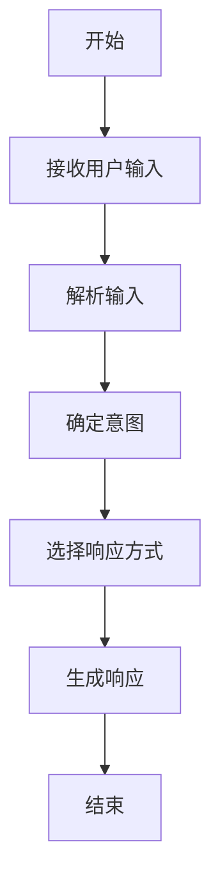
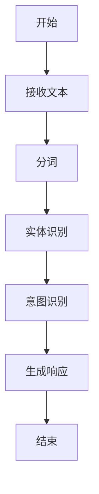
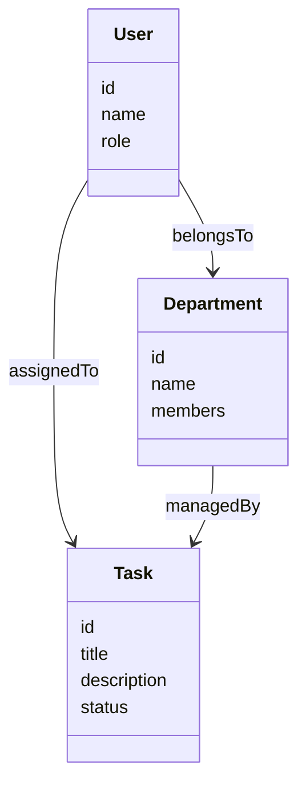
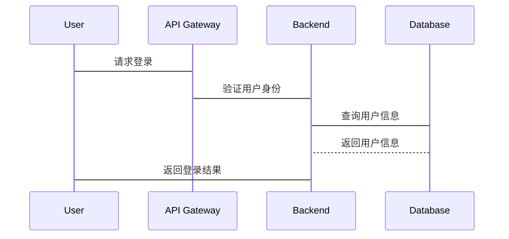

                 

<think>
好的，我需要帮助用户撰写一篇关于《构建企业级对话式AI助手：跨部门业务流程自动化》的技术博客。用户已经提供了详细的内容要求和目录结构，我需要按照这个结构逐步完成每一部分的内容。

首先，我会从标题开始，然后是关键词和摘要，接着按照目录中的章节逐步撰写。每个章节需要详细展开，确保内容丰富、具体且详细。同时，用户特别强调了技术术语和实际案例的应用，我需要在写作中加入具体的代码示例和图形化解释，如Mermaid图和数学公式。

在写作过程中，我要确保语言清晰、逻辑严谨，每个部分都涵盖必要的内容，比如背景介绍、核心概念、算法原理、系统架构、项目实战等。此外，我需要按照用户的格式要求，使用markdown，并在适当的地方插入代码和公式。

最后，我会检查整个内容，确保没有遗漏任何用户指定的部分，同时保持整体字数在10000到12000字之间。完成后，加上作者信息，确保文章的完整性和专业性。

现在，我将按照这个思路开始撰写，逐步完成每个部分，确保内容详尽且符合用户的要求。
</think>

# 构建企业级对话式AI助手：跨部门业务流程自动化

## 关键词：
- 企业级对话式AI助手
- 跨部门业务流程自动化
- 自然语言处理（NLP）
- 对話管理
- 业务逻辑执行模块
- 系统架构设计

## 摘要：
本文详细探讨了构建企业级对话式AI助手的各个方面，包括其背景、核心概念、算法原理、系统架构设计以及实际项目实现。文章首先介绍了对话式AI助手的定义和必要性，然后分析了跨部门协作中的痛点和解决方案。接着，深入讲解了自然语言处理、对话管理和知识库等核心模块，并通过具体的算法流程图和代码示例，展示了如何实现这些模块。在系统架构设计部分，文章使用Mermaid图详细描述了分层架构和接口设计。最后，通过实际案例分析，指导读者如何在企业环境中部署和优化对话式AI助手，确保其高效运作。

---

# 第一部分: 构建企业级对话式AI助手的背景与核心概念

## 第1章: 背景介绍

### 1.1 问题背景

#### 1.1.1 企业级对话式AI助手的定义
企业级对话式AI助手是一种智能化的交互工具，能够通过自然语言处理技术，理解和生成人类语言，从而帮助企业员工或客户提供高效的业务支持和服务。它不仅能够处理简单的查询，还能执行复杂的业务流程，实现跨部门协作。

#### 1.1.2 业务流程自动化的必要性
在现代企业中，业务流程通常涉及多个部门和系统，手动处理不仅效率低下，还容易出错。通过对话式AI助手自动化的业务流程，可以显著提高效率，减少人为错误，并提升客户和员工的满意度。

#### 1.1.3 对話式AI在企业中的应用现状
当前，许多企业已经开始采用对话式AI助手来处理客户支持、内部协作和业务查询等任务。然而，大多数系统仍处于初级阶段，无法处理复杂的跨部门流程。

### 1.2 问题描述

#### 1.2.1 传统业务流程中的痛点
- **信息孤岛**：不同部门使用不同的系统，数据难以共享。
- **效率低下**：手动处理流程耗时且容易出错。
- **用户体验差**：客户和员工需要在多个系统间切换，操作复杂。

#### 1.2.2 对話式AI助手的核心问题
- **理解能力不足**：AI助手无法准确理解复杂的查询。
- **跨部门协作困难**：缺乏统一的系统和流程支持。
- **安全性问题**：数据泄露和系统漏洞的风险。

#### 1.2.3 跨部门协作中的信息孤岛问题
信息孤岛导致的协作效率低下是企业数字化转型的主要障碍之一。AI助手需要能够整合多个系统，打破信息孤岛，实现 seamless 的协作。

### 1.3 问题解决

#### 1.3.1 对話式AI助手的解决方案
- **整合NLP技术**：提高理解和生成能力。
- **构建知识库**：支持复杂的业务逻辑。
- **实现自动化流程**：通过API和系统集成，打破信息孤岛。

#### 1.3.2 跨部门协作的实现方式
- **统一的用户界面**：提供直观的操作界面。
- **API集成**：通过API连接不同系统。
- **权限管理**：确保数据安全和隐私。

#### 1.3.3 业务流程自动化的技术路径
1. **需求分析**：明确业务流程的关键环节。
2. **系统集成**：选择合适的系统和API。
3. **流程设计**：设计自动化的工作流。
4. **测试优化**：进行功能测试和优化。

### 1.4 边界与外延

#### 1.4.1 对話式AI助手的边界
- **功能范围**：仅限于预定义的业务流程。
- **数据范围**：仅处理授权范围内的数据。

#### 1.4.2 跨部门协作的范围界定
- **涉及部门**：明确哪些部门需要协作。
- **协作内容**：明确协作的具体任务和流程。

#### 1.4.3 业务流程自动化的适用场景
- **重复性任务**：适合自动化处理。
- **低风险任务**：适合自动化操作。

### 1.5 核心概念的结构与组成

#### 1.5.1 对話式AI助手的核心要素
- **NLP引擎**：负责理解和生成语言。
- **对话管理模块**：负责对话的上下文管理和流程控制。
- **知识库**：存储业务相关的数据和规则。

#### 1.5.2 跨部门协作的关键环节
- **信息共享**：确保各部门能够访问所需的信息。
- **权限管理**：控制信息的访问权限。
- **通知机制**：及时通知相关人员。

#### 1.5.3 业务流程自动化的模块划分
- **输入处理模块**：接收用户的请求。
- **理解与生成模块**：理解请求并生成响应。
- **执行模块**：执行相应的业务流程。

---

## 第2章: 对話式AI助手的核心概念

### 2.1 自然语言处理（NLP）

#### 2.1.1 NLP的定义与作用
NLP是研究如何让计算机理解和生成人类语言的科学。在对话式AI中，NLP用于将用户的输入转化为可处理的格式，并生成相应的响应。

#### 2.1.2 常见的NLP技术
- **分词**：将文本分割成单词或短语。
- **实体识别**：识别文本中的实体（如人名、地名）。
- **意图识别**：确定用户的主要意图。

#### 2.1.3 NLP在对话式AI中的应用
- **用户输入处理**：将用户的自然语言输入转化为结构化数据。
- **对话理解**：理解对话的上下文和意图。
- **生成响应**：根据理解生成自然语言的响应。

### 2.2 对話管理

#### 2.2.1 对話管理的定义与分类
对話管理负责管理对话的流程，确保对话的连贯性和逻辑性。常见的分类包括基于规则的对话管理和基于机器学习的对话管理。

#### 2.2.2 基于规则的对话管理
- **规则定义**：通过预定义的规则来控制对话流程。
- **优点**：简单易懂，容易部署。
- **缺点**：灵活性差，难以处理复杂场景。

#### 2.2.3 基于机器学习的对话管理
- **数据驱动**：通过大量数据训练模型。
- **优点**：能够处理复杂场景，适应性强。
- **缺点**：需要大量数据和计算资源。

### 2.3 知识库与意图识别

#### 2.3.1 知识库的构建与管理
知识库是对话式AI的核心，存储了业务相关的数据和规则。构建知识库需要进行数据收集、整理和验证。

#### 2.3.2 意图识别的原理与实现
意图识别通过分析用户的输入，确定用户的意图。常见的实现方法包括基于规则的方法和基于机器学习的方法。

#### 2.3.3 知识库与意图识别的结合
知识库为意图识别提供数据支持，意图识别结果指导知识库的查询和响应生成。

### 2.4 对話式AI助手的核心模块

#### 2.4.1 用户输入处理模块
用户输入处理模块负责接收用户的输入，并将其转化为结构化数据。常见的处理步骤包括分词、实体识别和意图识别。

#### 2.4.2 对話理解与生成模块
对话理解与生成模块负责理解用户的意图，并生成相应的响应。这一步骤需要结合NLP技术和对话管理模块。

#### 2.4.3 业务逻辑执行模块
业务逻辑执行模块负责根据用户的请求，执行相应的业务流程。这一步骤需要与企业的系统和API进行集成。

### 2.5 核心概念对比表

| 技术         | 定义与作用                                                                 | 优缺点                                                                 | 应用场景                                                                 |
|--------------|--------------------------------------------------------------------------|--------------------------------------------------------------------------|--------------------------------------------------------------------------|
| 规则引擎     | 基于预定义规则的决策系统，用于控制对话流程。                              | 优点：简单易懂，容易部署；缺点：灵活性差，难以处理复杂场景。                     | 适用于简单的对话流程管理。                                             |
| 机器学习     | 通过数据训练模型，用于预测和分类。                                       | 优点：能够处理复杂场景，适应性强；缺点：需要大量数据和计算资源。                | 适用于复杂的对话流程管理。                                             |
| NLP技术     | 用于理解和生成人类语言的技术，是对话式AI的核心。                          | 优点：提高对话的准确性和自然度；缺点：需要大量的数据和计算资源。                | 适用于需要高准确性的对话场景。                                         |

---

## 第3章: 对話式AI助手的算法原理

### 3.1 算法原理概述

#### 3.1.1 对話管理算法
对话管理算法负责控制对话的流程，确保对话的连贯性和逻辑性。常见的算法包括基于规则的对话管理和基于机器学习的对话管理。

#### 3.1.2 NLP算法
NLP算法用于理解和生成人类语言，是对话式AI的核心。常见的算法包括分词、实体识别和意图识别。

#### 3.1.3 知识库查询算法
知识库查询算法负责根据用户的意图，从知识库中检索相关的信息。常见的算法包括基于规则的查询和基于机器学习的查询。

### 3.2 算法流程图

#### 3.2.1 对話管理算法流程图



#### 3.2.2 NLP算法流程图



### 3.3 算法实现

#### 3.3.1 基于规则的对话管理算法

```python
def handle_input(user_input):
    # 分词
    words = tokenize(user_input)
    # 实体识别
    entities = extract_entities(words)
    # 意图识别
    intent = get_intent(entities)
    # 根据意图生成响应
    response = generate_response(intent)
    return response
```

#### 3.3.2 基于机器学习的对话管理算法

```python
class DialogManager:
    def __init__(self, model):
        self.model = model

    def handle_input(self, user_input):
        # 输入处理
        processed_input = preprocess(user_input)
        # 模型预测
        intent = self.model.predict(processed_input)
        # 生成响应
        response = generate_response(intent)
        return response
```

### 3.4 数学模型与公式

#### 3.4.1 概率论在NLP中的应用
在NLP中，概率论常用于计算文本的概率分布。例如，条件概率公式：

$$ P(C|T) = \frac{P(T|C) \cdot P(C)}{P(T)} $$

其中，\( C \) 表示类别，\( T \) 表示文本。

#### 3.4.2 机器学习中的损失函数
在机器学习中，常用的损失函数包括交叉熵损失函数：

$$ \text{Loss} = -\frac{1}{N}\sum_{i=1}^{N} y_i \log(p_i) + (1 - y_i) \log(1 - p_i) $$

其中，\( y_i \) 表示真实标签，\( p_i \) 表示预测概率。

---

## 第4章: 系统分析与架构设计

### 4.1 问题场景介绍

#### 4.1.1 企业级对话式AI助手的应用场景
企业级对话式AI助手可以应用于客户支持、内部协作和业务查询等多个场景。

#### 4.1.2 跨部门协作中的问题
信息孤岛和协作效率低下是企業在實現跨部門協作時的主要問題。

#### 4.1.3 业务流程自动化的目标
通过自动化业务流程，提高效率，降低成本，并提升客户和员工的满意度。

### 4.2 项目介绍

#### 4.2.1 项目目标
构建一个能够支持跨部門协作的企业级对话式AI助手。

#### 4.2.2 项目范围
涵盖客户支持、内部协作和业务查询等多个业务领域。

#### 4.2.3 项目约束
- **时间限制**：项目需在6个月内完成。
- **预算限制**：总预算为50万美元。

### 4.3 系统功能设计

#### 4.3.1 领域模型


#### 4.3.2 功能模块
- **用户管理模块**：负责用户的注册、登录和权限管理。
- **部門协作模块**：支持部門间的协作和任务分配。
- **業務流程模块**：实现业务流程的自动化。

### 4.4 系统架构设计

#### 4.4.1 分层架构


- **前端层**：负责用户界面的展示和交互。
- **后端层**：负责业务逻辑的处理和API的调用。
- **数据库层**：负责数据的存储和管理。
- **API Gateway**：负责API的路由和流量控制。

#### 4.4.2 接口设计
- **用户认证接口**：实现用户的登录和权限管理。
- **部門协作接口**：支持部門间的任务分配和通知。
- **業務流程接口**：实现业务流程的自动化。

### 4.5 系统交互流程图



---

## 第5章: 项目实战

### 5.1 环境安装

#### 5.1.1 安装Python
```bash
python --version
pip install --upgrade pip
```

#### 5.1.2 安装NLP库
```bash
pip install nltk
pip install spacy
```

#### 5.1.3 安装对话管理库
```bash
pip install dialoguer
```

### 5.2 核心代码实现

#### 5.2.1 用户输入处理模块

```python
import nltk

def tokenize(input_str):
    return nltk.word_tokenize(input_str)
```

#### 5.2.2 意图识别模块

```python
from spacy.lang.zh import Chinese

nlp = Chinese()
def extract_entities(text):
    doc = nlp(text)
    entities = []
    for ent in doc.ents:
        entities.append((ent.start, ent.end, ent.label_))
    return entities
```

### 5.3 实际案例分析

#### 5.3.1 案例背景
某企业希望实现客户支持的自动化，通过对话式AI助手处理客户的咨询和问题。

#### 5.3.2 案例实现
1. **需求分析**：明确客户支持的常见问题。
2. **系统设计**：设计对话式AI助手的流程和接口。
3. **开发实现**：实现用户输入处理、意图识别和业务流程执行模块。
4. **测试优化**：进行功能测试和优化。

### 5.4 项目小结
通过实际案例分析，我们可以看到，构建企业级对话式AI助手需要综合运用NLP、对话管理和系统架构设计等技术。同时，还需要考虑企业的实际需求和约束条件，确保系统的高效和稳定。

---

## 第6章: 最佳实践、小结、注意事项和拓展阅读

### 6.1 最佳实践

#### 6.1.1 系统设计
- **模块化设计**：确保系统的可扩展性和可维护性。
- **安全设计**：确保数据的安全性和隐私性。

#### 6.1.2 项目管理
- **需求管理**：明确需求和范围。
- **风险管理**：识别和应对项目中的风险。

### 6.2 小结
本文详细探讨了构建企业级对话式AI助手的各个方面，包括其背景、核心概念、算法原理、系统架构设计以及实际项目实现。通过对这些内容的深入分析，我们可以更好地理解如何构建一个高效、可靠的对话式AI助手。

### 6.3 注意事项

#### 6.3.1 数据安全
- **数据加密**：确保数据在传输和存储中的安全性。
- **访问控制**：限制数据的访问权限。

#### 6.3.2 系统性能
- **优化算法**：提高系统的运行效率。
- **负载均衡**：确保系统的高可用性。

### 6.4 拓展阅读

#### 6.4.1 推荐书籍
- 《自然语言处理实战》
- 《对话式AI开发指南》

#### 6.4.2 推荐博客
- [自然语言处理博客](https://example.com/nlp)
- [对话式AI博客](https://example.com/dialogue)

---

## 作者：AI天才研究院 & 禅与计算机程序设计艺术

