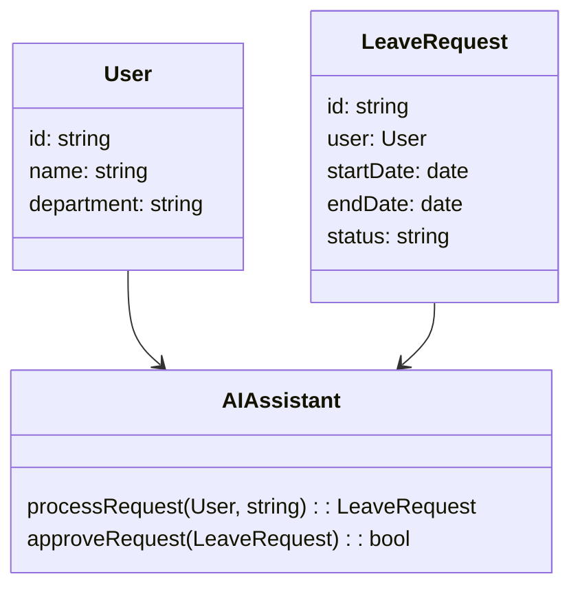
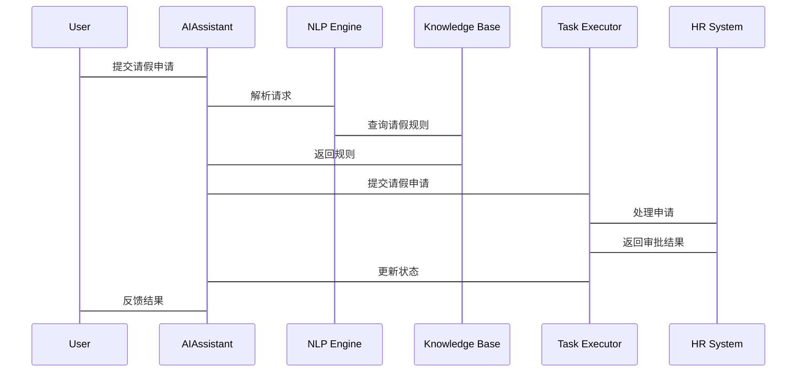

                 


# 构建企业级对话式AI助手：跨部门业务流程自动化与协同

## 关键词：对话式AI助手，自然语言处理，业务流程自动化，跨部门协作，系统架构，企业数字化转型

## 摘要：  
本文系统阐述了构建企业级对话式AI助手的完整过程，涵盖技术原理、系统架构、项目实战及最佳实践。通过深入分析对话式AI的核心技术，结合实际案例，展示如何实现跨部门业务流程的自动化与协同，助力企业数字化转型。

---

# 第一部分: 背景与概述

# 第1章: 对话式AI助手的背景与核心概念

## 1.1 问题背景

### 1.1.1 企业级对话式AI的需求背景
在企业环境中，员工需要处理大量跨部门协作的任务，例如审批流程、信息查询、任务分配等。传统的方式依赖于邮件、即时通讯工具或线下流程，效率低且容易出错。对话式AI助手能够通过自然语言处理技术，简化这些流程，提供实时、高效的解决方案。

### 1.1.2 传统业务流程中的痛点
- **信息孤岛**：各部门之间数据分散，难以共享和协同。
- **效率低下**：手动处理流程耗时长，容易出错。
- **用户体验差**：员工需要在多个系统之间切换，操作复杂。
- **缺乏智能化支持**：缺乏自动化工具辅助决策。

### 1.1.3 对话式AI的解决方案
通过引入对话式AI助手，企业可以实现以下目标：
- 提供统一的入口，简化跨部门协作流程。
- 实现业务流程的自动化，减少人工干预。
- 提供智能化的决策支持，提升效率。
- 改善用户体验，提高员工满意度。

## 1.2 核心概念与定义

### 1.2.1 对话式AI助手的定义
对话式AI助手是一种基于自然语言处理技术的智能系统，能够通过文本或语音交互，理解和执行用户的请求，实现业务流程的自动化与协同。

### 1.2.2 跨部门业务流程的核心要素
- **用户需求分析**：识别用户的意图和需求。
- **信息抽取**：从对话中提取关键信息（如时间、地点、人物等）。
- **任务执行**：根据用户需求，调用相关系统完成任务。
- **反馈与交互**：通过对话形式向用户反馈执行结果，并支持进一步交互。

### 1.2.3 对话式AI助手的功能边界
- **核心功能**：自然语言理解、对话管理、任务执行。
- **辅助功能**：知识库管理、用户身份验证、日志记录。

## 1.3 技术基础与实现路径

### 1.3.1 自然语言处理技术
自然语言处理（NLP）是对话式AI的核心技术，包括分词、语义理解、意图识别等功能。

### 1.3.2 对话管理技术
对话管理技术负责维护对话状态，确保对话的连贯性和有效性。

### 1.3.3 知识表示与推理
通过知识图谱和规则引擎，对话式AI能够理解上下文关系，并进行推理。

## 1.4 应用价值与实际案例

### 1.4.1 对话式AI在企业中的应用场景
- **内部员工服务**：审批流程、信息查询、任务分配。
- **客户服务**：客户咨询、订单跟踪、问题反馈。
- **协作工具**：跨部门协调、日程管理、资源分配。

### 1.4.2 典型案例分析
例如，在一家大型企业中，对话式AI助手可以用于员工请假审批流程。员工只需通过对话形式提交请假申请，系统自动识别信息并提交给相关部门审批，大大提高了效率。

### 1.4.3 未来发展趋势
随着AI技术的不断进步，对话式AI助手将更加智能化，支持更复杂的业务流程，并实现跨平台的无缝集成。

---

# 第二部分: 核心概念与技术原理

# 第2章: 对话式AI助手的核心技术

## 2.1 自然语言处理技术

### 2.1.1 分词与词性标注
分词是将输入的文本分割成词语，词性标注是对每个词语进行词性分类。

### 2.1.2 语义理解与意图识别
语义理解通过分析上下文，识别用户的意图。意图识别是将用户的输入映射到预定义的意图类别。

### 2.1.3 基于上下文的对话理解
对话式AI需要理解上下文关系，确保对话的连贯性。

## 2.2 对话管理技术

### 2.2.1 对话状态表示
对话状态表示是对话管理的核心，通常包括当前对话的上下文信息和用户意图。

### 2.2.2 对话策略设计
对话策略是对话式AI在不同状态下选择最优回复的规则。

### 2.2.3 对话历史记录与记忆机制
对话式AI需要记录对话历史，确保在后续对话中能够保持连贯性。

## 2.3 知识表示与推理

### 2.3.1 知识图谱构建
知识图谱是将企业中的知识和信息以图结构的形式表示。

### 2.3.2 基于规则的推理
通过预定义的规则，对话式AI能够进行简单的推理和决策。

### 2.3.3 基于模型的推理
基于深度学习模型的推理能力更强，能够处理复杂的问题。

## 2.4 实体识别与槽位填充

### 2.4.1 实体识别技术
实体识别是通过NLP技术从文本中提取特定的实体信息。

### 2.4.2 槽位填充方法
槽位填充是根据提取的实体信息，填充到预定义的模板中。

### 2.4.3 实体关系分析
通过分析实体之间的关系，对话式AI能够更好地理解用户的意图。

---

# 第3章: 对话式AI助手的算法原理

## 3.1 模型训练与优化

### 3.1.1 预训练语言模型的微调
预训练语言模型（如BERT）通过微调可以适应特定的任务需求。

### 3.1.2 对话生成模型的训练策略
对话生成模型通常采用生成对抗网络（GAN）或Transformer架构。

### 3.1.3 模型评估与优化方法
通过BLEU、ROUGE等指标评估对话生成的质量，并进行优化。

## 3.2 对话生成算法

### 3.2.1 基于规则的生成方法
基于规则的生成方法简单但缺乏灵活性。

### 3.2.2 基于统计模型的生成方法
基于统计模型的生成方法能够处理一定规模的数据，但依赖于数据质量。

### 3.2.3 基于深度学习的生成方法
基于深度学习的生成方法效果最好，但需要大量的计算资源。

## 3.3 意图识别算法

### 3.3.1 基于词袋模型的意图识别
词袋模型通过统计词语的出现频率进行意图分类。

### 3.3.2 基于TF-IDF的意图识别
TF-IDF方法能够有效区分关键词的重要性。

### 3.3.3 基于深度学习的意图识别
基于深度学习的意图识别方法（如LSTM、Transformer）效果更优。

---

# 第三部分: 系统架构设计

# 第4章: 系统架构与实现

## 4.1 问题场景介绍
对话式AI助手需要处理复杂的跨部门协作任务，涉及多个系统的集成。

## 4.2 项目介绍
以企业内部员工请假审批流程为例，展示对话式AI助手的实现过程。

## 4.3 系统功能设计

### 4.3.1 领域模型


### 4.3.2 系统架构
```mermaid
client --> AIAssistant: send request
AIAssistant --> NLP Engine: parse request
NLP Engine --> Knowledge Base: query data
Knowledge Base <---> Database
AIAssistant --> Task Executor: execute task
Task Executor <---> Systems (e.g., HR System)
AIAssistant <---> User: send response
```

### 4.3.3 系统接口设计
- **输入接口**：自然语言文本或语音信号。
- **输出接口**：结构化的数据或自然语言文本。
- **系统集成接口**：与企业现有系统的API接口。

### 4.3.4 系统交互


---

# 第四部分: 项目实战

# 第5章: 项目实战

## 5.1 环境搭建

### 5.1.1 安装Python
```bash
python --version
pip install --upgrade pip
```

### 5.1.2 安装依赖库
```bash
pip install numpy
pip install transformers
pip install scikit-learn
```

## 5.2 核心代码实现

### 5.2.1 对话管理模块
```python
class DialogManager:
    def __init__(self):
        self.dialogue_state = {}
    
    def update_state(self, user_id, state):
        self.dialogue_state[user_id] = state
    
    def get_state(self, user_id):
        return self.dialogue_state.get(user_id, {})
```

### 5.2.2 意图识别模块
```python
from sklearn.feature_extraction.text import TfidfVectorizer
from sklearn.naive_bayes import MultinomialNB

class IntentClassifier:
    def __init__(self):
        self.vectorizer = TfidfVectorizer()
        self.classifier = MultinomialNB()
    
    def train(self, X, y):
        self.vectorizer.fit(X)
        X_vec = self.vectorizer.transform(X)
        self.classifier.fit(X_vec, y)
    
    def predict(self, text):
        X_vec = self.vectorizer.transform([text])
        return self.classifier.predict(X_vec)[0]
```

### 5.2.3 实体识别模块
```python
import spacy

nlp = spacy.load("en_core_web_sm")

def extract_entities(text):
    doc = nlp(text)
    entities = []
    for ent in doc.ents:
        entities.append((ent.text, ent.label_))
    return entities
```

## 5.3 案例分析与实现

### 5.3.1 假期申请流程
用户输入：“我需要请假一天。”
- 系统解析：提取实体“请假”和“一天”。
- 对话管理模块更新状态：标记用户为请假状态。
- 任务执行模块提交请假申请到HR系统。
- 返回结果：“请假申请已提交，请等待审批。”

## 5.4 项目总结
通过实际案例分析，展示了对话式AI助手在企业中的具体应用，以及实现过程中的关键步骤。

---

# 第五部分: 最佳实践与总结

# 第6章: 最佳实践与总结

## 6.1 开发规范

### 6.1.1 设计规范
- 明确系统边界和功能模块。
- 确保系统可扩展性。
- 提供详细的接口文档。

### 6.1.2 开发规范
- 使用模块化设计。
- 保持代码简洁易懂。
- 定期进行代码审查。

## 6.2 部署与维护

### 6.2.1 系统部署
- 使用容器化技术（如Docker）部署系统。
- 配置负载均衡和高可用性。

### 6.2.2 日志与监控
- 集成日志管理系统（如ELK）。
- 实时监控系统性能。

## 6.3 性能优化

### 6.3.1 模型优化
- 使用更高效的算法。
- 增加训练数据量。

### 6.3.2 系统优化
- 优化数据库查询。
- 减少不必要的系统调用。

## 6.4 安全与合规

### 6.4.1 数据安全
- 确保数据加密传输和存储。
- 遵守相关法律法规。

### 6.4.2 用户权限管理
- 实施严格的权限控制。
- 定期进行安全审计。

## 6.5 小结与展望

### 6.5.1 小结
对话式AI助手在企业中的应用前景广阔，能够显著提升业务效率和用户体验。

### 6.5.2 展望
随着技术的进步，对话式AI助手将更加智能化，支持更复杂的业务场景。

---

# 作者：AI天才研究院 & 禅与计算机程序设计艺术

