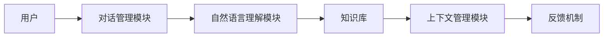
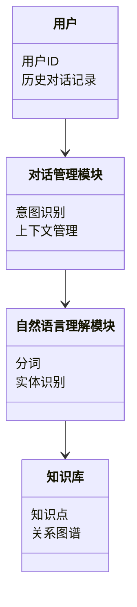
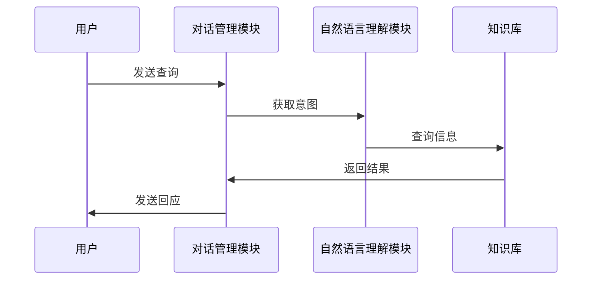

                 


# 构建企业级对话式AI平台：提升内外部沟通效率

## 关键词：对话式AI，企业级平台，自然语言处理，沟通效率，系统架构

## 摘要：构建一个企业级对话式AI平台是提升企业内外部沟通效率的关键。本文将从背景介绍、核心概念、算法原理、系统架构设计、项目实战到最佳实践，全面解析如何构建高效、智能的对话式AI平台，帮助企业在数字化转型中提升竞争力。

---

## 第一部分: 背景介绍

### 第1章: 对话式AI平台的背景与需求

#### 1.1 对话式AI的基本概念
##### 1.1.1 什么是对话式AI
对话式AI（Conversational AI）是一种能够理解和生成人类语言的智能系统，通过自然语言处理（NLP）技术，实现与用户的实时对话交互。它不仅能够理解用户输入的文字，还能根据上下文生成合适的回应。

##### 1.1.2 对话式AI的核心要素
- **自然语言理解（NLU）**：将用户的输入转化为计算机可理解的结构化数据。
- **对话管理（DM）**：根据上下文和用户意图，决定如何生成回应。
- **知识库**：存储对话所需的知识和信息，用于支持对话内容。
- **反馈机制**：根据对话结果进行优化和调整。

##### 1.1.3 对话式AI的应用场景
- **企业客服**：通过对话式AI提供24/7的客户支持。
- **内部沟通**：优化企业内部员工之间的沟通效率。
- **外部营销**：通过对话式界面与潜在客户互动，提升营销效果。

#### 1.2 企业级对话式AI的必要性
##### 1.2.1 企业内部沟通的痛点
- 信息孤岛：各部门之间信息不共享，导致效率低下。
- 沟通不畅：员工之间沟通不及时，影响工作效率。
- 信息过载：员工需要处理大量信息，难以快速找到所需内容。

##### 1.2.2 企业外部沟通的挑战
- 客户需求多样化：不同客户有不同的需求，人工难以快速响应。
- 售后服务成本高：传统客服模式成本高，且效率低。
- 品牌一致性：人工客服可能因为个人情绪影响服务质量，品牌一致性难以保证。

##### 1.2.3 对话式AI如何解决这些问题
对话式AI能够通过自动化处理，快速响应用户需求，减少人工干预，提升沟通效率。同时，通过智能化的对话管理，确保品牌一致性，降低企业运营成本。

#### 1.3 对话式AI的技术基础
##### 1.3.1 自然语言处理（NLP）
NLP技术是对话式AI的核心，包括分词、句法分析、实体识别、情感分析等任务，帮助系统理解用户输入的内容。

##### 1.3.2 机器学习与深度学习
通过机器学习和深度学习算法，对话式AI能够从大量数据中学习对话模式，生成更自然的回应。

##### 1.3.3 对话管理技术
对话管理技术负责根据用户输入和系统知识库，生成合适的回应，并管理对话的上下文。

#### 1.4 当前对话式AI的现状与趋势
##### 1.4.1 行业现状分析
目前，对话式AI在各个行业中有广泛的应用，尤其是在客服、销售和市场营销领域。然而，许多企业级对话式AI平台仍存在技术瓶颈，如对话上下文处理不准确、知识库更新不及时等问题。

##### 1.4.2 技术发展趋势
- **多轮对话**：支持更长的对话链条，提升用户体验。
- **多语言支持**：能够处理多种语言，满足全球化的业务需求。
- **个性化对话**：根据用户行为和偏好，提供个性化的对话体验。

##### 1.4.3 企业级应用的未来展望
未来，企业级对话式AI平台将更加智能化，能够与企业现有的CRM、ERP等系统无缝集成，实现数据的互联互通，进一步提升企业的整体效率。

---

## 第二部分: 核心概念与联系

### 第2章: 对话式AI平台的核心概念与联系

#### 2.1 对话式AI的核心概念
##### 2.1.1 对话管理
对话管理是对话式AI的核心模块，负责理解用户意图，并根据知识库生成合适的回应。它包括以下几个步骤：
1. **意图识别**：识别用户的意图。
2. **上下文理解**：理解对话的上下文。
3. **回应生成**：根据意图和上下文生成回应。

##### 2.1.2 自然语言理解
自然语言理解（NLU）是对话式AI的重要组成部分，负责将用户的自然语言输入转化为结构化数据。它包括以下几个任务：
1. **分词**：将文本分割成词语或短语。
2. **实体识别**：识别文本中的实体，如人名、地点、时间等。
3. **情感分析**：分析文本中的情感倾向。

##### 2.1.3 知识库与上下文管理
知识库是对话式AI的“大脑”，存储了系统需要的所有知识和信息。上下文管理负责在对话过程中维护对话的上下文，确保系统能够正确理解用户的意图。

#### 2.2 核心概念之间的关系
##### 2.2.1 对话管理与自然语言理解的交互
对话管理模块通过自然语言理解模块获取用户的意图，并根据意图和上下文生成回应。

##### 2.2.2 知识库与上下文的关系
知识库为对话管理提供支持，而上下文管理模块则负责维护对话的上下文，确保知识库能够动态更新。

##### 2.2.3 企业级平台的扩展性
企业级对话式AI平台需要具备良好的扩展性，能够支持多语言、多场景的应用。

#### 2.3 对话式AI平台的实体关系图


---

## 第三部分: 算法原理讲解

### 第3章: 对话式AI的算法原理

#### 3.1 对话管理算法
##### 3.1.1 基于规则的对话管理
基于规则的对话管理是一种简单的对话管理方法，通过预定义的规则来生成回应。例如：
```python
if 用户输入 == "你好":
    回应 = "你好！有什么可以帮助你的吗？"
```

##### 3.1.2 基于统计的对话管理
基于统计的对话管理通过统计用户输入的频率和模式，生成最可能的回应。这种方法通常使用马尔可夫链模型。

##### 3.1.3 基于深度学习的对话管理
基于深度学习的对话管理使用神经网络模型，如循环神经网络（RNN）或Transformer模型，来生成回应。例如：
```python
import tensorflow as tf
from tensorflow.keras import layers

# 示例：一个简单的对话模型
class DialogModel(tf.keras.Model):
    def __init__(self, vocab_size):
        super(DialogModel, self).__init__()
        self.embedding = layers.Embedding(vocab_size, 100)
        self.rnn = layers.SimpleRNN(50)
        self.dense = layers.Dense(vocab_size, activation='softmax')

    def call(self, inputs):
        embedded = self.embedding(inputs)
        output = self.rnn(embedded)
        output = self.dense(output)
        return output
```

#### 3.2 自然语言理解算法
##### 3.2.1 词嵌入技术
词嵌入技术将词语映射到低维向量空间中，常用的算法有Word2Vec和GloVe。

##### 3.2.2 语义理解模型
语义理解模型（如BERT）能够理解文本的语义，生成更准确的意图识别结果。

##### 3.2.3 对话上下文的建模
对话上下文的建模通常使用循环神经网络（RNN）或Transformer模型，以捕捉对话的时序性。

#### 3.3 对话式AI的数学模型
##### 3.3.1 概率论基础
概率论是机器学习的基础，例如贝叶斯定理：
$$ P(A|B) = \frac{P(B|A)P(A)}{P(B)} $$

##### 3.3.2 深度学习模型的数学表达
深度学习模型的数学表达通常涉及矩阵运算和激活函数。例如，Transformer模型中的注意力机制：
$$ \text{Attention}(Q, K, V) = \text{softmax}\left(\frac{QK^T}{\sqrt{d_k}}\right)V $$

##### 3.3.3 对话策略的优化算法
对话策略的优化算法通常使用强化学习，例如：
$$ R = \sum_{t} r_t $$
其中，$R$ 是累计奖励，$r_t$ 是时间步$t$的奖励。

#### 3.4 算法实现的Python代码示例
##### 示例：一个简单的对话模型
```python
import tensorflow as tf
from tensorflow.keras import layers

# 示例：一个简单的对话模型
class DialogModel(tf.keras.Model):
    def __init__(self, vocab_size):
        super(DialogModel, self).__init__()
        self.embedding = layers.Embedding(vocab_size, 100)
        self.rnn = layers.SimpleRNN(50)
        self.dense = layers.Dense(vocab_size, activation='softmax')

    def call(self, inputs):
        embedded = self.embedding(inputs)
        output = self.rnn(embedded)
        output = self.dense(output)
        return output

# 使用模型进行预测
model = DialogModel(vocab_size=1000)
input_sequence = tf.random.uniform(shape=(1, 5), minval=0, maxval=999, dtype=tf.int64)
output = model(input_sequence)
print(output)
```

---

## 第四部分: 系统分析与架构设计

### 第4章: 对话式AI平台的系统分析与架构设计

#### 4.1 系统功能设计
##### 4.1.1 领域模型设计
领域模型描述了系统的功能模块及其关系，例如：


#### 4.2 系统架构设计
##### 4.2.1 架构设计
系统架构设计通常采用分层架构，包括：
- **数据层**：存储用户数据和知识库。
- **服务层**：提供对话管理和自然语言理解服务。
- **应用层**：与用户交互，接收输入并返回结果。

##### 4.2.2 架构图


#### 4.3 系统接口设计
##### 4.3.1 接口描述
- **输入接口**：接收用户的文本输入。
- **输出接口**：返回系统的回应。

##### 4.3.2 接口协议
- **HTTP API**：通过RESTful API进行通信。
- **WebSocket**：支持实时对话。

#### 4.4 系统交互流程
##### 4.4.1 交互流程图


---

## 第五部分: 项目实战

### 第5章: 对话式AI平台的项目实战

#### 5.1 环境搭建
##### 5.1.1 安装Python和TensorFlow
```bash
pip install tensorflow
pip install numpy
pip install matplotlib
```

#### 5.2 核心实现
##### 5.2.1 对话管理模块的实现
```python
import tensorflow as tf
from tensorflow.keras import layers

class DialogManager:
    def __init__(self, vocab_size):
        self.model = self.build_model(vocab_size)

    def build_model(self, vocab_size):
        model = tf.keras.Sequential()
        model.add(layers.Embedding(vocab_size, 100))
        model.add(layers.SimpleRNN(50))
        model.add(layers.Dense(vocab_size, activation='softmax'))
        return model

    def predict(self, input_sequence):
        return self.model.predict(input_sequence)
```

##### 5.2.2 自然语言理解模块的实现
```python
import spacy

nlp = spacy.load("en_core_web_sm")

def analyze_text(text):
    doc = nlp(text)
    tokens = [token.text for token in doc]
    entities = [(ent.start, ent.end, ent.label_) for ent in doc.ents]
    return tokens, entities
```

#### 5.3 实际案例分析
##### 5.3.1 案例介绍
假设我们有一个客服对话系统，用户输入“我的订单在哪里？”，系统需要生成回应“请提供订单号，我将为您查询订单状态。”

##### 5.3.2 案例实现
```python
def process_query(query):
    tokens, entities = analyze_text(query)
    intent = get_intent(tokens)
    response = generate_response(intent)
    return response

def get_intent(tokens):
    # 简单的意图识别，可以根据关键词判断
    if "order" in tokens and "where" in tokens:
        return "order_location"
    else:
        return "unknown"

def generate_response(intent):
    if intent == "order_location":
        return "请提供订单号，我将为您查询订单状态。"
    else:
        return "抱歉，我无法理解您的问题。"
```

#### 5.4 项目小结
通过以上实现，我们可以看到，构建一个简单的对话式AI平台需要涉及多个模块，包括对话管理、自然语言理解、知识库管理等。实际应用中，还需要考虑系统的扩展性和稳定性。

---

## 第六部分: 最佳实践与小结

### 第6章: 最佳实践与小结

#### 6.1 最佳实践
##### 6.1.1 数据质量管理
对话式AI的效果很大程度上依赖于数据质量，需要确保数据的准确性和完整性。

##### 6.1.2 模型优化
通过不断优化模型参数和算法，提升对话系统的准确率和响应速度。

##### 6.1.3 安全与隐私保护
在实际应用中，需要特别注意用户数据的安全与隐私保护。

#### 6.2 小结
构建企业级对话式AI平台是一个复杂的系统工程，需要结合自然语言处理、深度学习、系统架构等多方面的知识。通过本文的讲解，读者可以对构建对话式AI平台有全面的了解，并能够实际操作。

---

## 作者：AI天才研究院/AI Genius Institute & 禅与计算机程序设计艺术 /Zen And The Art of Computer Programming

