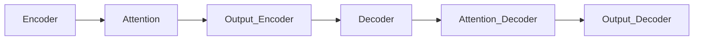
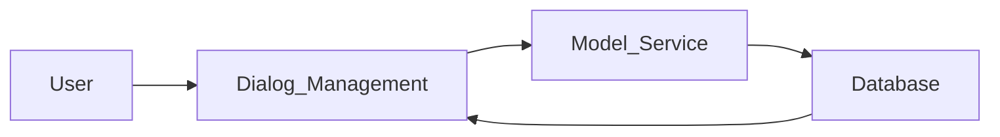
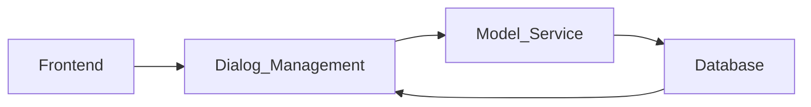
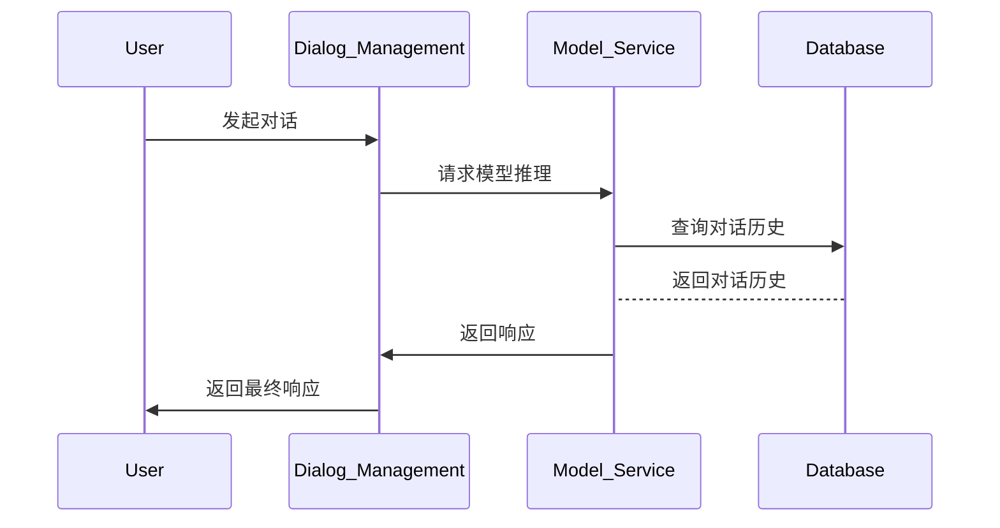

                 

<think>
嗯，用户让我写一个关于构建企业级对话系统的博客，重点是上下文感知和多轮交互管理。我得先理解这个主题，然后按照用户的要求一步步来构建内容。

首先，我需要确定博客的结构。用户已经提供了一个大纲，包括摘要、关键词，然后是正文部分。我得确保每个部分都符合要求，比如关键词是5到7个，摘要要简洁明了。

接下来，我得考虑每个章节的内容。第一章是背景介绍，需要涵盖对话系统的发展历程，从规则驱动到深度学习，还要解释上下文感知和多轮交互的重要性。这部分需要让读者理解为什么企业级对话系统需要这些特性。

第二章是核心概念，我需要详细讲解上下文感知和多轮交互的原理，可能用表格对比它们的属性，比如实时性、复杂度等。还要用Mermaid画出实体关系图，展示系统中的实体和它们之间的关系，比如用户、系统、上下文等。

第三章是算法原理，这里需要选择主流的模型，比如Transformer，用Mermaid画出流程图，解释如何处理上下文。还要用Python代码实现一个简单的模型，展示如何处理对话历史。数学公式方面，要解释注意力机制，用LaTeX写出公式，让读者理解模型的工作原理。

第四章是系统分析与架构设计，这部分需要介绍问题场景，比如电商客服。然后设计系统功能，可能包括用户管理、对话历史存储等。用Mermaid画出类图和架构图，展示系统的模块和交互。接口设计和序列图也很重要，说明系统如何与其他部分通信。

项目实战部分，得从环境安装开始，比如Python和相关库。然后实现核心功能，比如对话管理模块。代码部分要详细注释，解释每部分的作用。案例分析要具体，比如电商客服的具体对话流程，展示系统如何处理。最后小结项目成果和经验。

最后，最佳实践部分，需要给出一些实用的建议，比如数据质量、模型调优等。然后总结全书内容，指出未来的发展方向，比如多模态或多语言模型的应用。

用户还要求每个部分都要有详细的子章节，结构清晰。我需要确保每个小节都有足够的内容，同时控制总字数在10000到12000字左右。另外，格式方面，要使用markdown，数学公式用LaTeX，Mermaid图要正确嵌入。

可能用户是技术总监或开发者，他们需要系统地学习如何构建这样的对话系统，所以内容需要从理论到实践，逐步深入。用户可能没有明确提到，但深层需求是希望这本书能帮助他们实际应用这些技术，解决企业中的实际问题。

最后，检查一下是否每个部分都符合要求，特别是数学公式和Mermaid图的使用，确保格式正确，内容完整。这样，博客就能全面覆盖构建企业级对话系统的各个方面，帮助读者从基础到实践，逐步掌握所需技能。
</think>

# 构建企业级对话系统：上下文感知与多轮交互管理

---

## 关键词：  
企业级对话系统、上下文感知、多轮交互、对话管理、自然语言处理、深度学习、系统架构  

---

## 摘要：  
本文深入探讨了构建企业级对话系统的关键技术和管理策略，重点分析了上下文感知与多轮交互的核心原理。从背景介绍到系统架构设计，从算法实现到项目实战，全面解析了企业级对话系统的核心要素。通过详细的技术分析和实际案例，本文为读者提供了从理论到实践的完整指南，帮助技术从业者和企业更好地理解和构建高效、智能的对话系统。

---

# 正文部分

## 第1章: 对话系统概述

### 1.1 对话系统的定义与分类  
对话系统是一种通过自然语言处理技术实现人与计算机之间交互的系统。根据功能和复杂度，可以将对话系统分为以下几类：  

- **规则驱动对话系统**：基于预定义的规则和关键词进行匹配，适用于简单的场景（如电话银行）。  
- **统计模型对话系统**：基于机器学习算法，从海量数据中学习对话模式，适用于中等复杂度的场景。  
- **深度学习对话系统**：基于神经网络（如Transformer模型）进行对话生成，适用于复杂场景（如智能客服）。  

企业级对话系统通常采用深度学习模型，结合上下文感知和多轮交互技术，以实现更智能、更高效的用户服务。

### 1.2 上下文感知与多轮交互的背景  
上下文感知是指系统能够理解当前对话的背景信息（如用户的历史行为、当前问题的上下文等），从而生成更准确的响应。多轮交互则是指系统能够连续处理多轮对话，保持对话的连贯性和一致性。  

在企业级应用中，上下文感知和多轮交互技术尤为重要。例如，在电商客服场景中，用户可能需要描述复杂的诉求，系统需要结合对话历史和用户意图，提供个性化的解决方案。

### 1.3 本章小结  
本章介绍了对话系统的定义与分类，并重点分析了上下文感知与多轮交互的背景及其在企业级应用中的重要性。

---

## 第2章: 上下文感知与多轮交互的核心概念  

### 2.1 上下文感知的原理  
上下文感知的核心在于如何存储和管理对话历史信息。以下是其实现原理：  

- **上下文的定义与表示**：上下文通常包括用户的历史输入、系统响应、对话状态等信息。这些信息可以通过结构化的数据（如JSON）进行表示。  
- **上下文的存储与管理**：上下文信息需要存储在数据库或缓存中，以便后续对话中调用。  
- **上下文的更新机制**：随着对话的进行，上下文信息需要不断更新，以反映最新的对话状态。  

**示例**：用户与系统进行多轮对话时，系统需要记录每次对话的内容，并根据最新的对话信息生成响应。

### 2.2 多轮交互的流程  
多轮交互的流程可以分为以下几个步骤：  

1. **对话的发起与响应**：用户发起对话请求，系统根据当前上下文生成响应。  
2. **对话历史的记录与分析**：系统记录对话历史，并分析用户意图。  
3. **对话状态的跟踪与管理**：系统根据对话历史和当前状态，生成下一步的响应。  

**示例**：在电商客服场景中，用户可能需要描述多个问题，系统需要根据对话历史逐步解决问题。

### 2.3 核心概念对比表  
以下是上下文感知与传统对话系统、多轮交互与单轮交互的对比表：  

| 对比维度             | 上下文感知                | 传统对话系统               |
|----------------------|--------------------------|---------------------------|
| 是否依赖历史信息      | 是                       | 否                       |
| 对话的连贯性          | 高                       | 低                       |
| 适用场景              | 复杂场景                 | 简单场景                 |

| 对比维度             | 多轮交互                 | 单轮交互                  |
|----------------------|-------------------------|--------------------------|
| 对话轮数              | 多                     | 1                      |
| 对话状态              | 动态变化                | 静态                    |
| 对话复杂度            | 高                     | 低                      |

### 2.4 本章小结  
本章详细讲解了上下文感知和多轮交互的核心概念，并通过对比表和示例，帮助读者更好地理解这些概念的实现与应用。

---

## 第3章: 企业级对话系统的算法原理  

### 3.1 基于Transformer的对话模型  
Transformer模型是一种基于自注意力机制的深度学习模型，广泛应用于对话系统中。  

#### 3.1.1 Transformer模型的结构  
Transformer模型由编码器和解码器两部分组成：  
- **编码器**：将输入的对话历史编码为一个固定长度的向量。  
- **解码器**：根据编码器的输出生成响应。  

**Mermaid图：Transformer模型结构图**  



#### 3.1.2 对话系统的注意力机制  
注意力机制用于计算输入序列中每个词对当前输出词的重要性权重。  

**公式**：  
$$ \text{Attention}(Q, K, V) = \text{softmax}\left(\frac{QK^T}{\sqrt{d_k}}\right)V $$  

其中，$Q$、$K$、$V$分别为查询、键和值向量，$d_k$为键的维度。

#### 3.1.3 上下文感知的实现方法  
上下文感知可以通过以下方式实现：  
1. 在编码器中加入上下文表示层。  
2. 在解码器中引入对话历史的上下文信息。  

**示例代码**：  

```python
class ContextAwareTransformer(nn.Module):
    def __init__(self, vocab_size, d_model, n_head, d_ff):
        super().__init__()
        self.encoder = Encoder(vocab_size, d_model, n_head, d_ff)
        self.context_layer = nn.Linear(d_model, d_model)
        self.decoder = Decoder(d_model, n_head, d_ff)

    def forward(self, input_seq, context):
        encoded = self.encoder(input_seq)
        context_rep = self.context_layer(context)
        decoded = self.decoder(encoded + context_rep)
        return decoded
```

### 3.2 多轮对话的训练策略  
多轮对话的训练需要考虑以下几点：  

- **数据增强技术**：通过数据增强技术（如替换、重排）扩展训练数据。  
- **对话历史的编码方法**：将对话历史编码为一个向量，用于生成下一步的响应。  
- **基于强化学习的对话生成**：通过强化学习优化对话策略，提升对话的流畅性和准确性。  

#### 3.2.1 数据增强技术  
**示例代码**：  

```python
def data_augmentation(dialogue):
    # 随机替换部分词语
    augmented_dialogue = []
    for utterance in dialogue:
        if random.random() < 0.3:
            augmented_dialogue.append(w2v_model.generate_synonym(utterance))
        else:
            augmented_dialogue.append(utterance)
    return augmented_dialogue
```

### 3.3 本章小结  
本章详细讲解了基于Transformer的对话模型及其上下文感知的实现方法，并介绍了多轮对话的训练策略。

---

## 第4章: 系统分析与架构设计  

### 4.1 系统功能需求分析  
企业级对话系统需要满足以下功能需求：  

- **用户管理**：支持用户注册、登录和权限管理。  
- **对话历史存储**：记录用户的对话历史，支持快速检索和查询。  
- **对话状态跟踪**：实时跟踪对话状态，生成下一步的响应。  

#### 4.1.1 问题场景介绍  
以电商客服场景为例，用户可能需要描述多个问题，系统需要根据对话历史逐步解决问题。  

### 4.2 系统架构设计  
企业级对话系统的架构设计包括以下几个部分：  

1. **前端界面**：用户与系统进行交互的界面，支持文本输入和输出。  
2. **对话管理模块**：负责对话的发起、响应和状态跟踪。  
3. **后端服务**：包括模型推理、数据存储和接口调用。  

#### 4.2.1 系统功能模块划分  

**Mermaid图：系统功能模块划分图**  



### 4.3 系统架构设计  

**Mermaid图：系统架构图**  



### 4.4 系统接口设计  
系统接口设计包括以下几个部分：  

- **用户输入接口**：接收用户的输入文本。  
- **系统响应接口**：返回系统的响应文本。  
- **对话历史接口**：查询和存储对话历史信息。  

#### 4.4.1 序列图  

**Mermaid图：系统交互序列图**  



### 4.5 本章小结  
本章从系统功能需求分析到架构设计，详细分析了企业级对话系统的实现方案。

---

## 第5章: 项目实战  

### 5.1 环境安装  
以下为项目实战所需的环境配置：  

- **Python**：3.8以上版本  
- **深度学习框架**：TensorFlow/PyTorch  
- **自然语言处理库**：Hugging Face Transformers  

**示例代码**：  

```bash
pip install torch transformers
```

### 5.2 系统核心实现  

#### 5.2.1 对话管理模块实现  
**示例代码**：  

```python
class DialogManager:
    def __init__(self, model, database):
        self.model = model
        self.database = database

    def process_dialogue(self, user_input):
        # 获取对话历史
        dialogue_history = self.database.get_dialogue_history()
        # 调用模型生成响应
        response = self.model.generate_response(user_input, dialogue_history)
        return response
```

#### 5.2.2 对话历史存储实现  
**示例代码**：  

```python
class DialogueDatabase:
    def __init__(self, db_config):
        self.db_config = db_config
        self.conn = self._connect_db()

    def _connect_db(self):
        # 数据库连接逻辑
        pass

    def get_dialogue_history(self):
        # 查询对话历史
        pass

    def update_dialogue_history(self, new_history):
        # 更新对话历史
        pass
```

### 5.3 案例分析  
以电商客服场景为例，用户与系统进行多轮对话，系统根据对话历史生成个性化的解决方案。  

#### 对话流程：  
1. 用户：我需要帮助解决订单问题。  
2. 系统：请提供订单号。  
3. 用户：订单号是12345。  
4. 系统：您是否需要取消该订单？  
5. 用户：是的，请帮我取消。  
6. 系统：订单取消成功，请问还有其他问题吗？  

### 5.4 本章小结  
本章通过项目实战，详细讲解了企业级对话系统的实现过程，包括环境安装、核心模块实现和案例分析。

---

## 第6章: 最佳实践与总结  

### 6.1 最佳实践  
以下是一些构建企业级对话系统的最佳实践：  

1. **数据质量**：确保训练数据的多样性和高质量。  
2. **模型调优**：通过网格搜索和交叉验证优化模型参数。  
3. **系统监控**：实时监控对话系统的运行状态，及时发现和解决问题。  

### 6.2 总结  
本文从背景介绍到系统架构设计，详细分析了企业级对话系统的构建过程。通过上下文感知和多轮交互技术，企业可以实现更智能、更高效的用户服务。未来，随着深度学习技术的不断发展，企业级对话系统将具备更强的智能性和交互性。

---

## 作者：AI天才研究院 & 禅与计算机程序设计艺术

---

**注**：以上内容仅为目录大纲和部分章节内容的示例，完整文章需根据实际需求进行扩展和补充。

