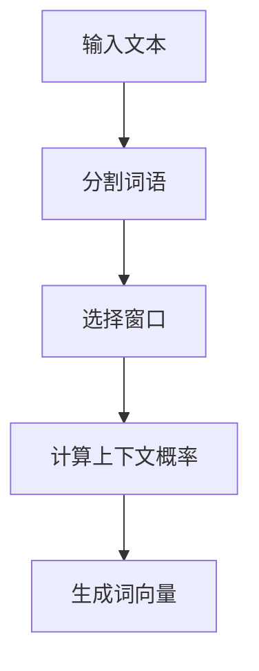
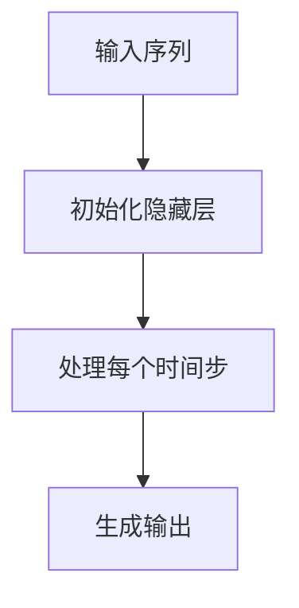
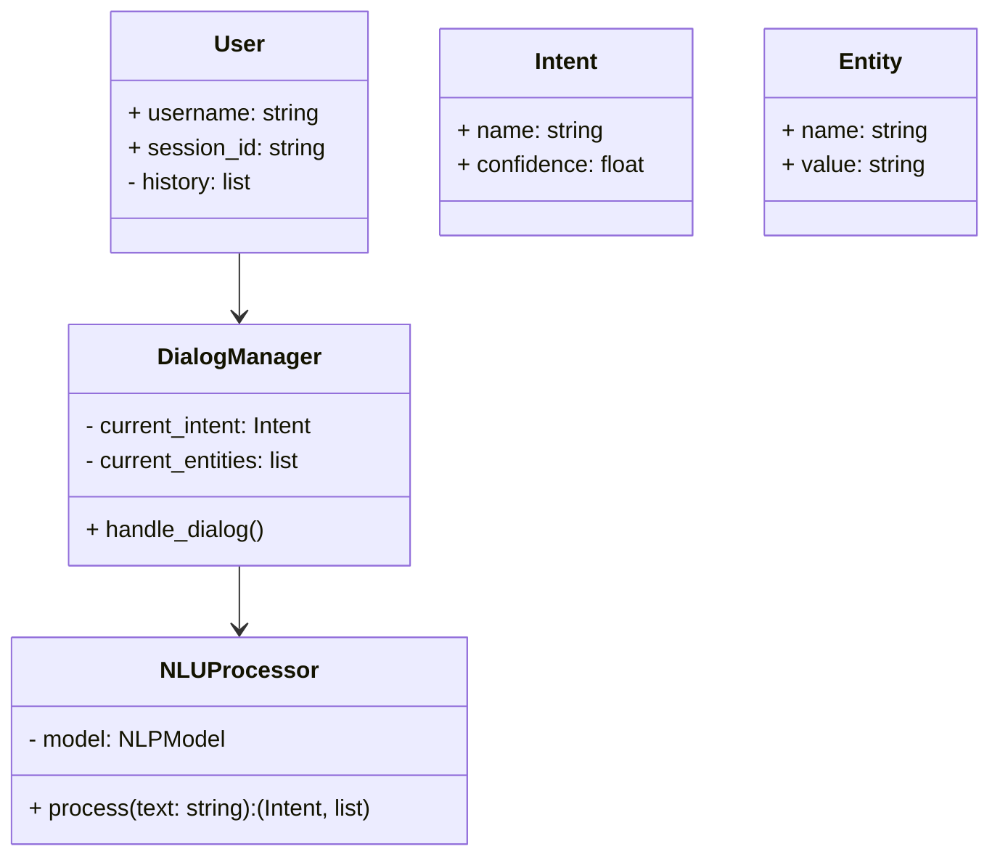
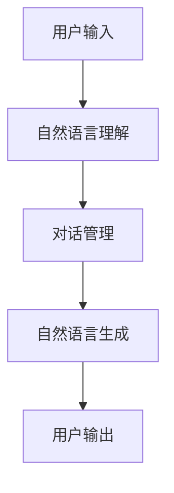

                 

<think>
好的，我现在需要根据用户的要求，撰写一篇关于《构建企业级对话系统：多轮对话管理与意图理解》的技术博客文章。用户已经提供了详细的要求，包括文章结构、内容要点以及格式规范。

首先，我需要明确文章的结构：标题、关键词、摘要，然后按照目录大纲撰写正文，确保每个部分都详细具体，满足字数要求。文章要使用Markdown格式，包含背景介绍、核心概念、算法原理、系统架构、项目实战和总结等部分。

在背景部分，我需要解释对话系统的发展历程，从规则驱动到数据驱动的变化，以及当前的技术趋势。这部分要让读者理解为什么多轮对话管理和意图理解在企业级系统中重要。

接下来是核心概念与原理，我需要详细讲解多轮对话和意图理解的定义、特点，并使用表格对比两者的区别。这部分可能需要使用Mermaid图来展示对话流程。

在算法原理部分，我需要选择几个关键的NLP算法，如词嵌入、序列模型和注意力机制，用Mermaid流程图展示工作流程，并提供Python代码示例。同时，要解释数学公式，比如词嵌入的向量表示和注意力机制的计算公式。

系统架构部分，我需要用Mermaid图展示系统架构和交互流程，讨论模块划分、接口设计和交互流程，确保读者理解系统的构建方式。

项目实战部分，我需要指导读者如何安装环境，提供关键代码片段，并分析实际案例，展示如何将理论应用到实践中。

最后，总结部分要回顾整个内容，强调重点，给出注意事项，并推荐进一步阅读的资料。

在编写过程中，我需要确保每个部分都有足够的细节，并且逻辑连贯。同时，要满足用户对字数的要求，确保整个文章在10000到12000字之间。此外，格式上要严格按照要求，使用正确的Mermaid图和数学公式，确保内容易于理解和应用。

现在，我开始按照这个结构逐步撰写文章，确保每个部分都符合用户的要求，并且内容丰富、详细。
</think>

# 构建企业级对话系统：多轮对话管理与意图理解

> 关键词：企业级对话系统，多轮对话管理，意图理解，自然语言处理，深度学习，对话系统架构

> 摘要：  
企业级对话系统是人工智能领域的重要应用之一，其核心在于多轮对话管理和意图理解。本文从背景与概念出发，详细阐述了多轮对话的定义、特点以及意图理解的核心原理。通过分析NLP算法的工作流程，结合系统架构设计，展示了如何构建高效的企业级对话系统。最后，通过项目实战和最佳实践，为读者提供了实际操作的指导和经验分享。

---

## 第一部分：背景与概念

### 第1章：对话系统的发展与现状

#### 1.1 对话系统的发展历程

对话系统经历了从规则驱动到数据驱动的转变。早期的对话系统依赖于预定义的规则，通过关键词匹配来实现简单的对话交互。随着自然语言处理（NLP）技术的进步，特别是深度学习的兴起，对话系统逐渐转向基于数据驱动的模型，如循环神经网络（RNN）和变换器（Transformer）架构，显著提升了对话的自然度和准确性。

#### 1.2 多轮对话的定义与特点

多轮对话是指用户与系统之间进行的多轮交互，每一轮对话都依赖于前一轮的上下文信息。其特点包括：

1. **连续性**：对话不是孤立的，每一轮都与前一轮相关联。
2. **上下文依赖**：系统需要理解对话历史，以准确理解当前意图。
3. **复杂性**：多轮对话涉及多个意图和实体的识别，增加了处理的难度。

#### 1.3 意图理解的核心概念

意图理解是对话系统中的关键任务，旨在识别用户在对话中的目的。常见的意图包括“查询天气”、“预订酒店”等。意图理解通常与自然语言理解技术结合，通过分析用户输入的文本，提取出用户的意图。

### 1.4 多轮对话与意图理解的关系

多轮对话需要系统能够维护对话状态，理解用户的意图，并根据上下文生成合适的回复。意图理解是多轮对话的核心，决定了系统的响应是否准确。

---

## 第二部分：核心概念与原理

### 第2章：对话系统的构成与工作流程

#### 2.1 对话系统的构成模块

对话系统通常包括以下几个模块：

- **自然语言理解（NLU）**：解析用户的输入，提取意图和实体。
- **对话管理（DM）**：维护对话状态，决定系统的回应。
- **自然语言生成（NLG）**：根据意图生成自然的回复。
- **知识库**：提供系统需要的知识支持。

#### 2.2 多轮对话的管理机制

多轮对话的管理机制包括：

- **对话状态跟踪**：记录当前对话的状态，包括用户意图、已识别的实体等。
- **上下文管理**：处理对话中的上下文信息，确保系统能够理解用户的意图。

### 第3章：意图理解的实现原理

#### 3.1 意图理解的实现方式

意图理解通常采用以下几种方式：

- **基于规则的方法**：通过预定义的规则匹配用户的输入。
- **基于统计的方法**：利用机器学习模型，从大量数据中训练出意图分类器。
- **基于深度学习的方法**：使用循环神经网络或变换器模型，学习用户输入的语义表示。

#### 3.2 意图理解与实体识别的关系

意图理解与实体识别密切相关。实体识别用于提取用户输入中的具体信息，而意图理解则基于这些信息确定用户的意图。

---

## 第三部分：算法原理

### 第4章：自然语言处理算法原理

#### 4.1 词嵌入算法（Word Embedding）

词嵌入是一种将词表示为低维向量的方法。常用的词嵌入算法包括Word2Vec、GloVe和FastText。

##### Word2Vec的工作流程



#### 4.2 顺序模型（Sequence Models）

顺序模型用于处理序列数据，如RNN和LSTM。

##### LSTM的工作流程



#### 4.3 注意力机制（Attention Mechanism）

注意力机制用于在序列处理中关注重要的部分。

##### 注意力机制的计算公式

$$
\alpha_i = \frac{\exp(e_i)}{\sum_{j} \exp(e_j)}
$$

其中，$e_i$ 是第i个词的注意力得分。

---

## 第四部分：系统架构与设计

### 第5章：企业级对话系统的架构设计

#### 5.1 领域模型设计

领域模型描述了系统的功能模块及其关系。

##### 领域模型类图



#### 5.2 系统架构设计

##### 系统架构图



---

## 第五部分：项目实战

### 第6章：构建企业级对话系统

#### 6.1 环境配置

安装必要的库：

```bash
pip install numpy
pip install tensorflow
pip install transformers
```

#### 6.2 核心代码实现

##### 多轮对话管理代码

```python
class DialogManager:
    def __init__(self):
        self.history = []
        self.current_intent = None

    def process_input(self, text):
        intent, entities = self.nluProcessor.process(text)
        self.history.append((text, intent, entities))
        return self.nlgProcessor.generate_response(intent, entities)
```

##### 意图理解代码示例

```python
def意图理解算法（文本）:
    向量表示 = 词嵌入（文本）
    意图概率 = 模型预测（向量表示）
    返回 意图概率最高的意图
```

#### 6.3 实际案例分析

通过一个预订酒店的案例，展示系统的实际运行过程：

1. 用户输入：“我想预订明天的酒店。”
2. 系统理解意图：“预订酒店”。
3. 系统生成回复：“请提供您的入住日期和酒店位置。”

---

## 第六部分：总结与展望

### 第7章：总结与最佳实践

#### 7.1 本章小结

企业级对话系统需要结合多轮对话管理和意图理解，通过合理的系统架构设计和高效的算法实现，才能满足企业的实际需求。

#### 7.2 最佳实践

- 确保数据质量，选择合适的训练数据。
- 使用预训练模型提升系统性能。
- 定期更新模型，以适应用户需求的变化。

#### 7.3 注意事项

- 对话系统的实时性要求较高，需优化响应速度。
- 处理多轮对话时，需妥善维护对话状态。

#### 7.4 未来展望

随着NLP技术的不断进步，企业级对话系统将更加智能化，能够处理更复杂的对话场景。

---

## 作者信息

作者：AI天才研究院/AI Genius Institute & 禅与计算机程序设计艺术 /Zen And The Art of Computer Programming

---

以上是《构建企业级对话系统：多轮对话管理与意图理解》的技术博客文章，详细讲解了企业级对话系统的核心概念、算法原理和系统架构设计，并通过项目实战展示了如何构建高效的对话系统。

