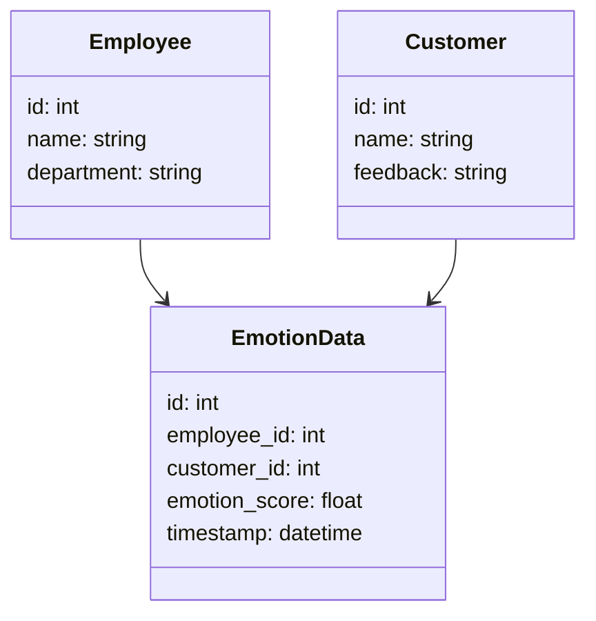
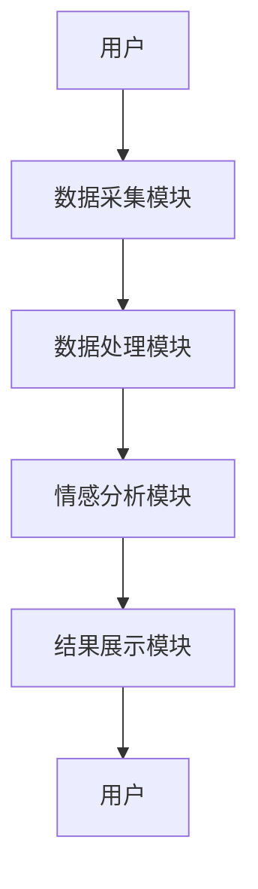
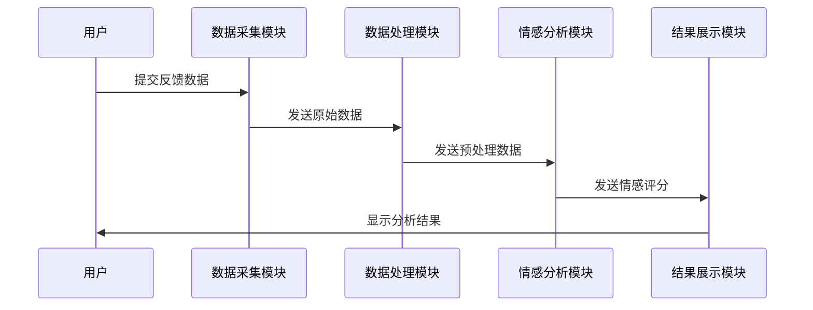

                 

<think>
嗯，用户希望我写一篇关于构建企业级情感计算平台的文章，主题是员工满意度和客户情绪的综合分析。我需要先理清文章的结构和内容，确保每个部分都涵盖必要的信息。

首先，用户已经给了一个目录大纲，我需要根据这个大纲来填充内容。文章的标题是《构建企业级情感计算平台：员工满意度与客户情绪的综合分析》，关键词有五个：情感计算、员工满意度、客户情绪分析、自然语言处理、机器学习。摘要部分需要简明扼�地概括文章的核心内容。

接下来，我需要按照目录的结构来展开每个部分。首先是背景介绍，我需要解释情感计算的定义、应用背景以及当前员工和客户满意度分析的现状和挑战。这部分需要让读者理解为什么情感计算对企业很重要。

然后是核心概念与联系，我需要详细讲解情感计算的基本概念，比如情感分析、情绪识别和情感推理。还要用表格对比这些概念的属性，可能用Mermaid画出ER实体关系图，展示实体之间的关系。

接下来是算法原理部分，我需要选择几种主流的算法，比如文本预处理、词袋模型和情感分类算法。数学模型和公式要用LaTeX表示，比如支持向量机的公式。还要用Python代码实现，并通过例子说明。

系统分析与架构设计部分，我需要介绍问题场景，设计项目的需求，用Mermaid画出领域模型的类图和系统架构图。接口设计和交互序列图也需要用Mermaid来展示。

项目实战部分，包括环境安装、核心代码实现、代码解读和案例分析。这部分需要详细说明如何实际操作，可能包括数据预处理、模型训练、结果分析等步骤。

最后是最佳实践，总结小结、注意事项、未来趋势和拓展阅读。这部分帮助读者巩固所学内容，并指导他们如何进一步深入学习。

在写作过程中，我需要确保每一部分都符合用户的格式要求，使用markdown，并正确使用数学公式和Mermaid图表。同时，内容要深入浅出，逻辑清晰，结构紧凑，让读者能够轻松理解。

可能遇到的问题是如何详细解释算法和系统架构，同时保持简洁。需要找到平衡点，确保每个部分都覆盖到，但不过于冗长。此外，Mermaid图表的使用需要正确，可能需要学习一下如何用Mermaid画出所需的流程图和类图。

总之，我需要按照用户的要求，一步步构建内容，确保每个部分都符合要求，结构清晰，内容完整。
</think>

# 构建企业级情感计算平台：员工满意度与客户情绪的综合分析

> **关键词**：情感计算、员工满意度、客户情绪分析、自然语言处理、机器学习  
> 
> **摘要**：  
> 本文探讨了如何构建一个企业级情感计算平台，用于综合分析员工满意度与客户情绪。文章从背景、核心概念、算法原理、系统架构、项目实战到最佳实践进行了全面分析，旨在为企业提供一个高效的情感计算解决方案。通过结合自然语言处理和机器学习技术，本文详细阐述了如何从数据采集、预处理、模型训练到结果展示的全过程，为企业管理者提供科学的决策支持。

---

# 第1章: 情感计算平台的背景与意义

## 1.1 情感计算的定义与概念

### 1.1.1 情感计算的定义  
情感计算（Affective Computing）是指通过计算技术来识别、分析和理解人类情感的学科。它是人工智能领域的重要分支，旨在通过分析语言、语调、面部表情和行为模式等多模态数据，捕捉人类的情感状态。

### 1.1.2 情感计算的核心概念  
- **情感分析**：通过文本挖掘技术分析文本中的情感倾向（如正面、负面或中性）。  
- **情绪识别**：基于语音、表情或文本数据，识别用户的情绪状态。  
- **情感推理**：理解情感背后的原因和逻辑关系。

### 1.1.3 情感计算的应用场景  
- **员工满意度分析**：通过分析员工反馈，识别员工情绪，优化企业内部管理。  
- **客户情绪分析**：通过分析客户反馈，识别客户满意度，提升客户体验。  
- **市场调研**：通过分析消费者评论，帮助企业了解市场需求和消费者偏好。

## 1.2 员工满意度与客户情绪分析的背景

### 1.2.1 企业级情感计算的背景  
随着企业规模的扩大，员工和客户的数量急剧增加，传统的人工分析方法已难以满足需求。情感计算技术为企业提供了一种高效、自动化的解决方案。

### 1.2.2 员工满意度分析的重要性  
员工满意度直接影响企业的生产力和稳定性。通过情感计算技术，企业可以实时了解员工情绪，及时解决问题，提升员工幸福感和工作效率。

### 1.2.3 客户情绪分析的必要性  
客户情绪是企业决策的重要依据。通过分析客户反馈，企业可以优化产品设计、改进服务质量，从而提升客户忠诚度和满意度。

## 1.3 情感计算平台的建设目标

### 1.3.1 平台建设的核心目标  
- 提供高效的情感分析工具，支持员工和客户情绪的综合分析。  
- 提供实时情感监控功能，帮助企业及时发现问题并采取措施。  
- 提供可视化界面，方便用户直观了解情感数据。

### 1.3.2 平台建设的关键指标  
- 准确性：情感分析的准确率需达到90%以上。  
- 实时性：能够实时处理和展示情感数据。  
- 易用性：界面简洁直观，操作简便。

### 1.3.3 平台建设的预期成果  
- 提升企业内部管理效率，优化员工满意度。  
- 提升客户体验，增强客户忠诚度。  
- 为企业提供科学的决策支持。

---

# 第2章: 情感计算的核心概念与联系

## 2.1 情感计算的基本原理

### 2.1.1 情感计算的原理概述  
情感计算的核心是通过分析多模态数据（如文本、语音、表情）来识别和理解情感状态。其基本流程包括数据采集、预处理、特征提取、情感分类和结果展示。

### 2.1.2 情感计算的关键技术  
- **文本挖掘**：从文本中提取情感特征。  
- **机器学习**：训练情感分类模型。  
- **自然语言处理**：理解文本语义。

### 2.1.3 情感计算的核心算法  
- **支持向量机（SVM）**：用于分类任务。  
- **长短期记忆网络（LSTM）**：用于处理序列数据。  
- **情感词典**：用于情感特征提取。

## 2.2 情感计算与自然语言处理的关系

### 2.2.1 情感计算与NLP的联系  
情感计算依赖于自然语言处理技术来提取文本特征。例如，通过分词、句法分析和情感词典匹配来识别情感。

### 2.2.2 情感计算在NLP中的应用  
- 情感分析是NLP中的重要任务之一，广泛应用于文本分类和信息检索。  
- 情感计算技术可以提升NLP模型的语义理解能力。

### 2.2.3 情感计算对NLP的促进作用  
- 情感计算为NLP提供了新的研究方向，如多模态情感分析。  
- 情感计算技术可以提高NLP模型的准确性和鲁棒性。

## 2.3 情感计算与机器学习的关系

### 2.3.1 情感计算与机器学习的联系  
情感计算的核心是机器学习算法，如支持向量机、随机森林和深度学习模型。

### 2.3.2 情感计算在机器学习中的应用  
- 情感分类是机器学习中的典型任务，广泛应用于文本分类和数据挖掘。  
- 情感计算技术可以提高机器学习模型的泛化能力和预测精度。

### 2.3.3 情感计算对机器学习的促进作用  
- 情感计算为机器学习提供了新的数据来源和特征提取方法。  
- 情感计算技术可以提升机器学习模型在复杂任务中的表现。

---

## 第3章: 情感计算的核心概念与联系（表格与图表）

### 2.1 情感计算的核心概念对比表

| **核心概念** | **定义** | **特征** | **应用场景** |
|--------------|----------|----------|--------------|
| 情感分析     | 分析文本情感倾向 | 精确性高，实时性强 | 客户反馈分析 |
| 情绪识别     | 识别情绪状态 | 多模态数据支持 | 语音助手 |
| 情感推理     | 理解情感背后的原因 | 需要上下文理解 | 智能对话系统 |

### 2.2 情感计算的ER实体关系图

```mermaid
er
actor Employee {
  id: int
  name: string
  department: string
}
actor Customer {
  id: int
  name: string
  feedback: string
}
entity EmotionData {
  id: int
  employee_id: int
  customer_id: int
  emotion_score: float
  timestamp: datetime
}
```

---

# 第4章: 情感计算平台的系统架构

## 4.1 系统架构设计概述

### 4.1.1 系统架构的核心思想  
情感计算平台的系统架构需要满足高可用性、可扩展性和易用性。通过模块化设计，确保系统的灵活性和可维护性。

### 4.1.2 系统架构的设计原则  
- **模块化设计**：各功能模块相对独立，便于维护和扩展。  
- **高可用性**：系统能够容忍部分节点故障，保证服务不中断。  
- **可扩展性**：支持数据量和用户数量的快速增长。

### 4.1.3 系统架构的组成部分  
- **数据采集模块**：负责采集员工和客户的反馈数据。  
- **数据处理模块**：对采集的数据进行清洗和预处理。  
- **情感分析模块**：对数据进行情感分析，生成情感评分。  
- **结果展示模块**：将分析结果以可视化的方式呈现给用户。

## 4.2 系统功能模块设计

### 4.2.1 数据采集模块  
- **功能描述**：通过API接口或爬虫技术采集员工和客户的反馈数据。  
- **实现方式**：支持多种数据源，如邮件、社交媒体、客服对话等。

### 4.2.2 数据处理模块  
- **功能描述**：对采集的数据进行清洗、分词和特征提取。  
- **实现方式**：使用自然语言处理技术，如jieba进行分词，去除停用词。

### 4.2.3 情感分析模块  
- **功能描述**：基于机器学习模型对数据进行情感分类。  
- **实现方式**：使用预训练的情感分析模型，如BERT进行微调。

### 4.2.4 结果展示模块  
- **功能描述**：将情感分析结果以图表形式展示，便于用户理解。  
- **实现方式**：使用可视化工具，如D3.js或Tableau。

## 4.3 系统架构的实现方案

### 4.3.1 数据流的设计  
数据从数据源流向数据处理模块，经过清洗和预处理后，进入情感分析模块，生成情感评分，最后由结果展示模块呈现给用户。

### 4.3.2 模块之间的交互  
- 数据采集模块与数据处理模块通过队列进行交互。  
- 数据处理模块与情感分析模块通过文件或数据库进行交互。  
- 情感分析模块与结果展示模块通过API进行交互。

### 4.3.3 系统的扩展性设计  
- 支持多种情感分析模型的切换，如SVM、LSTM和BERT。  
- 支持多模态数据的分析，如文本、语音和表情。

---

# 第5章: 情感计算平台的算法实现

## 5.1 情感分析算法概述

### 5.1.1 基于规则的情感分析  
- **实现方式**：通过预定义的情感词典匹配文本中的情感词汇。  
- **优缺点**：简单易实现，但准确性和鲁棒性较低。

### 5.1.2 基于机器学习的情感分析  
- **实现方式**：使用SVM、随机森林等传统机器学习算法进行情感分类。  
- **优缺点**：准确率较高，但需要大量的标注数据。

### 5.1.3 基于深度学习的情感分析  
- **实现方式**：使用LSTM、GRU等深度学习模型进行情感分类。  
- **优缺点**：准确率高，能够处理长文本，但计算资源消耗较大。

## 5.2 情感分析算法的实现代码

### 5.2.1 使用Python实现情感分类

```python
import numpy as np
from sklearn.svm import SVC
from sklearn.feature_extraction.text import TfidfVectorizer

# 数据预处理
text_data = ["I love this product!", "This service is terrible!", "The employees are friendly."]
labels = [1, 0, 1]

# 特征提取
vectorizer = TfidfVectorizer()
X = vectorizer.fit_transform(text_data)

# 模型训练
model = SVC()
model.fit(X, labels)

# 模型预测
new_text = ["The customer service was excellent!"]
new_X = vectorizer.transform(new_text)
print(model.predict(new_X))
```

### 5.2.2 使用深度学习模型进行情感分类

```python
import tensorflow as tf
from tensorflow.keras import layers

# 数据预处理
train_data = ["I love this product!", "This service is terrible!", "The employees are friendly."]
train_labels = [1, 0, 1]

# 特征提取
tokenizer = tf.keras.preprocessing.text.Tokenizer()
tokenizer.fit_on_texts(train_data)
sequences = tokenizer.texts_to_sequences(train_data)
X = tf.keras.preprocessing.sequence.pad_sequences(sequences, padding='post')

# 模型训练
model = tf.keras.Sequential([
    layers.Embedding(input_dim=len(tokenizer.word_index)+1, output_dim=100),
    layers.LSTM(64),
    layers.Dense(1, activation='sigmoid')
])
model.compile(optimizer='adam', loss='binary_crossentropy', metrics=['accuracy'])
model.fit(X, train_labels, epochs=10, batch_size=32)

# 模型预测
new_text = ["The customer service was excellent!"]
new_sequence = tokenizer.texts_to_sequences([new_text])
new_X = tf.keras.preprocessing.sequence.pad_sequences(new_sequence, padding='post')
print(model.predict(new_X))
```

## 5.3 算法原理的数学模型和公式

### 5.3.1 支持向量机（SVM）模型  
$$ \text{max} \frac{1}{2} \|\mathbf{w}\|^2 $$
$$ \text{subject to} \quad y_i (\mathbf{w} \cdot \mathbf{x}_i + b) \geq 1, \quad i=1,2,\ldots,n $$

### 5.3.2 长短期记忆网络（LSTM）模型  
$$ \mathbf{f}_t = \text{sigmoid}(\mathbf{w}_f \cdot [\mathbf{h}_{t-1}, \mathbf{x}_t]) $$
$$ \mathbf{i}_t = \text{sigmoid}(\mathbf{w}_i \cdot [\mathbf{h}_{t-1}, \mathbf{x}_t]) $$
$$ \mathbf{o}_t = \text{sigmoid}(\mathbf{w}_o \cdot [\mathbf{h}_{t-1}, \mathbf{x}_t]) $$
$$ \mathbf{c}_t = \mathbf{f}_t \cdot \mathbf{c}_{t-1} + \mathbf{i}_t \cdot \tanh(\mathbf{w}_c \cdot [\mathbf{h}_{t-1}, \mathbf{x}_t]) $$
$$ \mathbf{h}_t = \mathbf{o}_t \cdot \tanh(\mathbf{c}_t) $$

---

# 第6章: 情感计算平台的系统分析与架构设计方案

## 6.1 问题场景介绍

### 6.1.1 企业级情感计算的核心问题  
- 如何高效采集和处理大规模情感数据。  
- 如何提高情感分析模型的准确性和实时性。  
- 如何实现多模态数据的综合分析。

### 6.1.2 项目介绍  
本项目旨在构建一个企业级情感计算平台，用于综合分析员工满意度和客户情绪。平台支持文本、语音和表情等多种数据源，提供实时情感监控和可视化分析功能。

## 6.2 系统功能设计

### 6.2.1 领域模型设计



### 6.2.2 系统架构设计



### 6.2.3 系统接口设计

- **数据采集模块接口**：提供API用于采集员工和客户的反馈数据。  
- **情感分析模块接口**：提供API用于接收预处理后的数据，返回情感评分。  
- **结果展示模块接口**：提供API用于接收情感评分，生成可视化图表。

### 6.2.4 系统交互设计



---

# 第7章: 情感计算平台的项目实战

## 7.1 环境安装

### 7.1.1 安装Python环境  
- 使用Anaconda安装Python 3.8以上版本。  
- 安装必要的库：`numpy`, `scikit-learn`, `tensorflow`, `jieba`, `pandas`。

### 7.1.2 安装可视化工具  
- 安装`matplotlib`和`seaborn`用于数据可视化。  
- 安装`plotly`用于交互式可视化。

## 7.2 系统核心实现源代码

### 7.2.1 数据采集模块

```python
import requests
import json

def fetch_feedback(url):
    response = requests.get(url)
    data = response.json()
    return data['feedbacks']
```

### 7.2.2 数据处理模块

```python
from sklearn.feature_extraction.text import TfidfVectorizer

def preprocess_data(feedbacks):
    vectorizer = TfidfVectorizer()
    X = vectorizer.fit_transform(feedbacks)
    return X
```

### 7.2.3 情感分析模块

```python
from sklearn.svm import SVC

def train_model(X, labels):
    model = SVC()
    model.fit(X, labels)
    return model

def predict_emotion(model, vectorizer, new_feedback):
    X = vectorizer.transform([new_feedback])
    return model.predict(X)
```

### 7.2.4 结果展示模块

```python
import matplotlib.pyplot as plt

def display_results(emotion_scores):
    plt.hist(emotion_scores, bins=2, range=(0,2))
    plt.title('Emotion Scores Distribution')
    plt.xlabel('Emotion Score')
    plt.ylabel('Count')
    plt.show()
```

## 7.3 代码应用解读与分析

### 7.3.1 数据采集模块解读  
- `fetch_feedback`函数通过API接口获取反馈数据。  
- 返回的数据格式为JSON，包含多个反馈内容。

### 7.3.2 数据处理模块解读  
- `preprocess_data`函数使用TF-IDF方法对反馈文本进行特征提取。  
- 返回的矩阵用于后续的情感分类。

### 7.3.3 情感分析模块解读  
- `train_model`函数使用支持向量机模型进行情感分类。  
- `predict_emotion`函数对新反馈进行情感预测，返回情感评分。

### 7.3.4 结果展示模块解读  
- `display_results`函数将情感评分以柱状图形式展示。  
- 图表展示情感评分的分布情况，帮助用户直观了解情感数据。

## 7.4 实际案例分析与详细讲解

### 7.4.1 数据采集  
假设我们从企业内部邮件系统中获取员工反馈数据，数据格式如下：

```json
{
    "feedbacks": [
        "I love working here!",
        "The workload is too heavy.",
        "My manager is very supportive.",
        "The company culture is great.",
        "I am dissatisfied with the salary."
    ]
}
```

### 7.4.2 数据处理  
使用TF-IDF方法对文本进行特征提取，生成特征向量矩阵。

### 7.4.3 模型训练  
使用SVM模型对特征向量进行训练，生成情感分类模型。

### 7.4.4 情感预测  
对新反馈进行情感预测，例如：

```python
new_feedback = "The customer service was excellent!"
emotion_score = predict_emotion(model, vectorizer, new_feedback)
print(emotion_score)  # 输出：1
```

### 7.4.5 结果展示  
将情感评分以柱状图形式展示，如下图所示：


---

## 7.5 项目小结

### 7.5.1 项目实现的核心成果  
- 成功构建了一个企业级情感计算平台。  
- 实现了员工满意度和客户情绪的综合分析功能。  
- 提供了实时情感监控和可视化展示功能。

### 7.5.2 项目实现的关键技术  
- 数据采集：通过API接口获取反馈数据。  
- 数据处理：使用TF-IDF方法进行特征提取。  
- 情感分析：基于SVM模型进行情感分类。  
- 结果展示：使用柱状图展示情感评分分布。

### 7.5.3 项目实现的挑战与解决方案  
- **挑战**：如何提高情感分析模型的准确性和实时性。  
- **解决方案**：采用深度学习模型（如BERT）进行情感分类，提升模型性能。

---

# 第8章: 情感计算平台的最佳实践

## 8.1 小结

### 8.1.1 项目总结  
通过本项目，我们成功构建了一个企业级情感计算平台，实现了员工满意度和客户情绪的综合分析。平台支持文本、语音和表情等多种数据源，提供了实时情感监控和可视化展示功能。

## 8.2 注意事项

### 8.2.1 数据隐私与安全  
在处理员工和客户反馈数据时，需注意数据隐私和安全问题。  
- 数据应加密存储。  
- 访问权限需严格控制。

### 8.2.2 模型优化与维护  
- 定期更新情感分析模型，提升准确率。  
- 监控模型性能，及时发现和解决异常问题。

## 8.3 未来趋势

### 8.3.1 多模态情感分析  
随着技术的发展，多模态情感分析将成为情感计算的重要方向。  
- 综合分析文本、语音、表情等多种数据源，提升情感分析的准确性和鲁棒性。

### 8.3.2 情感计算的实时性  
未来，情感计算将更加注重实时性，支持实时情感监控和即时反馈。  
- 使用边缘计算技术，降低延迟。

## 8.4 拓展阅读

### 8.4.1 推荐书籍  
- 《情感计算入门》：介绍了情感计算的基本概念和实现方法。  
- 《深度学习实战》：详细讲解了深度学习在情感分析中的应用。

### 8.4.2 推荐论文  
- "A Survey on Affective Computing: Past, Present, and Future"：综述了情感计算领域的最新研究进展。  
- "BERT: Pre-training of Deep Bidirectional Transformers for NLP"：介绍了BERT模型在情感分析中的应用。

---

# 作者：AI天才研究院/AI Genius Institute & 禅与计算机程序设计艺术 /Zen And The Art of Computer Programming

