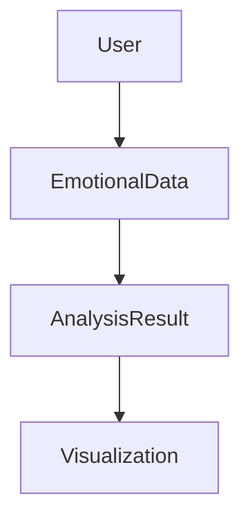
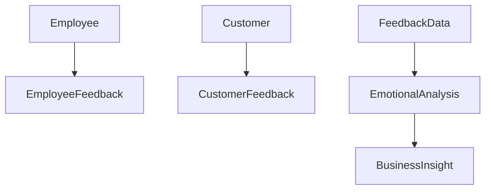
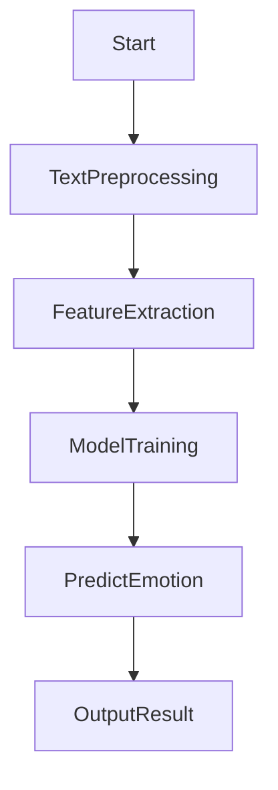

                 


# 构建企业级情感计算平台：员工满意度与客户情绪综合分析

## 关键词：企业级情感计算平台、员工满意度、客户情绪分析、自然语言处理、机器学习、深度学习

## 摘要：
本文将深入探讨如何构建一个企业级情感计算平台，用于同时分析员工满意度和客户情绪。通过结合自然语言处理、机器学习和深度学习技术，我们能够从大量文本数据中提取情感信息，为企业管理者提供数据支持，帮助他们做出更明智的决策。本文将从背景、技术原理、系统架构到项目实战，全面解析如何构建这样一个平台。

---

## 第一部分: 情感计算与企业级应用背景

### 第1章: 情感计算的定义与应用

#### 1.1 情感计算的定义
- **情感计算**是指通过计算机技术来识别、分析和处理人类情感信息的过程。它主要关注从文本、语音或图像中提取情感特征，并进行分类和预测。
- **应用领域**包括社交媒体分析、客户关系管理、教育技术、医疗健康等。
- **企业级平台的重要性**：在企业中，情感计算可以帮助管理者了解员工的工作状态和客户满意度，从而优化管理策略。

#### 1.2 情感计算的关键技术
- **情感分析**：通过文本挖掘技术判断文本的情感倾向（正面、负面或中性）。
- **情绪识别**：利用自然语言处理和机器学习技术，识别文本中特定情绪（如愤怒、快乐、悲伤等）。
- **自然语言处理**：在情感计算中，NLP技术用于文本预处理、特征提取和语义分析。

#### 1.3 情感计算的挑战与机遇
- **挑战**：数据质量和多样性、情感表达的歧义性、模型的泛化能力。
- **机遇**：随着AI技术的发展，情感计算在企业中的应用越来越广泛，能够为企业提供更精准的决策支持。

---

### 第2章: 企业级情感计算平台的背景

#### 2.1 企业级情感计算的必要性
- **员工满意度分析**：通过分析员工反馈，帮助企业识别员工的工作压力和不满情绪，从而优化员工管理策略。
- **客户情绪分析**：通过分析客户反馈，帮助企业识别客户满意度和忠诚度，从而优化客户服务策略。
- **综合分析**：将员工和客户的反馈结合起来，帮助企业从整体上优化管理和运营。

#### 2.2 企业级情感计算的现状
- **技术发展**：情感计算技术逐渐成熟，深度学习模型（如LSTM、BERT）在情感分析中表现优异。
- **应用问题**：数据获取困难、模型泛化能力不足、结果解释性差。
- **未来趋势**：情感计算将更加智能化和个性化，应用场景将更加广泛。

---

## 第二部分: 核心概念与联系

### 第3章: 情感计算的核心概念

#### 3.1 情感分析与情绪识别
- **情感分析**：通过文本挖掘技术判断文本的情感倾向，通常分为二分类（正面/负面）或多分类任务。
- **情绪识别**：识别文本中特定情绪（如愤怒、快乐、悲伤等），通常采用关键词匹配、规则库或机器学习模型。
- **两者区别与联系**：情感分析侧重整体情感倾向，情绪识别侧重具体情绪类型，两者可以结合使用。

#### 3.2 情感计算的关键属性
- **数据来源多样性**：情感数据可以来自文本、语音、图像等多种形式。
- **分析结果准确性**：情感计算的结果需要尽可能准确，通常需要结合上下文和语境进行分析。
- **平台可扩展性**：企业级平台需要支持大规模数据处理和多种应用场景。

#### 3.3 情感计算的实体关系图


---

### 第4章: 情感计算的核心概念与联系

#### 4.1 情感计算的核心原理
- **情感数据的采集**：通过问卷调查、社交媒体评论、客服对话等渠道获取情感数据。
- **情感特征的提取**：利用NLP技术提取文本中的情感特征，如关键词、句法结构、语义信息。
- **情感模型的训练**：基于训练数据，利用机器学习或深度学习算法训练情感分类模型。

#### 4.2 情感计算的对比分析
| 方法         | 优点                          | 缺点                          |
|--------------|------------------------------|-------------------------------|
| 规则-based   | 实现简单，易于解释            | 需要人工编写规则，泛化能力差   |
| 机器学习     | 泛化能力强，适合大规模数据    | 需要大量标注数据，解释性较差   |
| 深度学习     | 模型复杂度高，表现优异         | 需要大量计算资源，实现复杂     |

#### 4.3 情感计算的实体关系图


---

## 第三部分: 算法原理

### 第5章: 情感计算的算法原理

#### 5.1 情感分析算法
- **文本预处理**：分词、去除停用词、词干提取。
- **特征提取**：词袋模型、TF-IDF、词嵌入（如Word2Vec）。
- **模型训练**：使用SVM、随机森林、深度学习模型（如LSTM、BERT）进行分类。

#### 5.2 情感计算的流程图


#### 5.3 情感计算的Python实现
```python
import pandas as pd
from sklearn.feature_extraction.text import TfidfVectorizer
from sklearn.svm import SVC

# 数据加载
data = pd.read_csv('feedback_data.csv')

# 文本预处理
def preprocess(text):
    return text.lower().strip()

data['processed_text'] = data['text'].apply(preprocess)

# 特征提取
vectorizer = TfidfVectorizer(max_features=5000)
X = vectorizer.fit_transform(data['processed_text'])

# 模型训练
model = SVC()
model.fit(X, data['label'])

# 模型预测
new_feedback = ['员工对公司的管理非常不满']
new_X = vectorizer.transform([preprocess(new_feedback[0])])
predicted_label = model.predict(new_X)[0]

print(predicted_label)
```

---

### 第6章: 情感计算的数学模型

#### 6.1 词袋模型
词袋模型将文本表示为词汇的集合，不考虑词序。公式如下：
$$
\text{WordBag} = \{w_1, w_2, ..., w_n\}
$$

#### 6.2 TF-IDF
TF-IDF是一种常用的文本特征提取方法，公式如下：
$$
\text{TF-IDF}(w, d) = \text{TF}(w, d) \times \text{IDF}(w)
$$
其中，$\text{TF}(w, d)$表示词$w$在文档$d$中的频率，$\text{IDF}(w)$表示词$w$的逆文档频率。

---

## 第四部分: 系统分析与架构设计

### 第7章: 系统分析与架构设计

#### 7.1 问题场景介绍
- **员工满意度分析**：分析员工反馈，识别员工情绪，优化员工管理。
- **客户情绪分析**：分析客户反馈，识别客户满意度，优化客户服务。

#### 7.2 系统功能设计
- **数据采集模块**：从多种渠道采集情感数据。
- **数据预处理模块**：清洗和标准化数据。
- **情感分析模块**：基于模型进行情感分类。
- **可视化模块**：生成情感分析结果的可视化报告。
- **报告生成模块**：输出分析报告，提供决策支持。

#### 7.3 系统架构设计
```mermaid
graph TD
    Client --> HTTP_Request
    HTTP_Request --> API Gateway
    API Gateway --> DataPreprocessing
    DataPreprocessing --> ModelService
    ModelService --> ResultDB
    ResultDB --> Visualization
```

---

### 第8章: 项目实战

#### 8.1 环境安装
```bash
pip install numpy
pip install pandas
pip install scikit-learn
pip install transformers
```

#### 8.2 核心代码实现
```python
from transformers import pipeline

# 初始化情感分析模型
sentiment_analyzer = pipeline("sentiment-analysis")

# 分析员工反馈
employee_feedback = "员工对公司的管理非常不满"
result = sentiment_analyzer(employee_feedback)
print(result)  # 输出情感倾向和置信度
```

#### 8.3 实际案例分析
- **案例背景**：某公司收到大量员工和客户的反馈，需要分析情绪。
- **数据处理**：清洗数据，提取关键词。
- **模型训练**：使用预训练的情感分析模型进行分类。
- **结果分析**：识别负面情绪，优化管理策略。

---

## 第五部分: 总结与展望

### 第9章: 总结

#### 9.1 最佳实践
- **数据质量**：确保数据的多样性和代表性。
- **模型调优**：结合业务需求，优化模型参数。
- **结果验证**：通过人工审核和业务验证，确保结果的准确性。

#### 9.2 小结
本文详细介绍了如何构建企业级情感计算平台，从背景、技术原理到系统设计和项目实战，全面解析了情感计算的核心概念和实现方法。

---

### 第10章: 注意事项与拓展阅读

#### 10.1 注意事项
- **数据隐私**：在处理员工和客户数据时，需要注意隐私保护。
- **模型解释性**：在企业应用中，模型的解释性非常重要。
- **结果验证**：需要结合业务场景，验证模型的准确性。

#### 10.2 拓展阅读
- 推荐阅读《自然语言处理实战》、《深度学习入门》等书籍。
- 关注情感计算领域的最新研究和应用。

---

## 作者：AI天才研究院/AI Genius Institute & 禅与计算机程序设计艺术 /Zen And The Art of Computer Programming

