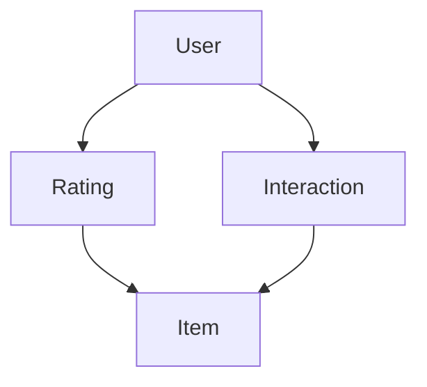
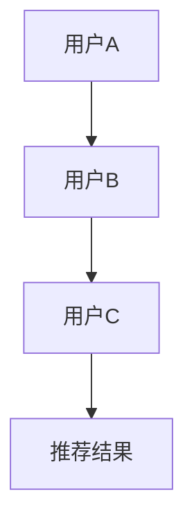
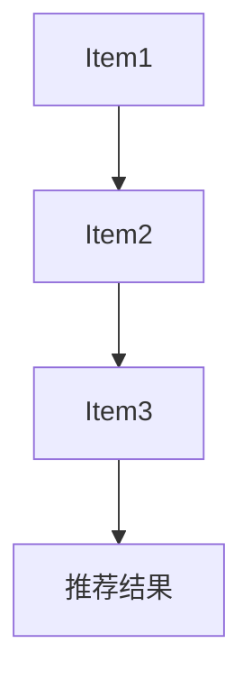
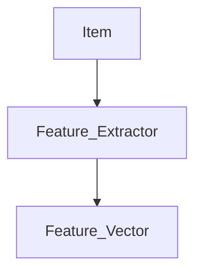
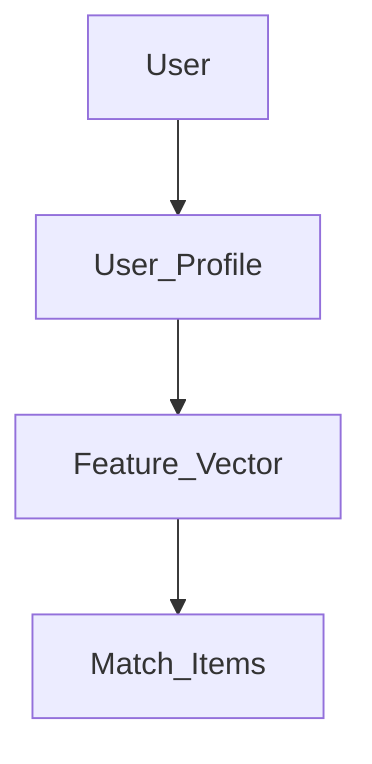
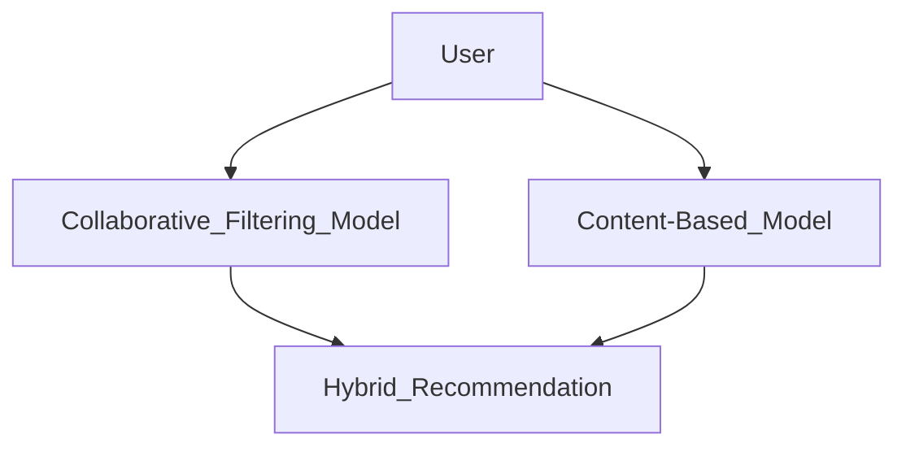
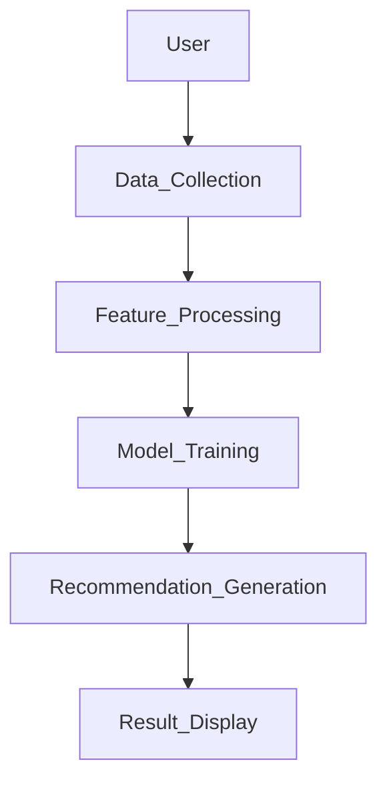
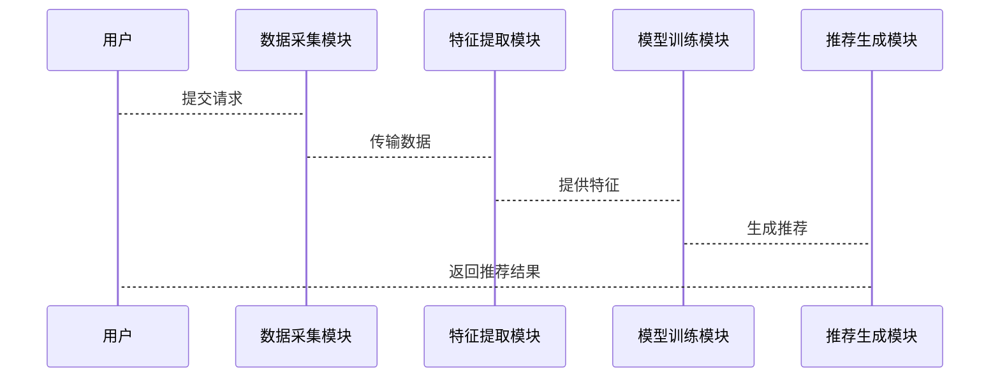

                 


# 构建企业级推荐系统：个性化产品与服务推荐

## 关键词：推荐系统、协同过滤、深度学习、混合推荐模型、个性化推荐、企业级系统

## 摘要：  
本文系统性地探讨了企业级推荐系统的构建过程，从核心概念到算法原理，再到系统架构设计与项目实战，详细阐述了如何实现个性化产品与服务推荐。文章通过丰富的实例、图表和数学模型，深入分析了协同过滤、基于内容的推荐、混合推荐模型等方法，并结合实际案例展示了推荐系统的应用与优化。通过本文，读者将能够全面理解推荐系统的构建流程，并掌握实际开发中的关键技巧。

---

# 第1章: 推荐系统的背景与核心概念

## 1.1 推荐系统的定义与背景

### 1.1.1 从传统推荐到现代推荐的演进

推荐系统是一种基于用户行为和偏好，自动为用户推荐相关产品或服务的技术。随着互联网的快速发展，推荐系统从早期的简单规则推荐，逐步演变为基于协同过滤、基于内容的推荐，再到如今的深度学习推荐模型。这种演变不仅提高了推荐的准确性和个性化，还使得推荐系统在企业级应用中发挥着越来越重要的作用。

### 1.1.2 企业级推荐系统的应用场景

企业级推荐系统广泛应用于多个领域：

1. **电子商务**：推荐商品、个性化促销。
2. **媒体与娱乐**：推荐视频、音乐、新闻。
3. **社交网络**：推荐好友、内容。
4. **金融行业**：推荐理财产品、风险评估。

### 1.1.3 推荐系统的边界与外延

推荐系统的边界包括用户行为数据采集、特征提取、模型训练和结果展示。外延则涉及数据源（如用户日志、点击流数据）、模型部署环境（如云平台）和评价指标（如准确率、召回率）。

## 1.2 推荐系统的核心要素与概念结构

### 1.2.1 用户、物品、行为的核心关系

推荐系统的核心关系如下：

- **用户（User）**：具有兴趣、行为和属性的主体。
- **物品（Item）**：需要推荐的实体，可以是商品、服务或内容。
- **行为（Behavior）**：用户与物品的交互记录，如点击、购买。

### 1.2.2 推荐系统的属性特征对比表

| 属性 | 描述 |
|------|------|
| 用户特征 | 兴趣、行为、属性 |
| 物品特征 | 属性、类别、标签 |
| 推荐策略 | 协同过滤、基于内容、混合推荐 |
| 评价指标 | 准确率、召回率、F1值 |

### 1.2.3 推荐系统的ER实体关系图



## 1.3 推荐系统的分类与架构

### 1.3.1 协同过滤推荐

基于用户相似性或物品相似性进行推荐。

### 1.3.2 基于内容的推荐

基于物品的特征和用户的偏好进行推荐。

### 1.3.3 混合推荐模型

结合协同过滤和基于内容的推荐，通过混合策略提高推荐效果。

## 1.4 本章小结

本章介绍了推荐系统的背景、核心概念和分类，为后续的算法和系统设计奠定了基础。

---

# 第2章: 协同过滤算法原理

## 2.1 协同过滤的核心思想

### 2.1.1 基于用户的协同过滤

通过用户相似性计算，找到相似用户的行为，推荐用户喜欢的物品。

### 2.1.2 基于物品的协同过滤

通过物品相似性计算，找到与目标物品相似的物品，推荐给用户。

## 2.2 协同过滤的实现流程

### 2.2.1 基于用户的协同过滤实现流程



### 2.2.2 基于物品的协同过滤实现流程



## 2.3 协同过滤的数学模型

### 2.3.1 用户相似度计算公式

$$ sim(u_i, u_j) = \frac{\sum_{k} r_{u_i,k} \cdot r_{u_j,k}}{\sqrt{\sum_{k} r_{u_i,k}^2} \cdot \sqrt{\sum_{k} r_{u_j,k}^2}} $$

### 2.3.2 推荐评分预测公式

$$ \hat{r}_{u_i, i_j} = \frac{\sum_{k} w_{u_i,k} \cdot r_{u_j,k}}{\sum_{k} w_{u_i,k}} $$

## 2.4 本章小结

本章详细讲解了协同过滤的核心思想和实现流程，为后续的推荐系统设计提供了理论基础。

---

# 第3章: 基于内容的推荐算法

## 3.1 基于内容推荐的核心原理

### 3.1.1 物品特征提取

通过对物品的属性、类别和标签进行分析，提取物品的特征向量。

### 3.1.2 用户偏好匹配

通过用户的行为和偏好，匹配与用户兴趣相符的物品。

## 3.2 基于内容推荐的实现流程

### 3.2.1 物品特征提取流程



### 3.2.2 用户偏好匹配流程



## 3.3 基于内容推荐的数学模型

### 3.3.1 物品特征表示

使用向量表示物品的特征，例如：

$$ \text{Item}_i = [f_1, f_2, \ldots, f_n] $$

### 3.3.2 用户偏好匹配

通过计算用户偏好与物品特征的相似度，选择最匹配的物品。

## 3.4 本章小结

本章介绍了基于内容的推荐算法，重点讲解了物品特征提取和用户偏好匹配的实现过程。

---

# 第4章: 混合推荐模型

## 4.1 混合推荐模型的核心思想

### 4.1.1 协同过滤与基于内容的混合

结合协同过滤和基于内容的推荐，通过加权的方式提高推荐的准确性和多样性。

### 4.1.2 混合推荐模型的优势

通过结合不同推荐方法的优势，提升推荐效果。

## 4.2 混合推荐模型的实现流程

### 4.2.1 协同过滤与基于内容的混合实现流程



### 4.2.2 混合推荐模型的数学表示

通过加权的方式融合不同模型的输出：

$$ \hat{r}_{hybrid} = \alpha \cdot \hat{r}_{cf} + (1-\alpha) \cdot \hat{r}_{cb} $$

## 4.3 本章小结

本章介绍了混合推荐模型的核心思想和实现流程，展示了如何通过结合不同推荐方法的优势来提升推荐效果。

---

# 第5章: 推荐系统的系统分析与架构设计

## 5.1 系统分析

### 5.1.1 问题场景介绍

推荐系统的应用场景包括用户行为数据采集、特征提取、模型训练和结果展示。

### 5.1.2 项目介绍

以电商推荐系统为例，介绍推荐系统的功能需求和技术选型。

## 5.2 系统架构设计

### 5.2.1 系统架构图



### 5.2.2 系统功能模块

1. **数据采集模块**：采集用户行为数据。
2. **特征提取模块**：提取用户和物品的特征。
3. **模型训练模块**：训练推荐模型。
4. **推荐生成模块**：生成推荐结果。
5. **结果展示模块**：展示推荐结果。

## 5.3 系统接口设计

### 5.3.1 用户接口

- 接收用户输入，返回推荐结果。

### 5.3.2 模型接口

- 提供特征提取和模型训练的API。

## 5.4 系统交互序列图



## 5.5 本章小结

本章通过系统分析与架构设计，展示了推荐系统的整体结构和各模块的协作关系。

---

# 第6章: 项目实战——电商推荐系统

## 6.1 环境安装

### 6.1.1 安装Python

```bash
python --version
```

### 6.1.2 安装依赖库

```bash
pip install numpy pandas scikit-learn
```

## 6.2 系统核心实现

### 6.2.1 数据预处理

```python
import pandas as pd

data = pd.read_csv('user_ratings.csv')
data.head()
```

### 6.2.2 特征工程

```python
from sklearn.feature_extraction.text import TfidfVectorizer

vectorizer = TfidfVectorizer()
item_features = vectorizer.fit_transform(items)
```

### 6.2.3 模型训练

```python
from sklearn.metrics.pairwise import cosine_similarity

similarity_matrix = cosine_similarity(item_features)
```

### 6.2.4 推荐生成

```python
def recommend_items(user_id, similarity_matrix):
    # 获取用户历史评分
    user_ratings = data[data['user_id'] == user_id]
    # 计算推荐得分
   推荐得分 = similarity_matrix[user_ratings.index]
    return 推荐得分
```

## 6.3 实际案例分析

### 6.3.1 案例背景

以电商推荐系统为例，分析推荐系统的实际应用。

### 6.3.2 案例实现

```python
import numpy as np

def hybrid_recommendation(user_id, collaborative_scores, content_scores):
    alpha = 0.5
    hybrid_scores = alpha * collaborative_scores + (1 - alpha) * content_scores
    return hybrid_scores.argsort()[-5:][::-1]
```

## 6.4 项目小结

本章通过电商推荐系统的实战，展示了推荐系统的实现过程和关键步骤。

---

# 第7章: 最佳实践与注意事项

## 7.1 最佳实践

### 7.1.1 数据质量的重要性

确保数据的完整性和准确性。

### 7.1.2 模型选择的注意事项

根据实际场景选择合适的推荐方法。

### 7.1.3 系统部署与维护

确保系统的稳定性和可扩展性。

## 7.2 小结

推荐系统的构建需要综合考虑数据、算法和系统架构，通过不断的优化和调整，才能实现最佳的推荐效果。

---

## 作者：AI天才研究院/AI Genius Institute & 禅与计算机程序设计艺术 /Zen And The Art of Computer Programming

