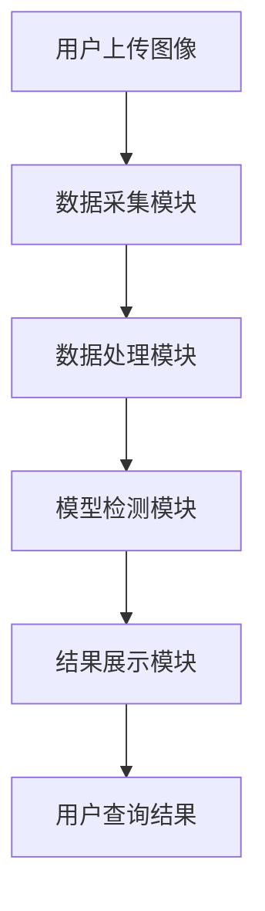

                 

<think>
好，我需要帮用户撰写一篇关于《构建企业级机器视觉平台：质量控制与安全监测》的技术博客文章。用户希望文章结构清晰，逻辑严谨，内容详实，涵盖机器视觉的定义、核心算法、系统架构以及项目实战等方面。我需要按照用户提供的大纲逐步展开，确保每个部分都深入分析，同时使用专业但易懂的语言。

首先，我得明确文章的关键词和摘要。关键词包括机器视觉、深度学习、计算机视觉、图像处理、目标检测、质量控制、安全监测。摘要需要简明扼要地概括文章的核心内容，强调机器视觉在企业中的应用价值和技术实现。

接下来是目录结构。第一部分是背景介绍，包括机器视觉的定义、核心概念以及在企业中的应用。这部分需要让读者了解什么是机器视觉，为什么它对企业如此重要。

第二部分是核心算法与技术，涵盖图像处理、目标检测、深度学习模型等内容。我需要详细解释每种算法的工作原理，并通过代码示例和对比表格帮助读者理解不同算法的优缺点。

第三部分是系统架构设计，这部分比较复杂。我需要描述系统的功能模块、架构设计、接口设计以及交互流程。使用Mermaid图表来展示系统架构和交互流程会更直观。

第四部分是项目实战与应用，这部分需要指导读者如何构建一个实际的机器视觉平台。从环境搭建到代码实现，再到案例分析，都要详细讲解，帮助读者将理论应用于实践。

最后是最佳实践、小结、注意事项和拓展阅读，这部分总结全文，给出实用建议，并引导读者进一步学习。

在撰写过程中，我要确保每个章节都有足够的细节，比如在算法部分，不仅要解释原理，还要给出Python代码示例和数学公式。在系统架构部分，要用Mermaid图来展示结构，使内容更清晰。

现在，我需要检查每个部分是否覆盖了用户要求的所有内容，确保没有遗漏任何关键点。同时，要保持语言的专业性和逻辑的连贯性，使整篇文章既有深度又易于理解。

总的来说，我需要系统地分解每个部分，逐步展开，确保内容全面且结构合理。通过这种方式，我能够为用户提供一篇高质量的技术博客文章，满足他们的需求。
</think>

# 构建企业级机器视觉平台：质量控制与安全监测

## 关键词：机器视觉，深度学习，计算机视觉，图像处理，目标检测，质量控制，安全监测

## 摘要：  
本文详细探讨了构建企业级机器视觉平台的核心技术与实际应用，重点分析了质量控制与安全监测两大领域。从机器视觉的定义、技术原理到深度学习算法的应用，再到系统架构设计与项目实战，为读者提供了从理论到实践的全面指导。通过具体案例和代码实现，帮助读者理解如何在企业中高效部署和优化机器视觉系统。

---

# 第一部分: 企业级机器视觉平台概述

## 第1章: 机器视觉与企业级应用概述

### 1.1 机器视觉的定义与核心概念  
#### 1.1.1 机器视觉的定义  
机器视觉是通过计算机模拟人类视觉系统的功能，利用摄像头、传感器和算法对图像进行采集、处理和分析，从而实现对物体的识别、检测和跟踪。  

#### 1.1.2 机器视觉的核心技术与组成  
机器视觉的核心技术包括图像采集、图像处理、目标检测、图像识别和深度学习等。其组成通常包括硬件设备（如摄像头、光源、传感器）和软件算法（如OpenCV、深度学习框架）。  

#### 1.1.3 机器视觉在企业中的应用价值  
在企业中，机器视觉主要用于质量控制、安全监测、生产自动化等领域。通过提高检测效率和准确性，显著降低人工成本并提升生产效率。  

### 1.2 企业级机器视觉平台的背景与需求  
#### 1.2.1 企业级应用的背景分析  
随着工业4.0和智能化生产的推进，企业对自动化、智能化的需求日益增加。机器视觉作为实现智能化生产的关键技术之一，得到了广泛应用。  

#### 1.2.2 质量控制与安全监测的核心需求  
在制造业中，质量控制需要对产品进行高精度检测，而安全监测则需要实时监控生产环境中的潜在危险。机器视觉能够通过图像分析快速识别缺陷或异常情况，满足这两方面的核心需求。  

#### 1.2.3 机器视觉在企业中的应用场景  
- 质量控制：如电子产品组装、汽车零部件检测等。  
- 安全监测：如工厂设备状态监测、人员安全防护等。  
- 生产优化：如生产线上的实时监控与优化。  

### 1.3 机器视觉技术的演进与挑战  
#### 1.3.1 传统视觉检测技术的局限性  
传统视觉检测依赖于规则和模板匹配，难以应对复杂场景和多样化的物体形状。  

#### 1.3.2 深度学习驱动的机器视觉革命  
深度学习技术的引入，如卷积神经网络（CNN）和目标检测算法（如YOLO、Faster R-CNN），极大地提升了机器视觉的检测精度和鲁棒性。  

#### 1.3.3 当前机器视觉技术的主要挑战  
- 数据依赖性：深度学习需要大量标注数据，数据获取成本高。  
- 算法实时性：在工业场景中，实时性要求高，算法优化至关重要。  
- 环境适应性：复杂光照、遮挡等环境因素会影响检测效果。  

### 1.4 本章小结  
本章从机器视觉的定义、核心技术、企业应用场景及技术挑战四个方面进行了概述，为后续章节的深入分析奠定了基础。

---

# 第二部分: 机器视觉核心算法与技术

## 第2章: 机器视觉的核心算法原理  

### 2.1 图像处理基础  
#### 2.1.1 图像采集与预处理  
图像采集是机器视觉的第一步，预处理包括去噪、二值化、边缘检测等，旨在提升图像质量。  

#### 2.1.2 常用图像处理算法概述  
- **形态学运算**：如膨胀、腐蚀操作，用于消除噪声或增强目标区域。  
- **边缘检测**：如Canny算法，用于提取图像边缘特征。  
- **图像分割**：将图像分割为多个区域，便于后续分析。  

#### 2.1.3 图像特征提取方法  
- **Harris角点检测**：用于图像中的关键点检测。  
- **SIFT（尺度不变特征变换）**：用于图像特征点的提取与匹配。  

### 2.2 目标检测与识别  
#### 2.2.1 常用目标检测算法对比  
| 算法名称       | 核心思想                     | 优缺点                               |  
|----------------|------------------------------|--------------------------------------|  
| Haar分类器     | 基于haar特征的分类器         | 简单易用，适合小目标检测             |  
| DPM（Deformable Part Model） | 基于部件模型的目标检测     | 检测精度高，但计算复杂               |  
| YOLO           | 通过一个神经网络直接预测边界框 | 实时性好，适合工业实时检测             |  
| Faster R-CNN   | 结合区域建议网络和目标检测网络 | 检测精度高，但实时性稍差             |  

#### 2.2.2 基于深度学习的目标检测原理  
目标检测算法通常分为两步：  
1. **生成候选区域**：如使用RPN（Region Proposal Network）生成可能包含目标的区域。  
2. **分类与回归**：对每个候选区域进行目标分类和位置回归。  

#### 2.2.3 检测算法的优缺点分析  
- YOLO：实时性好，适合工业实时检测，但对复杂场景的检测精度较低。  
- Faster R-CNN：检测精度高，但计算复杂，适合非实时场景。  

### 2.3 机器学习与深度学习在视觉中的应用  
#### 2.3.1 传统机器学习在视觉中的应用  
- **SVM（支持向量机）**：用于图像分类和目标检测。  
- **K-Means聚类**：用于图像分割和目标分类。  

#### 2.3.2 深度学习模型的构建与训练  
- **CNN（卷积神经网络）**：通过卷积层提取图像特征，全连接层进行分类。  
- **迁移学习**：利用预训练模型（如ResNet）进行微调，减少训练数据需求。  

#### 2.3.3 模型优化与部署  
- **模型压缩**：如剪枝、量化，降低模型体积和计算复杂度。  
- **模型部署**：将模型部署到边缘设备或云平台，实现实时检测。  

### 2.4 算法实现与代码示例  
#### 2.4.1 基于OpenCV的图像处理代码  
```python
import cv2

# 读取图像
img = cv2.imread('image.jpg')

# 转换为灰度图像
gray = cv2.cvtColor(img, cv2.COLOR_BGR2GRAY)

# 使用Canny边缘检测
edges = cv2.Canny(gray, 100, 200)

# 保存结果
cv2.imwrite('edges.jpg', edges)
```

#### 2.4.2 基于YOLO的目标检测代码  
```python
import numpy as np
from tensorflow.keras.models import load_model

# 加载预训练模型
model = load_model('yolov3.h5')

# 输入图像
input_image = cv2.imread('input.jpg')

# 前向传播
predictions = model.predict(input_image)

# 解析预测结果并绘制边界框
for box in predictions:
    x1, y1, x2, y2, label = box
    cv2.rectangle(input_image, (x1, y1), (x2, y2), (0, 255, 0), 2)
    cv2.putText(input_image, label, (x1, y1 - 10), cv2.FONT_HERSHEY_SIMPLEX, 1, (0, 255, 0), 2)

cv2.imwrite('output.jpg', input_image)
```

#### 2.4.3 模型训练与优化的Python代码示例  
```python
# 定义损失函数
def loss_fn(y_true, y_pred):
    return tf.reduce_mean(tf.square(y_true - y_pred))

# 模型训练
optimizer = tf.keras.optimizers.Adam(learning_rate=0.001)
model.compile(optimizer=optimizer, loss=loss_fn, metrics=['accuracy'])

# 数据加载与训练
model.fit(X_train, y_train, epochs=10, batch_size=32, validation_data=(X_val, y_val))
```

### 2.5 本章小结  
本章详细介绍了机器视觉中的核心算法，包括图像处理、目标检测和深度学习模型的构建与优化。通过代码示例和对比分析，帮助读者理解不同算法的适用场景和优缺点。

---

# 第三部分: 企业级机器视觉平台系统架构

## 第3章: 系统架构与设计  

### 3.1 系统功能模块划分  
#### 3.1.1 数据采集模块  
- 负责图像的采集和预处理，确保数据质量。  

#### 3.1.2 数据处理模块  
- 对采集到的图像进行特征提取和目标检测。  

#### 3.1.3 模型训练与部署模块  
- 负责模型的训练、优化和部署，支持实时检测。  

#### 3.1.4 结果展示与反馈模块  
- 展示检测结果，并提供反馈机制用于优化模型。  

### 3.2 系统架构设计  
#### 3.2.1 分层架构设计  
- **数据层**：存储原始图像和处理后的数据。  
- **算法层**：实现目标检测和图像处理算法。  
- **应用层**：提供用户界面和结果展示。  

#### 3.2.2 微服务架构设计  
- **数据采集服务**：负责图像采集和预处理。  
- **算法服务**：提供目标检测和识别接口。  
- **结果展示服务**：展示检测结果并提供反馈。  

#### 3.2.3 高可用性与扩展性设计  
- **负载均衡**：通过Nginx实现服务的负载均衡。  
- **弹性扩展**：使用容器化技术（如Docker）实现弹性扩展。  

### 3.3 系统接口与交互设计  
#### 3.3.1 API接口设计  
- **图像上传接口**：`POST /api/upload`  
- **目标检测接口**：`POST /api/detect`  
- **结果查询接口**：`GET /api/results`  

#### 3.3.2 系统交互流程图  


#### 3.3.3 接口协议与数据格式  
- **协议**：RESTful API  
- **数据格式**：JSON格式，如：  
  ```json
  {
      "image_path": "path/to/image.jpg",
      "detection_results": [{"label": "object", "coordinates": [x1, y1, x2, y2]}]
  }
  ```

### 3.4 系统架构的实现与优化  
#### 3.4.1 基于Docker的容器化部署  
- 使用Docker将各服务打包为镜像，实现快速部署和扩展。  

#### 3.4.2 微服务架构的实现  
- 使用Spring Boot或FastAPI框架实现各服务的独立部署。  

#### 3.4.3 系统性能优化策略  
- **并行计算**：利用多线程或GPU加速提升检测速度。  
- **缓存机制**：缓存频繁访问的数据，减少数据库压力。  

### 3.5 本章小结  
本章从系统架构设计、功能模块划分、接口设计和性能优化等方面，详细介绍了企业级机器视觉平台的构建过程。

---

# 第四部分: 项目实战与应用  

## 第4章: 企业级机器视觉平台的构建与实战  

### 4.1 项目环境搭建  
#### 4.1.1 开发环境的安装与配置  
- **操作系统**：Linux或Windows  
- **工具安装**：安装Python、OpenCV、TensorFlow、Docker等。  

#### 4.1.2 依赖管理与版本控制  
- 使用虚拟环境（如venv）管理Python依赖。  
- 使用Git进行代码版本控制。  

### 4.2 系统核心实现  
#### 4.2.1 数据采集模块的实现  
```python
import cv2

def capture_image():
    cap = cv2.VideoCapture(0)
    ret, frame = cap.read()
    cap.release()
    return frame
```

#### 4.2.2 数据处理模块的实现  
```python
import cv2

def process_image(image):
    gray = cv2.cvtColor(image, cv2.COLOR_BGR2GRAY)
    edges = cv2.Canny(gray, 100, 200)
    return edges
```

#### 4.2.3 目标检测模块的实现  
```python
import tensorflow as tf
from tensorflow.keras.models import load_model

model = load_model('yolov3.h5')

def detect_objects(image):
    input_image = image.copy()
    predictions = model.predict(input_image)
    for box in predictions:
        x1, y1, x2, y2, label = box
        cv2.rectangle(input_image, (x1, y1), (x2, y2), (0, 255, 0), 2)
        cv2.putText(input_image, label, (x1, y1 - 10), cv2.FONT_HERSHEY_SIMPLEX, 1, (0, 255, 0), 2)
    return input_image
```

#### 4.2.4 结果展示模块的实现  
```python
import cv2

def display_results(image):
    cv2.imshow('Detection Results', image)
    cv2.waitKey(0)
    cv2.destroyAllWindows()
```

### 4.3 项目实战：质量控制与安全监测  
#### 4.3.1 质量控制案例  
- **任务**：检测电子元件的表面缺陷。  
- **实现**：使用YOLO算法对元件进行检测，识别表面的划痕和污渍。  

#### 4.3.2 安全监测案例  
- **任务**：监控工厂设备的运行状态。  
- **实现**：通过摄像头实时采集设备图像，使用深度学习模型检测设备的异常状态。  

### 4.4 项目小结  
本章通过具体案例展示了企业级机器视觉平台的构建过程，从环境搭建到核心模块实现，再到实际应用，为读者提供了完整的实战指导。

---

# 第五部分: 最佳实践与总结  

## 第5章: 最佳实践与总结  

### 5.1 最佳实践 Tips  
1. **数据质量管理**：确保数据的多样性和代表性，避免过拟合。  
2. **算法优化**：结合实际场景优化算法，提升检测速度和精度。  
3. **系统维护**：定期更新模型和优化系统架构，确保平台的稳定性和高效性。  

### 5.2 小结  
通过本文的详细讲解，读者可以掌握企业级机器视觉平台的核心技术与实际应用。从算法实现到系统架构设计，再到项目实战，为构建高效的机器视觉平台提供了全面的指导。  

### 5.3 注意事项  
- **数据隐私**：在实际应用中，需注意数据的隐私保护。  
- **系统兼容性**：确保系统在不同设备和环境下都能稳定运行。  

### 5.4 拓展阅读  
- 《Deep Learning for Computer Vision》  
- 《Practical Deep Learning for Coders》  
- 《Computer Vision: Algorithms and Applications》  

---

# 作者：AI天才研究院/AI Genius Institute & 禅与计算机程序设计艺术 /Zen And The Art of Computer Programming  

---

以上是《构建企业级机器视觉平台：质量控制与安全监测》的技术博客文章的完整大纲和内容。希望本文能为读者提供有价值的参考和启发！

