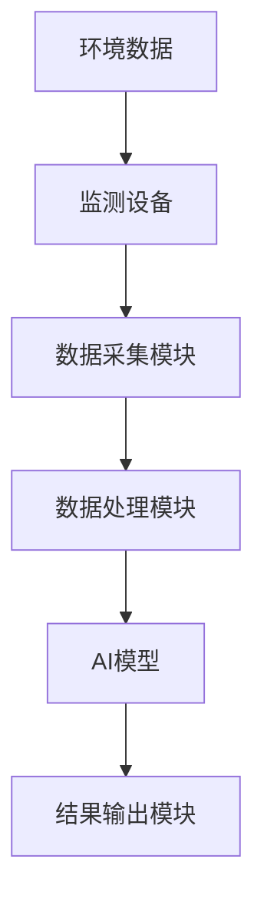
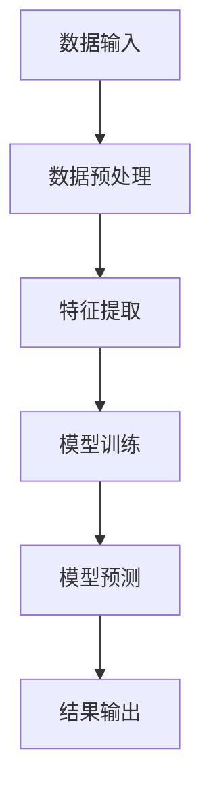
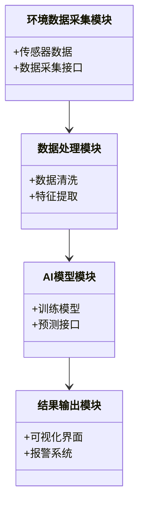
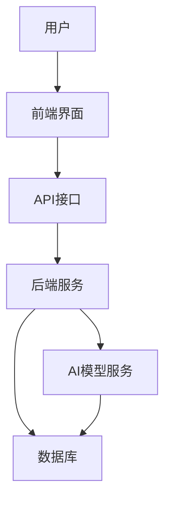
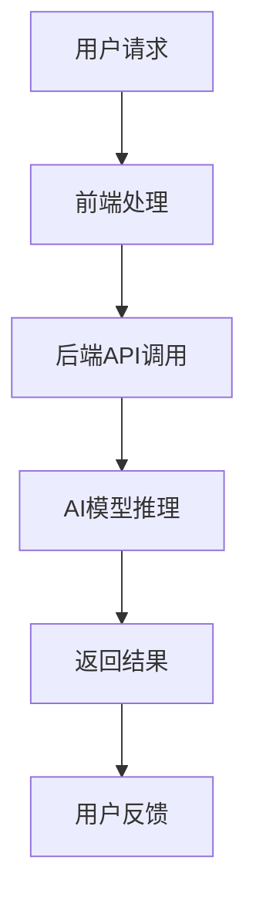

                 


# 构建企业级环境监测AI：助力合规与可持续发展

## 关键词：企业级环境监测AI，合规，可持续发展，深度学习，时间序列分析，异常检测

## 摘要：企业级环境监测AI系统利用人工智能技术，通过深度学习和时间序列分析等算法，实时监测和分析环境数据，识别异常情况，预测潜在风险，助力企业实现环境合规与可持续发展目标。本文详细讲解系统架构设计、算法原理及项目实战。

---

# 第1章: 企业级环境监测AI的背景介绍

## 1.1 问题背景与问题描述

### 1.1.1 环境监测的重要性与挑战
随着工业化进程的加快，环境问题日益严重，企业面临的环境监管要求也越来越严格。环境监测是企业合规经营的基础，但传统的人工监测方式效率低、成本高，难以满足实时性和精准性的需求。此外，环境数据的复杂性和多样性也对监测技术提出了更高的要求。

### 1.1.2 企业合规与可持续发展的需求
企业需要遵守国家和地方的环境法规，同时在可持续发展方面做出表率。环境监测AI系统能够帮助企业实时监控环境数据，预测潜在的环境风险，优化资源利用，减少污染排放，从而实现合规与可持续发展的双重目标。

### 1.1.3 环境监测AI的必要性与目标
传统环境监测系统存在数据处理能力有限、响应速度慢等问题。AI技术的引入能够显著提升环境监测的效率和精度，通过自动化分析和预测，帮助企业更好地应对环境挑战。

## 1.2 问题解决与边界定义

### 1.2.1 环境监测AI的核心问题解决
- 实时监测环境数据
- 自动识别异常情况
- 预测潜在环境风险
- 优化环境管理策略

### 1.2.2 系统边界与外延
- 数据来源：企业内部的传感器数据、外部环境数据
- 数据处理范围：从数据采集到分析的全生命周期
- 系统输出：实时报警、预测报告、优化建议

### 1.2.3 核心要素与组成结构
- 数据采集模块
- 数据处理模块
- AI模型模块
- 结果输出模块

## 1.3 核心概念与联系

### 1.3.1 环境监测AI的概念属性特征对比表
| 特性 | 传统环境监测 | AI环境监测 |
|------|---------------|------------|
| 数据处理能力 | 有限 | 强大 |
| 响应速度 | 较慢 | 实时 |
| 分析精度 | 低 | 高 |
| 自动化能力 | 无 | 有 |

### 1.3.2 ER实体关系图架构


---

# 第2章: 环境监测AI的核心算法原理

## 2.1 算法原理讲解

### 2.1.1 深度学习算法在环境监测中的应用
深度学习通过神经网络模型自动提取数据特征，适用于复杂的环境数据分析。例如，使用LSTM（长短期记忆网络）模型进行时间序列预测。

### 2.1.2 时间序列分析算法
时间序列分析用于预测未来环境数据，常用ARIMA（自回归积分滑动平均模型）和Prophet模型。

### 2.1.3 异常检测算法
异常检测用于识别环境数据中的异常值，常用基于聚类的Isolation Forest算法和基于深度学习的自动编码器（Autoencoder）。

## 2.2 算法流程图



## 2.3 数学模型与公式

### 2.3.1 线性回归模型
$$ y = \beta_0 + \beta_1x + \epsilon $$

### 2.3.2 LSTM模型结构
$$ h_t = \text{激活函数}(f_t \odot h_{t-1}) $$
$$ o_t = \text{激活函数}(o_t) $$

---

# 第3章: 系统分析与架构设计

## 3.1 系统功能设计

### 3.1.1 领域模型设计


## 3.2 系统架构设计



## 3.3 接口设计与交互流程

### 3.3.1 系统接口设计
- 数据采集接口：接收传感器数据
- AI模型接口：调用预测服务
- 报警接口：发送异常报警

### 3.3.2 交互流程图


---

# 第4章: 项目实战与实现

## 4.1 环境监测AI系统安装与配置

### 4.1.1 环境安装
- 安装Python、TensorFlow、Keras、Flask等依赖库
- 配置数据库和传感器接口

## 4.2 系统核心实现源代码

```python
import numpy as np
from tensorflow.keras.models import Sequential
from tensorflow.keras.layers import LSTM, Dense

# 数据预处理
def preprocess(data):
    # 数据清洗和特征提取
    return processed_data

# LSTM模型构建
def build_model(input_shape):
    model = Sequential()
    model.add(LSTM(64, input_shape=input_shape))
    model.add(Dense(1, activation='sigmoid'))
    model.compile(optimizer='adam', loss='binary_crossentropy')
    return model

# 训练模型
def train_model(model, X_train, y_train):
    model.fit(X_train, y_train, epochs=10, batch_size=32)

# 预测
def predict(model, X_test):
    return model.predict(X_test)
```

### 代码应用解读与分析
- 数据预处理：清洗数据并提取特征
- LSTM模型：用于时间序列预测
- 训练与预测：使用训练数据优化模型，用测试数据验证效果

## 4.3 案例分析和详细讲解剖析
以某企业为例，分析系统如何实时监测污染物排放，预测超标风险，并提供优化建议。

## 4.4 项目小结
通过实际案例，验证了环境监测AI系统的有效性和实用性。

---

# 总结与展望

## 5.1 总结
环境监测AI系统通过深度学习和时间序列分析，帮助企业实现环境合规与可持续发展。

## 5.2 展望
未来，AI技术将进一步提升环境监测的智能化水平，推动绿色经济的发展。

---

# 最佳实践 Tips

- 数据质量是AI系统的核心，确保数据采集的准确性和完整性。
- 定期更新AI模型，适应环境变化。
- 结合企业实际需求，灵活调整系统功能。

---

# 作者

作者：AI天才研究院/AI Genius Institute & 禅与计算机程序设计艺术 /Zen And The Art of Computer Programming

