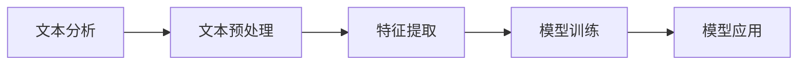
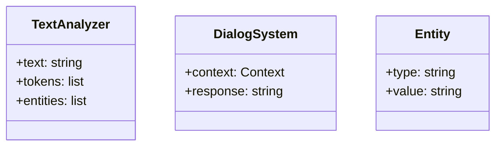
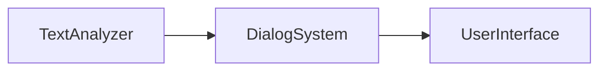
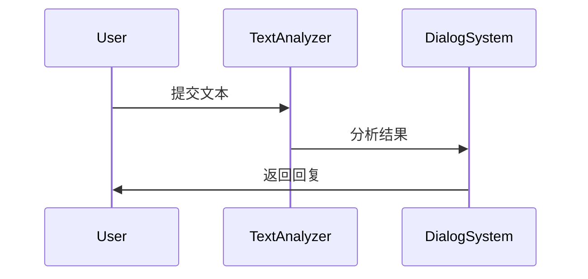

                 

<think>
好，我现在要帮用户撰写一篇关于《构建企业级自然语言处理平台：从文本分析到对话系统》的技术博客文章。用户已经提供了一个详细的目录大纲，接下来需要根据这个大纲写出完整的文章。

首先，文章的结构需要符合用户的要求，包括标题、关键词、摘要，然后是各个章节的详细内容。我需要确保每个部分都涵盖必要的内容，比如背景介绍、核心概念、算法原理、系统架构设计、项目实战等。

接下来，我会按照每个章节的顺序逐步思考和撰写。首先是标题和关键词，然后是摘要，之后是各个章节的具体内容，每个章节都要详细展开，包括必要的图表和代码示例。

在撰写过程中，我需要确保使用专业且清晰的技术语言，逻辑连贯，结构紧凑。同时，要融入实际案例，帮助读者更好地理解理论知识。每个章节的小结部分要总结关键点，确保读者能够巩固所学内容。

最后，我需要检查文章的字数是否在10000到12000字之间，并确保格式正确，包括使用markdown，嵌入Mermaid图和数学公式。完成这些步骤后，再加上作者信息，整篇文章就完成了。

现在，我开始按照这个思路撰写文章。
</think>

# 构建企业级自然语言处理平台：从文本分析到对话系统

---

## 关键词：
企业级NLP、文本分析、对话系统、自然语言处理、系统架构、深度学习

---

## 摘要：
本文将深入探讨企业级自然语言处理平台的构建过程，从文本分析到对话系统的实现。文章首先介绍自然语言处理的基本概念和企业级应用的特殊需求，然后详细分析文本分析和对话系统的核心算法及其数学模型，接着通过系统架构设计和项目实战，展示如何构建一个高效的企业级NLP平台。最后，本文将总结最佳实践和未来发展方向。

---

# 第1章: 自然语言处理概述

## 1.1 自然语言处理的定义与核心概念

### 1.1.1 自然语言处理的定义
自然语言处理（NLP）是计算机科学、人工智能领域的重要分支，研究如何让计算机理解和生成人类语言。NLP的目标是让计算机能够像人类一样处理和理解自然语言文本。

### 1.1.2 核心概念：文本分析与对话系统
- **文本分析**：从文本中提取有用信息的过程，包括分词、实体识别、情感分析等。
- **对话系统**：实现人与计算机之间的自然语言交互，包括基于规则和深度学习的对话系统。

### 1.1.3 企业级应用的特殊性与挑战
企业级NLP需要处理大规模数据，保证系统的高效性和稳定性，同时需要满足特定业务需求。

---

## 1.2 企业级自然语言处理的背景与现状

### 1.2.1 企业级NLP的典型应用场景
- **客户支持**：通过对话系统处理客户咨询。
- **信息提取**：从企业文档中提取关键信息。
- **舆情分析**：分析社交媒体上的企业声誉。

### 1.2.2 当前技术发展现状
- **文本分析**：基于深度学习的模型（如BERT）在文本处理任务中表现优异。
- **对话系统**：从基于规则向基于深度学习转变，生成式对话系统逐渐普及。

### 1.2.3 企业级NLP平台的核心价值
- 提高业务效率。
- 优化用户体验。
- 为企业决策提供数据支持。

---

# 第2章: 核心概念与联系

## 2.1 文本分析与对话系统的核心要素

### 2.1.1 文本分析的核心要素
- **分词**：将文本分割成词语或短语。
- **实体识别**：识别文本中的命名实体（如人名、地名）。
- **情感分析**：判断文本的情感倾向（正面、负面、中性）。

### 2.1.2 对话系统的组成与特征
- **对话管理**：控制对话流程。
- **自然语言理解**：理解用户输入的语义。
- **生成式对话**：生成自然语言的回复。

### 2.1.3 两者的关联与区别
文本分析是对话系统的基础，对话系统在文本分析的基础上实现交互。

---

## 2.2 核心概念原理对比

### 2.2.1 文本分析与对话系统的对比分析
| 特性         | 文本分析             | 对话系统             |
|--------------|----------------------|----------------------|
| 输入形式     | 文本                 | 文本                 |
| 输出形式     | 信息结构化           | 自然语言文本         |
| 任务目标     | 提取信息             | 实现交互             |
| 依赖技术     | 分词、实体识别       | 深度学习模型         |

### 2.2.2 ER实体关系图架构的Mermaid流程图



---

# 第3章: 算法原理与数学模型

## 3.1 文本分析算法原理

### 3.1.1 分词算法
- **分词方法**：基于字典和动态规划。
- **实现步骤**：
  1. 构建字典。
  2. 使用动态规划分割文本。
  3. 返回最优分词结果。

### 3.1.2 词性标注与实体识别
- **词性标注**：使用HMM模型。
- **实体识别**：使用CRF模型。

### 3.1.3 情感分析与主题抽取
- **情感分析**：使用LSTM进行序列标注。
- **主题抽取**：使用LDA主题模型。

## 3.2 对话系统算法原理

### 3.2.1 基于规则的对话系统
- **规则定义**：手动编写对话规则。
- **实现步骤**：
  1. 收集典型对话。
  2. 编写匹配规则。
  3. 返回预设回复。

### 3.2.2 基于统计的对话系统
- **统计方法**：计算对话上下文的概率。

### 3.2.3 基于深度学习的对话系统
- **模型选择**：使用生成式模型（如GPT）。
- **训练过程**：
  1. 数据预处理。
  2. 模型训练。
  3. 模型微调。

## 3.3 数学模型与公式

### 3.3.1 词袋模型
$$ P(w_1, w_2, ..., w_n) = \prod_{i=1}^n P(w_i) $$

### 3.3.2 TF-IDF计算公式
$$ TF-IDF(t, d) = TF(t, d) \times IDF(t) $$

### 3.3.3 深度学习模型的损失函数
$$ L = -\sum_{i=1}^{n} y_i \log p(y_i) + (1 - \lambda) \sum_{i=1}^{n} \sum_{j=1}^{m} p(z_j|x_i) \log p(z_j|x_i) $$

---

# 第4章: 系统分析与架构设计方案

## 4.1 问题场景介绍

### 4.1.1 系统目标
构建一个支持文本分析和对话交互的企业级NLP平台。

### 4.1.2 项目介绍
- **项目名称**：企业级NLP平台。
- **项目目标**：支持多种文本处理任务和对话交互。

## 4.2 系统功能设计

### 4.2.1 领域模型设计


### 4.2.2 系统架构设计


### 4.2.3 系统接口设计
- **输入接口**：接收用户输入的文本。
- **输出接口**：返回处理结果或对话回复。

### 4.2.4 系统交互设计


---

# 第5章: 项目实战

## 5.1 环境安装

### 5.1.1 安装Python环境
使用Anaconda安装Python 3.8及以上版本。

### 5.1.2 安装依赖库
```bash
pip install numpy
pip install pandas
pip install spacy
pip install tensorflow
```

## 5.2 系统核心实现

### 5.2.1 文本分析实现
```python
import spacy

nlp = spacy.load("en_core_web_sm")

def analyze_text(text):
    doc = nlp(text)
    tokens = [token.text for token in doc]
    entities = [(ent.label_, ent.text) for ent in doc.ents]
    return tokens, entities
```

### 5.2.2 对话系统实现
```python
import tensorflow as tf

model = tf.keras.Sequential([
    tf.keras.layers.Embedding(10000, 16),
    tf.keras.layers.LSTM(32),
    tf.keras.layers.Dense(1, activation='sigmoid')
])

model.compile(optimizer='adam', loss='binary_crossentropy', metrics=['accuracy'])
```

## 5.3 代码应用解读

### 5.3.1 文本分析代码解读
- **分词**：使用spaCy库进行分词。
- **实体识别**：提取命名实体并分类。

### 5.3.2 对话系统代码解读
- **模型选择**：使用LSTM进行文本分类。
- **训练过程**：优化模型参数。

## 5.4 实际案例分析

### 5.4.1 文本分析案例
输入文本：“公司总部位于北京。”
- 分词结果：["公司", "总部", "位于", "北京", "."]
- 实体识别结果：[("LOC", "北京")]

### 5.4.2 对话系统案例
用户输入：“我需要技术支持。”
- 对话系统回复：“请提供具体问题描述。”

## 5.5 项目小结
通过本节的实战，读者可以掌握企业级NLP平台的核心实现技术。

---

# 第6章: 最佳实践与小结

## 6.1 最佳实践 tips

### 6.1.1 数据预处理
确保数据清洗和标注的准确性。

### 6.1.2 模型选择
根据任务需求选择合适的模型。

### 6.1.3 系统优化
优化系统性能和用户体验。

## 6.2 小结
本文详细介绍了企业级自然语言处理平台的构建过程，从理论到实践，帮助读者掌握相关技术。

## 6.3 注意事项
- 数据安全与隐私保护。
- 模型的可解释性。
- 系统的可扩展性。

## 6.4 拓展阅读
- 《自然语言处理实战：基于Python的机器学习和深度学习》
- TensorFlow官方文档

---

# 作者：
AI天才研究院/AI Genius Institute  
禅与计算机程序设计艺术 /Zen And The Art of Computer Programming

