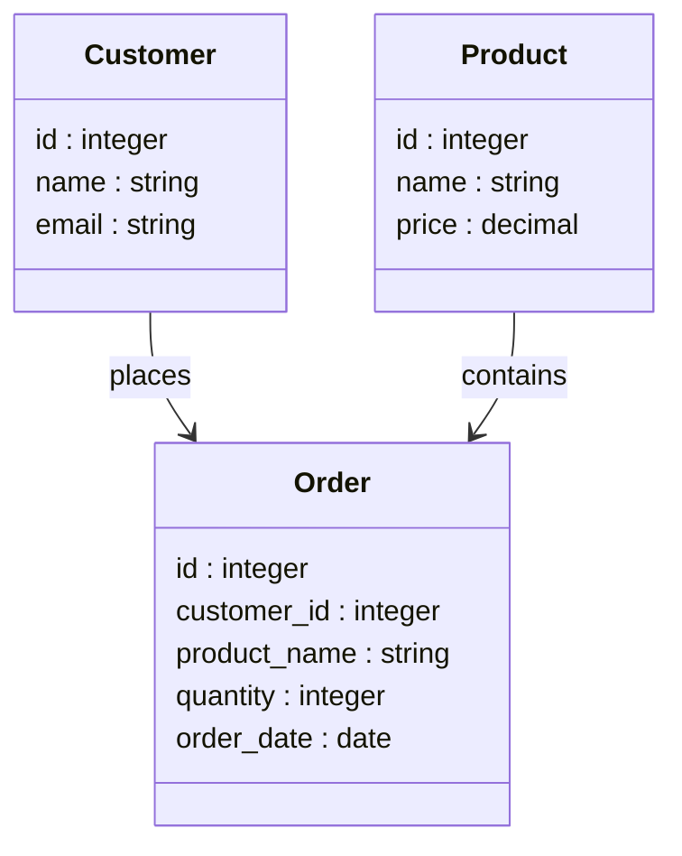

                 

<think>
嗯，用户让我写一篇关于《构建企业级自然语言接口：简化复杂系统操作》的技术博客文章。我得先理清思路，按照用户给的大纲来写。

首先，用户希望我以一个技术专家的身份来写，所以文章要专业但又不失易懂。我需要先写摘要，然后是目录，接着按照目录一步步展开每个部分。

摘要部分，我需要简明扼要地说明文章的核心内容，强调自然语言接口在企业级系统中的重要性，以及如何通过构建这样的接口来简化操作。

接下来是目录，用户已经提供了一个详细的大纲，包括背景介绍、核心原理、系统分析、项目实战和最佳实践等部分。我需要确保每个章节都涵盖关键点，并且结构清晰。

在写背景介绍时，我会先解释什么是自然语言处理，然后分析企业级应用中的挑战，最后介绍自然语言接口的核心要素和系统架构。

核心原理部分，我需要详细讲解NLP的流程，从文本预处理到语义理解，再到意图识别。同时，介绍常用的算法，比如Word2Vec、BERT，以及如何训练和优化模型。

系统分析与架构设计部分，我会讨论系统功能设计、架构选择，以及如何设计接口和交互流程。可能需要画一些图，比如领域模型的类图和架构图，来帮助读者理解。

项目实战部分，我会提供一个具体的实现案例，包括环境安装、核心代码实现，以及案例分析。这部分需要实际操作，确保读者能够跟着步骤一步步来。

最后，最佳实践部分，我会总结前面的内容，给出一些实用的建议，并推荐进一步的学习资源。

在写作过程中，我要注意使用专业术语，同时保持语言的流畅和易懂。可能还需要插入一些数学公式和代码示例，以增强技术深度。

总的来说，我需要系统地分析每个部分，确保文章结构完整，内容详实，同时保持逻辑清晰，让读者能够一步步理解如何构建企业级自然语言接口。
</think>

# 构建企业级自然语言接口：简化复杂系统操作

## 关键词：自然语言处理，企业级应用，自然语言接口，系统架构，NLP算法，意图识别，文本处理

## 摘要：
自然语言处理（NLP）是人工智能领域的重要分支，其核心目标是让计算机能够理解和生成人类语言。在企业级应用中，复杂的系统操作往往需要繁琐的步骤和专业的技能，而自然语言接口（NLI）的引入能够显著简化这一过程。本文将从自然语言接口的核心原理、算法实现、系统架构设计以及实际项目实战等多个维度展开讨论，帮助读者全面理解如何构建一个高效、可靠的自然语言接口，从而实现对企业级复杂系统的简化操作。

---

# 第一部分: 自然语言处理与企业级应用背景

# 第1章: 自然语言处理与企业级应用概述

## 1.1 自然语言处理的背景与现状

### 1.1.1 自然语言处理的核心概念

自然语言处理（NLP）是人工智能的一个重要分支，旨在使计算机能够理解和生成人类语言。NLP的核心任务包括文本分析、信息抽取、语义理解、意图识别等。

### 1.1.2 企业级应用中的NLP挑战

企业在实际应用中，面临着复杂的系统操作问题。例如，用户需要通过命令行或图形界面与系统交互，这种方式效率低下且难以满足多样化的用户需求。引入自然语言接口后，用户可以通过自然语言指令直接与系统交互，从而显著简化操作流程。

### 1.1.3 自然语言接口的定义与作用

自然语言接口（NLI）是一种让用户通过自然语言与计算机系统交互的技术。它的作用是将用户的自然语言指令转换为计算机能够理解的命令，从而实现复杂系统的简化操作。

## 1.2 问题背景与需求分析

### 1.2.1 复杂系统操作的难点

企业在运行过程中，通常需要处理大量的数据和复杂的业务逻辑。传统的交互方式（如命令行或图形界面）难以满足用户的需求，尤其是在处理复杂任务时，用户需要掌握特定的操作流程和技能。

### 1.2.2 自然语言接口的解决方案

自然语言接口通过将用户的自然语言指令转换为计算机指令，解决了复杂系统操作的难点。它能够支持多样化的用户需求，降低用户的学习成本，并提高操作效率。

### 1.2.3 边界与外延

自然语言接口的边界在于其支持的自然语言处理能力，即它能够理解和生成的语言类型和范围。其外延则包括与之相关的技术，如语音识别、机器翻译等。

## 1.3 核心概念与系统架构

### 1.3.1 自然语言接口的核心要素

自然语言接口的核心要素包括：

1. **文本预处理**：包括分词、停用词处理、词干提取等。
2. **语义理解**：基于上下文理解用户意图。
3. **意图识别与生成**：将用户的自然语言指令转换为系统可执行的命令。

### 1.3.2 系统架构的组成与功能

系统架构通常包括以下部分：

1. **前端界面**：用户输入自然语言指令。
2. **NLP引擎**：对用户的指令进行解析和处理。
3. **后端系统**：根据解析结果执行相应的操作。
4. **反馈机制**：将操作结果返回给用户。

### 1.3.3 实体关系图（ER图）

```mermaid
erDiagram
    customer
    {
        id : integer
        name : string
        email : string
    }
    order
    {
        id : integer
        customer_id : integer
        product_name : string
        quantity : integer
        order_date : date
    }
    product
    {
        id : integer
        name : string
        price : decimal
    }
    customer--order
    product--order
```

---

# 第2章: 自然语言接口的核心原理

## 2.1 自然语言处理的流程

### 2.1.1 文本预处理

文本预处理是自然语言处理的基础步骤，包括：

1. **分词**：将文本分割成词语或短语。
2. **去除停用词**：移除常见但无意义的词语（如“and”、“the”）。
3. **词干提取**：将词语转换为其基本形式（如“running”转换为“run”）。

### 2.1.2 语义理解

语义理解是自然语言处理的核心任务，旨在理解文本的深层含义。常用的技术包括：

1. **词嵌入模型**：如Word2Vec、GloVe、BERT等。
2. **句法分析**：分析句子的语法结构。
3. **语义网络**：构建词语之间的语义关系。

### 2.1.3 意图识别与生成

意图识别是将用户的自然语言指令映射到具体的操作或任务。常用的方法包括：

1. **基于规则的意图识别**：通过预定义的规则匹配用户指令。
2. **基于机器学习的意图识别**：使用分类算法（如SVM、随机森林）训练模型。
3. **基于深度学习的意图识别**：使用神经网络模型（如LSTM、Transformer）进行训练。

---

## 2.2 自然语言接口的算法原理

### 2.2.1 基于规则的NLP算法

基于规则的NLP算法通过预定义的规则来处理文本。例如，可以通过正则表达式匹配特定的关键词或短语。

```python
import re

text = "Please delete the report for customer A123"
pattern = r"delete the report for customer (\w+)"
match = re.search(pattern, text)
if match:
    customer_id = match.group(1)
    # 执行删除操作
```

### 2.2.2 基于统计的NLP算法

基于统计的NLP算法通过分析文本的统计特征来处理文本。例如，可以使用TF-IDF（Term Frequency-Inverse Document Frequency）来计算关键词的重要性。

### 2.2.3 基于深度学习的NLP算法

基于深度学习的NLP算法通过训练神经网络模型来处理文本。例如，可以使用BERT模型进行文本摘要或问答系统。

---

## 2.3 模型训练与优化

### 2.3.1 预训练模型的引入

预训练模型（如BERT）已经在大规模数据上进行过训练，可以直接用于各种NLP任务。

### 2.3.2 微调模型的实现

微调模型是通过对预训练模型进行进一步训练来适应特定任务。例如，可以在BERT模型的基础上添加分类层进行意图分类。

### 2.3.3 模型评估与优化

模型评估通常包括准确率、召回率、F1分数等指标。可以通过交叉验证和网格搜索来优化模型的超参数。

---

# 第3章: 企业级自然语言接口的系统分析与架构设计

## 3.1 问题场景介绍

### 3.1.1 企业级系统的复杂性

企业级系统通常涉及多个模块和复杂的业务逻辑。例如，企业资源计划（ERP）系统需要处理采购、生产、销售等多个环节。

### 3.1.2 自然语言接口的应用场景

自然语言接口可以应用于企业级系统的多个方面，例如：

1. **用户查询**：用户可以通过自然语言查询系统中的数据。
2. **任务执行**：用户可以通过自然语言指令系统执行特定任务。
3. **信息提取**：从自然语言文本中提取关键信息。

### 3.1.3 用户需求分析

用户需求分析是设计自然语言接口的重要步骤。例如，可以通过问卷调查、用户访谈等方式收集用户需求。

## 3.2 系统功能设计

### 3.2.1 领域模型设计

领域模型是对业务领域的抽象和建模。例如，可以使用UML（统一建模语言）进行建模。



### 3.2.2 功能模块划分

功能模块划分是系统设计的重要步骤。例如，可以将系统划分为以下几个模块：

1. **输入模块**：接收用户的自然语言指令。
2. **处理模块**：解析用户的指令并执行相应的操作。
3. **输出模块**：将操作结果返回给用户。

### 3.2.3 交互流程设计

交互流程设计是用户与系统之间的交互流程。例如：

1. 用户输入自然语言指令。
2. 系统解析用户的指令。
3. 系统执行相应的操作。
4. 系统将结果反馈给用户。

## 3.3 系统架构设计

### 3.3.1 分层架构设计

分层架构是一种常见的系统架构设计方法。例如：

1. **表现层**：负责用户界面的展示。
2. **业务逻辑层**：负责处理业务逻辑。
3. **数据访问层**：负责与数据存储的交互。

### 3.3.2 微服务架构设计

微服务架构是一种将系统划分为多个小型、独立服务的设计方法。例如：

1. **自然语言处理服务**：负责解析用户的指令。
2. **业务逻辑服务**：负责执行相应的操作。
3. **数据存储服务**：负责数据的存储和检索。

### 3.3.3 架构优化策略

架构优化策略包括：

1. **缓存优化**：通过缓存减少重复计算。
2. **负载均衡**：通过负载均衡分摊系统压力。
3. **容错设计**：通过冗余设计提高系统的可靠性。

---

# 第4章: 企业级自然语言接口的项目实战

## 4.1 环境安装

### 4.1.1 安装Python

```bash
python --version
```

### 4.1.2 安装NLP库

```bash
pip install numpy
pip install scikit-learn
pip install spacy
pip install transformers
```

## 4.2 核心代码实现

### 4.2.1 自然语言解析

```python
from transformers import pipeline

# 初始化自然语言处理管道
nlp = pipeline("text-classification", model="bert-base-cased")

# 解析用户指令
text = "Delete the report for customer A123"
result = nlp(text)
print(result)
```

### 4.2.2 意图分类

```python
from sklearn.feature_extraction.text import TfidfVectorizer
from sklearn.svm import SVC

# 训练意图分类模型
vectorizer = TfidfVectorizer()
model = SVC()

# 训练模型
model.fit(vectorizer.fit_transform(train_texts), train_labels)
```

## 4.3 案例分析与详细讲解

### 4.3.1 案例分析

假设我们有一个企业级系统，用户可以通过自然语言指令查询客户信息。例如：

```plaintext
"Show me the details of customer A123"
```

系统解析用户的指令后，会执行以下操作：

1. **解析指令**：识别用户的意图是查询客户信息。
2. **执行操作**：从数据库中检索客户A123的详细信息。
3. **返回结果**：将结果以自然语言形式反馈给用户。

### 4.3.2 详细讲解

详细讲解包括：

1. **数据预处理**：对文本进行分词、去除停用词等处理。
2. **模型训练**：使用预训练模型或自定义模型进行训练。
3. **结果反馈**：将操作结果以自然语言形式反馈给用户。

---

# 第5章: 最佳实践与小结

## 5.1 最佳实践

### 5.1.1 小结

自然语言接口是一种能够显著简化复杂系统操作的技术。通过本文的讨论，我们了解了自然语言接口的核心原理、系统架构设计以及实际项目实战。

### 5.1.2 注意事项

在实际应用中，需要注意以下几点：

1. **数据质量**：确保训练数据的质量和多样性。
2. **模型优化**：通过不断优化模型提高准确率。
3. **用户体验**：确保用户能够方便地与系统交互。

### 5.1.3 拓展阅读

推荐以下书籍和论文：

1. **《自然语言处理入门》**：作者：[书籍名称]
2. **《BERT: Pre-training of Self-attention Networks》**：作者：[论文作者]

---

# 作者：AI天才研究院/AI Genius Institute & 禅与计算机程序设计艺术 /Zen And The Art of Computer Programming

---

以上是《构建企业级自然语言接口：简化复杂系统操作》的技术博客文章的完整目录和内容框架。希望这篇文章能够帮助读者全面理解如何构建一个高效、可靠的自然语言接口，从而实现对企业级复杂系统的简化操作。

