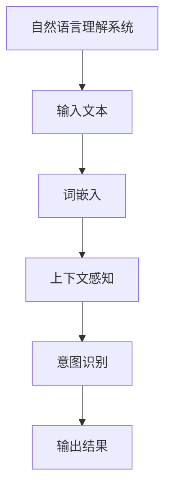
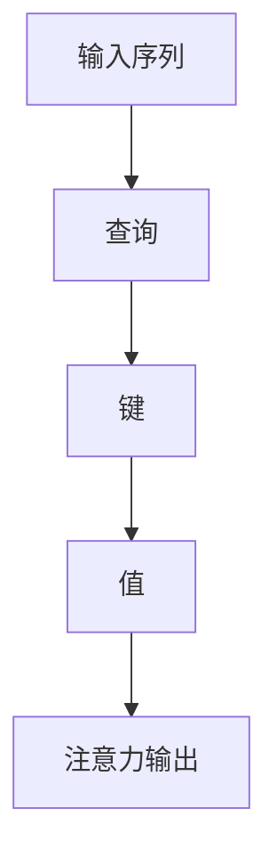
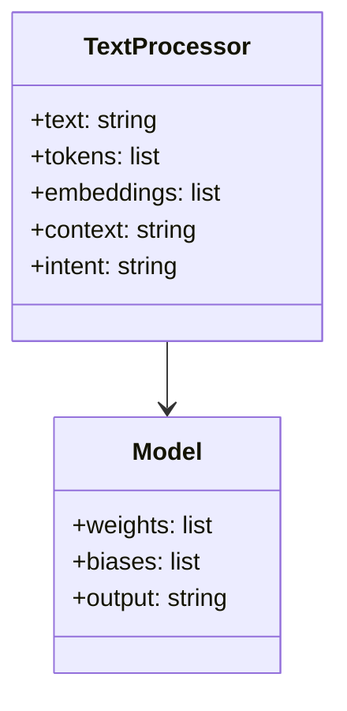
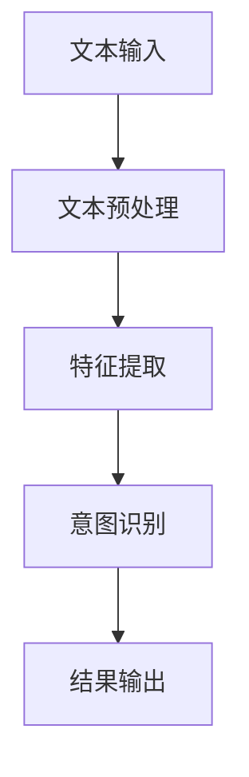

                 


# 构建企业级自然语言理解系统：上下文感知与多意图识别

## 关键词：企业级自然语言理解系统, 上下文感知, 多意图识别, 机器学习, 深度学习, 自然语言处理

## 摘要：  
本文详细探讨了构建企业级自然语言理解系统的关键技术，重点分析了上下文感知与多意图识别的核心原理和实现方法。通过结合实际应用场景，文章系统性地介绍了从问题背景到算法实现的全过程，结合具体案例和代码示例，为读者提供了全面的技术指导。

---

## 第一部分: 自然语言理解系统概述

## 第1章: 企业级自然语言理解系统背景介绍

### 1.1 问题背景
#### 1.1.1 自然语言理解的定义与目标
自然语言理解（Natural Language Understanding, NLU）是人工智能领域的重要分支，旨在让计算机能够理解人类的自然语言输入并生成有意义的输出。其目标是实现人与计算机之间的高效、准确的交流。

#### 1.1.2 企业级应用中的NLU需求
在企业级应用中，NLU系统需要处理复杂的上下文和多意图场景。例如，在智能客服系统中，用户可能会表达多个需求，系统需要准确识别用户的意图并提供相应的解决方案。

#### 1.1.3 上下文感知与多意图识别的重要性
上下文感知能够帮助系统理解当前对话的背景和语境，而多意图识别则能够在复杂的语句中识别出多个潜在意图，提升系统的智能化水平。

### 1.2 问题描述
#### 1.2.1 自然语言理解的核心挑战
自然语言理解的核心挑战包括语义歧义、上下文依赖性以及多意图识别的复杂性。

#### 1.2.2 上下文感知的复杂性
上下文感知需要系统能够理解前后文的关联性，这涉及到语义分析、实体识别和情感分析等多个方面。

#### 1.2.3 多意图识别的难点
多意图识别需要系统能够在同一语句中识别出多个意图，并根据上下文选择最合适的意图组合。

### 1.3 问题解决
#### 1.3.1 自然语言理解的解决方案
采用预训练语言模型（如BERT、GPT）结合任务特定的微调，可以有效提升自然语言理解的性能。

#### 1.3.2 上下文感知的技术实现
通过引入注意力机制和上下文向量，系统能够更好地捕捉文本中的语义信息。

#### 1.3.3 多意图识别的算法选择
使用序列标注模型（如CRF）或深度学习模型（如Transformer）可以有效进行多意图识别。

### 1.4 边界与外延
#### 1.4.1 自然语言理解的边界
自然语言理解的边界包括文本生成、语音识别等其他相关领域。

#### 1.4.2 上下文感知的适用范围
上下文感知主要适用于需要语境理解的任务，如智能对话系统和文本摘要。

#### 1.4.3 多意图识别的应用场景
多意图识别适用于客服咨询、信息检索等需要处理复杂用户需求的场景。

### 1.5 概念结构与核心要素
#### 1.5.1 自然语言理解的组成要素
自然语言理解系统通常包括文本预处理、特征提取、意图识别和结果输出四个部分。

#### 1.5.2 上下文感知的核心模块
上下文感知的核心模块包括上下文表示、关联分析和语义推理。

#### 1.5.3 多意图识别的关键组件
多意图识别的关键组件包括意图候选生成、意图排序和意图验证。

---

## 第二部分: 自然语言理解的核心概念与联系

## 第2章: 自然语言理解的核心原理

### 2.1 自然语言理解的原理
#### 2.1.1 语言模型的训练与推理
语言模型通过大量文本数据的训练，学习语言的统计规律，从而能够生成符合语法规则的文本。

#### 2.1.2 上下文感知的机制
上下文感知通过分析文本的上下文信息，生成与当前语境相关的语义表示。

#### 2.1.3 多意图识别的策略
多意图识别通过分析文本中的关键词、句法结构和语义信息，识别出多个潜在意图。

### 2.2 核心概念对比
#### 2.2.1 上下文感知与意图识别的对比
上下文感知关注语境的理解，而意图识别关注目标的确定。

#### 2.2.2 不同模型的性能对比
通过对比BERT、GPT等模型的性能，分析其在上下文感知和多意图识别任务中的表现。

#### 2.2.3 各种算法的优缺点分析
分析序列标注模型、注意力机制模型等算法在自然语言理解任务中的优缺点。

### 2.3 ER实体关系图


---

## 第三部分: 算法原理与数学模型

## 第3章: 自然语言理解的算法原理

### 3.1 预训练模型的原理
#### 3.1.1 BERT模型的结构
BERT模型通过双向Transformer结构，能够同时捕捉文本的全局上下文信息。

#### 3.1.2 GPT模型的机制
GPT模型通过自回归的方式，生成符合上下文的文本。

#### 3.1.3 模型的适用场景
BERT适用于需要理解文本上下文的任务，而GPT适用于生成文本的任务。

### 3.2 注意力机制的实现


### 3.3 数学模型与公式
#### 3.3.1 概率模型
$$ P(x|y) = \frac{P(x,y)}{P(y)} $$

#### 3.3.2 损失函数
$$ \text{Loss} = -\sum_{i=1}^{n} \log P(y_i|x_i) $$

---

## 第4章: 系统分析与架构设计

### 4.1 系统功能设计
#### 4.1.1 领域模型


### 4.2 系统架构设计


---

## 第5章: 项目实战

### 5.1 环境安装
#### 5.1.1 安装Python
```
python --version
```

#### 5.1.2 安装依赖库
```
pip install transformers
```

### 5.2 系统核心实现源代码
#### 5.2.1 模型训练代码
```python
from transformers import BertTokenizer, BertModel
tokenizer = BertTokenizer.from_pretrained('bert-base-uncased')
model = BertModel.from_pretrained('bert-base-uncased')
```

#### 5.2.2 意图识别代码
```python
def get_intent(text):
    inputs = tokenizer.encode_plus(text, return_tensors='pt')
    outputs = model(**inputs)
    # 处理输出以获取意图
    return intent
```

### 5.3 代码应用解读与分析
#### 5.3.1 系统功能解读
通过预训练模型和自定义模型的结合，实现上下文感知和多意图识别。

#### 5.3.2 代码实现分析
分析代码实现的关键部分，包括文本预处理、特征提取和意图识别。

### 5.4 实际案例分析和详细讲解剖析
#### 5.4.1 案例分析
通过具体案例分析，展示系统的实际应用效果。

#### 5.4.2 详细讲解剖析
从代码实现到系统架构，详细分析系统的各个组成部分。

### 5.5 项目小结
总结项目实现的关键点和经验教训，为后续优化提供参考。

---

## 第6章: 最佳实践 tips、小结、注意事项、拓展阅读

### 6.1 最佳实践 tips
#### 6.1.1 模型选择建议
根据任务需求选择合适的预训练模型。

#### 6.1.2 系统优化建议
通过并行计算和模型压缩等方式优化系统性能。

### 6.2 小结
总结全文内容，强调构建企业级自然语言理解系统的关键点。

### 6.3 注意事项
提醒读者在实际应用中需要注意的问题，如数据隐私和模型泛化能力。

### 6.4 拓展阅读
推荐相关领域的书籍和论文，供读者深入学习。

---

## 作者：AI天才研究院/AI Genius Institute & 禅与计算机程序设计艺术 /Zen And The Art of Computer Programming

