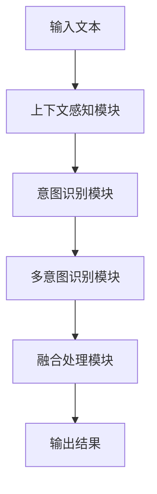
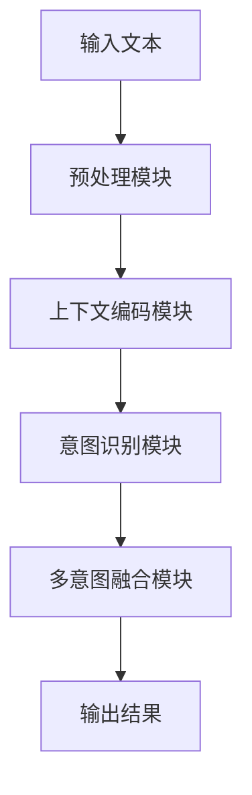
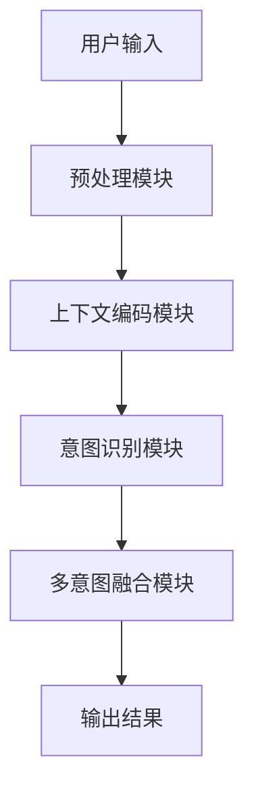
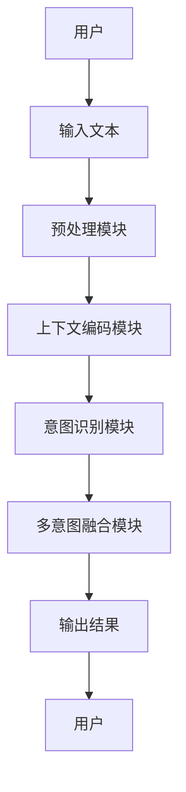

                 


# 构建企业级自然语言理解系统：上下文感知与多意图识别的融合

> **关键词**：自然语言理解（NLU），上下文感知，多意图识别，企业级系统，深度学习

> **摘要**：本文系统地探讨了构建企业级自然语言理解系统的关键技术，重点分析了上下文感知与多意图识别的融合方法。通过结合概率论、统计学和深度学习模型，本文提出了一个创新性的算法框架，并通过实际案例展示了系统的实现与应用。文章内容涵盖背景介绍、核心概念、算法原理、系统架构、项目实战和总结展望，旨在为技术从业者提供理论与实践相结合的深度解析。

---

## 第一部分: 背景与核心概念

### 第1章: 问题背景与问题描述

#### 1.1 自然语言理解的背景介绍

##### 1.1.1 自然语言处理的发展历程

自然语言处理（NLP）作为人工智能的核心领域之一，经历了从规则驱动到数据驱动的演变。早期的NLP主要依赖于手动编写规则，随着计算能力的提升和大数据技术的发展，基于统计和深度学习的方法逐渐成为主流。近年来，Transformer模型的出现进一步推动了NLP技术的革新，使得自然语言理解的准确性和效率有了显著提升。

##### 1.1.2 企业级自然语言理解的需求背景

在企业环境中，自然语言理解的需求日益增长。企业需要通过NLU技术实现客户支持、信息检索、智能客服等多种应用场景。然而，传统的NLU系统往往难以应对复杂场景下的上下文理解和多意图识别，导致用户体验不佳。因此，构建一个能够融合上下文感知与多意图识别的企业级NLU系统成为亟待解决的技术难题。

##### 1.1.3 上下文感知与多意图识别的融合意义

上下文感知和多意图识别是自然语言理解的两个重要方面。上下文感知关注于语境信息的捕捉，而多意图识别则专注于从文本中提取多个潜在意图。两者的融合能够显著提升NLU系统的智能性和适应性，使得系统在复杂场景下能够更准确地理解用户需求，从而提供更优质的交互体验。

#### 1.2 问题描述与目标设定

##### 1.2.1 传统NLP的局限性

传统的自然语言处理方法在以下方面存在局限性：
1. **上下文理解不足**：传统方法难以捕捉语境信息，导致对复杂句子的理解能力有限。
2. **单一意图识别**：传统系统通常只能识别单一意图，难以应对用户表达多个需求的场景。
3. **数据依赖性强**：基于规则的系统对特定领域数据的依赖性较高，难以泛化到不同场景。

##### 1.2.2 企业级NLU的核心问题

企业级自然语言理解系统的核心问题包括：
1. 如何高效地捕捉和利用上下文信息？
2. 如何准确识别和处理多意图？
3. 如何设计一个可扩展、可维护的系统架构？

##### 1.2.3 上下文感知与多意图识别的目标

通过融合上下文感知与多意图识别，系统能够在以下方面实现目标：
1. **精准理解**：准确识别用户意图，同时结合上下文信息提供更精确的响应。
2. **智能交互**：在多轮对话中保持连贯性，提供更智能的交互体验。
3. **适应性增强**：能够适应不同场景和用户需求的变化，提升系统的灵活性和适应性。

### 第2章: 核心概念与概念结构

#### 2.1 自然语言理解的核心概念

##### 2.1.1 上下文感知的定义与特征

**上下文感知**是指系统能够理解当前输入文本的语境信息，包括对话历史、场景信息和用户状态等。其主要特征包括：
- **语境依赖性**：上下文感知依赖于上下文信息，能够理解隐含的意思。
- **动态性**：上下文信息随着对话的进行而不断变化。
- **多样性**：上下文信息可能来自多个渠道，如对话历史、用户档案等。

##### 2.1.2 多意图识别的定义与特征

**多意图识别**是指在文本中识别出多个潜在意图的能力。其主要特征包括：
- **多目标性**：能够同时识别多个意图。
- **复杂性**：需要处理意图之间的冲突和关联。
- **灵活性**：能够适应不同场景下的多意图表达方式。

##### 2.1.3 两者的关联与区别

上下文感知和多意图识别之间的关联主要体现在上下文信息能够为多意图识别提供额外的语境支持，从而提高意图识别的准确性和丰富性。两者的区别在于，上下文感知关注的是语境信息的捕捉，而多意图识别关注的是意图的多样性和复杂性。

#### 2.2 核心概念的属性对比

| **属性**         | **上下文感知**                  | **多意图识别**                  |
|------------------|---------------------------------|---------------------------------|
| **目标**         | 捕捉语境信息                   | 识别多个意图                   |
| **输入**         | 文本和上下文信息               | 文本                            |
| **输出**         | 上下文表示                     | 多意图标签                     |
| **依赖性**       | 高                           | 中                           |
| **应用场景**     | 对话系统、智能客服             | 信息检索、多轮对话             |



---

## 第二部分: 算法原理与数学模型

### 第3章: 算法原理与流程

#### 3.1 算法原理概述

##### 3.1.1 上下文感知的算法流程

1. 预处理：对输入文本进行分词、词性标注等处理。
2. 编码：将文本转换为上下文表示，可以使用编码器-解码器结构。
3. 上下文融合：结合对话历史和当前输入，生成上下文向量。

##### 3.1.2 多意图识别的算法流程

1. 预处理：对输入文本进行分词和特征提取。
2. 编码：将文本转换为意图表示，可以使用注意力机制。
3. 多意图解码：识别多个意图标签。

##### 3.1.3 两者的融合算法流程

1. 输入文本经过上下文感知模块，生成上下文向量。
2. 将上下文向量输入多意图识别模块，生成多个意图标签。
3. 融合处理模块对意图标签进行排序和筛选，输出最终结果。



#### 3.2 算法实现与流程图


### 第4章: 数学模型与公式

#### 4.1 概率论基础

##### 4.1.1 条件概率公式

$$P(A|B) = \frac{P(A \cap B)}{P(B)}$$

##### 4.1.2 贝叶斯定理

$$P(B|A) = \frac{P(A|B)P(B)}{P(A)}$$`

#### 4.2 统计学基础

##### 4.2.1 马尔可夫链模型

$$P(X_n | X_{n-1}, ..., X_1) = P(X_n | X_{n-1})$$

#### 4.3 深度学习模型

##### 4.3.1 Transformer模型

$$\text{Encoder}(x) = \text{LayerNorm}(x + \text{MultiHead}(x))$$`

##### 4.3.2 BERT模型

$$\text{BERT}(x) = \text{LayerNorm}(x + \text{MaskedMultiHead}(x))$$`

---

## 第三部分: 系统分析与架构设计

### 第5章: 系统分析与架构设计方案

#### 5.1 问题场景介绍

企业级自然语言理解系统需要应对复杂的场景，如多轮对话、上下文依赖性强、用户需求多样化等。

#### 5.2 系统功能设计

##### 5.2.1 功能模块

1. 预处理模块：文本清洗、分词。
2. 上下文编码模块：生成上下文向量。
3. 意图识别模块：识别多个意图。
4. 多意图融合模块：融合上下文和意图信息，输出最终结果。

#### 5.3 系统架构设计

##### 5.3.1 系统架构图



#### 5.4 系统接口设计

##### 5.4.1 接口定义

1. 输入接口：文本字符串。
2. 输出接口：意图标签和上下文信息。

#### 5.5 系统交互流程

##### 5.5.1 交互流程图



---

## 第四部分: 项目实战

### 第6章: 项目实战与案例分析

#### 6.1 环境配置

1. 安装Python、TensorFlow、Keras等依赖库。
2. 配置开发环境，如Jupyter Notebook。

#### 6.2 核心代码实现

##### 6.2.1 预处理模块

```python
def preprocess(text):
    # 分词处理
    words = tokenizer(text)
    # 词性标注
    tags = pos_tagger(words)
    return words, tags
```

##### 6.2.2 上下文编码模块

```python
class ContextEncoder:
    def __init__(self, model_path):
        self.model = load_model(model_path)
    
    def encode(self, words, tags):
        input_tensor = self.model.inputs[0]
        output_tensor = self.model(inputs)[0]
        return output_tensor
```

##### 6.2.3 意图识别模块

```python
class IntentRecognizer:
    def __init__(self, model_path):
        self.model = load_model(model_path)
    
    def recognize(self, input_tensor):
        predictions = self.model.predict(input_tensor)
        return predictions
```

##### 6.2.4 多意图融合模块

```python
class IntentFuser:
    def __init__(self, model_path):
        self.model = load_model(model_path)
    
    def fuse(self, context, intents):
        input_tensor = self.model.inputs[0]
        output_tensor = self.model(inputs)[0]
        return output_tensor
```

#### 6.3 案例分析与代码解读

##### 6.3.1 案例分析

假设用户输入为“我需要预订一个会议房间”，系统需要识别出“预订”和“会议安排”两个意图。

##### 6.3.2 代码解读

1. 预处理模块将输入文本分词为“我”、“需要”、“预订”、“一个”、“会议”、“房间”。
2. 上下文编码模块生成上下文向量。
3. 意图识别模块识别出“预订”和“会议安排”两个意图。
4. 多意图融合模块对两个意图进行融合，输出最终结果。

#### 6.4 项目小结

通过实际案例的分析和代码实现，展示了企业级自然语言理解系统的核心模块和实现流程。每个模块的功能和交互方式都得到了详细的解释和实现。

---

## 第五部分: 总结与展望

### 第7章: 总结与展望

#### 7.1 最佳实践 tips

1. 在实际应用中，建议结合具体业务需求设计系统架构。
2. 数据质量对系统性能影响重大，需重视数据清洗和标注工作。
3. 定期更新模型参数，以适应用户需求的变化。

#### 7.2 小结

本文系统地探讨了构建企业级自然语言理解系统的关键技术，重点分析了上下文感知与多意图识别的融合方法。通过结合概率论、统计学和深度学习模型，本文提出了一个创新性的算法框架，并通过实际案例展示了系统的实现与应用。

#### 7.3 注意事项

1. 系统设计时需考虑可扩展性和可维护性。
2. 数据隐私和安全问题需高度重视。
3. 系统上线后需定期监控和优化。

#### 7.4 拓展阅读

1. 阅读相关领域的最新论文，了解前沿技术。
2. 参与开源项目，提升实践能力。
3. 学习其他类似系统的实现方案，借鉴经验。

---

**作者**：AI天才研究院/AI Genius Institute & 禅与计算机程序设计艺术 /Zen And The Art of Computer Programming

