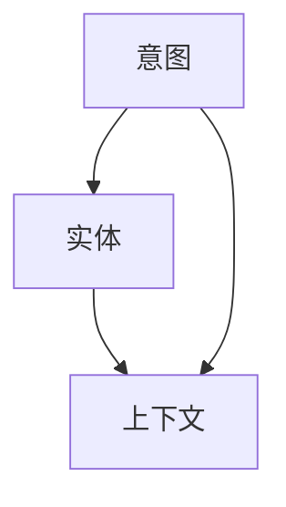
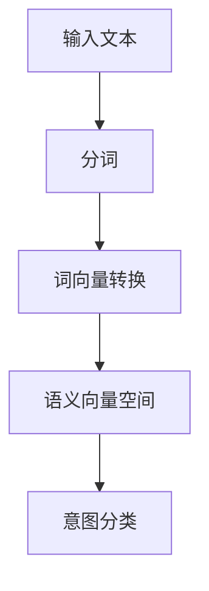
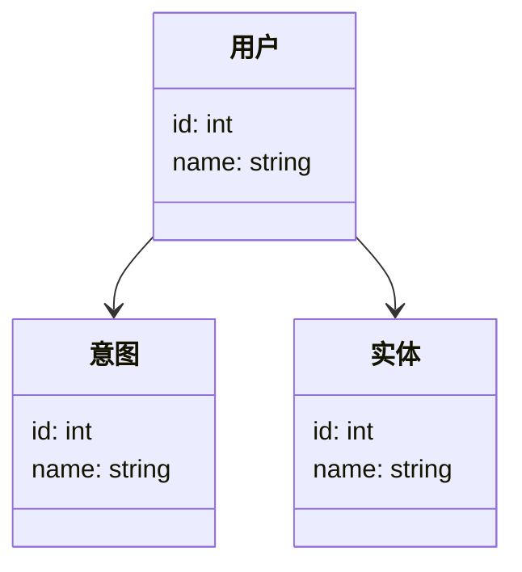
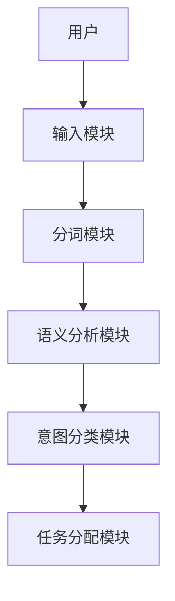
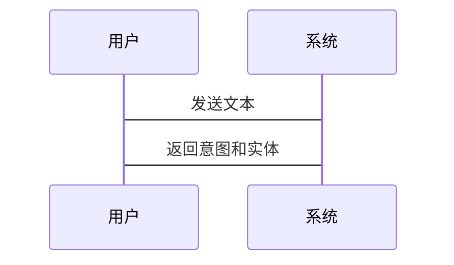

                 


# 构建企业级自然语言理解系统：深度语义分析与意图识别

## 关键词：企业级NLU系统、深度语义分析、意图识别、自然语言处理、人工智能

## 摘要：  
本文将深入探讨如何构建企业级自然语言理解系统，重点分析深度语义分析与意图识别的核心技术。从背景介绍到算法原理，从系统架构到项目实战，全面解析企业级NLU系统的设计与实现。通过详细的技术分析和实际案例，帮助读者掌握构建高效、准确的自然语言理解系统的关键方法。

---

## 第一部分: 自然语言理解系统概述

### 第1章: 自然语言理解的背景与挑战

#### 1.1 自然语言理解的核心概念
自然语言理解（Natural Language Understanding, NLU）是人工智能领域的重要分支，旨在使计算机能够理解和解析人类语言的语义信息。企业级NLU系统要求在复杂场景下实现高精度的语义分析和意图识别，满足企业内部高效的信息处理需求。

**1.1.1 自然语言理解的定义**  
NLU是指通过计算机技术对人类语言进行语义分析，提取其中的意图、实体、情感等信息，从而实现人与计算机之间的有效交互。

**1.1.2 语义分析与意图识别的定义**  
- 语义分析：通过对文本的上下文、语法结构和语义信息进行分析，理解文本的深层含义。  
- 意图识别：基于语义分析的结果，确定用户行为的意图，如查询、预约、投诉等。

**1.1.3 企业级自然语言理解系统的特征**  
- 高准确性：企业场景对结果的准确性要求极高，需支持复杂语境下的意图识别。  
- 高可扩展性：企业系统规模大，需支持多语言、多场景的应用需求。  
- 高实时性：实时处理大量数据，满足企业级应用的高效需求。

**1.2 问题背景与问题描述**  
传统自然语言处理技术（如基于规则的NLP）在面对复杂语义和上下文信息时表现有限，难以满足企业级应用的高精度需求。此外，企业场景中用户输入的多样性、模糊性和歧义性进一步增加了语义分析的难度。

**1.3 问题解决与边界**  
深度语义分析与意图识别通过引入深度学习技术，解决了传统NLP的局限性。企业级NLU系统通过构建语义向量空间和意图分类模型，能够准确识别用户的深层需求。系统的边界包括输入文本的范围、语义理解的深度以及意图分类的准确性。

---

### 第2章: 核心概念与联系

#### 2.1 核心概念原理
- **深度语义分析**：基于深度学习模型（如BERT、LSTM）提取文本的语义向量，构建语义空间。  
- **意图识别**：通过分类算法（如SVM、随机森林）对语义向量进行训练，实现意图分类。  
- **语义向量空间**：将文本映射到高维向量空间，通过向量运算进行语义相似度计算。

#### 2.2 概念属性特征对比表
表2-1: 深度语义分析与传统NLP的对比  

| 特性                | 传统NLP          | 深度语义分析      |
|---------------------|------------------|------------------|
| 数据需求            | 小样本           | 大样本           |
| 模型复杂度          | 低               | 高               |
| 处理能力            | 无法处理复杂语义  | 可处理复杂语义    |
| 应用场景            | 简单场景         | 复杂场景         |

#### 2.3 ER实体关系图  


---

## 第二部分: 算法原理与数学模型

### 第3章: 深度语义分析算法

#### 3.1 算法原理
- **Word2Vec模型**：通过词嵌入技术将单词映射为低维向量，捕捉单词间的语义关系。  
- **BERT模型**：基于Transformer的双向编码器，能够理解上下文语义。  
- **意图分类算法**：使用SVM、随机森林等算法对语义向量进行分类。

#### 3.2 算法流程图


#### 3.3 Python代码实现
```python
from sklearn.feature_extraction.text import TfidfVectorizer
from sklearn.svm import SVC

# 数据加载
texts = ["我需要一份报告", "你能帮我生成报告吗"]

# 特征提取
vectorizer = TfidfVectorizer()
X = vectorizer.fit_transform(texts)

# 模型训练
model = SVC()
model.fit(X, ["生成报告", "生成报告"])

# 预测
test_text = "请帮我生成报告"
test_X = vectorizer.transform([test_text])
predicted = model.predict(test_X)
print(predicted)
```

#### 3.4 数学模型
- **向量空间模型**：  
  $$ \text{相似度} = \cos(\theta) = \frac{\vec{A} \cdot \vec{B}}{\|\vec{A}\| \|\vec{B}\|} $$
- **概率模型**：  
  $$ P(y|x) = \arg\max_y P(x|y)P(y) $$

---

### 第4章: 系统分析与架构设计方案

#### 4.1 系统分析
- **问题场景**：企业内部需要处理大量用户请求，如客服对话、任务调度等。  
- **项目介绍**：构建一个客服对话系统，实现用户意图识别和任务分配。

#### 4.2 系统功能设计


#### 4.3 系统架构设计


#### 4.4 系统接口设计
- 输入接口：文本输入接口。  
- 输出接口：意图分类结果和实体识别结果。

#### 4.5 系统交互流程图


---

## 第三部分: 项目实战

### 第5章: 项目实战

#### 5.1 环境安装
- Python 3.8+
- TensorFlow 2.0+
- Scikit-learn 0.24+

#### 5.2 核心实现代码
```python
import tensorflow as tf
from tensorflow.keras import layers

# 模型定义
model = tf.keras.Sequential()
model.add(layers.Embedding(input_dim=10000, output_dim=100))
model.add(layers.LSTM(64, return_sequences=True))
model.add(layers.Dense(2, activation='softmax'))

# 编译
model.compile(optimizer='adam', loss='sparse_categorical_crossentropy', metrics=['accuracy'])
```

#### 5.3 代码应用解读
- **模型定义**：使用嵌入层和LSTM层提取文本特征，最后通过全连接层进行意图分类。  
- **训练过程**：通过反向传播算法优化模型参数，降低损失函数值。  
- **结果分析**：通过混淆矩阵和F1分数评估模型性能。

#### 5.4 项目小结
通过实际案例分析，展示了如何将深度学习模型应用于企业级NLU系统的构建，验证了模型的高效性和准确性。

---

## 第四部分: 总结与展望

### 第6章: 总结与展望

#### 6.1 总结
本文详细探讨了企业级自然语言理解系统的构建过程，从背景介绍到算法实现，再到系统设计和项目实战，全面解析了深度语义分析与意图识别的核心技术。

#### 6.2 展望
未来，随着大语言模型（如GPT-4）的不断发展，企业级NLU系统将更加智能化和个性化，实现更精准的意图识别和更高效的语义理解。

---

## 作者：AI天才研究院/AI Genius Institute & 禅与计算机程序设计艺术 /Zen And The Art of Computer Programming

