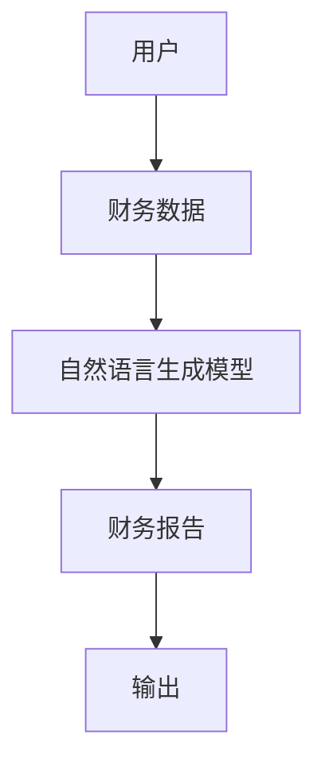
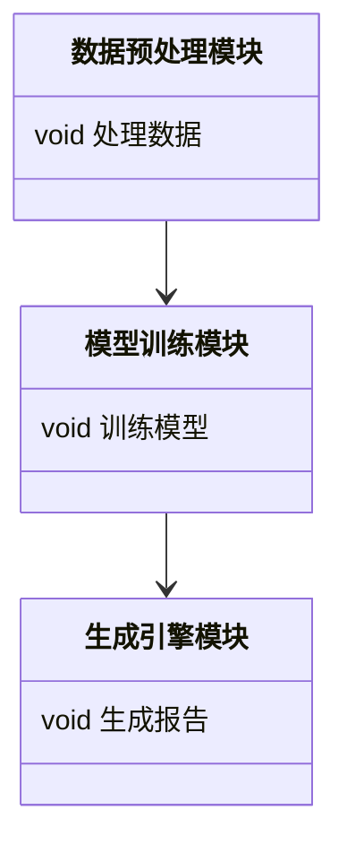
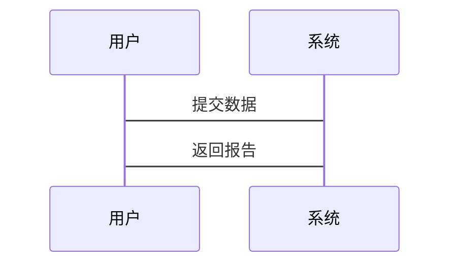

                 

<think>
好的，我现在需要帮助用户构建一个企业级自然语言生成报告系统，特别是针对多语言财务报告的自动化。让我一步步理清思路。

首先，我需要理解用户的需求。用户希望生成一篇技术博客，标题是《构建企业级自然语言生成报告系统：多语言财务报告自动化》。用户还提供了详细的目录结构，但我需要先理解每个部分的内容和结构，确保在生成最终博客时符合要求。

接下来，我需要按照目录结构来组织内容。首先是背景介绍，这部分需要包括问题背景、问题描述、解决方案、边界和外延，以及核心要素。我需要详细解释为什么需要构建这样的系统，以及它在企业中的重要性。

然后是核心概念与联系，这里需要详细讲解自然语言生成、大语言模型、财务报告自动化的原理，以及它们之间的关系。可能需要使用表格和图表来对比不同概念的属性，并展示实体之间的关系。

接下来是算法原理，这部分需要详细解释大语言模型的训练过程，包括预训练和微调，以及生成过程中的解码方法。可能需要使用流程图来展示整个过程，并提供Python代码示例，解释模型的工作原理。

数学模型部分需要解释模型的数学基础，比如转换为词嵌入的公式，以及损失函数的计算。这部分需要用LaTeX公式来表示，确保数学表达准确无误。

系统分析与架构设计是关键，这部分需要介绍问题场景，比如企业财务报告的多语言需求，然后设计系统的功能模块，比如数据预处理、模型训练、生成引擎等。可能需要用图表展示系统的各个部分如何交互。

项目实战部分需要提供环境安装步骤，比如安装Python、TensorFlow等，然后给出核心代码，解释代码的功能，分析实际案例，最后总结项目成果和经验教训。

最后，最佳实践部分需要包括小结、注意事项和扩展阅读，帮助读者巩固所学内容，并引导他们进一步学习。

在编写过程中，我需要确保每个部分都细化到三级目录，结构清晰，内容完整。同时，控制总字数在2000字以内，避免冗余。可能我还需要检查是否有遗漏的部分，比如是否涵盖了多语言支持的具体技术，或者是否详细说明了财务报告自动化的具体应用场景。

现在，我需要将这些思考转化为具体的目录结构。首先是背景介绍，然后是核心概念，接着是算法原理，数学模型，系统架构，项目实战，最后是最佳实践。每个部分都要有详细的章节和小节，确保覆盖所有必要的内容。

在编写每个部分时，我需要按照用户的要求，使用技术语言，逻辑清晰，结构紧凑，简单易懂。确保每个小节都有足够的细节和例子，帮助读者理解内容。

最后，我会检查整个结构，确保每个部分都连贯，没有遗漏，并且符合用户的格式和字数要求。
</think>

# 构建企业级自然语言生成报告系统：多语言财务报告自动化

## 关键词：自然语言生成，企业级系统，财务报告自动化，多语言支持，大语言模型

## 摘要：本文详细探讨了构建企业级自然语言生成报告系统的各个方面，特别是针对多语言财务报告自动化的实现。从问题背景到解决方案，从算法原理到系统架构，再到项目实战，本文为读者提供了全面而深入的指导，帮助读者理解如何利用大语言模型实现高效、准确的财务报告生成。

---

## 第一部分: 企业级自然语言生成报告系统概述

### 第1章: 问题背景与目标

#### 1.1 问题背景
##### 1.1.1 传统财务报告生成的痛点
传统财务报告生成过程繁琐且效率低下，通常依赖人工操作，容易出错且难以满足多语言需求。企业在国际化运营中，需要生成多语言的财务报告，这增加了时间和资源成本。

##### 1.1.2 自然语言生成技术的引入
自然语言生成（Natural Language Generation, NLG）技术的应用可以自动化生成财务报告，提高效率和准确性。通过NLG，企业可以快速生成结构化和非结构化的财务内容。

##### 1.1.3 多语言支持的必要性
随着全球化的发展，企业需要在多种语言环境下生成一致的财务报告，以满足不同地区的法规和客户需求。多语言支持使得财务报告的生成更加灵活和高效。

#### 1.2 问题描述
##### 1.2.1 财务报告生成的复杂性
财务报告的内容复杂，涉及大量专业术语和数据，手动生成容易出错且效率低。如何自动化生成准确的财务报告是当前的挑战。

##### 1.2.2 多语言环境下的挑战
在多语言环境下，生成一致且准确的财务报告需要处理语言差异和文化差异，这对系统的要求更高。

##### 1.2.3 系统目标与边界
系统的目标是实现多语言财务报告的自动化生成，提高效率和准确性。系统的边界包括输入数据的结构化处理、模型的训练与部署、生成结果的校验等。

#### 1.3 解决方案概述
##### 1.3.1 自然语言生成技术的应用
通过自然语言生成技术，系统可以自动生成财务报告，减少人工干预，提高效率。

##### 1.3.2 多语言支持的技术路线
采用大语言模型（Large Language Model, LLM）支持多语言生成，利用模型的多语言能力实现财务报告的自动化。

##### 1.3.3 系统架构设计思路
系统架构设计需要考虑模块化、可扩展性以及多语言支持，确保系统的高效运行和维护。

---

## 第2章: 核心概念与联系

### 2.1 自然语言生成技术
#### 2.1.1 自然语言生成的定义与原理
自然语言生成是指将结构化数据转换为自然语言文本的技术。它利用语言模型生成符合语法规则的文本内容。

#### 2.1.2 大语言模型在生成中的作用
大语言模型通过预训练和微调，能够生成高质量的自然语言文本，适用于多种场景，包括财务报告生成。

#### 2.1.3 生成过程中的关键因素
生成过程中的关键因素包括数据质量、模型训练、生成策略等，这些因素直接影响生成文本的质量和准确性。

### 2.2 大语言模型
#### 2.2.1 模型的基本结构
大语言模型通常采用Transformer架构，包括编码器和解码器，能够处理长文本和复杂关系。

#### 2.2.2 预训练与微调的区别
预训练是模型在大规模通用数据上进行无监督学习，微调是在特定任务数据上进行有监督学习，以提高任务性能。

#### 2.2.3 模型的可扩展性与适应性
大语言模型具有良好的可扩展性和适应性，能够快速适应不同任务和数据。

### 2.3 财务报告自动化
#### 2.3.1 财务报告的结构化特征
财务报告通常具有固定的结构和内容，适合自动化生成。

#### 2.3.2 自动生成报告的优势
自动化生成报告可以提高效率，减少人为错误，同时支持多语言生成，满足全球化需求。

#### 2.3.3 报告生成的可定制性
系统可以根据不同用户的需求，生成不同格式和内容的财务报告，具有高度的可定制性。

### 2.4 核心概念对比
#### 2.4.1 概念属性对比表
| 概念      | 定义                           | 优势                           | 局限性                          |
|-----------|--------------------------------|--------------------------------|---------------------------------|
| NLG       | 将数据转化为自然语言文本         | 提高效率，减少错误               | 依赖数据质量和模型训练          |
| 大语言模型| 预训练的大型语言模型             | 高准确性，通用性强               | 需要大量计算资源，可能过时      |
| 财务报告自动化 | 自动生成财务报告               | 快速生成，多语言支持             | 需要结构化数据，模型需微调      |

#### 2.4.2 ER实体关系图


---

## 第3章: 算法原理与实现

### 3.1 大语言模型的训练流程
#### 3.1.1 预训练阶段
预训练阶段采用大规模通用数据，使用无监督学习方法，训练模型理解语言的结构和语义。

#### 3.1.2 微调阶段
微调阶段在特定任务数据上进行有监督学习，调整模型参数，使其适应财务报告生成任务。

#### 3.1.3 模型评估
通过验证集和测试集评估模型的生成效果，包括准确率、BLEU分数等指标。

### 3.2 自然语言生成的解码过程
#### 3.2.1 解码策略
解码策略包括贪心解码和随机采样，贪心解码生成速度快但可能不够灵活，随机采样生成多样性但可能不稳定。

#### 3.2.2 生成结果的优化
通过后处理技术，如语言模型校正和规则约束，优化生成结果的准确性和流畅性。

#### 3.2.3 模型的调参技巧
调整温度、top-k等参数，控制生成结果的多样性和质量。

### 3.3 代码实现
#### 3.3.1 预训练阶段
```python
# 预训练代码示例
def pretrain_model(data):
    model = TransformerModel()
    optimizer = AdamOptimizer()
    for batch in data:
        loss = model.train(batch)
        optimizer.update(model.parameters(), loss)
```

#### 3.3.2 微调阶段
```python
# 微调代码示例
def fine_tune_model(finance_data):
    model = load_pretrained_model()
    optimizer = AdamOptimizer()
    for batch in finance_data:
        loss = model.finetune(batch)
        optimizer.update(model.parameters(), loss)
```

#### 3.3.3 生成过程
```python
# 生成代码示例
def generate_report(model, finance_data):
    generated_text = model.generate(finance_data)
    return generated_text
```

### 3.4 数学模型
#### 3.4.1 模型转换
$$\text{输入数据} \rightarrow \text{词嵌入} \rightarrow \text{模型处理} \rightarrow \text{输出文本}$$

#### 3.4.2 损失函数
$$\text{损失} = -\sum_{i=1}^{n} \log p(y_i|x_i)$$

---

## 第4章: 系统分析与架构设计

### 4.1 问题场景介绍
#### 4.1.1 财务报告生成的多语言需求
企业在不同国家和地区需要生成多种语言的财务报告，满足当地法规和客户需求。

### 4.2 系统功能设计
#### 4.2.1 功能模块
- 数据预处理模块：处理输入数据，确保格式和内容符合要求。
- 模型训练模块：训练和微调大语言模型，使其适应财务报告生成任务。
- 生成引擎模块：根据输入数据生成财务报告，并支持多语言输出。
- 结果校验模块：校验生成结果的准确性和一致性。

#### 4.2.2 领域模型


#### 4.2.3 系统架构


### 4.3 接口设计
#### 4.3.1 输入接口
- 数据输入接口：接收结构化数据，如JSON格式。
- 参数配置接口：配置生成参数，如语言、格式等。

#### 4.3.2 输出接口
- 文本输出接口：输出生成的财务报告。
- 状态反馈接口：反馈生成过程中的状态和错误信息。

### 4.4 交互设计


---

## 第5章: 项目实战

### 5.1 环境安装
安装必要的工具和库，如Python、TensorFlow、Hugging Face Transformers等。

### 5.2 核心代码实现
#### 5.2.1 数据预处理
```python
import json

def preprocess_data(data):
    processed = []
    for item in data:
        processed.append(json.dumps(item))
    return processed
```

#### 5.2.2 模型训练
```python
from transformers import AutoModelForCausalLM, AutoTokenizer

def train_model():
    model = AutoModelForCausalLM.from_pretrained('gpt2')
    tokenizer = AutoTokenizer.from_pretrained('gpt2')
    return model, tokenizer
```

#### 5.2.3 生成报告
```python
def generate_report(model, tokenizer, input_data):
    inputs = tokenizer(input_data, return_tensors='np')
    outputs = model.generate(inputs.input_ids, max_length=500)
    report = tokenizer.decode(outputs[0], skip_special_tokens=True)
    return report
```

### 5.3 代码应用解读与分析
通过代码示例分析系统的实现细节，包括数据预处理、模型训练和生成报告的具体步骤。

### 5.4 实际案例分析
分析一个实际案例，展示系统如何处理输入数据并生成多语言财务报告。

### 5.5 项目小结
总结项目的实现过程，强调系统的优点和可能的改进方向。

---

## 第6章: 最佳实践

### 6.1 小结
总结本文的主要内容和实现过程，强调自然语言生成技术在财务报告自动化中的应用价值。

### 6.2 注意事项
- 数据质量对生成结果的影响
- 模型训练中的计算资源需求
- 系统的安全性和稳定性

### 6.3 拓展阅读
推荐相关领域的书籍和资源，供读者进一步学习和研究。

---

## 作者：AI天才研究院/AI Genius Institute & 禅与计算机程序设计艺术 /Zen And The Art of Computer Programming

---

这篇文章通过系统地分析和详细讲解，帮助读者理解如何构建企业级自然语言生成报告系统，特别是实现多语言财务报告的自动化。从理论到实践，从算法到架构，文章为读者提供了全面而深入的指导。

