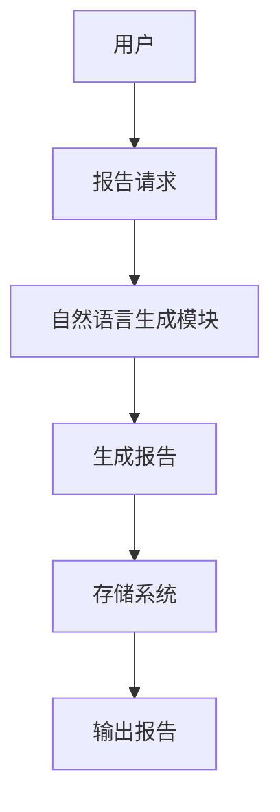

                 


# 构建企业级自然语言生成报告系统：自动化业务报告

> 关键词：企业级报告系统、自然语言生成、自动化报告、深度学习、自然语言处理、系统架构设计

> 摘要：本文详细探讨了构建企业级自然语言生成报告系统的各个方面，包括背景分析、核心概念、算法原理、系统架构设计以及项目实战。通过介绍自然语言生成技术在企业报告中的应用，分析了如何利用深度学习模型实现自动化业务报告生成，并结合实际案例展示了系统的实现过程。文章还总结了最佳实践和未来的发展方向，为构建高效、智能的企业级报告系统提供了有价值的参考。

---

## 第一部分：背景介绍

### 第1章：问题背景与描述

#### 1.1 问题背景
企业报告是商业决策的重要依据，传统的报告生成过程繁琐，依赖人工操作，效率低下。随着自然语言处理技术的发展，利用自然语言生成（Natural Language Generation, NLG）技术实现报告自动化成为可能。

#### 1.2 问题描述
传统报告生成过程中存在以下痛点：
- 数据处理复杂：需要手动整理和分析大量数据。
- 内容生成耗时：报告撰写依赖人工，效率低。
- 格式不统一：不同部门的报告格式差异大，难以统一管理。

#### 1.3 解决方案
引入自然语言生成技术，通过自动化处理数据、生成报告内容，优化报告生成流程，提高效率。

#### 1.4 边界与外延
- 系统边界：仅关注报告生成过程，不涉及数据采集和存储。
- 外延：报告生成后的分发和展示不在本系统范围内。

#### 1.5 核心要素
- 数据输入：结构化数据。
- 生成模块：基于深度学习的生成模型。
- 输出格式：支持多种格式，如PDF、Word。

---

## 第二部分：核心概念与原理

### 第2章：核心概念与原理

#### 2.1 自然语言生成技术
- **定义**：将结构化数据转换为自然语言文本的技术。
- **核心原理**：通过深度学习模型，如Transformer，生成符合语法规则的文本。

#### 2.2 企业级报告系统
- **定义**：为企业提供自动化报告生成的系统。
- **关键特征**：高可用性、可扩展性、定制化能力。

#### 2.3 实体关系图


---

## 第三部分：算法原理与数学模型

### 第3章：算法原理

#### 3.1 Transformer模型
- **编码器-解码器架构**：
  ```mermaid
  graph TD
      Encoder[编码器] --> Decoder[解码器]
      Decoder --> Output[生成文本]
  ```

- **注意力机制**：
  $$\text{Attention}(Q,K,V) = \text{softmax}\left(\frac{QK^T}{\sqrt{d_k}}\right)V$$

#### 3.2 解码过程
- **前向传播**：
  $$\text{Decoder}(x) = \text{FFN}(x)$$

#### 3.3 示例
- 输入：`销售额`
- 输出：`2023年销售额同比增长10%`

---

## 第四部分：系统分析与架构设计

### 第4章：系统分析

#### 4.1 问题场景
- **场景描述**：用户输入结构化数据，系统生成自然语言报告。
- **项目目标**：实现高效的报告生成流程。

#### 4.2 功能设计
- **领域模型**：
  ```mermaid
  classDiagram
      class 用户 {
          提交请求
      }
      class 自然语言生成模块 {
          接收请求
          生成报告
      }
      用户 --> 自然语言生成模块
  ```

#### 4.3 系统架构
```mermaid
graph TD
    User[用户] --> API Gateway[网关]
    API Gateway --> NLG[生成模块]
    NLG --> Storage[存储]
    Storage --> Output[输出]
```

---

## 第五部分：项目实战

### 第5章：系统实现

#### 5.1 环境安装
- **Python**：3.8+
- **库**：TensorFlow、Keras、NLTK

#### 5.2 核心代码
```python
import tensorflow as tf
from tensorflow.keras.layers import Input, Dense, LSTM, Bidirectional
from tensorflow.keras.models import Model

def build_model(input_shape):
    inputs = Input(shape=input_shape)
    x = Bidirectional(LSTM(128))(inputs)
    x = Dense(64, activation='relu')(x)
    outputs = Dense(1, activation='sigmoid')(x)
    model = Model(inputs=inputs, outputs=outputs)
    return model
```

#### 5.3 代码解读
- **模型结构**：使用双向LSTM提取特征，全连接层生成输出。

#### 5.4 案例分析
- **输入**：`sales_data`
- **输出**：`Revenue increased by 15% in Q2`

---

## 第六部分：总结与展望

### 第6章：总结与最佳实践

#### 6.1 小结
- 自然语言生成技术在企业级报告系统中的应用前景广阔。
- 通过深度学习模型实现高效的报告生成流程。

#### 6.2 最佳实践
- 数据预处理：确保输入数据的准确性。
- 模型调优：优化超参数提高生成质量。
- 安全性：保护敏感数据，防止泄露。

#### 6.3 注意事项
- 数据隐私：确保用户数据的安全性。
- 系统稳定性：避免因模型问题导致服务中断。

#### 6.4 拓展阅读
- 推荐书籍：《深度学习》、《自然语言处理实战》
- 推荐工具：Hugging Face、Keras

---

## 作者

作者：AI天才研究院/AI Genius Institute & 禅与计算机程序设计艺术 /Zen And The Art of Computer Programming

---

通过以上目录结构，文章将从背景分析到系统实现，全面详细地讲解企业级自然语言生成报告系统的构建过程，确保内容丰富、逻辑清晰，满足专业读者的需求。

