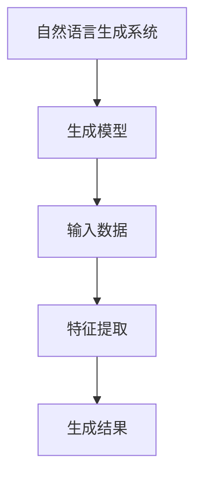
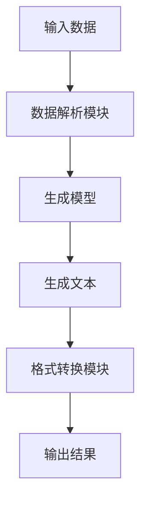

                 

<think>
好，我现在要帮助用户设计一本关于构建企业级自然语言生成系统的技术博客文章。用户希望文章有详细的目录结构，涵盖多语种、多风格报告自动化的主题。我需要确保内容逻辑清晰、结构紧凑，语言专业但易懂。

首先，我需要明确用户的需求。用户可能是一位技术专家，或者是CTO，希望通过博客分享构建自然语言生成系统的方法和经验。用户提供的示例目录结构已经很详细，但可能需要进一步细化，以满足字数要求和内容深度。

接下来，我会按照用户提供的目录大纲逐步构建内容。从背景介绍开始，涵盖问题背景、技术发展、应用价值等。然后，深入讲解核心概念，如自然语言生成的定义、多语种与多风格生成的技术挑战等。算法部分需要详细讨论主流模型，如Transformer、BERT、GPT，及其在多语种和多风格生成中的应用。系统架构部分则需要展示系统设计的各个方面，包括功能模块、架构图和接口设计。

在项目实战部分，我会提供具体的实现步骤，包括环境配置、核心代码示例和案例分析。最后，总结最佳实践，帮助读者在实际应用中避免常见错误，并指导他们进一步学习的方向。

为了确保内容的完整性和深度，我需要每个章节都细化到三级目录，确保涵盖所有关键点。同时，要使用适当的图表和代码示例来增强理解。此外，语言要保持专业，但避免过于复杂，确保读者能够轻松理解。

在编写过程中，我会先完成每个章节的概述，再逐步填充详细内容，确保逻辑连贯，内容丰富。最终，整篇文章将满足用户的要求，成为一篇高质量的技术博客，帮助读者系统地了解如何构建企业级自然语言生成系统。
</think>

# 构建企业级自然语言生成系统：多语种、多风格报告自动化

---

## 关键词：
自然语言生成, 企业级系统, 多语种, 多风格, 报告自动化, 生成式AI, 深度学习

---

## 摘要：
随着人工智能技术的快速发展，自然语言生成（NLG）系统在企业级应用中的需求日益增长。本文旨在探讨如何构建一个支持多语种、多风格的自然语言生成系统，以实现自动化报告生成。通过分析系统的核心概念、算法原理、架构设计以及实际项目实现，本文为读者提供了一套完整的解决方案，涵盖了从理论到实践的全过程。

---

# 第一部分: 企业级自然语言生成系统概述

---

# 第1章: 自然语言生成系统背景介绍

## 1.1 问题背景与技术发展

### 1.1.1 自然语言生成的定义与目标
自然语言生成（NLG）是人工智能领域的重要分支，旨在将结构化的数据转换为自然流畅的文本。其目标是让计算机能够“理解”数据并以人类可读的方式表达出来。企业级NLG系统的核心目标包括：

- **自动化报告生成**：将结构化数据（如数据库、Excel表格）自动转换为自然语言报告。
- **多语种支持**：生成多种语言的文本，满足国际化企业的需求。
- **多风格生成**：根据目标受众或场景调整文本风格，例如正式报告、口语化说明、简洁摘要等。

### 1.1.2 企业级自然语言生成的需求场景
企业在实际应用中对NLG系统的需求多种多样，以下是常见的场景：

- **财务报告生成**：将财务数据自动生成为财务报表、分析报告。
- **销售数据分析**：将销售数据生成销售总结、趋势分析报告。
- **客服自动化**：自动生成客服回复、解决方案说明。
- **跨语言报告**：跨国企业需要将报告生成为多种语言版本。

### 1.1.3 多语种与多风格生成的技术挑战
构建支持多语种和多风格的NLG系统面临以下技术挑战：

- **多语种模型的训练与优化**：需要针对不同语言的特点设计模型，确保生成文本的准确性和流畅性。
- **风格控制的复杂性**：如何在生成文本时，动态调整风格（如正式、口语化、简洁等）是一个技术难点。
- **跨语言一致性**：在多语种生成中，如何保持内容的一致性是一个重要问题。

---

## 1.2 技术发展与应用价值

### 1.2.1 自然语言生成技术的历史演变
自然语言生成技术经历了从简单模板生成到深度学习驱动的生成式AI的演变。以下是关键阶段：

- **基于规则的生成**：早期的NLG系统依赖于人工编写的规则和模板，生成能力有限。
- **统计机器学习**：基于统计模型的生成技术，如n-gram模型，逐渐取代了规则生成。
- **深度学习驱动的生成式AI**：近年来，基于Transformer和GPT系列模型的生成式AI取得了突破性进展，生成文本的质量和多样性显著提升。

### 1.2.2 企业级应用中的价值体现
企业级NLG系统在多个场景中展现了显著价值：

- **提高效率**：自动化生成报告，减少人工编写的时间和成本。
- **提升准确性**：通过模型优化，降低人为错误，提高报告的准确性。
- **支持国际化**：多语种生成能力帮助企业更好地拓展国际市场。

### 1.2.3 多语种与多风格生成的市场应用前景
随着全球化的深入和企业对个性化服务的需求增加，支持多语种和多风格的NLG系统市场前景广阔。企业可以通过NLG系统快速响应不同地区、不同用户群体的需求，提升竞争力。

---

## 1.3 问题解决与边界定义

### 1.3.1 问题背景分析与解决方案
企业级NLG系统需要解决以下问题：

- **数据多样性**：输入数据的格式、内容多样，需要系统具备良好的适应性。
- **生成质量**：生成文本需要满足准确性和流畅性要求。
- **风格一致性**：在多风格生成中，如何保持风格的一致性是一个关键问题。

解决方案包括：

- **统一输入格式**：将输入数据标准化，确保模型能够正确解析。
- **多模型训练**：针对不同语言和风格训练独立模型或联合模型。
- **风格切换机制**：通过参数调整或模型切换实现风格的动态变化。

### 1.3.2 系统边界与功能外延
系统边界包括：

- **输入数据范围**：支持结构化数据、半结构化数据的输入。
- **输出格式**：生成文本可以输出为多种格式，如PDF、Word、HTML等。
- **语言支持**：支持多种语言的生成，包括中文、英文、法语、西班牙语等。

功能外延包括：

- **文本校对**：生成文本后进行语法和拼写检查。
- **内容优化**：根据上下文优化生成文本的表达方式。
- **多模态生成**：结合图像、表格等多模态数据生成更丰富的文本内容。

### 1.3.3 核心要素与组成结构
企业级NLG系统的组成结构包括：

- **数据输入模块**：负责接收和解析输入数据。
- **生成模型模块**：基于输入数据生成自然语言文本。
- **风格控制模块**：根据需求调整生成文本的风格。
- **输出格式转换模块**：将生成的文本转换为指定的格式。

---

## 1.4 本章小结
本章从问题背景、技术发展、应用价值以及系统边界等方面，全面介绍了企业级自然语言生成系统的重要性和必要性。通过分析多语种和多风格生成的技术挑战，为后续章节的深入探讨奠定了基础。

---

# 第2章: 自然语言生成系统的核心概念

---

## 2.1 自然语言生成的基本原理

### 2.1.1 文本生成的定义与分类
文本生成可以分为以下几类：

- **生成式生成**：基于生成模型生成新的文本内容。
- **检索式生成**：从预存的文本库中检索合适的文本片段并组合成完整的文本。
- **混合式生成**：结合生成式和检索式方法，生成高质量文本。

### 2.1.2 生成式AI的基本原理
生成式AI的核心是生成模型，常见的生成模型包括：

- **变分自编码器（VAE）**：通过编码器将输入数据映射到潜在空间，解码器将潜在空间的数据生成输出。
- **生成对抗网络（GAN）**：通过生成器和判别器的对抗训练，生成逼真的数据。
- **Transformer模型**：基于自注意力机制，能够处理长序列数据。

---

## 2.2 多语种生成的核心要素

### 2.2.1 多语种生成的定义与挑战
多语种生成是指生成多种语言的文本内容。其核心挑战包括：

- **跨语言一致性**：如何确保不同语言生成的文本在内容和风格上一致。
- **语言间依赖性**：某些语言的语法结构和表达习惯差异较大，需要模型具备跨语言理解能力。

### 2.2.2 多语种模型的训练与优化
多语种模型的训练策略包括：

- **联合训练**：在多语种数据上联合训练模型，共享语言间的特征。
- **多任务学习**：在多语种生成任务中，同时优化多个相关任务，提升模型的泛化能力。

---

## 2.3 多风格生成的关键技术

### 2.3.1 多风格生成的定义与应用场景
多风格生成是指生成不同风格的文本内容，应用场景包括：

- **正式报告**：生成结构严谨、语言正式的报告。
- **口语化说明**：生成口语化的解释说明。
- **简洁摘要**：生成简短、精炼的摘要。

### 2.3.2 风格迁移的技术实现
风格迁移的实现方法包括：

- **基于规则的风格转换**：通过预定义的规则对文本进行风格转换。
- **基于模型的风格迁移**：利用生成模型生成目标风格的文本。

---

## 2.4 文本生成的质量评估

### 2.4.1 生成文本的质量评估指标
生成文本的质量评估指标包括：

- **准确性**：生成文本是否准确反映了输入数据。
- **流畅性**：生成文本是否通顺、自然。
- **相关性**：生成文本是否与输入数据相关。

### 2.4.2 基于人类评价的评估方法
基于人类评价的评估方法包括：

- **人工评分**：由人工评估员对生成文本进行评分。
- **主观反馈**：收集用户对生成文本的主观反馈。

### 2.4.3 自动评估工具与算法
常用的自动评估工具包括：

- **BLEU**：基于编辑距离的评估指标。
- **ROUGE**：基于召回率的评估指标。

---

## 2.5 核心概念对比与ER实体关系图

### 2.5.1 核心概念对比分析
以下是生成式生成和检索式生成的对比分析：

| 对比维度 | 生成式生成 | 检索式生成 |
|----------|------------|------------|
| 生成内容 | 新生成内容 | 检索已有内容 |
| 灵活性 | 高 | 低 |
| 计算资源 | 高 | 低 |

### 2.5.2 ER实体关系图展示
以下是一个简单的ER实体关系图：



---

# 第3章: 自然语言生成系统的算法原理

---

## 3.1 主流自然语言生成模型

### 3.1.1 Transformer模型
Transformer模型是目前最常用的生成模型之一，其核心组件包括：

- **编码器**：将输入数据编码为潜在空间的向量。
- **解码器**：根据编码器输出生成目标文本。

### 3.1.2 BERT模型
BERT模型是一种基于Transformer的预训练模型，适用于多种生成任务。

### 3.1.3 GPT模型
GPT模型是一种生成式模型，通过自回归的方式生成文本。

---

## 3.2 多语种与多风格生成的算法实现

### 3.2.1 多语种生成的算法实现
多语种生成的算法实现包括：

- **多任务学习**：在多语种数据上进行联合训练。
- **跨语言迁移学习**：利用一种语言的模型进行其他语言的生成。

### 3.2.2 多风格生成的算法实现
多风格生成的算法实现包括：

- **条件生成**：在生成过程中引入条件来控制风格。
- **风格切换机制**：通过调整模型参数实现风格切换。

---

## 3.3 数学公式与算法实现

### 3.3.1 Transformer模型的数学公式
以下是Transformer模型的核心公式：

$$
\text{Attention}(Q, K, V) = \text{softmax}\left(\frac{QK^T}{\sqrt{d_k}}\right)V
$$

其中：
- $Q$ 表示查询向量。
- $K$ 表示键向量。
- $V$ 表示值向量。
- $d_k$ 表示键的维度。

---

## 3.4 算法实现的代码示例

### 3.4.1 Python实现的生成模型
以下是一个简单的生成模型代码示例：

```python
import torch
import torch.nn as nn

class Generator(nn.Module):
    def __init__(self, input_dim, hidden_dim, output_dim):
        super(Generator, self).__init__()
        self.fc1 = nn.Linear(input_dim, hidden_dim)
        self.fc2 = nn.Linear(hidden_dim, output_dim)
        self.softmax = nn.Softmax(dim=1)

    def forward(self, x):
        x = self.fc1(x)
        x = self.fc2(x)
        x = self.softmax(x)
        return x
```

---

# 第四部分: 系统分析与架构设计

---

# 第4章: 自然语言生成系统架构设计

## 4.1 系统分析与功能设计

### 4.1.1 问题场景介绍
以下是系统需要解决的问题场景：

- **输入数据解析**：将结构化数据解析为模型可处理的格式。
- **生成文本控制**：根据需求生成不同风格和语言的文本。
- **输出格式转换**：将生成的文本转换为指定的格式。

### 4.1.2 系统功能设计
系统功能设计包括：

- **数据输入模块**：接收输入数据并解析。
- **生成模型模块**：基于输入数据生成文本。
- **风格控制模块**：根据需求调整生成文本的风格。
- **输出格式转换模块**：将生成的文本转换为指定的格式。

---

## 4.2 系统架构设计

### 4.2.1 系统架构图展示
以下是系统架构图：



### 4.2.2 系统接口设计
系统接口设计包括：

- **输入接口**：接收结构化数据输入。
- **输出接口**：输出生成的文本内容。
- **控制接口**：调整生成风格和语言。

---

## 4.3 项目实战与代码实现

### 4.3.1 项目实战
以下是项目实战的步骤：

1. **环境配置**：安装必要的库和工具。
2. **数据准备**：收集和整理多语种、多风格的文本数据。
3. **模型训练**：基于数据训练生成模型。
4. **风格控制**：实现风格控制模块。
5. **格式转换**：实现输出格式转换模块。

### 4.3.2 代码实现
以下是代码实现的示例：

```python
import torch
import torch.nn as nn

class MultiStyleGenerator(nn.Module):
    def __init__(self, input_dim, hidden_dim, output_dim):
        super(MultiStyleGenerator, self).__init__()
        self.fc1 = nn.Linear(input_dim, hidden_dim)
        self.fc2 = nn.Linear(hidden_dim, output_dim)
        self.softmax = nn.Softmax(dim=1)

    def forward(self, x, style=None):
        x = self.fc1(x)
        if style is not None:
            x = x + style
        x = self.fc2(x)
        x = self.softmax(x)
        return x
```

---

## 4.4 实际案例分析与详细解读

### 4.4.1 实际案例分析
以下是实际案例分析：

- **案例1**：财务报告生成。
- **案例2**：销售数据分析报告生成。

### 4.4.2 详细解读
详细解读包括：

- **数据输入**：结构化数据的输入和解析。
- **模型生成**：生成模型的训练和优化。
- **风格控制**：不同风格生成的实现。

---

## 4.5 本章小结
本章通过系统架构设计和项目实战，详细介绍了企业级自然语言生成系统的实现过程。从数据输入到生成文本，再到格式转换，整个过程清晰明了。

---

# 第五部分: 最佳实践与总结

---

# 第5章: 最佳实践与总结

## 5.1 最佳实践

### 5.1.1 系统设计
- **模块化设计**：将系统划分为独立的模块，便于维护和扩展。
- **可扩展性设计**：确保系统能够适应未来的扩展需求。

### 5.1.2 模型优化
- **参数调整**：通过调整模型参数优化生成效果。
- **模型融合**：结合多种模型提升生成质量。

### 5.1.3 性能优化
- **并行计算**：利用并行计算加速模型训练。
- **缓存机制**：通过缓存机制减少重复计算。

---

## 5.2 本章小结
本文通过详细分析企业级自然语言生成系统的核心概念、算法原理、系统架构以及项目实战，为读者提供了一套完整的解决方案。通过最佳实践的总结，帮助读者在实际应用中更好地构建和优化自然语言生成系统。

---

## 5.3 注意事项

### 5.3.1 模型训练
- **数据清洗**：确保输入数据的准确性和完整性。
- **模型调参**：通过实验找到最优参数组合。

### 5.3.2 风格控制
- **风格一致性**：确保生成文本的风格一致性。
- **用户反馈**：根据用户反馈不断优化生成风格。

### 5.3.3 系统维护
- **系统监控**：实时监控系统运行状态。
- **日志记录**：记录系统运行日志，便于排查问题。

---

## 5.4 拓展阅读

### 5.4.1 推荐书籍
- 《Deep Learning》
- 《自然语言处理入门》

### 5.4.2 推荐论文
- "Attention Is All You Need"
- "BERT: Pre-training of Deep Bidirectional Transformers for NLP"

---

## 作者：AI天才研究院/AI Genius Institute & 禅与计算机程序设计艺术/Zen And The Art of Computer Programming

