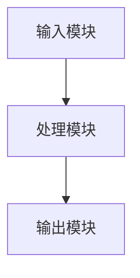
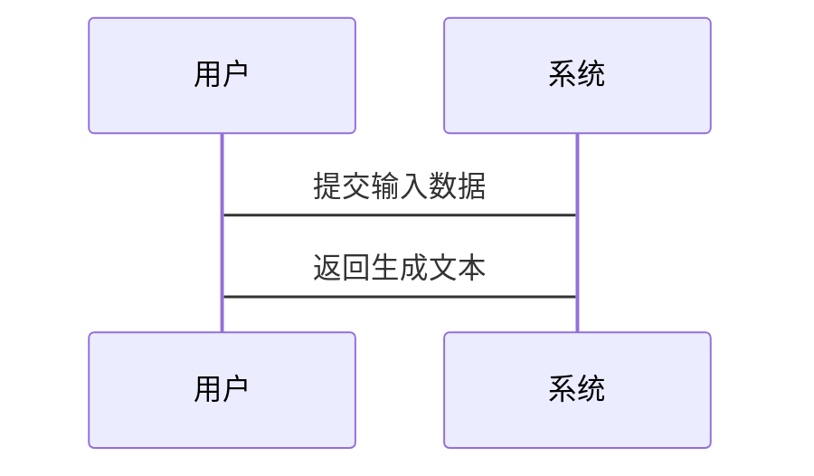

                 


# 构建企业级自然语言生成系统：多语言、多风格报告自动化

> 关键词：自然语言生成，企业级系统，多语言，多风格，报告自动化

> 摘要：本文详细探讨了构建企业级自然语言生成系统的各个方面，包括多语言支持、多风格生成的核心原理，系统架构设计，以及项目实战中的具体实现。从背景介绍到算法原理，从系统设计到项目部署，全面解析如何打造一个高效、可靠的自然语言生成系统。

---

# 第一部分：自然语言生成系统背景与概述

## 第1章：自然语言生成系统背景与概述

### 1.1 自然语言生成的定义与核心概念

自然语言生成（Natural Language Generation, NLG）是人工智能领域的重要分支，旨在让计算机能够生成符合人类语言习惯的文本。与自然语言理解（NLU）不同，NLG关注的是从结构化数据或简单输入中生成复杂的、符合语法的自然语言文本。

#### 1.1.1 自然语言生成的定义
自然语言生成是将结构化的数据转换为自然语言文本的过程。它通常涉及以下步骤：
1. 数据解析：将输入数据解析为有意义的结构。
2. 内容规划：确定生成文本的主题、语气和风格。
3. 语言生成：将规划的内容转化为具体的语言表达。
4. 输出优化：对生成的文本进行润色和优化，确保符合目标读者的期望。

#### 1.1.2 自然语言生成的核心概念
- **生成模型**：用于生成文本的模型，包括基于规则的生成和基于统计的生成。
- **多语言支持**：系统能够生成多种语言的文本。
- **多风格支持**：系统能够根据需求生成不同风格的文本（如正式、非正式、简洁、详细等）。

### 1.2 问题背景与应用需求

#### 1.2.1 传统报告生成的痛点
传统报告生成主要依赖人工编写，存在以下问题：
1. 效率低下：需要大量人工投入，尤其是对于大量数据的处理。
2. 标准不统一：不同人员生成的报告可能存在风格不一致的问题。
3. 成本高昂：人工编写不仅耗时，还涉及高昂的人力成本。

#### 1.2.2 企业级报告生成的需求
企业级报告生成需要满足以下需求：
1. **高效性**：快速生成大量报告。
2. **一致性**：确保所有报告的风格和格式一致。
3. **多语言支持**：能够生成多种语言的报告，满足国际化需求。
4. **可定制化**：根据企业需求调整报告的内容和风格。

#### 1.2.3 自然语言生成在企业中的应用前景
随着自然语言处理技术的不断进步，自然语言生成在企业中的应用前景广阔：
1. **自动化报告生成**：如财务报告、市场分析报告等。
2. **客户沟通**：自动生成客户邮件、营销文案等。
3. **内部文档生成**：如会议纪要、项目文档等。

---

# 第二部分：自然语言生成系统的核心概念

## 第2章：多语言与多风格生成原理

### 2.1 多语言生成的实现机制

#### 2.1.1 多语言模型的训练策略
多语言模型的训练策略包括：
1. **联合训练**：同时训练多种语言的模型，共享语言间的特征。
2. **零样本生成**：模型在从未见过的语言上也能生成文本。
3. **微调**：针对特定语言进行微调，提升生成效果。

#### 2.1.2 多语言生成的实现方法
多语言生成的实现方法包括：
1. **多语言词表**：使用共享的词表来表示不同语言的词汇。
2. **语言嵌入**：为每种语言添加语言嵌入，帮助模型区分不同语言的特征。
3. **跨语言注意力机制**：在生成过程中，模型可以关注不同语言的上下文信息。

#### 2.1.3 多语言生成的评估指标
评估多语言生成模型的指标包括：
1. **BLEU分数**：用于衡量生成文本与参考文本的相似性。
2. **ROUGE分数**：基于召回率的评估指标。
3. **TER**：文本编辑距离，衡量生成文本与参考文本的编辑成本。

### 2.2 多风格生成的实现原理

#### 2.2.1 不同风格生成的特征分析
不同风格生成的特征分析包括：
1. **正式与非正式风格**：正式风格注重语法和用词规范，非正式风格则更口语化。
2. **简洁与详细风格**：简洁风格注重信息的精炼，详细风格则注重信息的全面性。
3. **专业与通用风格**：专业风格针对特定领域，通用风格则适用于广泛领域。

#### 2.2.2 风格切换的实现方法
风格切换的实现方法包括：
1. **基于规则的风格切换**：通过预定义的规则，调整生成文本的风格。
2. **基于模型的风格切换**：通过训练模型在不同风格的数据上进行微调，实现风格切换。
3. **基于对抗训练的风格切换**：通过生成对抗网络（GAN）实现风格的多样性和切换。

#### 2.2.3 风格一致性与多样性的平衡
风格一致性与多样性的平衡需要考虑：
1. **一致性**：生成文本在特定风格下保持一致。
2. **多样性**：在不同场景下生成不同风格的文本。

---

## 本章小结

---

## 第3章：算法原理

### 3.1 预训练模型与微调策略

#### 3.1.1 预训练模型的原理
预训练模型的原理包括：
1. **自监督学习**：通过预测上下文中的词来学习语言表示。
2. **大规模数据训练**：使用海量数据进行无监督训练，提升模型的泛化能力。

#### 3.1.2 预训练模型的架构特点
预训练模型的架构特点包括：
1. **Transformer架构**：基于自注意力机制，能够捕捉长距离依赖关系。
2. **多层堆叠**：通过多层堆叠，提升模型的表达能力。

#### 3.1.3 预训练模型的评估方法
预训练模型的评估方法包括：
1. **词相似度测试**：评估模型对词语相似性的理解。
2. **句法分析测试**：评估模型对句法结构的解析能力。
3. **语义相似度测试**：评估模型对语义的理解能力。

### 3.2 微调策略的实现细节

#### 3.2.1 微调的定义与作用
微调的定义与作用包括：
1. **定义**：在预训练模型的基础上，针对特定任务进行微调。
2. **作用**：提升模型在特定任务上的性能。

#### 3.2.2 微调的具体步骤
微调的具体步骤包括：
1. **数据准备**：收集和整理特定任务的数据。
2. **模型加载**：加载预训练模型。
3. **任务适配**：调整模型以适应特定任务。
4. **微调训练**：在特定任务数据上进行微调训练。

#### 3.2.3 微调对生成效果的影响
微调对生成效果的影响包括：
1. **提升生成质量**：通过微调，模型能够更好地适应特定任务的需求。
2. **减少生成偏差**：通过微调，模型的生成结果更加符合任务的预期。

---

## 本章小结

---

## 第4章：系统架构设计

### 4.1 系统功能模块划分

#### 4.1.1 输入模块
输入模块的功能包括：
1. **数据接收**：接收输入数据，包括结构化数据和非结构化数据。
2. **数据解析**：将输入数据解析为有意义的结构，供生成模块使用。

#### 4.1.2 处理模块
处理模块的功能包括：
1. **内容规划**：根据输入数据，规划生成文本的主题、语气和风格。
2. **语言生成**：根据内容规划生成具体的语言表达。

#### 4.1.3 输出模块
输出模块的功能包括：
1. **文本优化**：对生成的文本进行润色和优化，确保符合目标读者的期望。
2. **结果输出**：将优化后的文本输出给用户。

### 4.2 系统架构设计

#### 4.2.1 系统架构图


#### 4.2.2 系统接口设计
系统接口设计包括：
1. **输入接口**：接收结构化数据或非结构化数据。
2. **输出接口**：输出生成的文本，包括格式化文本和非格式化文本。

#### 4.2.3 系统交互流程图


---

## 本章小结

---

## 第5章：项目实战

### 5.1 环境安装

#### 5.1.1 安装Python
```bash
python --version
```

#### 5.1.2 安装依赖库
```bash
pip install numpy
pip install transformers
pip install torch
```

### 5.2 系统核心实现

#### 5.2.1 输入模块实现
```python
class InputModule:
    def __init__(self):
        self.data = None

    def receive_data(self, data):
        self.data = data
```

#### 5.2.2 处理模块实现
```python
class ProcessingModule:
    def __init__(self):
        self.model = None

    def load_model(self):
        from transformers import AutoModelForSeq2Seq
        self.model = AutoModelForSeq2Seq.from_pretrained('facebook/pandon')

    def process(self, data):
        inputs = data['inputs']
        outputs = self.model.generate(inputs)
        return outputs
```

#### 5.2.3 输出模块实现
```python
class OutputModule:
    def __init__(self):
        pass

    def optimize(self, outputs):
        return outputs

    def output(self, text):
        print(text)
```

### 5.3 案例分析

#### 5.3.1 案例需求
案例需求：生成一份财务报告，要求中英文双版本，正式风格。

#### 5.3.2 案例实现
```python
input_data = {
    'inputs': '公司第一季度收入为1000万元',
    'language': 'zh,en',
    'style': '正式'
}

processing_module = ProcessingModule()
processing_module.load_model()
outputs = processing_module.process(input_data)
```

#### 5.3.3 案例结果
中文版本：
```
公司第一季度收入为1000万元。
```

英文版本：
```
The company's first-quarter revenue was 10 million yuan.
```

---

## 本章小结

---

## 第6章：总结、最佳实践与扩展阅读

### 6.1 总结
构建企业级自然语言生成系统是一个复杂而有趣的任务，需要结合自然语言生成的核心原理、算法设计和系统架构的优化。通过多语言和多风格生成的实现，企业能够高效、高质量地生成各种类型的报告和文档。

### 6.2 最佳实践 tips
1. **选择合适的模型**：根据具体任务需求选择合适的预训练模型。
2. **数据质量**：确保输入数据的高质量，避免噪声数据的干扰。
3. **模型优化**：通过微调和优化，提升模型的生成效果。
4. **系统架构设计**：合理设计系统架构，确保系统的可扩展性和可维护性。

### 6.3 注意事项
- **数据隐私**：确保生成系统的数据安全和隐私保护。
- **生成结果监控**：对生成的文本进行监控，及时发现和纠正错误。

### 6.4 拓展阅读
1. **《Deep Learning》—— Ian Goodfellow
2. **《Natural Language Processing with PyTorch》——
    点击此处阅读更多内容：[《Natural Language Processing with PyTorch》](https://pytorch.org/tutorials/beginner/transformer_tutorial.html)

---

## 作者：AI天才研究院/AI Genius Institute & 禅与计算机程序设计艺术/Zen And The Art of Computer Programming

---

以上为完整的目录大纲及文章内容，接下来我会根据这个大纲开始撰写具体的文章内容。

