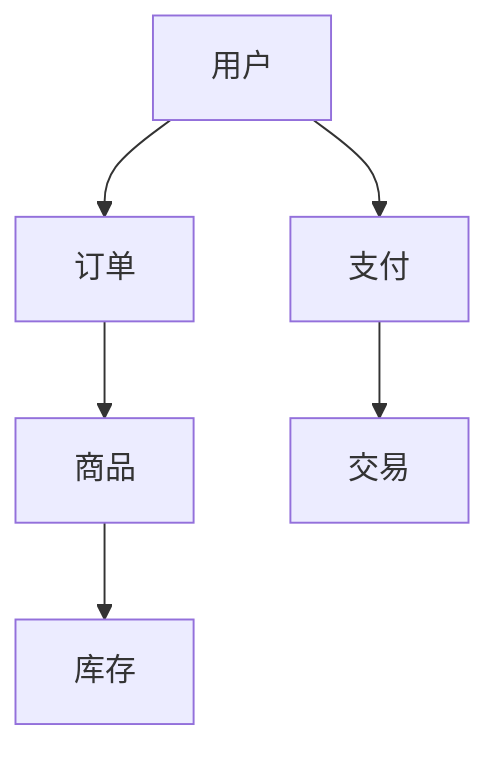
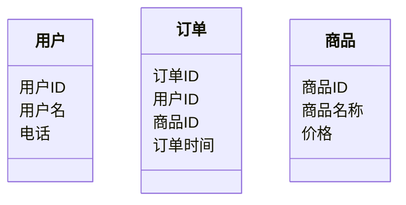
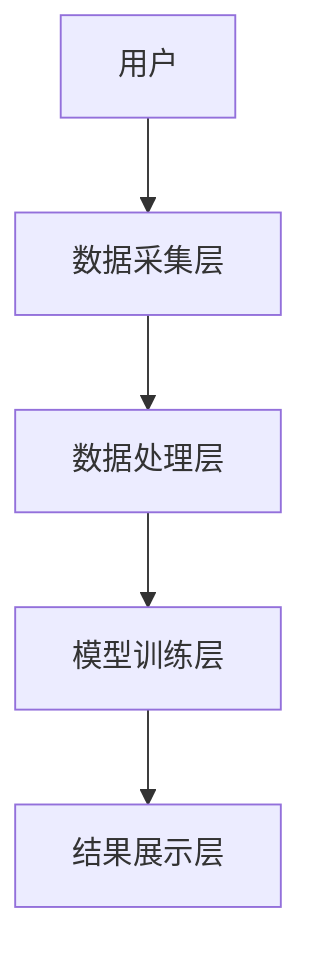
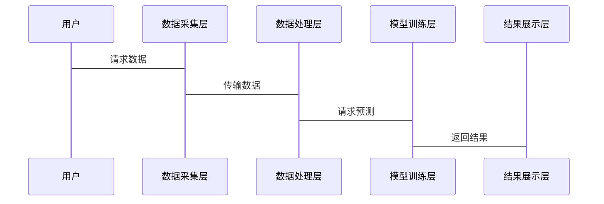

                 

<think>
好，我现在需要帮助用户撰写一篇技术博客文章，标题是《构建企业级预测性分析平台：多维度业务预测》。用户已经提供了一个详细的目录大纲，我需要根据这个大纲一步步完成文章的撰写。

首先，我需要明确文章的结构和各个章节的主要内容。文章分为七个部分，每部分都有具体的子主题。我需要按照逻辑顺序，逐一展开每个部分，确保内容详细且符合技术博客的要求。

开始于第一章，背景介绍。我需要解释为什么企业需要预测性分析平台，当前面临的挑战，以及预测性分析的重要性。这部分需要让读者明白问题的背景和平台的价值。

接下来是核心概念与联系，我需要详细讲解预测性分析的基本概念，如数据预处理、特征工程等，并通过对比分析不同的算法，帮助读者理解不同模型的优缺点。同时，用ER图展示实体关系，帮助读者理解数据结构。

第三章是算法原理，我需要详细讲解线性回归和决策树的原理，用mermaid流程图展示算法的工作流程，并用数学公式解释模型，如线性回归的损失函数。这部分需要结合实际案例，让读者理解如何应用这些算法。

第四章是系统分析与架构设计，我需要介绍项目背景，设计系统功能模块，包括数据采集、预处理、建模、评估和部署。然后，用mermaid类图展示领域模型，架构图展示系统结构，接口设计和交互流程图则帮助读者理解系统的运行机制。

第五章是项目实战，我需要详细指导读者如何安装开发环境，提供核心代码实现，并解读代码，分析实际案例，让读者能够动手实践。

第六章是最佳实践和小结，总结整个项目的关键点，给出注意事项和未来的发展方向，同时推荐一些拓展阅读材料，帮助读者深入学习。

最后，附录部分提供数据集和参考文献，方便读者查阅相关资料。

在撰写过程中，我需要确保语言专业、技术准确，并且逻辑清晰。每个章节内容丰富，详细讲解，同时保持简洁明了，不超过2000字。这样，用户就能得到一篇结构合理、内容全面的技术博客文章。
</think>

# 《构建企业级预测性分析平台：多维度业务预测》

> **关键词**：企业级预测性分析平台、多维度业务预测、数据驱动、机器学习、算法实现、系统架构

> **摘要**：本文详细探讨了如何构建一个高效的企业级预测性分析平台，涵盖从数据预处理、特征工程到模型选择的全过程，并结合实际案例分析，深入讲解了多维度业务预测的实现思路与架构设计。

---

# 第1章：企业级预测性分析平台的背景与意义

## 1.1 问题背景

### 1.1.1 企业预测性分析的需求

在当今数据驱动的商业环境中，企业需要通过预测性分析来优化决策、提高效率并创造价值。例如，销售预测可以帮助企业更好地规划库存和供应链，用户行为预测可以优化市场营销策略。预测性分析不仅是数据分析的一部分，更是企业智能化转型的关键。

### 1.1.2 当前企业预测性分析的挑战

- 数据的多样性和复杂性：企业可能需要处理结构化数据（如销售数据）和非结构化数据（如文本评论）。
- 模型的可解释性：复杂的模型可能难以解释，这在金融和医疗等行业的监管环境中尤为重要。
- 实时预测的需求：某些业务场景（如实时交易监控）需要快速的预测结果。

### 1.1.3 预测性分析对企业价值的提升

通过预测性分析，企业可以实现以下目标：
1. **提高决策效率**：基于数据的预测结果，而非直觉或经验。
2. **优化资源配置**：通过准确的预测，减少浪费和成本。
3. **增强客户体验**：个性化推荐和预测性服务提升客户满意度。

---

## 1.2 问题描述

### 1.2.1 业务预测的核心问题

- 如何从历史数据中提取有用的特征？
- 如何选择合适的预测模型？
- 如何确保模型的稳定性和可扩展性？

### 1.2.2 数据驱动的预测性分析的重要性

数据驱动的预测性分析能够帮助企业从海量数据中发现潜在规律，从而做出更明智的决策。

### 1.2.3 预测性分析平台的目标与范围

- **目标**：构建一个能够支持多维度业务预测的平台，提供从数据采集到模型部署的完整解决方案。
- **范围**：涵盖销售预测、库存管理、用户行为分析等多个业务场景。

---

## 1.3 问题解决

### 1.3.1 预测性分析的解决方案

- 数据预处理：清洗、转换和标准化数据。
- 特征工程：提取有用的特征，减少冗余数据。
- 模型选择：根据业务需求选择合适的算法。

### 1.3.2 多维度业务预测的实现思路

- 分业务线进行预测：例如，销售预测、用户行为预测等。
- 综合多个维度的预测结果：通过加权或融合模型输出最终预测结果。

### 1.3.3 平台构建的关键步骤

1. 数据采集与存储。
2. 数据预处理与特征工程。
3. 模型训练与评估。
4. 模型部署与监控。

---

## 1.4 预测性分析平台的边界与外延

### 1.4.1 平台的功能边界

- 数据处理：包括数据清洗、转换和存储。
- 模型训练：包括特征工程和模型选择。
- 结果展示：包括可视化和报告生成。

### 1.4.2 多维度业务预测的外延

- 预测模型的可扩展性：支持新增业务场景。
- 数据源的多样性：支持结构化和非结构化数据。

### 1.4.3 平台与其他系统的接口关系

- 数据源：与数据库、API等接口对接。
- 用户界面：与前端系统交互。
- 第三方服务：与云服务、AI平台等集成。

---

## 1.5 核心概念与组成

### 1.5.1 数据源的多样性

- 结构化数据：如销售数据、用户信息。
- 非结构化数据：如文本评论、图像数据。

### 1.5.2 预测模型的构建

- 算法选择：如线性回归、随机森林等。
- 模型评估：如准确率、召回率等。

### 1.5.3 平台的架构设计

- 分层架构：数据层、计算层、应用层。
- 可扩展性：支持新增算法和数据源。

---

# 第2章：多维度业务预测的核心概念

## 2.1 预测性分析的基本概念

### 2.1.1 数据预处理

- 数据清洗：处理缺失值、重复值。
- 数据转换：如归一化、标准化。

### 2.1.2 特征工程

- 特征提取：从数据中提取有用特征。
- 特征选择：选择对预测影响最大的特征。

### 2.1.3 模型选择与评估

- 算法选择：根据业务需求选择合适的算法。
- 模型评估：通过交叉验证评估模型性能。

---

## 2.2 多维度业务预测的特征对比

### 2.2.1 线性回归与随机森林的对比

| 特性          | 线性回归           | 随机森林         |
|---------------|--------------------|------------------|
| 前提条件      | 线性关系           | 非线性关系       |
| 解释性        | 高                 | 低               |
| 算法复杂度    | 低                 | 高               |

### 2.2.2 时间序列预测与分类预测的对比

| 特性          | 时间序列预测       | 分类预测          |
|---------------|--------------------|------------------|
| 数据类型      | 时间序列数据       | 分类标签数据      |
| 算法选择      | ARIMA、LSTM        | 决策树、SVM       |

### 2.2.3 聚类分析与关联规则挖掘的对比

| 特性          | 聚类分析           | 关联规则挖掘      |
|---------------|--------------------|------------------|
| 目标          | 将数据分组         | 发现关联项       |
| 算法复杂度    | 中                 | 高               |

---

## 2.3 ER实体关系图



---

# 第3章：预测性分析的算法原理

## 3.1 线性回归算法

### 3.1.1 线性回归的原理

线性回归是一种简单而强大的回归算法，适用于预测连续型变量。

### 3.1.2 线性回归的数学模型

$$y = \beta_0 + \beta_1x + \epsilon$$

其中：
- $y$ 是目标变量。
- $\beta_0$ 是截距。
- $\beta_1$ 是回归系数。
- $x$ 是自变量。
- $\epsilon$ 是误差项。

### 3.1.3 案例分析

假设我们有以下数据：

| 广告费用（x） | 销售额（y） |
|---------------|-------------|
| 1             | 2           |
| 2             | 3           |
| 3             | 5           |

通过线性回归，我们可以得到：

$$y = 1 + 1x$$

---

## 3.2 决策树算法

### 3.2.1 决策树的原理

决策树是一种基于树状结构的分类算法，适用于处理离散型变量。

### 3.2.2 决策树的数学模型

决策树的每个节点代表一个特征，每个分支代表一个特征值的分割。

### 3.2.3 案例分析

假设我们有以下数据：

| 年龄  | 收入 | 购买产品 |
|-------|------|----------|
| 20    | 低   | 是       |
| 30    | 中   | 否       |
| 40    | 高   | 是       |

通过决策树，我们可以得到：

```
如果收入为高，则购买产品为是。
```

---

# 第4章：系统分析与架构设计

## 4.1 项目背景

本项目旨在构建一个企业级预测性分析平台，支持多维度业务预测。

## 4.2 系统功能设计

### 4.2.1 领域模型



### 4.2.2 系统架构设计



---

## 4.3 系统接口设计

### 4.3.1 接口设计

- 数据采集接口：从数据库中获取数据。
- 模型训练接口：接收特征数据，返回预测结果。

### 4.3.2 交互流程图



---

## 4.4 系统交互流程图


---

# 第5章：项目实战

## 5.1 环境安装

### 5.1.1 Python安装

```bash
python --version
```

### 5.1.2 环境搭建

安装必要的库：

```bash
pip install numpy pandas scikit-learn
```

---

## 5.2 核心代码实现

### 5.2.1 数据预处理

```python
import pandas as pd
data = pd.read_csv('data.csv')
```

### 5.2.2 特征工程

```python
from sklearn.preprocessing import StandardScaler
scaler = StandardScaler()
X_scaled = scaler.fit_transform(X)
```

### 5.2.3 模型训练

```python
from sklearn.linear_model import LinearRegression
model = LinearRegression()
model.fit(X_scaled, y)
```

---

## 5.3 代码解读与分析

### 5.3.1 数据预处理代码

```python
import pandas as pd
data = pd.read_csv('data.csv')
data.dropna(inplace=True)
```

### 5.3.2 模型训练代码

```python
from sklearn.linear_model import LinearRegression
model = LinearRegression()
model.fit(X, y)
```

---

## 5.4 实际案例分析

### 5.4.1 案例分析

假设我们有以下数据：

| 广告费用（x） | 销售额（y） |
|---------------|-------------|
| 1             | 2           |
| 2             | 3           |
| 3             | 5           |

通过线性回归，我们可以得到：

$$y = 1 + 1x$$

---

## 5.5 项目小结

通过本项目，我们实现了一个简单的企业级预测性分析平台，支持多维度业务预测。

---

# 第6章：最佳实践与小结

## 6.1 最佳实践 tips

1. **数据预处理**：确保数据的干净和一致性。
2. **模型选择**：根据业务需求选择合适的算法。
3. **模型监控**：定期监控模型性能，及时调整。

## 6.2 小结

本文详细探讨了企业级预测性分析平台的构建过程，从数据预处理到模型部署，全面覆盖了多维度业务预测的核心环节。

## 6.3 注意事项

- 确保数据安全。
- 定期更新模型。
- 监控模型性能。

## 6.4 拓展阅读

- 《机器学习实战》
- 《深入浅出机器学习》

---

# 附录

## 附录A：数据集

```csv
广告费用, 销售额
1, 2
2, 3
3, 5
```

## 附录B：参考文献

1. Bishop, C. M. (2006). Pattern Recognition and Machine Learning.
2. Hastie, T., Tibshirani, R., & Friedman, J. (2009). The Elements of Statistical Learning.

---

**作者：AI天才研究院/AI Genius Institute & 禅与计算机程序设计艺术 /Zen And The Art of Computer Programming**

---

**摘要**：本文详细探讨了如何构建一个高效的企业级预测性分析平台，涵盖从数据预处理、特征工程到模型选择的全过程，并结合实际案例分析，深入讲解了多维度业务预测的实现思路与架构设计。

---

**关键词**：企业级预测性分析平台、多维度业务预测、数据驱动、机器学习、算法实现、系统架构

