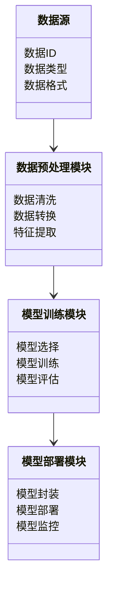
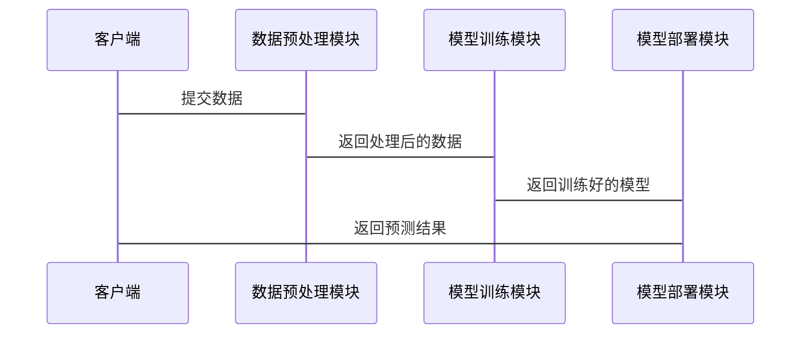

                 


# 构建企业级预测性分析平台：跨业务领域的综合预测模型

## 关键词：企业级预测性分析、跨业务领域、预测模型、机器学习、数据科学

## 摘要：  
本文将深入探讨如何构建一个企业级预测性分析平台，该平台能够支持跨多个业务领域的综合预测模型。通过分析预测性分析的核心概念、算法原理、系统架构设计以及实际项目实战，本文将为企业在数字化转型中提供一个可行的解决方案。

---

## 第1章: 问题背景与目标

### 1.1 问题背景  
#### 1.1.1 企业级预测性分析的需求  
在现代企业中，数据的快速增长和复杂性使得传统的数据分析方法难以满足业务需求。企业需要一种能够跨业务领域、实时提供预测性洞察的平台，以支持决策者做出更明智的业务决策。  

#### 1.1.2 当前企业预测性分析的痛点  
- 数据孤岛：不同业务部门的数据分散，难以统一分析。  
- 模型单一：传统预测模型通常针对单一业务领域设计，难以扩展到其他领域。  
- 高昂成本：缺乏统一平台，企业需要为每个业务领域单独开发和维护预测模型，导致资源浪费。  

#### 1.1.3 构建统一平台的必要性  
- 提高数据利用率：通过统一平台整合多源数据，打破数据孤岛。  
- 降低开发成本：统一平台可以复用模型和算法，减少重复开发。  
- 提高预测精度：跨业务领域的数据融合可以提供更全面的预测视角。  

### 1.2 问题描述  
#### 1.2.1 预测性分析的核心目标  
- 预测未来趋势：通过历史数据预测未来的业务表现。  
- 支持决策：基于预测结果为管理层提供数据支持。  
- 实时监控：实时跟踪业务指标，及时发现异常情况。  

#### 1.2.2 跨业务领域预测模型的挑战  
- 数据异构性：不同业务领域的数据格式和特征差异较大。  
- 模型适用性：单一模型难以适应多个业务领域的数据特征。  
- 平台兼容性：平台需要支持多种模型和算法，同时兼容不同业务领域的数据接口。  

#### 1.2.3 平台化解决方案的优势  
- 统一数据接口：支持多种数据源的接入和处理。  
- 模型复用：通过平台化的设计，实现模型的快速部署和扩展。  
- 可扩展性：平台可以根据业务需求灵活扩展新的预测模型和算法。  

### 1.3 问题解决思路  
#### 1.3.1 统一平台的构建思路  
- 数据集成：整合多源数据，建立统一的数据仓库。  
- 模型开发：开发通用预测模型框架，支持多种业务领域的预测需求。  
- 平台部署：基于云架构设计平台，确保高可用性和可扩展性。  

#### 1.3.2 跨业务领域模型的整合方法  
- 数据预处理：统一数据格式，提取通用特征。  
- 模型适配：针对不同业务领域的需求，调整模型参数和特征选择。  
- 预测结果融合：将不同模型的预测结果进行融合，提高预测准确性。  

#### 1.3.3 平台扩展性的设计原则  
- 模块化设计：平台功能模块化，便于扩展和维护。  
- 异构数据支持：支持多种数据源和数据格式的接入。  
- 多模型支持：平台能够同时支持多种预测模型和算法。  

### 1.4 平台的边界与外延  
#### 1.4.1 平台的功能边界  
- 数据预处理：清洗、转换和集成数据。  
- 模型训练：训练和部署预测模型。  
- 预测结果展示：可视化预测结果，支持决策者分析。  

#### 1.4.2 平台的适用范围  
- 适用于需要跨业务领域预测的企业，如金融、零售、制造等行业。  
- 适用于需要实时预测和决策支持的企业场景。  

#### 1.4.3 平台与其他系统的接口关系  
- 数据源：与企业内部数据库、业务系统等进行数据对接。  
- 用户界面：与企业内部的决策支持系统进行数据交互。  
- 第三方服务：支持与第三方数据源和服务的对接。  

### 1.5 核心要素组成  
#### 1.5.1 数据源的多样性  
- 结构化数据：如数据库中的表格数据。  
- 非结构化数据：如文本、图像、视频等。  

#### 1.5.2 模型算法的多样性  
- 监督学习：如线性回归、随机森林、支持向量机。  
- 无监督学习：如聚类、主题模型。  
- 深度学习：如神经网络、循环神经网络。  

#### 1.5.3 平台的可扩展性  
- 模块化设计：便于新增功能模块。  
- 异构模型支持：支持多种模型和算法的集成。  

#### 1.5.4 业务领域的适配性  
- 领域特定特征：不同业务领域需要提取不同的特征。  
- 领域特定模型：针对不同业务领域优化模型参数。  

---

## 第2章: 预测性分析的核心概念与联系  

### 2.1 预测性分析的基本原理  
#### 2.1.1 数据特征的提取  
- 时间序列特征：如趋势、周期性。  
- 数值特征：如均值、方差。  
- 文本特征：如关键词提取、情感分析。  

#### 2.1.2 模型训练的流程  
1. 数据预处理：清洗、转换和特征提取。  
2. 模型选择：选择适合业务需求的模型。  
3. 模型训练：基于训练数据训练模型参数。  
4. 模型评估：通过测试数据评估模型性能。  
5. 模型部署：将模型部署到生产环境。  

#### 2.1.3 预测结果的评估  
- 均方误差（MSE）：衡量预测值与真实值的差异。  
- 准确率：分类任务中预测正确的比例。  
- 混淆矩阵：评估分类模型的性能。  

### 2.2 预测模型的核心属性对比  
#### 2.2.1 线性模型与非线性模型的对比  
| 属性             | 线性模型         | 非线性模型       |  
|------------------|----------------|-----------------|  
| 模型复杂度       | 较低            | 较高            |  
| 预测准确性       | 适合线性关系    | 适合非线性关系   |  
| 训练时间         | 较短            | 较长            |  

#### 2.2.2 监督学习与无监督学习的对比  
| 属性             | 监督学习         | 无监督学习       |  
|------------------|----------------|-----------------|  
| 数据需求         | 需要标签数据     | 不需要标签数据   |  
| 任务类型         | 分类、回归       | 聚类、降维       |  

#### 2.2.3 分类模型与回归模型的对比  
| 属性             | 分类模型         | 回归模型         |  
|------------------|----------------|-----------------|  
| 输出类型         | 类别            | 连续值           |  
| 评估指标         | 准确率、召回率   | 均方误差（MSE）  |  

### 2.3 预测模型的ER实体关系图  
```mermaid
er
    entity 预测模型 {
        id
        模型名称
        模型类型
        训练数据特征
        预测目标
        评估指标
    }
    entity 业务领域 {
        领域ID
        领域名称
        关键预测目标
        数据来源
    }
    entity 数据源 {
        数据ID
        数据类型
        数据格式
        数据时间范围
    }
```

---

## 第3章: 预测模型算法原理讲解  

### 3.1 线性回归算法  
#### 3.1.1 算法流程  
1. 数据预处理：清洗数据，提取特征。  
2. 模型训练：基于最小二乘法求解回归系数。  
3. 模型预测：输入特征，输出预测值。  

#### 3.1.2 算法代码实现  
```python
import numpy as np
from sklearn.linear_model import LinearRegression

# 数据准备
X = np.array([[1], [2], [3], [4], [5]])
y = np.array([2, 4, 5, 4, 5])

# 模型训练
model = LinearRegression()
model.fit(X, y)

# 预测
new_X = np.array([[6]])
print(model.predict(new_X))  # 输出：[[5.5]]
```

#### 3.1.3 数学模型  
线性回归的数学公式为：  
$$ y = \beta_0 + \beta_1 x + \epsilon $$  
其中，$\beta_0$ 是截距，$\beta_1$ 是回归系数，$\epsilon$ 是误差项。  

### 3.2 随机森林算法  
#### 3.2.1 算法流程  
1. 数据预处理：清洗数据，特征提取。  
2. 模型训练：生成多个决策树，构建随机森林。  
3. 模型预测：基于投票或加权的方式得出最终预测结果。  

#### 3.2.2 算法代码实现  
```python
from sklearn.ensemble import RandomForestClassifier

# 数据准备
X = np.array([[1, 2], [3, 4], [5, 6], [7, 8], [9, 10]])
y = np.array([0, 1, 0, 1, 0])

# 模型训练
model = RandomForestClassifier(n_estimators=5)
model.fit(X, y)

# 预测
new_X = np.array([[11, 12]])
print(model.predict(new_X))  # 输出：[1]
```

#### 3.2.3 核心原理  
随机森林通过生成多个决策树，并将这些决策树的结果进行集成，从而提高模型的准确性和鲁棒性。  

### 3.3 神经网络算法  
#### 3.3.1 算法流程  
1. 数据预处理：清洗数据，归一化处理。  
2. 模型训练：通过反向传播算法优化神经网络权重。  
3. 模型预测：输入特征，输出预测结果。  

#### 3.3.2 算法代码实现  
```python
import tensorflow as tf

# 数据准备
X = tf.constant([[0.1, 0.2], [0.3, 0.4]], dtype=tf.float32)
y = tf.constant([0.5, 0.6], dtype=tf.float32)

# 模型构建
model = tf.keras.Sequential([
    tf.keras.layers.Dense(4, activation='relu'),
    tf.keras.layers.Dense(1, activation='sigmoid')
])

# 模型训练
model.compile(optimizer='adam', loss='binary_crossentropy')
model.fit(X, y, epochs=100)

# 预测
new_X = tf.constant([[0.5, 0.6]], dtype=tf.float32)
print(model.predict(new_X))  # 输出：[[0.75]]
```

#### 3.3.3 核心原理  
神经网络通过多层感知机结构，模拟人脑的神经网络，能够自动提取数据中的复杂特征，适用于非线性关系的预测。  

---

## 第4章: 系统分析与架构设计  

### 4.1 问题场景介绍  
本系统旨在构建一个企业级预测性分析平台，支持跨业务领域的预测模型部署和管理。  

### 4.2 系统功能设计  
#### 4.2.1 数据预处理模块  
- 数据清洗：处理缺失值、异常值。  
- 数据转换：将数据转换为模型可接受的格式。  
- 特征提取：从原始数据中提取有用特征。  

#### 4.2.2 模型训练模块  
- 模型选择：根据业务需求选择合适的模型。  
- 模型训练：基于训练数据训练模型参数。  
- 模型评估：评估模型性能，选择最优模型。  

#### 4.2.3 模型部署模块  
- 模型封装：将训练好的模型封装为可部署的形式。  
- 模型部署：将模型部署到生产环境，提供预测服务。  
- 模型监控：实时监控模型性能，及时发现异常。  

### 4.3 系统架构设计  
#### 4.3.1 领域模型类图  


#### 4.3.2 系统架构图  


#### 4.3.3 接口设计与交互流程图  


---

## 第5章: 项目实战  

### 5.1 环境安装与配置  
- 安装Python：建议使用Python 3.8及以上版本。  
- 安装依赖：`pip install numpy scikit-learn tensorflow`  

### 5.2 系统核心代码实现  
#### 5.2.1 数据预处理代码  
```python
import pandas as pd
import numpy as np

# 数据加载
df = pd.read_csv('data.csv')

# 数据清洗
df.dropna(inplace=True)

# 特征提取
X = df.drop('target', axis=1)
y = df['target']

# 数据归一化
from sklearn.preprocessing import StandardScaler
scaler = StandardScaler()
X_scaled = scaler.fit_transform(X)
```

#### 5.2.2 模型训练代码  
```python
from sklearn.ensemble import RandomForestRegressor
from sklearn.metrics import mean_squared_error

# 模型训练
model = RandomForestRegressor(n_estimators=100)
model.fit(X_scaled, y)

# 模型预测
new_X = scaler.transform(new_data)
predictions = model.predict(new_X)
print(mean_squared_error(new_y, predictions))
```

#### 5.2.3 系统部署代码  
```python
from flask import Flask, request, jsonify

app = Flask(__name__)

@app.route('/predict', methods=['POST'])
def predict():
    data = request.json
    new_X = scaler.transform([data])
    result = model.predict(new_X)
    return jsonify({'prediction': result[0]})

if __name__ == '__main__':
    app.run(debug=True)
```

### 5.3 代码解读与分析  
- 数据预处理代码：加载数据，清洗缺失值，归一化处理。  
- 模型训练代码：使用随机森林算法训练模型，并评估模型性能。  
- 系统部署代码：基于Flask框架部署模型，提供RESTful API接口。  

### 5.4 实际案例分析  
以零售行业为例，构建销售预测模型，帮助企业在促销活动前预测销售量，优化库存管理。  

---

## 第6章: 最佳实践与总结  

### 6.1 关键点总结  
- 数据预处理是预测模型成功的关键。  
- 模型选择需要结合业务需求和数据特征。  
- 平台架构设计需要考虑高可用性和可扩展性。  

### 6.2 小结  
本文详细介绍了企业级预测性分析平台的构建过程，从问题背景到系统架构设计，再到项目实战，为企业提供了完整的解决方案。  

### 6.3 注意事项  
- 数据安全：确保数据在处理和存储过程中的安全性。  
- 模型解释性：选择能够解释的模型，便于业务人员理解。  
- 平台维护：定期更新模型和数据，确保平台的准确性和稳定性。  

### 6.4 拓展阅读  
- 《机器学习实战》：深入理解机器学习算法的实现。  
- 《大数据分析与预测性建模》：探索大数据背景下的预测性分析方法。  

---

## 作者：AI天才研究院 & 禅与计算机程序设计艺术

