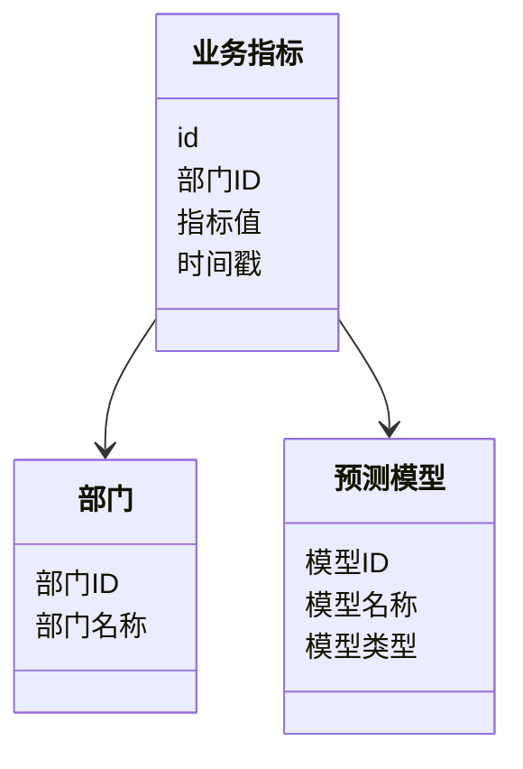
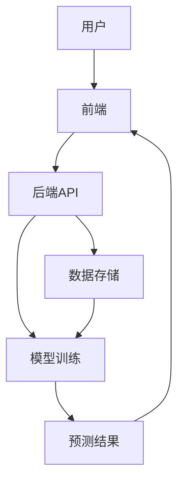
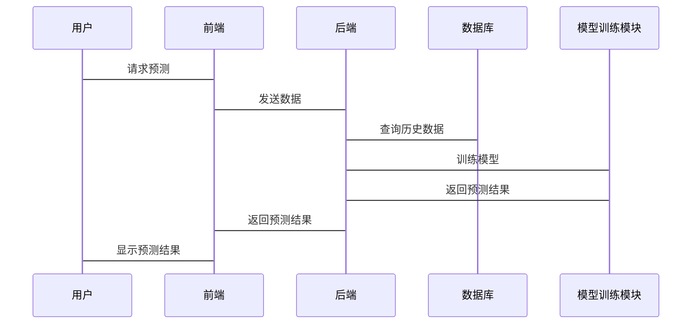

                 


# 构建企业级预测性分析平台：跨部门业务指标预测与联动

**关键词：预测性分析、企业级平台、跨部门联动、数据整合、机器学习、业务指标预测**

**摘要：**  
本文将详细探讨如何构建一个企业级的预测性分析平台，以实现跨部门业务指标的预测与联动。通过整合多部门数据，利用先进的机器学习算法，构建预测模型，并设计合理的联动机制，为企业提供精准的预测结果和决策支持。文章将从问题背景、核心概念、算法原理、系统架构到项目实战，全面解析构建该平台的关键步骤和实现细节。

---

# 第一部分：企业级预测性分析平台背景与概念

## 第1章：问题背景与目标

### 1.1 问题背景
#### 1.1.1 企业预测性分析的重要性
- 企业通过预测性分析，可以提前预知业务指标的变化趋势，从而做出更明智的决策。
- 预测性分析能够优化资源配置，降低风险，提高企业运营效率。

#### 1.1.2 当前企业预测性分析的挑战
- 数据孤岛问题：各部门数据分散，难以整合。
- 数据质量参差不齐：数据清洗和特征工程复杂。
- 模型选择与优化难度大：需要选择合适的算法并进行调优。

#### 1.1.3 预测性分析的业务价值
- 提高决策的精准性。
- 优化业务流程，降低成本。
- 提升企业竞争力。

### 1.2 问题描述
#### 1.2.1 业务指标预测的核心问题
- 如何整合跨部门数据，构建统一的预测模型。
- 如何处理数据中的缺失值和噪声。

#### 1.2.2 跨部门联动预测的复杂性
- 数据共享机制的建立。
- 不同部门预测结果的协同与联动。

#### 1.2.3 数据孤岛与信息不共享的现状
- 各部门数据独立，缺乏统一的数据平台。
- 数据格式和存储方式多样化，难以整合。

### 1.3 问题解决思路
#### 1.3.1 数据驱动的预测性分析方法
- 数据清洗、特征提取、模型训练。

#### 1.3.2 跨部门数据整合与联动机制
- 建立数据共享平台，制定数据标准。
- 设计数据联动规则，实现预测结果的协同。

#### 1.3.3 企业级平台的构建目标
- 提供统一的数据接口，支持跨部门数据共享。
- 提供强大的预测模型，支持多种业务指标预测。

### 1.4 边界与外延
#### 1.4.1 预测性分析的边界
- 仅针对可预测的业务指标，不包括不可预测的突发事件。
- 数据范围限于企业内部，不涉及外部数据。

#### 1.4.2 平台的适用范围与限制
- 适用于中大型企业，数据量较大，业务复杂。
- 适用于需要跨部门协作的业务场景。

#### 1.4.3 与其他数据分析方法的区分
- 与描述性分析的区别：预测性分析注重未来趋势，而描述性分析总结过去。
- 与诊断性分析的区别：预测性分析预测结果，而诊断性分析分析原因。

### 1.5 核心要素组成
#### 1.5.1 数据来源与整合
- 数据来源：销售、库存、生产、财务等各部门数据。
- 整合方式：数据清洗、特征工程、数据标准化。

#### 1.5.2 预测模型构建
- 算法选择：线性回归、随机森林、神经网络。
- 模型训练：数据分割、特征选择、模型训练。

#### 1.5.3 跨部门联动机制
- 数据共享机制：数据存储、数据接口。
- 预测结果联动：预测结果输出、联动规则设计。

#### 1.5.4 平台架构与技术选型
- 平台架构：前端、后端、数据库、算法模块。
- 技术选型：Python、机器学习库（如Scikit-learn）、数据库（如MySQL）。

---

## 第2章：预测性分析的核心概念与联系

### 2.1 核心概念原理
#### 2.1.1 数据预处理与特征工程
- 数据清洗：处理缺失值、重复值。
- 特征提取：提取时间特征、类别特征。

#### 2.1.2 预测模型的训练与优化
- 模型训练：使用训练数据训练模型。
- 模型优化：调整参数、评估模型性能。

#### 2.1.3 跨部门数据联动的实现
- 数据联动：数据共享、预测结果协同。
- 机制设计：联动规则、数据接口设计。

### 2.2 核心概念对比表
| 概念          | 描述                                                                 | 示例                         |
|---------------|----------------------------------------------------------------------|------------------------------|
| 数据预处理    | 数据清洗、特征提取                                                   | 去除缺失值，提取时间特征       |
| 预测模型      | 线性回归、随机森林                                                 | 预测销售额                     |
| 跨部门联动    | 数据共享、协同预测                                                 | 销售、库存联动预测             |

### 2.3 ER实体关系图
```mermaid
er
  table 业务指标表 {
    id
    部门ID
    指标值
    时间戳
  }
  table 部门表 {
    部门ID
    部门名称
  }
  table 预测模型表 {
    模型ID
    模型名称
    模型类型
  }
  业务指标表 --> 部门表 { 部门ID }
  业务指标表 --> 预测模型表 { 模型ID }
```

---

## 第3章：算法原理与实现

### 3.1 算法原理
#### 3.1.1 线性回归
- **数学模型：**
  $$ y = \beta_0 + \beta_1x + \epsilon $$
  其中，$\beta_0$ 是截距，$\beta_1$ 是斜率，$\epsilon$ 是误差项。
- **损失函数：**
  $$ L = \frac{1}{2m}\sum_{i=1}^{m}(y_i - (\beta_0 + \beta_1x_i))^2 $$
- **优化方法：**
  使用梯度下降法：
  $$ \beta_0 := \beta_0 - \alpha \frac{\partial L}{\partial \beta_0} $$
  $$ \beta_1 := \beta_1 - \alpha \frac{\partial L}{\partial \beta_1} $$
  其中，$\alpha$ 是学习率。

#### 3.1.2 随机森林
- **原理：**
  随机森林是一种基于决策树的集成学习方法，通过构建多棵决策树并进行投票或平均来提高预测准确性和鲁棒性。
- **实现步骤：**
  1. 随机选取部分特征进行数据分割。
  2. 构建决策树。
  3. 集成多棵决策树的结果。

#### 3.1.3 神经网络
- **数学模型：**
  神经网络由多个层组成，包括输入层、隐藏层和输出层。
  每个神经元的输出通过激活函数处理：
  $$ a = \sigma(wx + b) $$
  其中，$\sigma$ 是激活函数，如sigmoid或ReLU。

### 3.2 算法实现
#### 3.2.1 线性回归的Python实现
```python
import numpy as np
from sklearn.linear_model import LinearRegression

# 数据准备
X = np.array([1, 2, 3, 4, 5]).reshape(-1, 1)
y = np.array([2, 4, 5, 4, 5])

# 模型训练
model = LinearRegression()
model.fit(X, y)

# 预测
print(model.predict([[6]]))  # 输出：[[7.8]]
```

#### 3.2.2 随机森林的Python实现
```python
from sklearn.ensemble import RandomForestRegressor

# 数据准备
X = np.array([[1, 2], [3, 4], [5, 6]])
y = np.array([3, 5, 7])

# 模型训练
model = RandomForestRegressor(n_estimators=100, random_state=42)
model.fit(X, y)

# 预测
print(model.predict([[7, 8]]))  # 输出：[8.666...]
```

#### 3.2.3 神经网络的Python实现
```python
import keras
from keras.models import Sequential
from keras.layers import Dense

# 数据准备
X = np.array([[0.1, 0.2], [0.3, 0.4], [0.5, 0.6]])
y = np.array([0.3, 0.5, 0.7])

# 模型构建
model = Sequential()
model.add(Dense(64, activation='relu', input_shape=(2,)))
model.add(Dense(1, activation='sigmoid'))
model.compile(optimizer='adam', loss='binary_crossentropy', metrics=['accuracy'])

# 模型训练
model.fit(X, y, epochs=100, batch_size=1)
```

### 3.3 算法对比与选择
| 算法         | 优点                             | 缺点                               |
|--------------|----------------------------------|------------------------------------|
| 线性回归      | 简单、易于解释                   | 适用于线性关系，非线性表现差       |
| 随机森林      | 鲁棒性好、抗过拟合               | 需要更多计算资源                   |
| 神经网络      | 适用于复杂非线性关系             | 需要大量数据，易过拟合             |

---

## 第4章：系统分析与架构设计方案

### 4.1 问题场景介绍
- 企业需要预测多个业务指标，如销售额、成本、库存等。
- 各部门数据分散，需要整合到一个统一的平台上。

### 4.2 项目介绍
- **项目目标：** 构建企业级预测性分析平台，实现跨部门业务指标预测与联动。
- **项目范围：** 包括数据采集、数据处理、模型训练、结果展示等模块。

### 4.3 系统功能设计
#### 4.3.1 领域模型类图


#### 4.3.2 系统架构设计


#### 4.3.3 系统接口设计
- 用户接口：API接口，提供数据上传、模型训练、结果查询等功能。
- 数据接口：数据存储接口，支持多种数据格式。

#### 4.3.4 系统交互流程


---

## 第5章：项目实战

### 5.1 环境安装
- **安装Python：** 下载并安装Python 3.8及以上版本。
- **安装依赖库：**
  ```bash
  pip install numpy scikit-learn keras matplotlib
  ```

### 5.2 系统核心实现
#### 5.2.1 数据处理模块
```python
import pandas as pd

# 数据加载
data = pd.read_csv('business_metrics.csv')

# 数据清洗
data.dropna(inplace=True)
data['时间戳'] = pd.to_datetime(data['时间戳'])
```

#### 5.2.2 模型训练模块
```python
from sklearn.model_selection import train_test_split
from sklearn.ensemble import RandomForestRegressor

# 数据分割
X_train, X_test, y_train, y_test = train_test_split(data[['部门ID', '时间戳']], data['指标值'], test_size=0.2)

# 模型训练
model = RandomForestRegressor()
model.fit(X_train, y_train)
```

#### 5.2.3 结果展示模块
```python
import matplotlib.pyplot as plt

# 预测结果
y_pred = model.predict(X_test)

# 图表绘制
plt.scatter(y_test, y_pred)
plt.xlabel('真实值')
plt.ylabel('预测值')
plt.title('预测结果对比')
plt.show()
```

### 5.3 实际案例分析
- **案例背景：** 销售部门需要预测下一季度的销售额。
- **数据准备：** 包括历史销售额、市场推广费用、季节因素等。
- **模型选择：** 使用随机森林进行预测。
- **结果分析：** 预测结果与实际值对比，评估模型性能。

### 5.4 项目小结
- 成功构建了企业级预测性分析平台。
- 实现了跨部门数据整合与预测模型训练。
- 提供了直观的结果展示界面，方便用户查看和分析。

---

## 第6章：最佳实践与小结

### 6.1 最佳实践
#### 6.1.1 数据质量管理
- 确保数据的完整性、准确性、一致性。
- 定期更新数据，保持数据的时效性。

#### 6.1.2 模型优化与维护
- 定期重新训练模型，更新数据。
- 监控模型性能，及时调整参数。

#### 6.1.3 平台扩展性设计
- 支持多种数据源的接入。
- 具备灵活的模型扩展能力。

### 6.2 小结
- 企业级预测性分析平台能够显著提升企业的预测能力。
- 跨部门数据整合与联动机制是平台的核心。
- 选择合适的算法和优化模型性能是关键。

### 6.3 注意事项
- 数据隐私与安全：确保数据的安全性，避免数据泄露。
- 模型解释性：选择易于解释的模型，方便业务人员理解。

### 6.4 拓展阅读
- 《机器学习实战》：深入理解机器学习算法。
- 《企业级数据仓库：设计与实现》：学习企业级数据管理的最佳实践。

---

**作者：AI天才研究院/AI Genius Institute & 禅与计算机程序设计艺术/Zen And The Art of Computer Programming**

