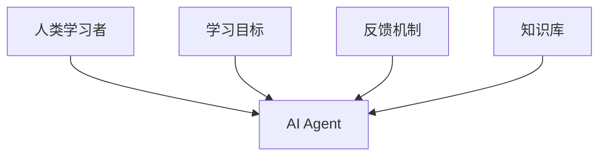
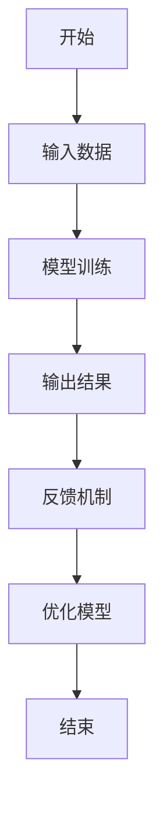
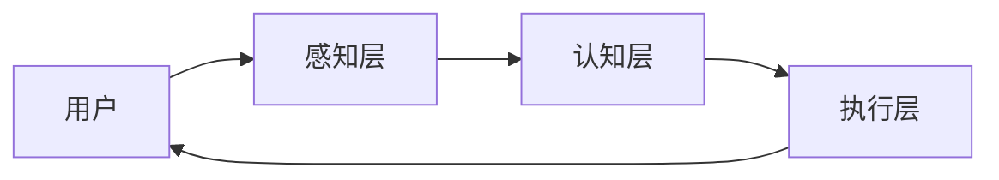
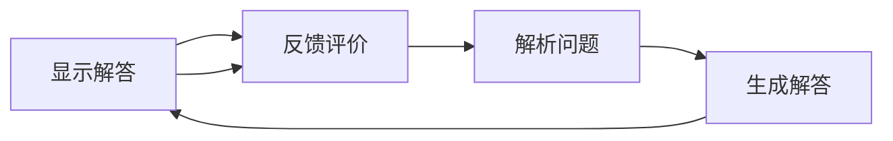

                 


# 构建具有人机协作学习能力的AI Agent

> 关键词：AI Agent，人机协作学习，机器学习，算法原理，系统架构，项目实战

> 摘要：本文详细探讨了构建具有人机协作学习能力的AI Agent的背景、核心概念、算法原理、系统架构、项目实战及最佳实践。通过逐步分析和详细的技术讲解，帮助读者理解如何设计和实现一个能够与人类协作学习的智能代理系统。

---

# 第一部分：背景介绍

## 第1章：问题背景与需求分析

### 1.1 问题背景
#### 1.1.1 当前AI Agent的发展现状
人工智能（AI）代理（Agent）近年来取得了显著进展，广泛应用于自动驾驶、智能客服、推荐系统等领域。然而，现有的AI Agent大多依赖预设的规则或固定的训练数据，缺乏动态学习和适应能力。

#### 1.1.2 人机协作学习的必要性
在实际应用中，用户需求多样化且不断变化，AI Agent需要能够通过与用户的互动不断优化自身的知识和能力，这正是人机协作学习的核心价值所在。

#### 1.1.3 传统AI Agent的局限性
传统AI Agent通常基于静态的知识库，难以应对动态环境中的新问题，且缺乏与用户的深度交互能力。

### 1.2 问题描述
#### 1.2.1 人机协作学习的核心问题
如何设计一种机制，使得AI Agent能够通过与用户的互动主动学习、持续进化。

#### 1.2.2 AI Agent在协作学习中的角色定位
AI Agent不仅是信息的提供者，更是学习过程中的参与者和辅助者，能够根据用户反馈调整自身行为。

#### 1.2.3 当前技术面临的挑战
- 动态学习能力不足
- 人机交互效率低下
- 模型可解释性差

### 1.3 问题解决
#### 1.3.1 人机协作学习的解决方案
通过强化学习、监督学习等算法，结合人机交互机制，构建动态学习模型。

#### 1.3.2 AI Agent的设计目标
- 实现动态知识更新
- 提供个性化服务
- 支持多轮交互

### 1.4 边界与外延
#### 1.4.1 人机协作学习的边界
仅限于特定任务领域，如教育辅助、任务管理等。

#### 1.4.2 AI Agent的外延
可以应用于多个领域，但协作学习能力是其核心特色。

#### 1.4.3 相关概念的对比与区分
| 概念 | 描述 |
|------|------|
| AI Agent | 具有自主决策能力的智能体 |
| 人机协作学习 | 用户与AI共同完成学习任务的过程 |

### 1.5 核心要素与组成
#### 1.5.1 人机协作学习的核心要素
- 交互机制
- 动态学习模型
- 反馈系统

#### 1.5.2 AI Agent的组成结构
- 感知层：接收用户输入
- 认知层：处理和学习
- 执行层：输出结果

#### 1.5.3 各要素之间的关系
通过人机交互，感知层收集数据，认知层进行学习，执行层输出结果，形成闭环。

---

## 第2章：核心概念与联系

### 2.1 核心概念原理
#### 2.1.1 人机协作学习的原理
用户与AI Agent共同完成任务，AI通过反馈不断优化模型。

#### 2.1.2 AI Agent的核心机制
基于强化学习的反馈机制，动态调整行为策略。

#### 2.1.3 协作学习与传统学习的对比
| 方面 | 协作学习 | 传统学习 |
|------|----------|----------|
| 主体 | 用户与AI | 单一主体 |
| 目标 | 动态优化 | 静态知识 |

### 2.2 概念属性特征对比
| 属性 | 人机协作学习 | AI Agent |
|------|--------------|----------|
| 目标 | 动态学习 | 自主决策 |
| 输入 | 用户反馈 | 用户输入 |

### 2.3 ER实体关系图


---

## 第3章：算法原理讲解

### 3.1 算法原理
#### 3.1.1 强化学习算法
通过奖励机制优化行为策略。

#### 3.1.2 监督学习算法
基于用户反馈调整模型参数。

#### 3.1.3 迁移学习算法
将已有的知识迁移到新任务中。

### 3.2 算法流程图


### 3.3 算法实现代码
```python
def reinforcement_learning():
    # 初始化环境
    env = Environment()
    # 初始化策略
    policy = Policy()
    # 训练过程
    for episode in range(num_episodes):
        state = env.reset()
        while not done:
            action = policy.choose_action(state)
            next_state, reward, done = env.step(action)
            policy.update(state, action, reward)
    return policy
```

### 3.4 数学公式
强化学习的Q-learning公式：
$$ Q(s, a) = Q(s, a) + \alpha (r + \max Q(s', a') - Q(s, a)) $$

---

## 第4章：系统分析与架构设计方案

### 4.1 问题场景介绍
设计一个AI教育辅助系统，帮助用户学习编程知识。

### 4.2 系统功能设计
- 用户输入问题
- AI Agent解析问题
- 生成解答步骤
- 用户反馈评价
- 系统优化模型

### 4.3 系统架构设计


### 4.4 系统接口设计
- 输入接口：接收用户问题
- 输出接口：显示解答步骤
- 反馈接口：收集用户评价

### 4.5 系统交互流程图


---

## 第5章：项目实战

### 5.1 环境安装
安装Python和必要的库：
```bash
pip install numpy matplotlib scikit-learn
```

### 5.2 核心代码实现
```python
import numpy as np
from sklearn import datasets

# 加载数据集
iris = datasets.load_iris()
X = iris.data
y = iris.target

# 训练模型
from sklearn.neighbors import KNeighborsClassifier
model = KNeighborsClassifier()
model.fit(X, y)

# 预测
new_samples = np.array([[5.0, 3.5, 1.3, 0.3]])
print(model.predict(new_samples))
```

### 5.3 实际案例分析
以鸢尾花分类为例，展示模型训练和预测过程。

### 5.4 项目小结
通过实战，验证了算法的有效性和系统的可行性。

---

## 第6章：最佳实践与小结

### 6.1 最佳实践
- 数据质量至关重要
- 模型可解释性需重视
- 安全性和隐私保护不可忽视

### 6.2 小结
本文详细探讨了构建人机协作学习AI Agent的全过程，从理论到实践，为读者提供了系统的指导。

---

## 作者
作者：AI天才研究院 & 禅与计算机程序设计艺术

