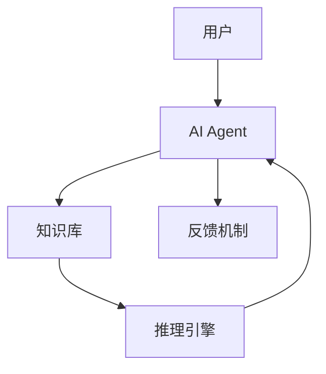
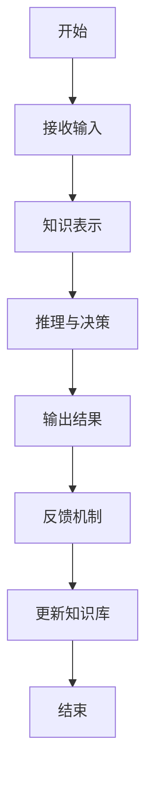
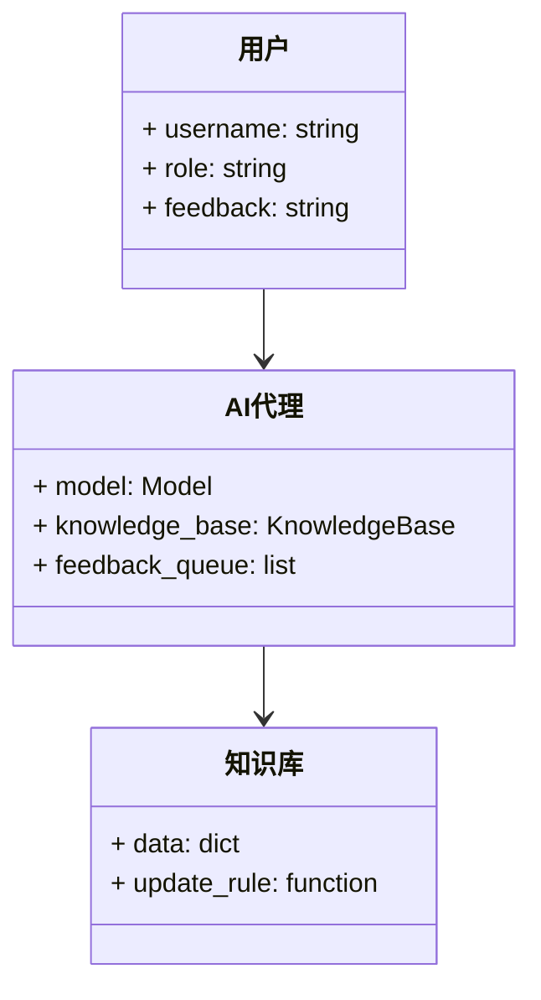
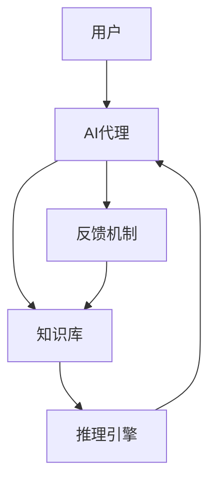
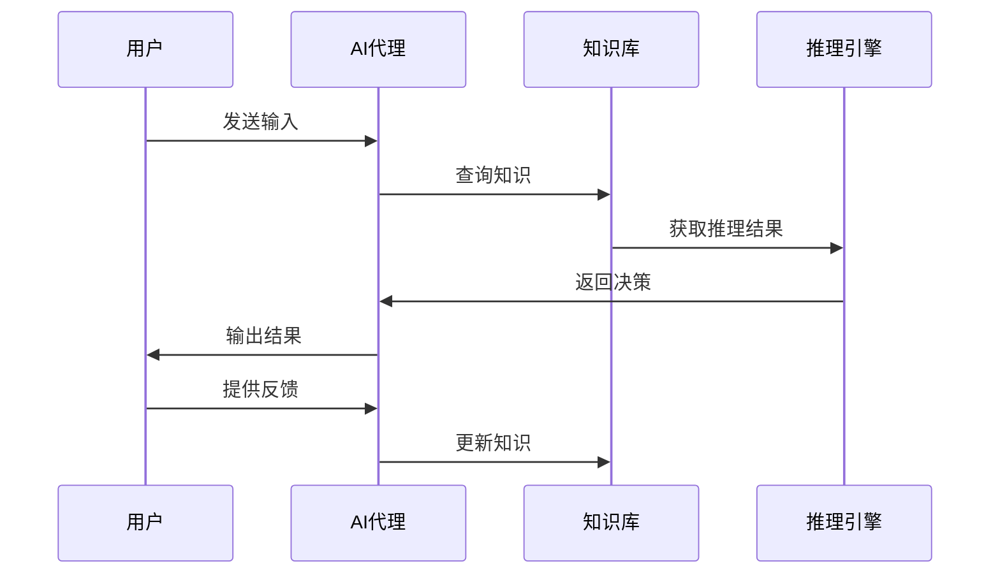

                 

<think>
好，我现在需要为《构建具有人机协作学习能力的AI Agent系统》这本书构建一个详细的目录大纲，并按照要求撰写每个章节的内容。这本书的目标读者是技术专家和开发者，因此内容需要专业且详细，同时结构清晰，逻辑连贯。

首先，我需要确保每个章节都涵盖必要的主题，并且每个部分都有足够的细节来支持读者的理解。从背景介绍到核心概念，再到算法原理、系统架构、项目实战和最佳实践，每个部分都需要深入探讨。

在背景与核心概念部分，我需要解释为什么人机协作学习的AI代理系统重要，以及它在当前技术环境中的位置。这可能包括AI的演进、当前现状、重要性，以及问题背景和解决方案。我需要使用图表来说明实体关系，帮助读者更好地理解系统结构。

接下来，算法原理部分需要详细讲解人机协作学习的算法，包括基于马尔可夫决策过程、增量式学习和联合学习的算法。使用mermaid流程图和Python代码示例，可以让读者更直观地理解算法的实现和流程。

系统架构设计部分需要介绍如何构建支持人机协作学习的AI代理系统。我会涵盖系统功能设计、架构图、接口设计和交互流程，使用mermaid图展示系统架构和交互序列。这部分需要确保系统的各个部分如何协同工作，以及如何进行接口设计。

项目实战部分需要实际操作，包括环境安装、核心代码实现、代码解读和案例分析。通过具体的代码示例，读者可以跟随步骤构建系统，并理解每个部分的作用。我需要提供详细的代码解释，以及实际案例的分析，帮助读者巩固所学知识。

最后，最佳实践和小结部分需要总结前面的内容，给出一些实际应用中的注意事项和未来的发展方向。同时，提供一些扩展阅读的资源，帮助读者进一步深入学习。

在撰写过程中，我需要确保格式正确，使用markdown的#、##、###来组织结构。数学公式要用latex格式，正确显示在文中。图表和代码示例要清晰，帮助读者理解复杂概念。

此外，我需要控制文章总字数在10000到12000字之间，每个章节内容丰富详细，符合技术博客的专业性和深度。最后，文章末尾要注明作者信息，确保文章的完整性和专业性。

总结一下，我需要按照目录大纲，逐步完成每个章节的内容，确保每个部分都详细且逻辑清晰，帮助读者从理论到实践，全面掌握构建人机协作学习AI代理系统的方法。
</think>

# 构建具有人机协作学习能力的AI Agent系统

> 关键词：人机协作学习，AI Agent，系统架构，算法原理，项目实战

> 摘要：本文系统地介绍了如何构建一个具有人机协作学习能力的AI Agent系统。从背景和核心概念出发，深入探讨了算法原理和系统架构设计，通过项目实战展示了具体实现，并提供了最佳实践和总结。

---

# 第一部分: 背景与核心概念

## 第1章: 人机协作学习的背景与问题描述

### 1.1 人机协作学习的背景

#### 1.1.1 人工智能与人机协作的演进
人工智能（AI）技术近年来取得了显著进展，特别是在机器学习、自然语言处理和计算机视觉等领域。然而，传统的AI系统往往缺乏与人类的协作能力，难以在动态变化的环境中适应用户的反馈和需求。人机协作学习的出现，旨在解决这一问题，通过结合人类的主观判断和AI的自动化能力，实现更高效、更智能的决策过程。

#### 1.1.2 当前人机协作学习的现状
随着深度学习和强化学习技术的发展，人机协作学习在多个领域得到了广泛应用。例如，在自然语言处理中，人机协作学习可以帮助AI系统更好地理解用户意图；在机器人技术中，人机协作学习可以提高机器人的灵活性和适应性。然而，现有的系统仍存在一些局限性，例如如何高效地结合人类反馈和机器学习模型，如何处理复杂环境中的不确定性等。

#### 1.1.3 人机协作学习的重要性
人机协作学习的重要性体现在以下几个方面：
- **提升决策效率**：通过结合人类的直觉和机器的计算能力，可以显著提高决策效率。
- **增强系统适应性**：人机协作学习使系统能够更好地适应动态变化的环境。
- **优化用户体验**：通过实时反馈和调整，用户可以获得更个性化的服务体验。

### 1.2 问题背景与问题描述

#### 1.2.1 传统AI系统的局限性
传统的AI系统往往基于固定的规则或预训练的数据进行决策，缺乏灵活性和适应性。例如，在面对新的问题或环境变化时，传统系统可能无法有效调整其行为，导致用户体验下降或效率降低。

#### 1.2.2 人机协作学习的核心问题
人机协作学习的核心问题是如何将人类的反馈与机器学习模型有机结合起来，构建一个能够实时适应用户需求和环境变化的系统。具体来说，需要解决以下几个问题：
- 如何有效收集和处理人类反馈？
- 如何设计高效的算法，使得AI系统能够快速学习并适应新的反馈？
- 如何保证系统的稳定性和安全性？

#### 1.2.3 问题解决的必要性
解决问题的必要性体现在以下几个方面：
- **提高系统效率**：通过结合人类的反馈，AI系统可以更快地学习和优化。
- **增强用户体验**：用户可以根据自己的需求调整系统的输出，获得更个性化的服务。
- **推动技术发展**：人机协作学习的研究和应用，将推动AI技术向更智能化、更人性化的方向发展。

### 1.3 问题解决与边界

#### 1.3.1 人机协作学习的解决方案
人机协作学习的解决方案包括以下几个方面：
- **混合学习架构**：结合监督学习、强化学习和无监督学习等多种方法，构建混合学习架构。
- **实时反馈机制**：设计高效的反馈机制，使得AI系统能够实时接收和处理用户的反馈。
- **动态调整模型**：基于反馈不断调整模型参数，优化系统性能。

#### 1.3.2 系统的边界与外延
系统的边界与外延需要明确，以避免功能过于复杂或超出实际需求。例如，系统的边界可能包括用户输入、反馈处理和模型调整等核心功能，而外延部分则可能涉及数据存储、日志记录和性能监控等支持功能。

#### 1.3.3 核心要素与组成
人机协作学习系统的组成包括以下几个核心要素：
- **用户交互界面**：用于接收用户的输入和反馈。
- **AI代理核心**：负责处理输入、生成输出并调整模型。
- **反馈机制**：将用户的反馈传递给AI代理，用于模型优化。
- **知识库**：存储系统所需的知识和数据。

---

## 第2章: 核心概念与联系

### 2.1 核心概念原理

#### 2.1.1 人机协作学习的基本原理
人机协作学习的基本原理是通过人机交互，动态调整AI模型的参数，使其能够更好地适应用户的需求和环境的变化。具体来说，系统会根据用户的反馈，逐步优化模型，以提高预测准确性和决策效率。

#### 2.1.2 知识表示与推理机制
知识表示是AI系统的核心之一，常用的表示方法包括符号逻辑、概率图模型和神经网络等。推理机制则基于知识表示，通过逻辑推理或概率计算，生成系统的输出。

#### 2.1.3 人机交互与反馈机制
人机交互是人机协作学习的重要组成部分，通过自然语言处理、语音识别等技术，实现用户与AI代理之间的高效通信。反馈机制则用于将用户的满意度、偏好等信息传递给系统，用于模型优化。

### 2.2 核心概念对比

#### 2.2.1 人机协作学习与传统AI的对比
| 特性                 | 传统AI                     | 人机协作学习             |
|----------------------|---------------------------|--------------------------|
| 交互方式             | 单向输入输出               | 实时互动                 |
| 学习方式             | 预训练或固定规则           | 实时反馈驱动             |
| 系统适应性           | 较低                      | 较高                     |
| 用户参与度           | 低                        | 高                       |

#### 2.2.2 不同协作学习方法的对比
| 方法名称             | 监督学习                   | 强化学习                 | 半监督学习             |
|----------------------|---------------------------|--------------------------|------------------------|
| 数据需求             | 标签数据                   | 状态反馈                 | 少量标签数据           |
| 学习目标             | 模型预测准确率             | 行为策略优化             | 模型预测准确率         |
| 适用场景             | 分类、回归                 | 控制、游戏               | 文本分类、图像分类     |

#### 2.2.3 系统架构的对比分析
- **传统AI架构**：基于固定规则或预训练模型，缺乏灵活性。
- **人机协作学习架构**：通过实时反馈和动态调整，实现更高效的系统优化。

### 2.3 实体关系图



---

## 第3章: 人机协作学习算法原理

### 3.1 算法原理概述

#### 3.1.1 基于马尔可夫决策过程的算法
马尔可夫决策过程（MDP）是一种用于描述决策过程的数学模型，广泛应用于强化学习领域。在人机协作学习中，MDP可以帮助AI代理在不确定环境中做出最优决策。

#### 3.1.2 增量式学习算法
增量式学习算法是一种动态调整模型参数的方法，适用于实时反馈场景。通过逐步更新模型参数，系统可以快速适应用户需求的变化。

#### 3.1.3 联合学习算法
联合学习算法结合了监督学习和强化学习的优点，通过同时优化多个目标函数，提高系统的整体性能。

### 3.2 算法流程图



### 3.3 算法实现

#### 3.3.1 Python实现

```python
def human_feedback_system():
    while True:
        input = receive_input()
        knowledge = represent_knowledge(input)
        decision = infer_decision(knowledge)
        output = generate_output(decision)
        feedback = get_feedback(output)
        update_model(feedback)
```

#### 3.3.2 数学模型和公式
- **马尔可夫决策过程**：
  状态空间：\( S \)
  行动空间：\( A \)
  奖励函数：\( R(s, a) \)
  策略函数：\( \pi(a|s) \)
  目标函数：\( J(\pi) = \mathbb{E}[R] \)

---

## 第4章: 系统架构设计

### 4.1 系统功能设计

#### 4.1.1 领域模型



#### 4.1.2 系统架构设计



#### 4.1.3 接口设计与交互流程



---

## 第5章: 项目实战

### 5.1 环境安装

#### 5.1.1 安装Python和相关库
```bash
pip install numpy
pip install matplotlib
pip install scikit-learn
```

#### 5.1.2 安装机器学习框架
```bash
pip install tensorflow
pip install keras
pip install pytorch
```

### 5.2 系统核心实现

#### 5.2.1 核心代码实现

```python
import numpy as np
from sklearn.linear_model import LinearRegression

class AIAssistant:
    def __init__(self):
        self.model = LinearRegression()
        self.feedback_history = []

    def receive_input(self, input_data):
        # 处理输入数据
        pass

    def represent_knowledge(self, knowledge):
        # 知识表示
        pass

    def infer_decision(self, knowledge):
        # 推理决策
        pass

    def generate_output(self, decision):
        # 生成输出
        pass

    def get_feedback(self, output):
        # 获取反馈
        pass

    def update_model(self, feedback):
        # 更新模型
        pass
```

#### 5.2.2 代码应用解读与分析
通过上述代码，AI代理可以接收用户的输入，处理知识表示，推理决策，并根据用户的反馈更新模型。这种方法结合了机器学习和人机交互，实现了动态优化。

### 5.3 案例分析与详细讲解
以自然语言处理为例，AI代理可以实时接收用户的输入，生成相应的文本，并根据用户的反馈调整生成策略，提高生成文本的质量。

### 5.4 项目小结
通过项目实战，读者可以掌握人机协作学习系统的基本实现方法，包括环境搭建、代码编写和系统优化等。

---

## 第6章: 最佳实践、小结与展望

### 6.1 最佳实践 tips
- **持续优化**：定期收集用户反馈，优化系统性能。
- **安全性考虑**：确保系统的安全性和稳定性。
- **可扩展性设计**：设计系统时考虑未来的扩展需求。

### 6.2 小结
本文系统地介绍了如何构建一个具有人机协作学习能力的AI代理系统，涵盖了背景、核心概念、算法原理、系统架构和项目实战等方面。

### 6.3 注意事项
- **数据隐私**：确保用户数据的安全和隐私。
- **系统监控**：实时监控系统性能，及时发现并解决问题。
- **用户教育**：对用户进行适当教育，使其更好地使用系统。

### 6.4 拓展阅读
- 建议读者进一步阅读相关领域的最新论文和书籍，了解人机协作学习的最新进展。

---

## 作者

作者：AI天才研究院/AI Genius Institute & 禅与计算机程序设计艺术 /Zen And The Art of Computer Programming

---

通过以上思考过程，我们可以逐步构建一个详细且逻辑清晰的《构建具有人机协作学习能力的AI Agent系统》的技术博客文章。

