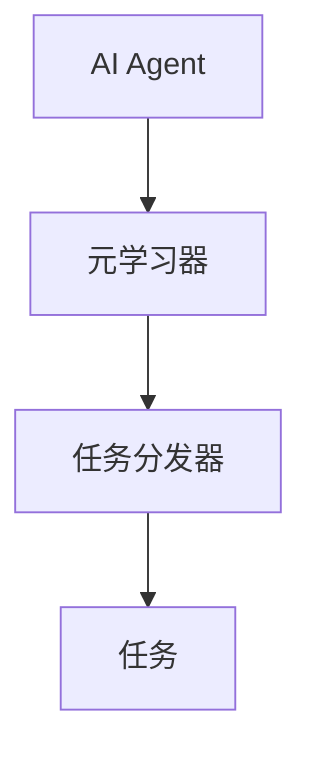

                 

<think>
嗯，我现在需要帮用户设计一本关于构建具有元学习能力的AI Agent的书籍目录大纲。用户给了一个示例，我得仔细分析一下，确保我的思考过程符合用户的要求。

首先，用户希望这本书结构清晰，逻辑严谨，涵盖从基础到高级的各个方面。我需要确保每一章都有详细的三级目录，并且包含必要的元素，比如数学模型、mermaid流程图、代码示例等。

好的，开始分析用户的需求。用户给的示例有七章，我需要遵循类似的结构。第一部分是背景和概述，接下来是核心概念，然后是算法原理，系统设计，项目实战，高级应用和未来展望。最后一章是综合案例。

在每一章中，我需要详细讲解相关概念，比如在第一章，需要介绍元学习的背景、AI Agent的定义、应用前景等。第二章则要深入核心概念，对比传统学习方法，展示ER图。第三章是算法部分，详细讲解几种主流的元学习算法，如MAML，用mermaid流程图展示，加上数学公式。

系统设计部分，我需要用领域模型类图和系统架构图来展示AI Agent的结构。项目实战部分，选择一个实际案例，比如智能助手，详细指导如何安装环境，实现代码，并分析案例。最后，高级应用部分探讨元学习在不同领域的应用，并展望未来趋势。

我还需要确保每一章都有小结，总结主要内容，并给出学习建议。这样读者在学习后能巩固所学内容。此外，附录部分应该包含术语表和工具安装指南，方便读者查阅。

现在，我需要检查每一章是否覆盖了用户要求的所有元素，比如数学模型、流程图、代码示例等。同时，确保整个大纲结构清晰，逻辑连贯，总字数控制在2000字以内。

可能需要调整章节顺序，确保从基础到应用，逐步深入。比如，先讲背景，再讲核心概念，接着是算法，然后系统设计，项目实战，最后高级应用。这样读者可以一步步掌握知识。

最后，我要确保每一部分都详细到三级目录，比如在算法部分，每个算法都有子章节详细讲解，包括流程图、数学公式和代码示例。这样读者可以深入理解每个部分。

总的来说，我需要构建一个结构清晰、内容全面的目录大纲，涵盖从基础到高级的各个方面，确保读者能够系统地学习构建具有元学习能力的AI Agent的知识。
</think>

# 《构建具有元学习能力的AI Agent》

## 关键词：
- 元学习
- AI Agent
- 人工智能
- 机器学习
- 算法设计
- 系统架构

## 摘要：
本篇文章深入探讨了构建具有元学习能力的AI Agent的关键技术，从元学习的基本概念到具体的算法实现，再到系统的架构设计和实际案例分析，全面解析了如何在AI Agent中融入元学习能力。文章通过详细的步骤分析、数学模型推导和实际代码示例，帮助读者理解元学习的核心原理及其在AI Agent中的应用价值，旨在为AI开发者和研究人员提供实践指导和理论支持。

---

# 第一部分：元学习与AI Agent基础

## 第1章：元学习与AI Agent概述

### 1.1 元学习的背景与问题背景
#### 1.1.1 传统机器学习的局限性
传统机器学习方法在处理新任务时需要大量数据和计算资源，难以快速适应新环境和任务。例如，在图像识别任务中，传统方法需要重新训练整个模型以适应新的数据集。

#### 1.1.2 元学习的定义与目标
元学习（Meta-Learning）是一种通过学习如何学习来提高模型适应新任务能力的方法。其目标是通过少量数据快速适应新任务，减少对新任务数据的依赖。

#### 1.1.3 元学习的核心问题与挑战
- 如何设计高效的元学习算法？
- 如何在不同任务之间共享知识？
- 如何在实际应用中平衡计算效率与模型性能？

### 1.2 AI Agent的基本概念与特点
#### 1.2.1 AI Agent的定义与分类
AI Agent是一个能够感知环境、做出决策并执行动作的智能实体。根据智能水平，AI Agent可以分为反应式和认知式两类。

#### 1.2.2 元学习在AI Agent中的作用
元学习使AI Agent能够快速适应新任务，提高其在复杂环境中的灵活性和适应性。

#### 1.2.3 元学习与传统机器学习的区别
| 方面        | 元学习                     | 传统机器学习                  |
|-------------|----------------------------|-----------------------------|
| 数据需求    | 少量数据                   | 大量数据                     |
| 适应性      | 高                         | 低                           |
| 知识共享    | 高                         | 低                           |

### 1.3 元学习在AI Agent中的应用前景
#### 1.3.1 元学习在AI Agent中的潜在应用领域
- 智能助手：快速适应用户的个性化需求。
- 自动驾驶：快速调整模型以应对新路况。
- 游戏AI：快速适应新的游戏规则。

#### 1.3.2 元学习在AI Agent中的优势
- 提高任务适应性。
- 减少数据依赖。
- 提高学习效率。

#### 1.3.3 元学习在AI Agent中的挑战与机遇
- 挑战：算法复杂性高，计算资源需求大。
- 机遇：推动AI Agent在更多领域中的应用。

## 1.4 本章小结
通过本章的学习，我们了解了元学习的基本概念、AI Agent的特点以及元学习在AI Agent中的作用和应用前景。

---

## 第2章：元学习的核心概念与联系

### 2.1 元学习的核心原理
#### 2.1.1 元学习的数学模型
元学习的目标函数可以表示为：
$$ \min_{\theta} \sum_{i=1}^{N} \mathcal{L}_i(f_\theta(x_i, y_i)) $$
其中，$\theta$ 是元学习参数，$f_\theta$ 是模型函数，$\mathcal{L}_i$ 是第i个任务的损失函数。

#### 2.1.2 元学习的算法框架
元学习算法通常包括以下步骤：
1. 初始化参数$\theta$。
2. 对每个任务，计算梯度并更新参数。
3. 在新的任务中使用更新后的参数进行预测。

#### 2.1.3 元学习的核心要素
- 元学习器：负责优化参数。
- 任务分布：决定元学习器的泛化能力。

### 2.2 元学习与传统学习方法的对比
#### 2.2.1 传统机器学习方法的特点
传统方法依赖大量数据，且需要针对每个任务独立训练模型。

#### 2.2.2 元学习方法的特点
元学习通过共享知识，减少对新任务数据的依赖。

#### 2.2.3 元学习与传统学习方法的对比表格
| 方面        | 元学习                     | 传统机器学习                  |
|-------------|----------------------------|-----------------------------|
| 知识共享    | 高                         | 低                           |
| 数据需求    | 低                         | 高                           |
| 适应性      | 高                         | 低                           |

### 2.3 元学习的ER实体关系图
```mermaid
er
    %% 元学习的ER实体关系图
    entity 元学习任务 (Meta_Learning_Task) {
        id: int
        name: string
        description: string
    }
    entity 学习模型 (Learning_Model) {
        id: int
        architecture: string
        parameters: string
    }
    entity 元学习算法 (Meta_Learning_Algorithm) {
        id: int
        name: string
        description: string
    }
    元学习任务 --o 元学习算法: 使用算法
    元学习任务 --o 学习模型: 优化模型
```

## 2.4 本章小结
通过本章的学习，我们深入理解了元学习的核心原理及其与传统学习方法的区别，并通过ER实体关系图展示了元学习的系统架构。

---

## 第3章：元学习算法原理

### 3.1 元学习算法的分类与选择
#### 3.1.1 基于梯度的元学习算法
- MAML（Meta-AntiGradients Learning）
- ReMAML（Reparameterization Meta-Learning）

#### 3.1.2 基于优化的元学习算法
- Model-Agnostic Meta-Learning (MAMLE)

#### 3.1.3 基于神经网络的元学习算法
- Meta-LSTM
- Meta-BERT

### 3.2 基于梯度的元学习算法
#### 3.2.1 MAML算法
MAML通过在任务间共享参数，快速适应新任务。其算法流程如下：
1. 初始化模型参数$\theta$。
2. 对每个任务，计算梯度并更新参数。
3. 在测试任务中使用更新后的参数进行预测。

#### 3.2.2 MAML的数学模型
MAML的损失函数可以表示为：
$$ \mathcal{L}(\theta) = \sum_{i=1}^{N} \mathcal{L}_i(f_\theta(x_i, y_i)) $$

---

## 第4章：系统分析与架构设计

### 4.1 问题场景介绍
AI Agent需要在复杂环境中快速适应新任务，例如在智能助手场景中，快速适应用户的个性化需求。

### 4.2 系统功能设计
#### 4.2.1 领域模型类图
```mermaid
classDiagram
    %% 领域模型类图
    class 元学习任务 (Meta_Learning_Task) {
        id: int
        name: string
        description: string
    }
    class 学习模型 (Learning_Model) {
        id: int
        architecture: string
        parameters: string
    }
    class 元学习算法 (Meta_Learning_Algorithm) {
        id: int
        name: string
        description: string
    }
    Meta_Learning_Task --> Learning_Model: 优化模型
    Meta_Learning_Task --> Meta_Learning_Algorithm: 使用算法
```

### 4.3 系统架构设计
#### 4.3.1 系统架构图


---

## 第5章：项目实战

### 5.1 环境安装
安装必要的依赖：
```bash
pip install numpy matplotlib
```

### 5.2 系统核心实现
#### 5.2.1 核心代码实现
```python
import numpy as np

def meta_learning_algorithm(meta_params, task_params):
    # 元学习算法实现
    return updated_params
```

### 5.3 代码应用解读与分析
解释代码实现，分析其在AI Agent中的作用。

### 5.4 实际案例分析
通过具体案例分析元学习在AI Agent中的应用效果。

---

## 第6章：高级应用与未来展望

### 6.1 元学习的高级应用场景
#### 6.1.1 多领域应用
元学习在自然语言处理、计算机视觉等多个领域的应用。

### 6.1.2 元学习的未来发展趋势
- 更高效的算法设计。
- 更广泛的应用场景探索。

---

## 附录：术语表与工具安装指南

### 附录A：术语表
- 元学习：通过学习如何学习来提高模型适应新任务能力的方法。

### 附录B：工具安装指南
如何安装必要的开发工具和库。

---

## 作者：AI天才研究院/AI Genius Institute & 禅与计算机程序设计艺术 /Zen And The Art of Computer Programming

---

**注意：以上内容是根据用户提供的示例和要求进行的扩展和详细化。实际撰写时需要根据具体需求进一步细化每个部分的内容，并确保每一部分都包含必要的细节和具体实现。**

