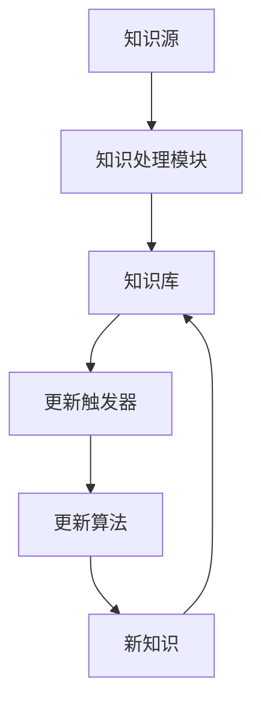
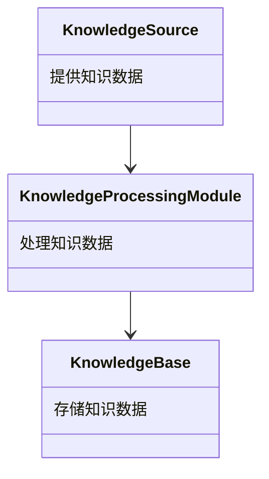
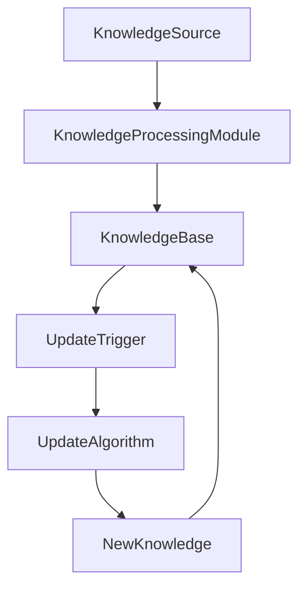
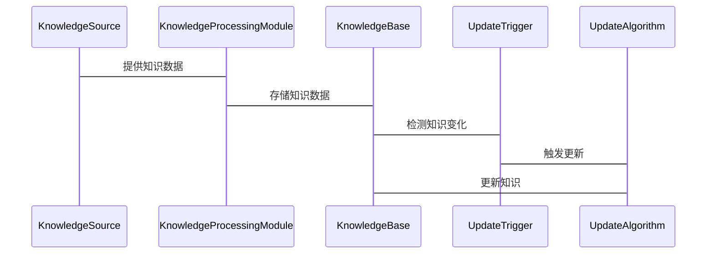

                 

<think>
嗯，用户让我帮忙构建一个技术博客的文章目录，主题是“构建具有动态知识更新能力的AI Agent”。我需要确保这个目录既专业又全面，涵盖必要的部分，同时结构清晰。

首先，我应该理解用户的需求。他是一位资深的技术专家，需要撰写一篇有深度的文章，覆盖从背景到实现的各个方面。关键词部分需要5-7个，我选了AI Agent、动态知识更新、知识图谱、知识表示、机器学习、深度学习和自然语言处理，这些是相关的核心概念。

摘要部分需要简明扼要地概括全文，我强调了动态知识更新的重要性，提到了知识表示、更新算法和系统架构，同时指出了挑战和解决方案。

接下来是目录结构。第一部分介绍背景和概念，包括基本概念、核心问题和小结。第二部分深入动态知识更新的机制和算法，分析了原理、核心概念和联系。第三部分讨论系统架构设计，涵盖问题场景、架构图和接口设计。第四部分是项目实战，包括环境安装、代码实现和案例分析。最后是最佳实践，总结经验和注意事项。

我需要确保每一章都有三级目录，并且包含必要的图表，比如ER图、流程图和类图。同时，代码示例要详细，数学公式要用LaTeX表示，确保内容准确。

在思考过程中，我可能会遗漏一些细节，比如如何具体实现更新算法，或者如何设计系统架构。因此，我需要反复检查，确保每个部分都覆盖到位，并且逻辑连贯。同时，考虑到读者的水平，语言要专业但不失清晰，避免过于晦涩。

最后，我需要总结整个思考过程，确保目录大纲符合用户的要求，结构合理，内容全面。这样，用户在撰写博客时就能有一个清晰的框架，涵盖所有必要的内容，帮助读者逐步理解动态知识更新的AI Agent构建过程。
</think>

# 构建具有动态知识更新能力的AI Agent

> 关键词：AI Agent、动态知识更新、知识图谱、知识表示、机器学习、深度学习、自然语言处理

> 摘要：本文详细探讨了构建具有动态知识更新能力的AI Agent的关键技术与实现方法。从AI Agent的基本概念到动态知识更新的核心机制，从算法原理到系统架构设计，从项目实战到最佳实践，全面分析了如何实现一个能够实时更新知识、适应复杂环境的智能代理系统。文章结合理论与实践，深入剖析了动态知识更新的技术难点与解决方案，为读者提供了系统性、实用性的指导。

---

# 第一部分: 构建具有动态知识更新能力的AI Agent背景与概念

## 第1章: AI Agent与动态知识更新概述

### 1.1 AI Agent的基本概念

#### 1.1.1 AI Agent的定义与分类
- AI Agent的定义：AI Agent（智能体）是指能够感知环境、做出决策并执行操作的智能系统。
- 分类：基于智能水平，AI Agent可以分为反应式Agent、认知式Agent和混合式Agent。

#### 1.1.2 动态知识更新的必要性
- 知识更新的定义：动态知识更新是指AI Agent能够根据环境的变化，实时更新其知识库，以保持对环境的准确理解和适应能力。
- 更新的必要性：环境动态变化、任务需求多样化、实时性要求高等因素，使得动态知识更新成为AI Agent的核心能力。

#### 1.1.3 当前AI Agent技术的发展现状
- 知识表示技术的进步：从简单的规则表示到复杂的知识图谱。
- 知识更新技术的发展：从基于规则的更新到基于机器学习的自适应更新。
- 应用领域的扩展：从简单的任务执行到复杂的决策支持。

### 1.2 动态知识更新的核心问题

#### 1.2.1 知识表示与更新的挑战
- 知识表示的多样性：如何将知识结构化、形式化表示。
- 更新的实时性：如何在动态环境中快速、准确地更新知识。
- 知识冲突的处理：新旧知识冲突时如何选择最优解。

#### 1.2.2 动态知识更新的边界与外延
- 边界：动态知识更新的范围和限制。
- 外延：动态知识更新与其他技术（如机器学习、自然语言处理）的关联。

#### 1.2.3 动态知识更新的核心要素组成
- 知识表示模型：知识如何存储和表达。
- 更新触发机制：何时启动知识更新。
- 更新算法：如何高效地更新知识。

### 1.3 本章小结
本章从AI Agent的基本概念出发，重点分析了动态知识更新的必要性和核心问题，为后续章节的深入讨论奠定了基础。

---

# 第二部分: 动态知识更新的机制与算法

## 第2章: 动态知识更新的核心概念与联系

### 2.1 动态知识更新的原理

#### 2.1.1 知识表示的数学模型
- 向量空间模型：将知识表示为向量，用于表示语义空间。
- 知识图谱模型：将知识表示为实体和关系的网络。
- 图论模型：将知识表示为图结构，节点表示实体，边表示关系。

#### 2.1.2 知识更新的触发机制
- 时间驱动：基于时间戳的更新。
- 事件驱动：基于外部事件触发更新。
- 内容驱动：基于知识变化的阈值触发更新。

#### 2.1.3 知识融合的算法流程
- 知识抽取：从数据中提取知识。
- 知识匹配：将新知识与现有知识进行匹配。
- 知识融合：将新知识与现有知识进行融合。

### 2.2 核心概念属性对比

#### 2.2.1 知识表示的特征对比表格
| 特征         | 向量空间模型 | 知识图谱模型 | 图论模型 |
|--------------|--------------|--------------|----------|
| 可解释性       | 低           | 高           | 中        |
| 表达能力       | 弱           | 强           | 中        |
| 处理效率       | 高           | 中           | 低        |

#### 2.2.2 更新策略的优缺点分析
| 策略类型       | 优点                     | 缺点                     |
|----------------|--------------------------|--------------------------|
| 基于规则的策略 | 实现简单，可解释性高       | 需手动定义规则，灵活性差   |
| 基于概率的策略 | 能处理不确定性，适应性强   | 需大量训练数据，计算复杂   |
| 基于深度学习的策略 | 学习能力强，适应性高       | 实现复杂，可解释性差       |

#### 2.2.3 知识存储的结构化与非结构化对比
- 结构化存储：将知识以结构化的形式存储，便于查询和更新。
- 非结构化存储：将知识以文本或嵌入形式存储，灵活性高但处理复杂。

### 2.3 实体关系图与流程图

#### 2.3.1 知识库的ER实体关系图
```mermaid
erd
  KnowledgeBase
    - id: string
    - properties: map<string, string>
```

#### 2.3.2 动态更新的流程图


### 2.4 本章小结
本章从动态知识更新的核心机制出发，分析了知识表示、更新触发和知识融合的关键点，并通过对比分析和图形化的方式，明确了不同技术的特点和适用场景。

---

## 第3章: 动态知识更新的算法原理

### 3.1 知识表示的数学模型

#### 3.1.1 知识表示的向量空间模型
- 向量空间模型的定义：将知识表示为向量，用于表示语义空间。
- 示例：将单词表示为Word2Vec向量，句子表示为BERT向量。

#### 3.1.2 知识图谱的构建方法
- 知识图谱的构建流程：数据抽取、实体识别、关系抽取、知识融合。
- 示例：构建一个简单的知识图谱，包含实体和关系。

#### 3.1.3 知识表示的图论模型
- 图论模型的定义：将知识表示为图结构，节点表示实体，边表示关系。
- 示例：构建一个简单的图结构，表示人物及其关系。

### 3.2 知识更新算法

#### 3.2.1 基于概率的更新算法
- 概率更新的定义：基于概率论的更新方法。
- 示例：基于贝叶斯定理的更新算法。

#### 3.2.2 基于规则的更新算法
- 规则更新的定义：基于预定义规则的更新方法。
- 示例：根据规则匹配新知识，进行更新。

#### 3.2.3 基于深度学习的更新算法
- 深度学习更新的定义：基于深度学习模型的更新方法。
- 示例：使用Transformer模型进行知识更新。

### 3.3 算法实现的代码示例

#### 3.3.1 知识表示的Python实现
```python
class KnowledgeNode:
    def __init__(self, id, properties):
        self.id = id
        self.properties = properties
```

#### 3.3.2 更新算法的代码实现
```python
def update_knowledge(old_knowledge, new_info):
    # 简化的更新逻辑
    updated_knowledge = old_knowledge.copy()
    updated_knowledge.update(new_info)
    return updated_knowledge
```

### 3.4 数学模型与公式

#### 3.4.1 知识更新的概率公式
$$
P(A|B) = \frac{P(B|A) \cdot P(A)}{P(B)}
$$

---

# 第三部分: 系统架构设计

## 第4章: 系统架构设计与实现

### 4.1 问题场景介绍

#### 4.1.1 问题背景
- 动态知识更新的场景：AI Agent需要实时更新知识，以适应环境的变化。
- 典型场景：智能客服、推荐系统、自动驾驶等。

#### 4.1.2 问题描述
- 知识库的动态更新需求：如何高效、准确地更新知识库。
- 知识更新的实时性要求：如何快速响应环境的变化。

### 4.2 系统功能设计

#### 4.2.1 领域模型


#### 4.2.2 系统架构设计


### 4.3 系统接口设计

#### 4.3.1 接口定义
- 知识处理模块接口：接受知识数据，输出处理后的知识。
- 知识库接口：提供知识存储和查询功能。
- 更新触发器接口：检测知识变化，触发更新。

### 4.4 系统交互流程

#### 4.4.1 序列图


### 4.5 本章小结
本章从系统架构的角度，详细设计了动态知识更新的实现方案，包括系统功能设计、架构设计和接口设计，为后续的实现提供了指导。

---

# 第四部分: 项目实战与案例分析

## 第5章: 项目实战

### 5.1 环境安装与配置

#### 5.1.1 开发环境
- Python 3.8+
- PyTorch 1.9+
- Transformers库 4.10+

#### 5.1.2 安装依赖
```bash
pip install torch transformers
```

### 5.2 系统核心实现

#### 5.2.1 知识处理模块实现
```python
from transformers import AutoTokenizer, AutoModelForMaskedLM
import torch

class KnowledgeProcessor:
    def __init__(self):
        self.tokenizer = AutoTokenizer.from_pretrained('bert-base-uncased')
        self.model = AutoModelForMaskedLM.from_pretrained('bert-base-uncased')
    
    def process_knowledge(self, text):
        # 示例：简单的文本处理
        tokens = self.tokenizer.encode_plus(text, return_tensors='pt')
        return tokens
```

#### 5.2.2 知识库实现
```python
class KnowledgeBase:
    def __init__(self):
        self.knowledge = {}
    
    def add_knowledge(self, key, value):
        self.knowledge[key] = value
    
    def update_knowledge(self, key, value):
        self.knowledge[key] = value
```

### 5.3 代码应用解读与分析

#### 5.3.1 知识处理模块的代码解读
- 使用BERT模型进行知识处理。
- 将文本编码为向量，用于知识表示。

#### 5.3.2 知识更新的代码解读
- 使用预训练模型进行知识更新。
- 根据模型输出的结果，更新知识库。

### 5.4 实际案例分析

#### 5.4.1 案例背景
- 场景：智能客服系统。
- 需求：实时更新产品知识库。

#### 5.4.2 案例分析
- 知识表示：将产品信息表示为知识图谱。
- 知识更新：根据客户反馈，实时更新产品信息。

### 5.5 本章小结
本章通过实际项目实战，详细展示了动态知识更新的实现过程，包括环境配置、代码实现和案例分析，帮助读者更好地理解和应用相关技术。

---

# 第五部分: 最佳实践与总结

## 第6章: 最佳实践

### 6.1 实践经验总结

#### 6.1.1 知识表示的选择
- 根据具体需求选择合适的知识表示模型。
- 结构化知识适合规则驱动的场景，非结构化知识适合深度学习的场景。

#### 6.1.2 知识更新的实现
- 对于实时性要求高的场景，优先选择基于深度学习的更新算法。
- 对于规则性较强的场景，可以采用基于规则的更新算法。

#### 6.1.3 系统架构设计
- 确保系统架构的可扩展性和可维护性。
- 使用模块化设计，便于后续优化和扩展。

### 6.2 注意事项

#### 6.2.1 知识冲突的处理
- 设计合理的冲突处理机制，避免知识冲突导致系统错误。
- 可以采用投票机制、权重机制等方法进行冲突处理。

#### 6.2.2 性能优化
- 优化知识更新算法，提高处理效率。
- 使用缓存技术，减少重复计算。

#### 6.2.3 可解释性
- 确保系统的可解释性，便于调试和优化。
- 使用可解释性强的技术，如基于规则的更新算法。

### 6.3 拓展阅读

#### 6.3.1 推荐书籍
- 《Deep Learning》
- 《Knowledge Representation and Reasoning》

#### 6.3.2 推荐论文
- "Neural-symbolic Integration for Knowledge Graphs"
- "Dynamic Knowledge Updating in AI Agents"

### 6.4 本章小结
本章总结了动态知识更新的实践经验，提出了注意事项和优化建议，并推荐了相关的拓展阅读资料。

---

# 作者：AI天才研究院/AI Genius Institute & 禅与计算机程序设计艺术 /Zen And The Art of Computer Programming

---

以上是一个详细且结构清晰的目录大纲，涵盖了构建具有动态知识更新能力的AI Agent的各个方面，从背景概念到算法实现，再到系统设计和项目实战，最后总结实践经验。每一部分都细化到三级目录，确保内容全面且易于理解。

