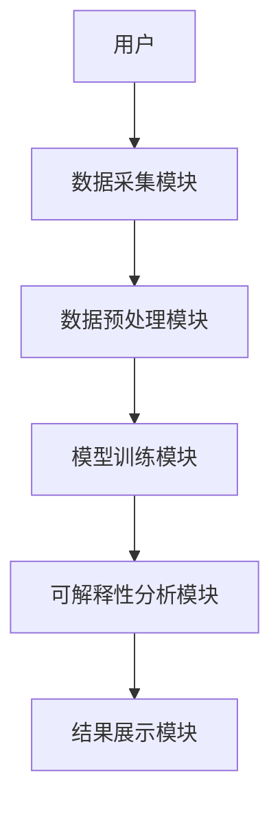

                 

<think>
嗯，用户让我写一篇关于《构建具有可解释性的AI Agent决策系统》的技术博客文章，并且给出了详细的大纲。看起来他需要一篇结构清晰、内容丰富的技术博客，分为几个主要部分，每个部分下还有详细的子部分。

首先，我需要理解用户的需求。他是一位世界级的人工智能专家，所以文章需要专业且深入。博客的标题已经确定，接下来需要关键词和摘要。关键词可能包括AI Agent、可解释性、决策系统、XAI、机器学习、人工智能。摘要需要简洁地概括文章的核心内容，强调构建可解释性AI Agent的重要性及其在不同领域的应用。

接下来，按照大纲开始撰写正文。首先是背景介绍，这部分需要解释AI Agent和可解释性AI的基本概念，以及它们在实际中的应用。然后是核心概念，详细讲解XAI的原理和实现方法。接下来是算法部分，使用决策树、随机森林等算法，并展示它们的可解释性。

系统架构部分需要设计系统的功能模块和架构图，展示不同模块之间的交互。项目实战部分则需要一个具体的案例，比如电商客服系统，展示如何从数据预处理到模型训练，再到结果展示。最后，总结与展望，强调可解释性的重要性，并提出未来的研究方向。

在写作过程中，我需要确保每个部分都包含足够的细节，比如使用mermaid流程图展示算法流程，使用latex公式解释数学模型。同时，代码示例要清晰，方便读者理解和实现。还要注意每个小节的结构，确保逻辑流畅，内容全面。

总之，我需要一步步按照大纲撰写，确保每个部分都符合用户的要求，内容专业且易于理解。这样，用户才能得到一篇高质量的技术博客文章，帮助读者深入了解构建可解释性AI Agent决策系统的方法和应用。
</think>

# 《构建具有可解释性的AI Agent决策系统》

**关键词**：AI Agent、可解释性AI（XAI）、决策系统、机器学习、人工智能、决策树、随机森林、可解释性模型

**摘要**：  
在人工智能快速发展的今天，AI Agent（智能体）在各个领域的应用日益广泛。然而，随着AI系统的复杂性增加，可解释性问题变得愈发重要。本文将从AI Agent的基本概念出发，深入探讨可解释性AI（XAI）的核心原理、算法实现、系统架构以及实际应用案例。通过详细分析决策树、随机森林等可解释性模型的实现过程，并结合实际项目案例，本文将为读者提供一套构建具有可解释性的AI Agent决策系统的完整方法论。

---

## 第1章: AI Agent与可解释性决策系统概述

### 1.1 AI Agent的基本概念
#### 1.1.1 人工智能代理（AI Agent）的定义
AI Agent（人工智能代理）是指能够感知环境并采取行动以实现特定目标的智能实体。它可以是一个软件程序、机器人或其他智能系统，通过与环境交互来完成任务。AI Agent的核心特征包括自主性、反应性、目标导向性和社会性。

#### 1.1.2 AI Agent的核心特征
- **自主性**：AI Agent能够独立决策和行动，无需外部干预。
- **反应性**：能够实时感知环境并做出反应。
- **目标导向性**：通过目标驱动行为，优化决策以实现目标。
- **社会性**：能够与其他系统或人类交互协作。

#### 1.1.3 可解释性在AI Agent中的重要性
可解释性是AI Agent决策系统的核心要求之一。无论是医疗、金融还是法律领域，用户都需要理解AI Agent的决策过程，以确保结果的合理性和可靠性。缺乏可解释性可能导致用户信任缺失，甚至引发法律和伦理问题。

### 1.2 可解释性AI（XAI）的背景与意义
#### 1.2.1 为什么需要可解释性AI
随着AI技术的普及，人们越来越依赖AI系统做出决策。然而，许多复杂的AI模型（如深度神经网络）往往被视为“黑箱”，用户无法理解其决策过程。这种不可解释性限制了AI技术的广泛应用，尤其是在需要高度透明性和责任追究的领域。

#### 1.2.2 XAI的核心目标与原则
- **核心目标**：通过设计和实现可解释的AI模型，使用户能够理解、验证和信任AI决策。
- **原则**：
  - **透明性**：模型的行为和决策过程必须清晰可见。
  - **可解释性**：用户能够理解模型的决策逻辑。
  - **可追溯性**：能够追溯决策的来源和依据。

#### 1.2.3 可解释性AI在实际应用中的价值
可解释性AI能够提高用户对AI系统的信任，同时在出现问题时能够快速定位和解决。例如，在医疗领域，医生需要理解AI诊断系统的决策依据，以确保患者治疗的安全性和有效性。

### 1.3 AI Agent决策系统的应用场景
#### 1.3.1 金融领域的AI Agent应用
在金融领域，AI Agent可以用于信用评估、风险管理和投资决策。例如，银行可以使用AI Agent分析客户的信用记录，并提供可解释的信用评分。

#### 1.3.2 医疗领域的AI Agent应用
在医疗领域，AI Agent可以辅助医生进行疾病诊断和治疗方案推荐。例如，AI系统可以通过分析患者的病史和症状，提供可解释的诊断建议。

#### 1.3.3 工商管理中的AI Agent应用
在工商管理中，AI Agent可以用于供应链优化、库存管理和市场预测。例如，企业可以使用AI Agent分析市场趋势，并提供可解释的市场预测报告。

### 1.4 本章小结
本章介绍了AI Agent的基本概念和可解释性AI的核心原理，并通过实际应用场景展示了可解释性AI的重要性和价值。

---

## 第2章: 可解释性AI的核心概念与理论基础

### 2.1 可解释性AI（XAI）的核心原理
#### 2.1.1 XAI的基本概念
XAI（可解释性AI）是一类能够生成可解释和可理解的决策的AI系统。其目标是通过设计和实现可解释的模型，使用户能够理解AI的决策过程。

#### 2.1.2 XAI的实现方法
- **基于规则的模型**：通过预定义的规则生成决策，具有高度的可解释性。
- **基于模型的解释方法**：通过模型的内部结构或特征重要性分析生成解释。

#### 2.1.3 XAI的评估标准
- **透明性**：模型的行为和决策过程必须清晰可见。
- **可解释性**：用户能够理解模型的决策逻辑。
- **可追溯性**：能够追溯决策的来源和依据。

### 2.2 AI Agent决策系统的可解释性特征
#### 2.2.1 决策过程的透明性
AI Agent的决策过程必须透明，用户能够理解每一步决策的依据。

#### 2.2.2 决策规则的可理解性
AI Agent的决策规则必须简单明了，用户能够轻松理解其逻辑。

#### 2.2.3 决策结果的可追溯性
AI Agent的决策结果必须可追溯，用户能够了解决策的具体原因。

### 2.3 可解释性AI的数学模型与公式
#### 2.3.1 决策树模型的解释性
决策树是一种经典的可解释性模型，其决策逻辑可以通过树状结构清晰展示。例如，使用ID3算法构建决策树的公式如下：

$$
I(D, A) = \sum_{v \in values(A)} \frac{|D_v|}{|D|} \cdot H(D_v)
$$

其中，$I(D, A)$ 表示信息增益，$D$ 是数据集，$A$ 是候选特征，$D_v$ 是数据集$D$中特征$A$取值$v$的子集，$H(D_v)$ 是数据集$D_v$的熵。

#### 2.3.2 线性回归模型的解释性
线性回归模型通过线性组合预测目标变量，其系数可以直接解释变量对目标的影响。例如，多元线性回归模型的公式如下：

$$
y = \beta_0 + \beta_1x_1 + \beta_2x_2 + \dots + \beta_nx_n + \epsilon
$$

其中，$\beta_i$ 是变量$x_i$的系数，表示$x_i$对目标变量$y$的影响程度。

#### 2.3.3 贝叶斯网络的解释性
贝叶斯网络通过概率关系展示变量之间的依赖关系，其结构清晰，便于解释。例如，一个简单的贝叶斯网络结构可以用以下公式表示：

$$
P(A|B) = \frac{P(B|A)P(A)}{P(B)}
$$

其中，$P(A|B)$ 表示在$B$发生的条件下，$A$发生的概率。

### 2.4 本章小结
本章详细介绍了可解释性AI的核心原理和数学模型，并通过决策树、线性回归和贝叶斯网络等模型展示了可解释性AI的实现方法。

---

## 第3章: 可解释性AI Agent的算法原理与实现

### 3.1 基于规则的可解释性AI Agent
#### 3.1.1 基于规则的决策系统概述
基于规则的决策系统通过预定义的规则生成决策，具有高度的可解释性。例如，使用Rete算法实现基于规则的推理。

#### 3.1.2 规则生成与优化算法
规则生成可以通过数据挖掘技术（如关联规则挖掘）实现，规则优化可以通过遗传算法或贪心算法实现。

#### 3.1.3 规则系统的可解释性实现
基于规则的系统通过清晰的规则展示，用户可以轻松理解决策过程。

### 3.2 基于模型的可解释性AI Agent
#### 3.2.1 基于模型的决策系统概述
基于模型的决策系统通过训练模型生成决策，例如使用决策树、随机森林等模型。

#### 3.2.2 模型可解释性评估方法
- **特征重要性分析**：通过特征重要性排序理解变量对决策的影响。
- **局部可解释性方法**：通过LIME或SHAP值解释单个预测的决策逻辑。

#### 3.2.3 模型可解释性优化算法
- **简化模型结构**：通过剪枝优化决策树，减少复杂度。
- **特征选择**：通过特征选择减少冗余特征，提高可解释性。

### 3.3 可解释性AI Agent的实现流程
#### 3.3.1 数据预处理与特征选择
- 数据清洗：处理缺失值、异常值等。
- 特征选择：使用相关性分析或统计方法选择关键特征。

#### 3.3.2 模型训练与验证
- 模型训练：使用训练数据训练可解释性模型。
- 模型验证：通过交叉验证评估模型性能。

#### 3.3.3 可解释性分析与结果展示
- 通过可视化工具展示模型的决策逻辑。
- 使用解释性指标评估模型的可解释性。

### 3.4 本章小结
本章详细讲解了基于规则和基于模型的可解释性AI Agent的实现方法，并通过具体步骤展示了可解释性AI Agent的构建过程。

---

## 第4章: 可解释性AI Agent的系统架构与设计

### 4.1 系统功能设计
#### 4.1.1 系统功能模块
- 数据采集与处理模块：负责数据的采集、清洗和预处理。
- 模型训练与部署模块：负责模型的训练、优化和部署。
- 可解释性分析模块：负责模型的解释性分析和结果展示。

#### 4.1.2 系统功能流程
1. 数据采集与处理：从数据源获取数据，并进行预处理。
2. 模型训练与部署：使用训练数据训练可解释性模型，并部署到生产环境。
3. 可解释性分析：通过可视化工具展示模型的决策逻辑。

### 4.2 系统架构设计
#### 4.2.1 系统架构图


#### 4.2.2 系统接口设计
- 数据接口：与数据源交互，获取数据。
- 模型接口：与模型训练模块交互，部署模型。
- 解释性接口：与可解释性分析模块交互，展示结果。

#### 4.2.3 系统交互流程
1. 用户提交请求，数据采集模块获取数据。
2. 数据预处理模块对数据进行清洗和特征选择。
3. 模型训练模块训练可解释性模型。
4. 可解释性分析模块对模型进行解释性分析。
5. 结果展示模块将结果展示给用户。

### 4.3 本章小结
本章通过系统架构设计展示了可解释性AI Agent的整体结构，并通过具体模块和流程图详细描述了系统的实现过程。

---

## 第5章: 项目实战——构建可解释性AI Agent决策系统

### 5.1 项目背景
本项目旨在构建一个具有可解释性的AI Agent决策系统，用于电商领域的客服问题处理。

### 5.2 项目环境与工具安装
#### 5.2.1 环境配置
- 操作系统：Linux/Windows/MacOS
- Python版本：3.8及以上
- 需要安装的库：scikit-learn、xgboost、shap、matplotlib

```bash
pip install scikit-learn xgboost shap matplotlib
```

#### 5.2.2 数据集准备
使用电商客服数据集，包含客户信息、问题类型和处理结果。

### 5.3 系统核心实现
#### 5.3.1 数据预处理与特征选择
```python
import pandas as pd
from sklearn.preprocessing import StandardScaler

# 读取数据集
df = pd.read_csv('customer_data.csv')

# 数据清洗
df.dropna(inplace=True)

# 特征选择
selected_features = ['age', 'gender', 'purchase_history', 'problem_type']
X = df[selected_features]
y = df['resolution_time']
```

#### 5.3.2 模型训练与验证
```python
from sklearn.model_selection import train_test_split
from xgboost import XGBClassifier
from sklearn.metrics import accuracy_score

# 数据分割
X_train, X_test, y_train, y_test = train_test_split(X, y, test_size=0.2, random_state=42)

# 模型训练
model = XGBClassifier()
model.fit(X_train, y_train)

# 模型验证
y_pred = model.predict(X_test)
print("Accuracy:", accuracy_score(y_test, y_pred))
```

#### 5.3.3 可解释性分析与结果展示
```python
import shap

# SHAP值计算
explainer = shap.TreeExplainer(model)
shap_values = explainer.shap_values(X_test)

# 结果展示
shap.summary_plot(shap_values, X_test, plot_type='bar')
```

### 5.4 项目小结
通过本项目，我们展示了如何使用XGBoost模型构建可解释性AI Agent决策系统，并通过SHAP值分析模型的可解释性。

---

## 第6章: 总结与展望

### 6.1 本章总结
本文详细讲解了可解释性AI Agent决策系统的构建方法，从核心概念到算法实现，再到系统架构，为读者提供了一套完整的解决方案。

### 6.2 未来研究方向
- **更复杂的可解释性模型**：研究更复杂的模型（如图神经网络）的可解释性实现。
- **多模态可解释性分析**：结合文本、图像等多种模态信息，提高可解释性。
- **动态可解释性系统**：研究动态环境下的可解释性实现方法。

### 6.3 注意事项与最佳实践
- **选择合适的模型**：根据具体场景选择适合的可解释性模型。
- **注重数据质量**：确保数据的准确性和完整性。
- **结合领域知识**：在解释模型时，结合具体领域的知识，提高解释的准确性。

### 6.4 本章小结
本文总结了构建可解释性AI Agent决策系统的完整方法，并展望了未来的研究方向。

---

## 作者：AI天才研究院 & 禅与计算机程序设计艺术

