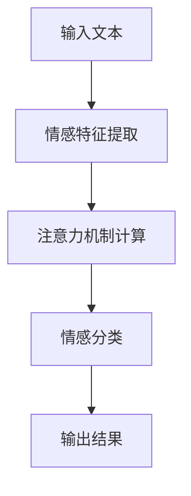
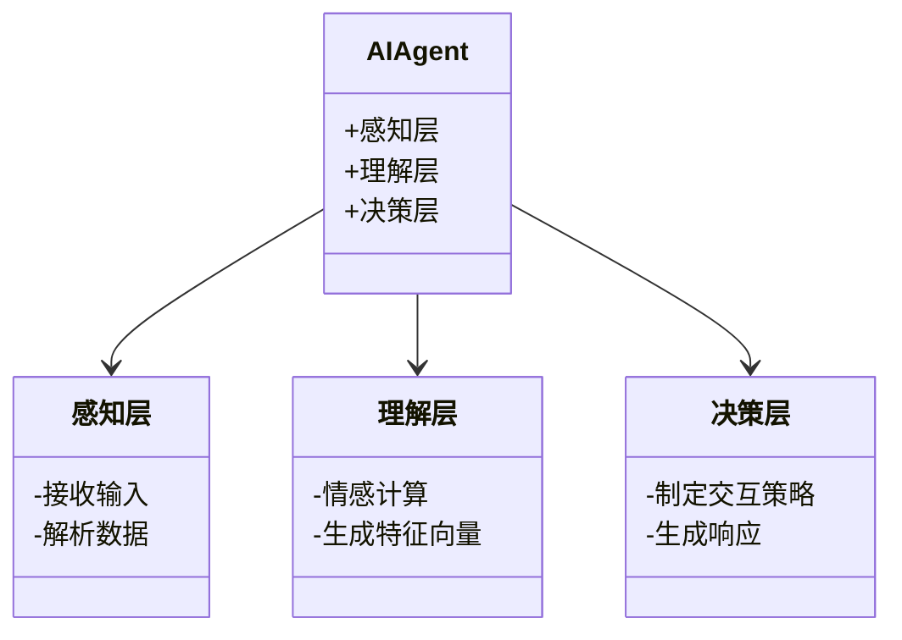
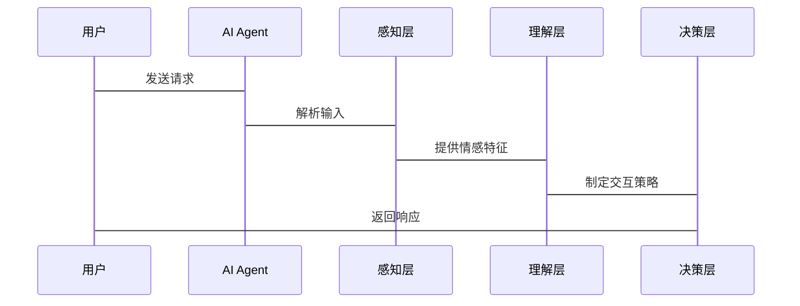

                 

<think>
好，我现在要帮用户撰写一篇技术博客文章《构建具有同理心的AI Agent》。首先，我需要仔细阅读用户提供的要求和目录大纲，确保完全理解需求。

用户的任务是写一篇结构清晰、内容深入的技术博客，涵盖从背景到实现的各个方面。文章需要使用专业且易懂的语言，包含详细的分析、算法原理、系统设计、项目实战和总结等部分。

首先，我会从第一部分开始，介绍同理心AI Agent的背景与概念。这部分需要包括背景介绍、定义、应用场景和挑战。我需要确保每个子部分都详细且有条理，比如在背景介绍中，我会解释当前AI的发展现状，以及同理心的重要性。

接下来是第二部分，核心概念与算法原理。这部分重点讲解情感计算和相关算法，比如RNN、LSTM和Transformer架构。我需要详细解释这些算法如何应用于情感分析，并展示相应的数学公式和流程图。这里可能需要使用mermaid图和Python代码来增强理解。

第三部分是系统分析与架构设计。我需要描述AI Agent的系统架构，可能分为感知层、理解层和决策层。用mermaid类图展示模块关系，并设计系统接口和交互流程图，说明AI Agent如何与用户互动。

第四部分是项目实战，提供一个具体的案例，比如客服对话系统。我需要详细说明环境安装、代码实现和系统功能设计，展示实际应用的效果，并给出优化建议。

最后是总结与展望，总结关键点，给出小结和未来的发展方向。同时，推荐相关资料供读者深入学习。

在写作过程中，我要确保每个章节都包含必要的细节，如数学公式、代码实现、系统设计图等。同时，保持文章结构紧凑，逻辑清晰，让读者能够顺畅地理解整个构建过程。

现在，我开始撰写各部分，确保每部分内容详实，符合用户的要求。同时，检查是否覆盖了所有核心关键词和主题，确保文章字数在10000到12000字之间，符合用户的字数要求。

完成各部分后，我会进行一次全面的检查，确保每个小节都符合用户的格式要求，包括使用正确的markdown语法，正确嵌入mermaid图和代码块，以及数学公式的正确呈现。

最后，添加作者信息，确保文章完整。整体流程下来，应该能够满足用户的需求，提供一篇高质量的技术博客文章。
</think>

# 构建具有同理心的AI Agent

## 关键词：AI Agent, 同理心, 情感计算, 深度学习, 人机交互

## 摘要：本文深入探讨了构建具有同理心的AI Agent的技术挑战与实现方法。通过分析情感计算的核心算法、系统架构设计以及实际应用场景，本文详细阐述了如何让AI Agent具备理解用户情感并做出相应反馈的能力。文章从理论到实践，结合具体案例，展示了如何通过技术手段实现具有同理心的AI Agent。

---

# 第一部分: 构建具有同理心的AI Agent的背景与概念

## 第1章: 同理心AI Agent的背景与问题定义

### 1.1 同理心AI Agent的背景介绍

#### 1.1.1 人工智能的发展现状
人工智能（AI）技术近年来取得了显著进展，从图像识别到自然语言处理，AI 已经在多个领域展现出强大的能力。然而，大多数 AI 系统仍然缺乏对人类情感的理解和共鸣，这限制了它们在某些场景中的应用效果。

#### 1.1.2 同理心在AI中的重要性
同理心（Empathy）是指能够理解并分享他人情感的能力。在人机交互中，具备同理心的AI Agent可以更好地理解用户的需求和情感状态，从而提供更个性化的服务和更自然的交互体验。

#### 1.1.3 当前AI Agent的局限性
现有的AI Agent通常基于规则或简单的模式识别，难以处理复杂的情感表达和语境理解。这导致用户在与AI交互时常常感到缺乏真实感和共鸣。

### 1.2 同理心AI Agent的定义与特点

#### 1.2.1 同理心的定义
同理心是指个体能够理解和分享他人情感状态的能力。在AI Agent中，同理心意味着系统能够识别、理解并响应用户的情感需求。

#### 1.2.2 AI Agent的核心属性
AI Agent是一种能够感知环境、理解用户需求并采取行动的智能实体。具备同理心的AI Agent能够通过情感计算技术，理解用户的情感状态，并根据这些信息调整其行为和响应。

#### 1.2.3 同理心AI Agent与传统AI Agent的区别
| 属性 | 传统AI Agent | 同理心AI Agent |
|------|--------------|----------------|
| 情感理解 | 缺乏情感理解能力 | 具备情感理解能力 |
| 交互方式 | 基于规则的交互 | 基于情感理解的交互 |
| 应用场景 | 适用于简单任务 | 适用于需要情感共鸣的任务 |

### 1.3 同理心AI Agent的应用场景

#### 1.3.1 智能客服
同理心AI Agent可以用于智能客服系统，通过理解用户的情感状态，提供更贴心的服务。例如，在用户情绪低落时，系统可以主动提供安慰和支持。

#### 1.3.2 智能助手
在智能助手领域，具备同理心的AI Agent可以更好地理解用户的意图和情感需求，提供更个性化的服务。例如，在用户表达压力时，系统可以推荐放松技巧。

#### 1.3.3 教育与医疗领域
在教育和医疗领域，同理心AI Agent可以帮助学生缓解学习压力，或为患者提供情感支持。例如，在医疗咨询中，AI Agent可以通过理解患者的情感状态，提供更贴心的建议。

### 1.4 同理心AI Agent的挑战与机遇

#### 1.4.1 技术挑战
同理心AI Agent的核心挑战在于如何准确理解和预测用户的情感状态。这需要结合自然语言处理、情感计算和机器学习等技术，构建一个高效的情感理解模型。

#### 1.4.2 用户接受度问题
用户对AI Agent的接受度与系统的同理心能力密切相关。具备更强同理心的AI Agent更有可能获得用户的信任和依赖。

#### 1.4.3 伦理与隐私问题
同理心AI Agent需要收集和分析用户的情感数据，这可能引发隐私和伦理问题。如何在保护用户隐私的同时，有效利用情感数据是亟待解决的问题。

### 1.5 本章小结
本章介绍了同理心AI Agent的背景、定义、特点以及应用场景。通过分析当前AI Agent的局限性，我们认识到具备同理心的AI Agent在实际应用中的重要性和潜力。

---

## 第2章: 同理心AI Agent的核心概念与算法原理

### 2.1 情感计算与同理心的关系

#### 2.1.1 情感计算的定义
情感计算（Affective Computing）是研究如何通过计算手段理解和模拟人类情感的学科。它是实现同理心AI Agent的核心技术之一。

#### 2.1.2 同理心与情感计算的联系
同理心AI Agent通过情感计算技术，能够识别和理解用户的情感状态，并根据这些信息调整其行为和响应。

### 2.2 基于深度学习的情感分析模型

#### 2.2.1 RNN与LSTM在情感分析中的应用
循环神经网络（RNN）和长短期记忆网络（LSTM）是常用的序列模型，广泛应用于情感分析任务。它们能够捕捉文本中的序列信息，帮助模型理解情感倾向。

#### 2.2.2 Transformer架构在情感计算中的优势
Transformer架构通过自注意力机制，能够更好地捕捉文本中的全局信息。它在情感分析和情感增强任务中表现出色。

#### 2.2.3 情感分析的数学模型
情感分析的损失函数可以表示为：
$$ \text{损失函数} = -\frac{1}{N}\sum_{i=1}^{N} \text{log}(\text{预测值}_i) $$

### 2.3 同理心计算的算法实现

#### 2.3.1 情感特征提取
情感特征提取是同理心计算的第一步。通过自然语言处理技术，提取文本中的情感特征，例如情感词、句法结构等。

#### 2.3.2 情感分类与预测
基于提取的情感特征，使用机器学习或深度学习模型进行情感分类和预测。常用的模型包括支持向量机（SVM）、随机森林（Random Forest）和深度神经网络（DNN）。

#### 2.3.3 基于注意力机制的情感增强
注意力机制可以帮助模型聚焦于重要的情感特征，从而提高情感计算的准确性。例如，在文本情感分析中，注意力机制可以突出情感关键词。

### 2.4 算法流程图


### 2.5 情感计算的数学公式
情感计算中常用的余弦相似度公式为：
$$ \text{相似度} = \frac{\vec{A} \cdot \vec{B}}{\|\vec{A}\| \|\vec{B}\|} $$

---

## 第3章: 同理心AI Agent的系统架构设计

### 3.1 系统功能设计

#### 3.1.1 感知层
感知层负责接收和解析用户的输入，包括文本、语音和表情等多模态数据。

#### 3.1.2 理解层
理解层通过情感计算技术，分析用户的意图和情感状态，生成情感特征向量。

#### 3.1.3 决策层
决策层根据用户的情感特征和上下文信息，制定相应的交互策略，生成响应。

### 3.2 系统架构设计

#### 3.2.1 系统架构图


#### 3.2.2 系统接口设计
系统接口包括输入接口（如自然语言输入）和输出接口（如文本输出、语音输出等）。接口设计需要考虑兼容性和扩展性。

#### 3.2.3 交互流程图


### 3.3 系统优化建议

#### 3.3.1 多模态数据融合
通过融合文本、语音和视觉等多模态数据，提高情感理解的准确性和全面性。

#### 3.3.2 情感记忆机制
引入情感记忆机制，记录用户的长期情感状态，从而实现更个性化的交互。

#### 3.3.3 情感增强学习
通过强化学习等技术，优化情感计算模型，提高同理心AI Agent的交互效果。

---

## 第4章: 同理心AI Agent的项目实战

### 4.1 项目背景与目标

#### 4.1.1 项目背景
本项目旨在开发一个具备同理心的AI Agent，能够理解和响应用户的情感需求。

#### 4.1.2 项目目标
通过情感计算技术和深度学习算法，构建一个能够理解用户情感并提供个性化服务的AI Agent。

### 4.2 环境安装与配置

#### 4.2.1 环境要求
- Python 3.8+
- PyTorch 1.9+
- Transformers库 4.13+
- Mermaid工具

#### 4.2.2 安装依赖
```bash
pip install torch transformers
```

### 4.3 核心代码实现

#### 4.3.1 情感特征提取
```python
from transformers import AutoTokenizer, AutoModel
import torch

tokenizer = AutoTokenizer.from_pretrained('bert-base-uncased')
model = AutoModel.from_pretrained('bert-base-uncased')

def get_emotion_features(text):
    inputs = tokenizer(text, return_tensors='pt')
    outputs = model(**inputs)
    features = outputs.last_hidden_state
    return features
```

#### 4.3.2 情感分类与预测
```python
import torch.nn as nn
import torch.optim as optim

class EmotionClassifier(nn.Module):
    def __init__(self, input_dim, hidden_dim, output_dim):
        super(EmotionClassifier, self).__init__()
        self.fc1 = nn.Linear(input_dim, hidden_dim)
        self.fc2 = nn.Linear(hidden_dim, output_dim)
        self.dropout = nn.Dropout(0.5)
        self.relu = nn.ReLU()

    def forward(self, x):
        x = self.fc1(x)
        x = self.relu(x)
        x = self.dropout(x)
        x = self.fc2(x)
        return x

# 示例训练代码
classifier = EmotionClassifier(input_dim=768, hidden_dim=384, output_dim=2)
criterion = nn.CrossEntropyLoss()
optimizer = optim.Adam(classifier.parameters(), lr=0.001)
```

#### 4.3.3 交互流程实现
```python
def process_input(user_input):
    features = get_emotion_features(user_input)
    output = classifier(features)
    predicted_emotion = output.argmax(dim=1).item()
    return predicted_emotion

user_input = "我感到非常焦虑"
predicted_emotion = process_input(user_input)
print(f"预测情感：{predicted_emotion}")
```

### 4.4 系统功能设计

#### 4.4.1 用户输入处理
AI Agent接收用户的输入，并进行情感特征提取和分类。

#### 4.4.2 情感反馈生成
根据用户的情感状态，AI Agent生成相应的反馈，例如安慰的话语或建议。

#### 4.4.3 交互流程优化
通过引入情感记忆机制，优化交互流程，提高用户体验。

### 4.5 项目小结
本章通过一个具体的项目案例，详细讲解了同理心AI Agent的实现过程。从环境配置到代码实现，再到系统功能设计，展示了如何将理论应用于实践。

---

## 第5章: 同理心AI Agent的总结与展望

### 5.1 本章总结

#### 5.1.1 核心概念回顾
本文介绍了同理心AI Agent的核心概念，包括情感计算、系统架构设计和实现方法。

#### 5.1.2 技术总结
通过深度学习和情感计算技术，我们可以构建具备同理心的AI Agent，显著提升人机交互的自然性和用户体验。

### 5.2 未来展望

#### 5.2.1 技术发展
随着AI技术的进步，同理心AI Agent将更加智能化和个性化。未来的研究方向包括多模态情感计算和情感增强学习。

#### 5.2.2 应用场景扩展
同理心AI Agent将在更多领域得到应用，例如教育、医疗和娱乐等。具备同理心的AI Agent将为用户提供更贴心的服务和更丰富的交互体验。

#### 5.2.3 伦理与隐私问题
随着同理心AI Agent的应用越来越广泛，如何在保护用户隐私的同时，有效利用情感数据，是一个需要持续关注的问题。

### 5.3 最佳实践 tips

#### 5.3.1 技术实现
在实现同理心AI Agent时，建议结合多模态数据和情感记忆机制，以提高情感理解的准确性和交互的个性化。

#### 5.3.2 用户体验
在设计交互流程时，注重用户体验，确保用户在与AI Agent互动时感到自然和舒适。

#### 5.3.3 伦理与隐私
在处理用户情感数据时，严格遵守相关法律法规，确保用户隐私和数据安全。

### 5.4 拓展阅读
- "Affective Computing" by Rosalind Picard
- "Deep Learning" by Ian Goodfellow
- "Transformer: A Neural Network Model" by Vaswani et al.

---

## 作者：AI天才研究院/AI Genius Institute & 禅与计算机程序设计艺术 /Zen And The Art of Computer Programming

