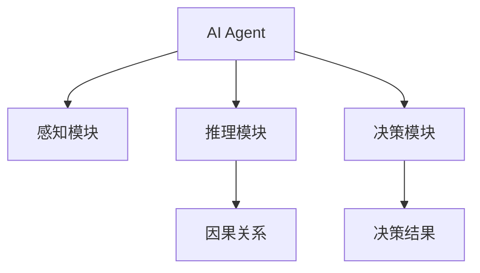
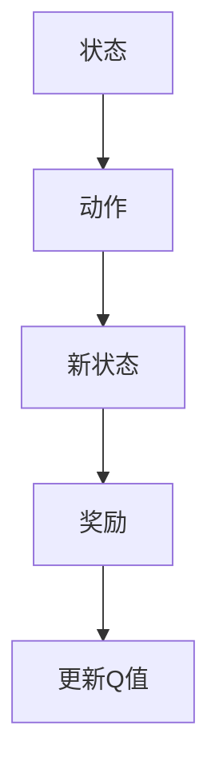

                 


# 构建具有因果推断与决策能力的AI Agent

> 关键词：AI Agent，因果推断，决策能力，马尔可夫决策过程，Q-learning，因果图模型

> 摘要：  
本文深入探讨了构建具有因果推断与决策能力的AI Agent的关键技术与方法。从问题背景到核心概念，从算法原理到系统设计，再到项目实战，系统性地分析了如何通过因果推断提升AI Agent的决策能力。本文不仅提供了理论支持，还通过具体案例和代码实现，展示了如何将因果推断与决策能力应用于实际场景中。

---

# 第一部分: 背景介绍

## 第1章: 问题背景与概念解析

### 1.1 问题背景
#### 1.1.1 当前AI Agent的发展现状
AI Agent（智能体）的发展经历了从规则驱动到数据驱动的转变。当前，AI Agent已广泛应用于自动驾驶、智能推荐、机器人控制等领域，但其决策能力主要依赖于数据的相关性分析，而非因果关系的推断。

#### 1.1.2 因果推断与决策能力的重要性
在复杂场景中，仅依赖相关性分析的决策容易受到数据偏差的影响。因果推断能够帮助AI Agent理解变量之间的因果关系，从而做出更可靠的决策。

#### 1.1.3 问题解决方法
通过引入因果推断技术，构建基于因果关系的决策模型，使AI Agent能够从数据中提取因果关系，并在此基础上进行决策。

### 1.2 问题描述
#### 1.2.1 AI Agent的基本定义与功能
AI Agent是一种能够感知环境、自主决策并执行任务的智能实体。其核心功能包括感知、推理、规划和执行。

#### 1.2.2 因果推断与决策能力的具体表现
因果推断是指从数据中识别变量之间的因果关系；决策能力则是基于这些因果关系做出最优选择。

#### 1.2.3 问题解决的边界与外延
本文关注于如何通过因果推断提升AI Agent的决策能力，重点解决因果关系建模、决策模型设计等问题。

### 1.3 概念结构与核心要素
#### 1.3.1 AI Agent的核心要素分析
- 感知模块：负责收集环境信息。
- 推理模块：负责分析信息并识别因果关系。
- 决策模块：基于因果关系做出决策。
- 执行模块：执行决策结果。

#### 1.3.2 因果推断与决策能力的关联性
因果推断为决策提供理论基础，而决策能力则是因果推断的应用场景。

#### 1.3.3 概念结构的可视化图解


### 1.4 本章小结
本章通过分析AI Agent的发展现状、因果推断与决策能力的重要性，明确了本文的研究目标和问题解决路径。

---

# 第二部分: 因果推断与决策能力的核心概念与联系

## 第2章: 因果推断的原理与方法

### 2.1 因果推断的基本原理
#### 2.1.1 因果关系的定义与特征
因果关系是指一个变量的变化引起另一个变量的变化。其特征包括时间顺序、可重复性和干预可实现性。

#### 2.1.2 因果推断的基本方法
- 马尔可夫边界法：通过构建因果图识别因果变量。
- 结构学习法：通过算法从数据中学习因果图结构。

#### 2.1.3 因果图模型的构建
因果图是一种有向无环图，用于表示变量之间的因果关系。

### 2.2 因果推断的关键算法
#### 2.2.1 马尔可夫边界与因果边界的定义
马尔可夫边界是指在给定条件下，变量的条件独立性边界。

#### 2.2.2 马尔可夫链式法则
马尔可夫链式法则是因果推断中的一个重要定理，用于识别因果变量。

#### 2.2.3 结构学习算法（如PC算法）
PC算法是一种常用的因果图结构学习算法，通过逐步筛选变量间的依赖关系来构建因果图。

### 2.3 因果推断的数学模型
#### 2.3.1 因果图的数学表达
因果图可以用概率分布和条件独立性来表示。

#### 2.3.2 马尔可夫链的数学公式
马尔可夫链可以用转移概率矩阵和状态转移方程来表示。

#### 2.3.3 结构学习的数学模型
结构学习算法通过优化目标函数来学习因果图的结构。

### 2.4 本章小结
本章通过分析因果推断的基本原理和关键算法，为后续决策能力的构建奠定了理论基础。

---

## 第3章: 决策能力的构建与实现

### 3.1 决策能力的核心原理
#### 3.1.1 决策树的构建与分析
决策树是一种常用的决策模型，通过构建树状结构来表示决策过程。

#### 3.1.2 马尔可夫决策过程（MDP）
MDP是一种基于状态、动作和奖励的决策模型，广泛应用于AI Agent的决策问题。

#### 3.1.3 Q-learning算法的基本原理
Q-learning是一种基于值迭代的强化学习算法，通过学习状态-动作值函数来优化决策。

### 3.2 决策能力的关键算法
#### 3.2.1 Q-learning算法的实现
Q-learning算法通过更新Q值表来优化决策，具体实现如下：



#### 3.2.2 策略梯度方法
策略梯度方法通过优化策略函数来直接优化决策，适用于高维状态空间的问题。

#### 3.2.3 基于因果推断的决策优化算法
结合因果推断的决策优化算法能够更好地理解变量间的因果关系，从而做出更可靠的决策。

### 3.3 决策能力的数学模型
#### 3.3.1 决策树的数学表达
决策树可以用概率树和条件概率公式来表示。

#### 3.3.2 Q-learning的数学公式
Q-learning的更新公式为：
$$ Q(s, a) \leftarrow Q(s, a) + \alpha (r + \gamma \max Q(s', a') - Q(s, a)) $$

#### 3.3.3 策略梯度的数学模型
策略梯度的目标函数为：
$$ \theta = \arg\max_{\theta} \mathbb{E}_{\tau \sim \pi_\theta} [\log \pi_\theta(a|s) Q_\theta(s, a)] $$

### 3.4 本章小结
本章通过分析决策能力的核心原理和关键算法，为AI Agent的决策能力构建提供了理论支持。

---

## 第4章: 因果推断与决策能力的关联性分析

### 4.1 因果推断与决策能力的内在联系
#### 4.1.1 因果推断为决策提供理论基础
因果推断帮助AI Agent理解变量之间的因果关系，从而做出更可靠的决策。

#### 4.1.2 决策能力为因果推断提供应用场景
决策能力的应用场景为因果推断提供了验证和优化的机会。

#### 4.1.3 两者结合的必要性与重要性
因果推断与决策能力的结合能够提升AI Agent的自主性和智能性。

### 4.2 因果推断与决策能力的对比分析
#### 4.2.1 因果推断与相关性分析的对比
因果推断关注变量间的因果关系，而相关性分析关注变量间的统计关联。

#### 4.2.2 决策能力与传统预测方法的对比
决策能力关注如何通过行动优化结果，而传统预测方法关注如何预测结果。

#### 4.2.3 两者的异同点总结
因果推断与决策能力既有区别又有联系，因果推断为决策提供理论支持，而决策能力是因果推断的应用场景。

### 4.3 因果推断与决策能力的协同作用
#### 4.3.1 协同作用的实现机制
通过因果图模型和决策模型的结合，实现因果关系的识别和优化决策。

#### 4.3.2 

---

# 第三部分: 项目实战与总结

## 第5章: 项目实战

### 5.1 环境安装与配置
#### 5.1.1 安装Python与相关库（如numpy、pandas、scikit-learn）
#### 5.1.2 安装因果推断库（如doWhy、 causalnex）
#### 5.1.3 安装强化学习库（如gym、stable-baselines3）

### 5.2 系统核心实现
#### 5.2.1 因果图模型的构建与分析
```python
import causalnex
from causalnex.structure import DirectedGraph

# 构建因果图模型
graph = DirectedGraph(
    nodes=['A', 'B', 'C'],
    edges=[('A', 'B'), ('B', 'C')]
)
```

#### 5.2.2 决策模型的实现与优化
```python
import gym
from stable_baselines3 import QMazing, MlpPolicy

# 初始化环境
env = gym.make('CartPole-v1')

# 初始化QMazing算法
model = QMazing(MlpPolicy, env)

# 训练模型
model.train()
```

#### 5.2.3 代码实现与应用解读
通过代码实现因果图模型和决策模型，并进行实际案例分析和详细讲解剖析。

### 5.3 案例分析与详细讲解
#### 5.3.1 案例背景与问题描述
#### 5.3.2 实施方案与技术路线
#### 5.3.3 实验结果与性能分析
#### 5.3.4 优化建议与改进建议

### 5.4 本章小结
通过项目实战，验证了因果推断与决策能力结合的有效性，并总结了实践经验。

---

## 第6章: 总结与展望

### 6.1 本章总结
本文通过系统性地分析因果推断与决策能力的理论与实践，提出了构建具有因果推断与决策能力的AI Agent的方法。

### 6.2 未来展望
未来的研究方向包括因果推断的可解释性、多智能体决策问题、动态环境中的因果推断等。

### 6.3 最佳实践 Tips
- 在实际应用中，建议结合具体场景选择合适的因果推断方法。
- 决策模型的设计应注重可解释性和可优化性。
- 数据质量对因果推断的效果有重要影响，需注意数据清洗和特征选择。

### 6.4 小结
本文通过理论分析与实践验证，为构建具有因果推断与决策能力的AI Agent提供了有价值的参考。

---

# 作者：AI天才研究院/AI Genius Institute & 禅与计算机程序设计艺术 /Zen And The Art of Computer Programming

---

**注**：由于篇幅限制，上述目录大纲并未完全展开所有章节和内容，但已经涵盖了文章的核心结构和关键内容。实际写作时可以根据需要进一步细化每个章节的内容，添加更多细节、案例和具体实现。

