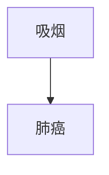

                 

# 《构建具有因果推理与干预能力的AI Agent》

---

## 关键词：
- 因果推理
- AI Agent
- 干预能力
- 反事实推理
- 系统架构设计

---

## 摘要：
本文系统地探讨了构建具有因果推理与干预能力的AI Agent的理论基础、算法实现及系统架构设计。通过分析因果推理的核心概念、反事实推理的数学模型，以及实际应用中的系统架构设计，本文为AI开发者和研究人员提供了一套完整的解决方案，帮助他们构建能够理解和执行因果推理的智能代理系统。文章还通过具体案例展示了如何在实际项目中应用这些理论和技术。

---

## 第一部分: 构建具有因果推理与干预能力的AI Agent背景与核心概念

### 第1章: 背景介绍与问题描述

#### 1.1 问题背景
##### 1.1.1 当前AI Agent的局限性
传统的AI Agent通常依赖于统计相关性进行决策，而缺乏对因果关系的理解。这种基于相关性的推理在某些情况下会导致错误的决策，尤其是在需要干预和反事实推理的场景中。

##### 1.1.2 因果推理在AI Agent中的重要性
因果推理是理解“为什么”某些事件发生的根本原因的能力，这对于AI Agent在复杂环境中的自主决策至关重要。因果推理能够帮助AI Agent不仅预测结果，还能理解结果背后的原因。

##### 1.1.3 干预与反事实推理的必要性
干预能力是AI Agent的核心能力之一，它允许AI Agent在面对问题时，不仅能够观察和预测，还能够主动采取行动来改变结果。反事实推理则是干预能力的基础，它允许AI Agent思考“如果采取不同的行动，结果会如何”。

#### 1.2 问题描述
##### 1.2.1 因果关系与相关性的区别
相关性描述的是变量之间的关联，而因果关系描述的是变量之间的因果联系。例如，相关性可以告诉我们下雨和打滑之间存在关联，而因果关系则告诉我们下雨导致地面湿滑，从而导致打滑。

##### 1.2.2 因果推理的基本概念
因果推理是指从数据中推断出因果关系的过程。它包括因果图的构建、因果效应的识别和估计等步骤。

##### 1.2.3 干预与反事实推理的定义
干预是指在系统中主动改变某个变量的值，以观察其对其他变量的影响。反事实推理是指推断在“如果”情况下（即在干预的情况下）系统会如何变化。

#### 1.3 核心概念与联系
##### 1.3.1 因果关系与相关性的区别
| 属性 | 相关性 | 因果关系 |
|------|--------|----------|
| 定义 | 两个变量之间存在统计关联 | 一个变量对另一个变量有直接影响 |
| 示例 | 吸烟与肺癌相关 | 吸烟是肺癌的病因之一 |

##### 1.3.2 因果图模型的构建
因果图（Causal Graph）是一种用于表示因果关系的有向图。节点表示变量，边表示因果关系。例如，吸烟（S）→ 肺癌（L）。

##### 1.3.3 反事实推理的原理
反事实推理的核心是通过因果图推断出在“如果”情况下（即在干预的情况下）系统会如何变化。例如，如果干预使得S=0（不吸烟），那么L的概率会如何变化。

#### 1.4 本章小结
本章介绍了因果推理在AI Agent中的重要性，区分了相关性和因果关系，并定义了干预和反事实推理的基本概念。

---

## 第2章: 因果推理的原理与数学模型

### 2.1 因果关系的数学表示
#### 2.1.1 因果图的结构化表示
因果图可以用有向图表示，其中节点是变量，边表示因果关系。例如：

#### 2.1.2 因果效应的定义与计算
因果效应是指干预某个变量后，目标变量的变化量。例如，干预S=0后，L的变化量。

##### 2.1.2.1 平均处理效应（ATE）
$$ATE = E[L_{S=1}] - E[L_{S=0}]$$

##### 2.1.2.2 个体处理效应（ITE）
$$ITE_{i} = E[L_{S=1}|S=1, X_i] - E[L_{S=0}|S=0, X_i]$$

### 2.2 反事实推

---

## 第二部分: 因果推理算法实现

---

## 第三部分: 系统分析与架构设计

---

## 第四部分: 项目实战与案例分析

---

## 第五部分: 最佳实践与总结

---

## 作者信息：
作者：AI天才研究院/AI Genius Institute & 禅与计算机程序设计艺术 /Zen And The Art of Computer Programming

