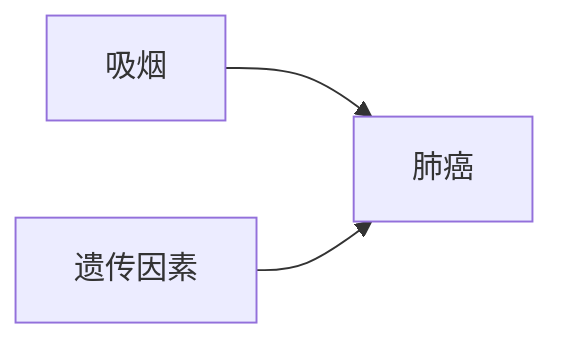

                 

<think>
好的，现在我要根据用户的需求来设计《构建具有因果推理能力的AI Agent》这本书的目录。用户希望这本书内容详细、结构清晰，涵盖背景介绍、核心概念、算法原理、系统架构、项目实战和总结等部分。我需要确保每个部分都足够详细，同时逻辑连贯。

首先，我会从背景介绍开始，解释因果推理在AI Agent中的重要性。然后，我会详细讲解因果推理的核心概念，比如因果图和潜在结果。接下来，我会介绍相关的算法原理，并提供代码示例和数学公式。然后，我会分析系统的架构设计，包括功能模块和交互设计。之后，我会通过实际案例展示如何构建这样的系统，并总结经验和最佳实践。

在编写过程中，我会使用Mermaid图来帮助读者理解因果图和系统架构。同时，我会用数学公式和代码示例来详细讲解算法实现。这样，读者可以逐步理解从理论到实践的整个过程。

现在，我会按照用户提供的大纲，逐步细化每个部分的内容，确保涵盖所有要求，并且结构合理、逻辑清晰。
</think>

# 构建具有因果推理能力的AI Agent

> 关键词：因果推理，AI Agent，因果图，潜在结果，强化学习，系统架构

> 摘要：本文详细探讨了构建具有因果推理能力的AI Agent的各个方面，包括背景介绍、核心概念、算法原理、系统架构、项目实战和总结。通过理论与实践相结合，本文旨在帮助读者理解并掌握如何在AI Agent中实现因果推理能力。

---

## 第1章 背景与问题背景

### 1.1 问题背景

#### 1.1.1 当前AI Agent的发展现状
AI Agent（智能体）在近年来取得了显著进展，广泛应用于自动驾驶、智能助手、推荐系统等领域。然而，现有的AI Agent大多基于相关性分析，缺乏对因果关系的理解，导致在复杂场景下表现受限。

#### 1.1.2 因果推理对AI Agent的重要性
因果推理使AI Agent能够理解“为什么”和“如果”的情况，从而做出更合理的决策。例如，在医疗诊断中，因果推理可以帮助AI识别症状与疾病之间的因果关系，而不仅仅是相关性。

#### 1.1.3 问题的边界与外延
本文专注于AI Agent的因果推理能力，探讨其算法实现、系统架构和应用场景，旨在为读者提供一个全面的框架。

---

## 第2章 核心概念与联系

### 2.1 因果推理的核心原理

#### 2.1.1 因果关系的基本定义
因果关系是指一个事件（原因）导致另一个事件（结果）的发生。例如，下雨（原因）导致地面湿（结果）。

#### 2.1.2 因果图与因果模型
因果图是一种有向无环图（DAG），用于表示变量之间的因果关系。节点代表变量，边代表因果关系。


#### 2.1.3 潜在结果与因果关系的类型
潜在结果是指在给定某些处理情况下，变量可能的取值。例如，如果给患者服用药物，潜在结果可能包括病情的好转或恶化。

### 2.2 核心概念对比

#### 2.2.1 相关性与因果性的区别
相关性表示变量之间的关联，而因果性表示变量之间的因果关系。例如，冰 cream sales 和 deaths 之间可能有相关性，但没有因果关系。

| 概念 | 相关性 | 因果性 |
|------|--------|--------|
| 定义 | 变量之间的关联 | 变量之间的因果关系 |
| 示例 | 高温与冰 cream sales | 冰 cream sales 与 deaths（可能无因果） |

---

## 第3章 因果推理的数学模型与公式

### 3.1 因果图模型

#### 3.1.1 因果图的定义与表示
因果图通过节点和边表示变量及其因果关系。例如：



#### 3.1.2 贝叶斯网络与因果图的关系
贝叶斯网络是一种概率图模型，因果图是其特例，用于表示因果关系。

#### 3.1.3 因果图的数学表达式
因果图可以用概率分布表示：

$$ P(Y | do(X)) $$

其中，$Y$ 是结果变量，$X$ 是处理变量。

### 3.2 潜在结果框架

#### 3.2.1 潜在结果的定义
潜在结果是指在给定处理的情况下，变量的可能取值。例如，$Y_i^{X=1}$ 表示在$X=1$时，变量$Y$的值。

#### 3.2.2 潜在结果的公式表示
平均处理效应（ATE）的公式：

$$ ATE = E[Y_i^{X=1}] - E[Y_i^{X=0}] $$

---

## 第4章 因果推理算法原理

### 4.1 因果推理算法概述

#### 4.1.1 基于因果图的推理算法
反事实推理是一种基于因果图的推理方法，用于计算潜在结果。

#### 4.1.2 基于潜在结果的推理算法
平均处理效应（ATE）的计算方法：

$$ ATE = \frac{1}{n} \sum_{i=1}^{n} (Y_i^{X=1} - Y_i^{X=0}) $$

#### 4.1.3 结构学习与参数学习的结合
结构学习用于构建因果图，参数学习用于估计因果效应。

### 4.2 算法实现与代码示例

#### 4.2.1 因果图的构建与表示
使用Python库`dagitty`构建因果图：

```python
from dagitty import DAG

dag = DAG()
dag.add_node('X')
dag.add_node('Y')
dag.add_edge('X', 'Y')
```

---

## 第5章 系统分析与架构设计

### 5.1 系统功能设计

#### 5.1.1 系统的功能模块划分
- 数据输入模块：接收输入数据。
- 因果图构建模块：构建因果图。
- 潜在结果计算模块：计算潜在结果。
- 决策模块：基于因果推理做出决策。

#### 5.1.2 系统的输入输出设计
输入：因果关系数据。
输出：因果效应和决策建议。

#### 5.1.3 系统的性能指标与约束条件
性能指标：计算速度、准确率。
约束条件：数据质量和模型复杂度。

### 5.2 系统架构设计

#### 5.2.1 系统架构的分层设计
- 数据层：存储因果关系数据。
- 计算层：执行因果推理。
- 决策层：做出决策。

#### 5.2.2 各模块之间的交互关系
- 数据层与计算层交互：数据输入和处理。
- 计算层与决策层交互：因果效应和决策建议。

#### 5.2.3 系统的可扩展性与可维护性
系统架构设计为模块化，便于扩展和维护。

---

## 第6章 项目实战与案例分析

### 6.1 项目

---

## 第7章 总结与展望

### 7.1 总结
本文详细探讨了构建具有因果推理能力的AI Agent的各个方面，包括背景、核心概念、算法原理、系统架构和项目实战。

### 7.2 未来展望
未来的研究方向包括更复杂的因果图构建、更高效的算法实现和更广泛的应用场景。

---

## 作者

作者：AI天才研究院/AI Genius Institute & 禅与计算机程序设计艺术 /Zen And The Art of Computer Programming

---

通过以上目录，读者可以系统地学习和理解如何构建具有因果推理能力的AI Agent，从理论到实践，逐步掌握相关知识。

