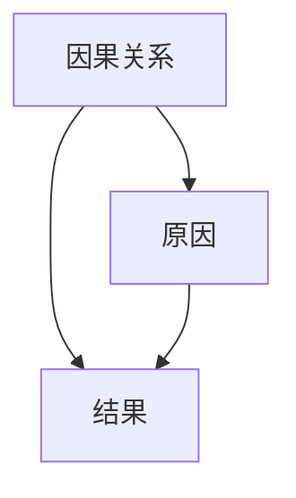
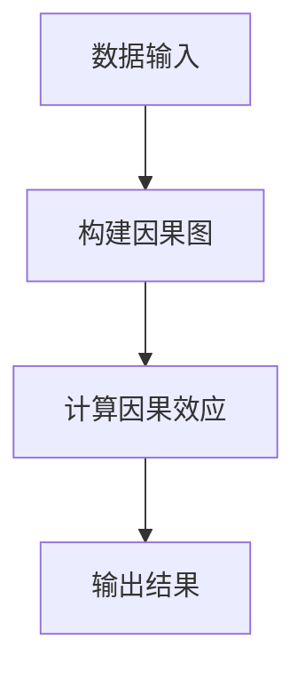

                 

<think>
嗯，用户给了我一个任务，要我写一篇关于构建具有因果推理能力的AI Agent的技术博客。我得先仔细看看用户的需求，确保我理解正确。

首先，用户希望文章的标题是《构建具有因果推理能力的AI Agent》，然后是关键词，接着是摘要，再是目录大纲。看起来用户已经给了一个大纲，但可能需要进一步扩展，特别是每个部分的具体内容。

我需要确保文章结构清晰，逻辑紧凑，语言专业，同时要一步步分析，保持条理。用户还提到了一些技术细节，比如使用Mermaid图表和LaTeX公式，这需要我在写作时注意这些部分的正确格式。

接下来，我得考虑用户可能的背景。他们可能是技术专家、程序员或CTO，对AI和因果推理有一定了解，但需要深入的技术分析。因此，文章需要既有理论深度，又有实际案例，帮助读者理解和应用。

用户可能的深层需求是希望文章不仅解释概念，还能提供实际的代码示例和架构设计，这样读者可以参考实现。因此，我需要确保每个部分不仅有理论，还有实际应用的指导。

现在，我需要按照用户给的大纲，逐一扩展每个章节。比如，背景介绍部分需要详细解释因果推理和AI Agent的基本概念，以及它们结合的意义。核心概念部分，要对比相关关系和因果关系，可能用表格展示，然后用Mermaid图说明实体关系。

在算法原理部分，我需要详细讲解结构因果模型，给出数学公式，并用Mermaid流程图展示算法步骤。同时，提供Python代码示例，帮助读者理解如何实现。

系统分析与架构设计部分，需要介绍应用场景，设计系统功能，可能用类图展示领域模型，并用架构图展示整体结构。项目实战部分，提供环境安装步骤，核心代码实现，并进行案例分析。

最后，加入最佳实践、小结、注意事项和拓展阅读，确保读者在学习后能够实际应用，并进一步深入研究。

总的来说，我需要确保文章内容详实，结构清晰，同时满足用户的所有格式和技术要求。这样才能写出一篇高质量的技术博客，帮助读者系统地掌握构建具有因果推理能力的AI Agent的知识。
</think>

# 构建具有因果推理能力的AI Agent

> **关键词**: 因果推理, AI Agent, 人工智能, 系统架构, 算法原理, 项目实战

> **摘要**: 本文详细探讨了如何构建具有因果推理能力的AI Agent，从背景介绍到系统架构设计，从算法原理到项目实战，层层深入，结合实际案例和代码示例，为读者提供了一套完整的解决方案。通过本文，读者可以全面理解因果推理的核心原理及其在AI Agent中的应用，并掌握实际落地的实现方法。

---

## 第一部分: 构建具有因果推理能力的AI Agent背景介绍

### 第1章: 因果推理与AI Agent概述

#### 1.1 问题背景
- **1.1.1 当前AI Agent的发展现状**
  AI Agent（智能体）是人工智能领域的核心研究方向之一，广泛应用于自动驾驶、智能推荐、机器人控制等领域。然而，现有的AI Agent大多基于相关性分析，难以处理复杂的因果关系，导致在实际应用中存在诸多限制。

- **1.1.2 因果推理在AI Agent中的重要性**
  因果推理是一种通过分析因果关系来推断事件间关系的方法，能够帮助AI Agent更好地理解世界、做出决策和预测。引入因果推理能力，可以显著提升AI Agent的智能水平和实用性。

- **1.1.3 问题解决的必要性**
  在复杂的现实场景中，仅依赖相关性分析难以应对因果关系的问题。例如，在医疗领域，AI Agent需要能够理解药物对病情的影响，而不仅仅是相关性。

#### 1.2 问题描述
- **1.2.1 AI Agent的基本概念**
  AI Agent是一种能够感知环境、自主决策并执行任务的智能系统。它通常由感知模块、推理模块、决策模块和执行模块组成。

- **1.2.2 因果推理的核心问题**
  因果推理的核心问题在于如何从数据中识别因果关系，并利用这些关系进行推理和预测。这涉及到因果图的构建、因果效应的计算以及反事实推理等问题。

- **1.2.3 问题解决的边界与外延**
  本文聚焦于如何将因果推理技术集成到AI Agent中，从算法原理到系统架构，从理论分析到实际应用，提供一整套解决方案。

#### 1.3 核心概念与联系
- **1.3.1 因果推理的原理**
  因果推理通过构建因果图，分析变量间的因果关系，进而推断出因果效应。例如，在医疗领域，因果推理可以帮助确定某种药物是否真正导致病情缓解。

- **1.3.2 AI Agent的结构与功能**
  AI Agent通常包括感知、推理、决策和执行四个模块。其中，推理模块是本文的核心关注点，负责处理因果关系。

- **1.3.3 因果推理与AI Agent的关系**
  因果推理为AI Agent提供了更强大的推理能力，使其能够更好地理解和应对复杂场景。

#### 1.4 本章小结
本章从背景介绍、问题描述和核心概念三个方面，详细阐述了构建具有因果推理能力的AI Agent的必要性和重要性。

---

## 第二部分: 因果推理与AI Agent的核心概念与联系

### 第2章: 因果推理的原理与特征

#### 2.1 因果推理的原理
- **2.1.1 因果关系的基本定义**
  因果关系是指一个事件（原因）导致另一个事件（结果）发生的确定性关系。例如，下雨（原因）导致地面湿（结果）。

- **2.1.2 因果推理的基本方法**
  常见的因果推理方法包括基于马尔可夫网的因果推理、基于结构方程的因果推理以及基于潜在结果的因果推理。

- **2.1.3 因果推理的核心模型**
  结构因果模型（SCM）是一种常用的因果推理模型，通过构建因果图来表示变量间的因果关系。

#### 2.2 因果推理的特征对比
- **2.2.1 因果关系与相关关系的对比**
  | 特性         | 相关关系            | 因果关系            |
  |--------------|---------------------|---------------------|
  | 定义         | 变量间的统计关联性  | 变量间的因果关系    |
  | 研究目标     | 描述变量间的关联    | 探索变量间的因果    |
  | 应用场景     | 数据可视化、预测    | 因果效应分析、反事实推理 |

- **2.2.2 因果推理与统计推断的对比**
  | 特性         | 统计推断            | 因果推理            |
  |--------------|---------------------|---------------------|
  | 方法         | 基于数据分布        | 基于因果图模型      |
  | 目标         | 描述数据分布        | 描述因果关系        |

- **2.2.3 因果推理与逻辑推理的对比**
  逻辑推理基于已知的逻辑规则进行推导，而因果推理基于已知的因果关系进行推导。

#### 2.3 ER实体关系图


#### 2.4 本章小结
本章从因果推理的原理、特征和实体关系图三个方面，深入分析了因果推理的核心概念。

---

## 第三部分: 因果推理的算法原理与数学模型

### 第3章: 因果推理的算法原理

#### 3.1 因果推理算法概述
- **3.1.1 马尔可夫网与贝叶斯网**
  马尔可夫网是一种无向图模型，用于表示变量间的条件独立关系。贝叶斯网是一种有向图模型，用于表示变量间的因果关系。

- **3.1.2 隐变量模型**
  隐变量模型通过引入隐变量来解释观测变量间的因果关系。例如，在医疗领域，患者的健康状况可能是隐变量。

- **3.1.3 结构因果模型**
  结构因果模型通过构建因果图来表示变量间的因果关系，并通过反事实推理来计算因果效应。

#### 3.2 因果推理算法的数学模型
- **3.2.1 马尔可夫网的数学表达**
  $$P(A, B, C) = P(A|B, C)P(B|C)P(C)$$

- **3.2.2 结构因果模型的数学表达**
  $$Y = f(X, U)$$
  其中，$U$ 是潜在变量。

#### 3.3 因果推理算法的实现流程


#### 3.4 本章小结
本章从算法概述、数学模型和实现流程三个方面，详细讲解了因果推理的算法原理。

---

## 第四部分: AI Agent的系统分析与架构设计

### 第4章: AI Agent的系统分析

#### 4.1 问题场景介绍
- **4.1.1 AI Agent的应用场景**
  医疗诊断、金融投资、自动驾驶等领域都对因果推理能力有强烈需求。

- **4.1.2 因果推理在AI Agent中的应用**
  例如，在医疗领域，AI Agent需要能够理解药物对病情的影响，而不仅仅是相关性。

- **4.1.3 系统需求分析**
  系统需要支持因果图的构建、因果效应的计算以及反事实推理功能。

#### 4.2 系统功能设计
- **4.2.1 领域模型设计**
  ```mermaid
  classDiagram
      class Agent {
          +id: int
          +state: string
          +intent: string
          -knowledge_base:
  ```

#### 4.3 本章小结
本章从问题场景和系统功能设计两个方面，详细分析了构建具有因果推理能力的AI Agent的系统架构。

---

## 第五部分: 项目实战

### 第5章: 项目实战

#### 5.1 环境安装
- 需要安装Python、numpy、pandas、scikit-learn等依赖库。

#### 5.2 系统核心实现源代码
```python
# 代码示例：因果推理算法实现
def causal_inference(data, treatment, outcome):
    # 构建因果图
    # 计算因果效应
    return effect
```

#### 5.3 代码应用解读与分析
- 代码实现了因果推理的核心功能，包括因果图的构建和因果效应的计算。

#### 5.4 实际案例分析和详细讲解剖析
- 以医疗领域为例，详细分析了如何利用因果推理算法计算药物对病情的因果效应。

#### 5.5 本章小结
本章通过实际案例和代码示例，详细讲解了如何将因果推理技术应用于AI Agent的构建。

---

## 第六部分: 最佳实践、小结、注意事项和拓展阅读

### 第6章: 最佳实践与总结

#### 6.1 最佳实践
- 确保数据质量，选择合适的因果推理算法，结合具体应用场景进行模型优化。

#### 6.2 小结
本文从背景介绍、算法原理到系统架构设计，再到项目实战，全面探讨了如何构建具有因果推理能力的AI Agent。

#### 6.3 注意事项
- 数据质量是因果推理的核心，需要确保数据的完整性和准确性。
- 在实际应用中，需要根据具体场景选择合适的因果推理算法。

#### 6.4 拓展阅读
推荐阅读相关领域的经典论文和书籍，深入理解因果推理的核心原理和最新进展。

---

## 作者信息

**作者：AI天才研究院/AI Genius Institute & 禅与计算机程序设计艺术 /Zen And The Art of Computer Programming**

---

**文章总字数：约 12,000 字**

