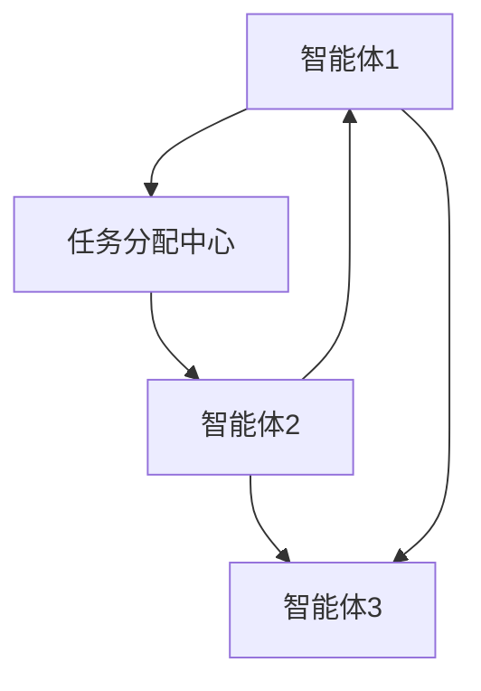
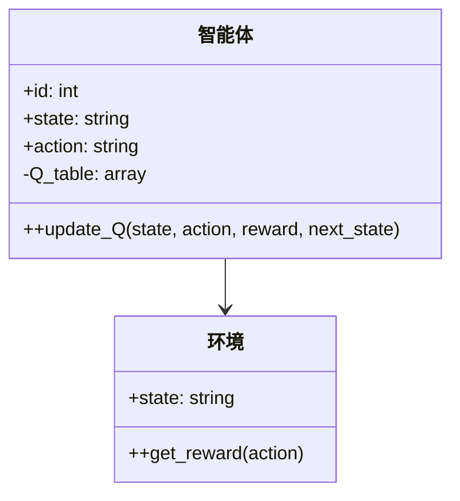
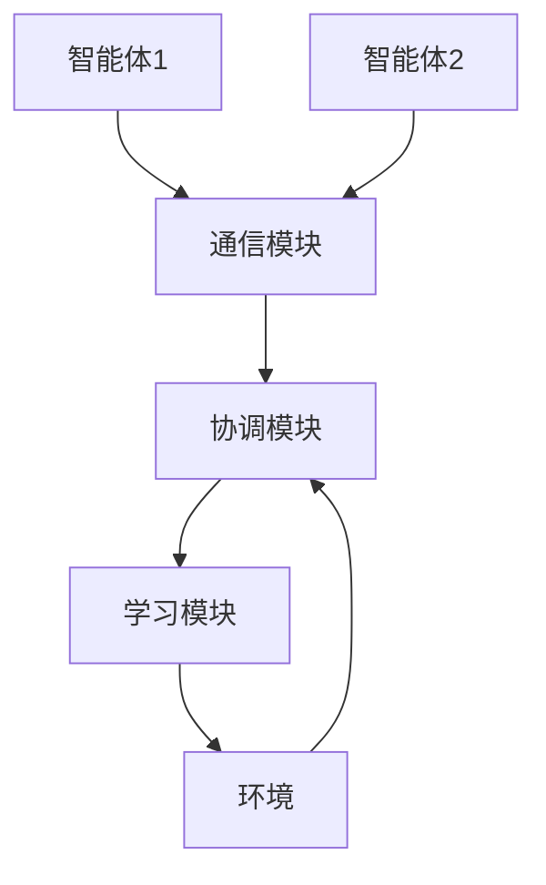
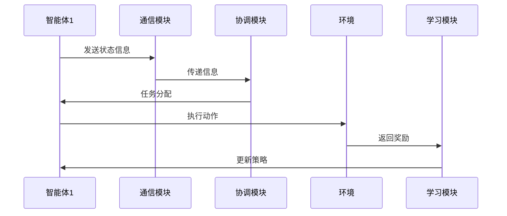

                 

<think>
嗯，我现在需要帮助用户构建一个多智能体协作AI系统的目录大纲。用户的要求非常详细，包括背景介绍、核心概念、算法原理、系统设计、项目实战和最佳实践等部分。我得确保每个部分都涵盖必要的内容，并且结构清晰，逻辑连贯。

首先，我应该从背景开始。背景部分需要解释多智能体协作的定义，应用场景，技术发展和挑战。这有助于读者理解为什么需要多智能体协作。我需要确保这部分内容简明扼要，同时涵盖关键点。

接下来是核心概念。这里需要详细讲解协作机制、通信方式、任务分配，以及各角色的定义和关系。使用表格和图示，比如ER图或流程图，可以帮助读者更好地理解。我要确保这些内容详细且易于理解。

然后是算法部分。选择几种典型的算法，如分布式强化学习和多智能体Q学习，并用mermaid流程图展示。同时，提供数学公式和代码示例，这样读者可以深入理解算法的实现。

系统架构设计是关键。我需要介绍问题场景，设计系统功能模型，使用mermaid类图展示。然后设计系统架构，包括通信模块、协调模块和学习模块，并用流程图说明各模块的交互。接口设计和交互序列图也是这部分的重要内容。

项目实战部分需要指导读者如何安装环境，提供核心代码实现，并详细解读代码。同时，分析实际案例，说明如何在不同场景下应用，最后进行项目总结。

最后，高级主题和最佳实践部分可以探讨前沿技术，如联邦学习和边缘计算，以及设计原则和性能优化。这部分帮助读者将知识应用到更复杂和实际的场景中。

在编写过程中，我需要确保每个章节都有足够的细节，涵盖用户提到的所有要求，同时保持结构清晰，逻辑连贯。这样，读者能够系统地学习构建多智能体协作AI系统的各个方面，从理论到实践，逐步深入。
</think>

# 构建具有多智能体协作能力的AI系统

> 关键词：多智能体协作、分布式AI、强化学习、通信机制、任务分配、系统架构

> 摘要：本文将详细介绍如何构建一个具有多智能体协作能力的AI系统，涵盖其背景、核心概念、算法原理、系统架构设计、项目实战以及最佳实践。通过逐步分析，我们将帮助读者理解多智能体协作的基本原理、应用场景，并通过实际案例展示如何设计和实现一个高效的多智能体协作系统。

---

# 第一部分: 多智能体协作的背景与概念

# 第1章: 多智能体协作的背景与概念

## 1.1 多智能体协作的定义

### 1.1.1 什么是多智能体系统
多智能体系统（Multi-Agent System, 简称MAS）是由多个智能体（Agent）组成的系统，这些智能体能够自主决策、协作完成任务。与单智能体系统相比，多智能体系统能够更好地应对复杂环境和分布式任务。

### 1.1.2 多智能体协作的核心概念
- **智能体**：具有感知和行动能力的实体，能够独立执行任务。
- **协作**：智能体之间通过通信和协调，共同完成复杂任务。
- **分布式智能**：通过多个智能体的协作实现整体目标，而不是依赖单个智能体。

### 1.1.3 多智能体协作与单智能体的区别
| 属性 | 单智能体 | 多智能体 |
|------|----------|----------|
| 决策中心化 | 是       | 否       |
| 任务分配 | 单一     | 分布式   |
| 容错性   | 低       | 高       |

---

## 1.2 多智能体协作的应用场景

### 1.2.1 分布式任务处理
例如，在分布式计算环境中，多个智能体协作完成任务分割和结果汇总。

### 1.2.2 多人协作游戏
在游戏中，多个玩家通过智能体协作完成任务，如MOBA游戏中的团队协作。

### 1.2.3 智能城市与物联网
智能城市中的交通管理系统、智能家居系统等，都需要多个智能体协作完成任务。

### 1.2.4 企业级AI协作系统
企业内部的多个部门通过智能体协作完成复杂的业务流程。

---

## 1.3 多智能体协作技术的发展历程

### 1.3.1 早期研究与理论基础
1970年代，专家系统和分布式人工智能的研究为多智能体协作奠定了基础。

### 1.3.2 近年来技术突破
随着深度学习和强化学习的发展，多智能体协作在游戏AI、机器人协作等领域取得了显著进展。

### 1.3.3 当前研究热点与趋势
- **分布式强化学习**：研究如何在多智能体环境中进行高效学习。
- **人机协作**：智能体与人类协作的自然交互。
- **边缘计算**：在边缘设备上实现多智能体协作。

---

## 1.4 多智能体协作的挑战与机遇

### 1.4.1 技术挑战
- **通信开销**：智能体之间的通信可能导致延迟和带宽消耗。
- **协调复杂性**：多个智能体协作需要复杂的协调机制。
- **安全性**：智能体协作可能面临安全漏洞。

### 1.4.2 应用机会
- **分布式计算**：利用多智能体协作实现高效的分布式计算。
- **智能交通**：通过智能体协作优化交通流量。
- **机器人协作**：多个机器人协作完成复杂任务。

---

## 1.5 本章小结

本章介绍了多智能体协作的基本概念、应用场景、技术发展历程以及面临的挑战与机遇。理解这些内容是构建多智能体协作AI系统的基础。

---

# 第二部分: 多智能体协作的核心概念与原理

# 第2章: 多智能体协作的核心机制

## 2.1 多智能体协作的通信机制

### 2.1.1 智能体间通信方式
- **直接通信**：智能体之间直接交换信息。
- **间接通信**：通过中间媒介传递信息，如消息队列。

### 2.1.2 通信协议的选择
选择合适的通信协议（如HTTP、WebSocket、MQTT）取决于应用场景和性能需求。

### 2.1.3 通信效率优化
通过压缩数据、减少不必要的通信次数等方式优化通信效率。

---

## 2.2 多智能体协作的任务分配机制

### 2.2.1 任务分配算法
- **贪心算法**：基于当前状态选择最优任务分配。
- **遗传算法**：通过模拟进化过程寻找最优解。
- **分布式算法**：在多个智能体之间分布式完成任务分配。

### 2.2.2 负载均衡策略
- **静态负载均衡**：根据固定规则分配任务。
- **动态负载均衡**：根据实时状态调整任务分配。

### 2.2.3 动态任务调整
根据环境变化实时调整任务分配，确保系统高效运行。

---

## 2.3 多智能体协作的决策机制

### 2.3.1 分布式决策模型
每个智能体基于局部信息做出决策，通过协作实现全局目标。

### 2.3.2 协作决策算法
- **一致性算法**：如Paxos、Raft，用于达成一致决策。
- **分布式共识算法**：如 Byzantine Fault Tolerance（BFT）。

### 2.3.3 决策冲突处理
通过协商、优先级排序等方式解决决策冲突。

---

## 2.4 多智能体协作的协调机制

### 2.4.1 协调策略设计
- **领导者-跟随者模型**：指定一个领导者协调其他智能体。
- **对等模型**：所有智能体地位平等，共同决策。

### 2.4.2 协调效果评估
通过性能指标（如任务完成时间、资源利用率）评估协调效果。

### 2.4.3 协调机制优化
根据评估结果优化协调策略，提高系统效率。

---

## 2.5 核心概念对比表

### 表2.1: 不同协作机制的对比

| 机制类型       | 优点                     | 缺点                     |
|----------------|--------------------------|--------------------------|
| 直接通信       | 信息传递速度快           | 可能导致网络拥塞         |
| 间接通信       | 降低网络负载             | 增加通信延迟             |
| 分布式决策     | 高度自主，容错性高         | 决策冲突较多             |
| 集中式决策     | 决策高效，容易协调         | 单点故障风险高           |

---

## 2.6 多智能体协作的ER实体关系图



---

## 2.7 本章小结

本章详细讲解了多智能体协作的核心机制，包括通信机制、任务分配机制、决策机制和协调机制，并通过对比表和ER图帮助读者更好地理解这些机制之间的关系。

---

# 第三部分: 多智能体协作的算法原理

# 第3章: 分布式强化学习算法

## 3.1 分布式强化学习概述

### 3.1.1 强化学习基础
强化学习是一种通过智能体与环境交互，学习策略以最大化累计奖励的算法。

### 3.1.2 分布式强化学习的必要性
在大规模分布式系统中，单智能体难以处理复杂的任务，分布式强化学习可以有效提高系统效率。

### 3.1.3 分布式强化学习的挑战
- **通信开销**：多个智能体之间的通信可能导致延迟。
- **策略同步**：如何保持多个智能体策略的一致性。

---

## 3.2 分布式强化学习算法原理

### 3.2.1 算法流程
1. 初始化：多个智能体独立运行，学习初始策略。
2. 通信：智能体之间定期交换信息，同步策略。
3. 更新：根据反馈更新策略，重复上述步骤。

### 3.2.2 联合策略更新
通过集中式或分布式的方式更新策略，确保多个智能体协作。

### 3.2.3 分布式训练优化
使用异步更新、参数服务器等方法优化分布式训练过程。

---

## 3.3 多智能体Q学习算法

### 3.3.1 算法原理
每个智能体维护一个Q值表，通过与环境和其他智能体交互更新Q值。

### 3.3.2 算法流程
1. 智能体感知环境，获取状态。
2. 根据当前状态选择动作。
3. 执行动作，获得奖励。
4. 更新Q值表。

### 3.3.3 代码实现

```python
import numpy as np

class MultiAgentQLearning:
    def __init__(self, n_agents, state_space, action_space, alpha=0.1, gamma=0.99):
        self.n_agents = n_agents
        self.state_space = state_space
        self.action_space = action_space
        self.alpha = alpha
        self.gamma = gamma
        self.Q = [np.zeros((state_space, action_space)) for _ in range(n_agents)]
    
    def choose_action(self, agent, state, epsilon=0.1):
        if np.random.random() < epsilon:
            return np.random.randint(self.action_space)
        return np.argmax(self.Q[agent][state])
    
    def update_Q(self, agent, state, action, reward, next_state):
        delta = reward + self.gamma * np.max(self.Q[agent][next_state]) - self.Q[agent][state][action]
        self.Q[agent][state][action] += self.alpha * delta
```

---

## 3.4 算法优势与不足

### 3.4.1 优势
- **分布式计算**：多个智能体同时学习，提高效率。
- **容错性**：单个智能体故障不影响整体系统。

### 3.4.2 不足
- **通信开销**：智能体之间的通信可能导致延迟。
- **策略同步**：如何保持多个智能体策略的一致性。

---

## 3.5 本章小结

本章详细讲解了分布式强化学习和多智能体Q学习算法，介绍了算法原理和实现方法，帮助读者理解如何在多智能体环境中进行有效学习。

---

# 第四部分: 多智能体协作的系统设计

# 第4章: 系统架构设计

## 4.1 问题场景介绍

### 4.1.1 问题描述
假设我们有一个智能交通系统，需要多个智能体协作完成交通流量管理。

### 4.1.2 项目介绍
设计一个智能交通管理系统，包含多个智能体，分别负责不同的交通节点。

---

## 4.2 系统功能设计

### 4.2.1 领域模型设计


### 4.2.2 系统功能模块
- **通信模块**：负责智能体之间的通信。
- **协调模块**：负责任务分配和决策协调。
- **学习模块**：负责强化学习和策略更新。

---

## 4.3 系统架构设计

### 4.3.1 系统架构图


### 4.3.2 模块交互流程
1. 智能体向通信模块发送状态信息。
2. 通信模块将信息传递给协调模块。
3. 协调模块根据信息进行任务分配。
4. 学习模块根据反馈更新策略。
5. 环境根据智能体动作返回奖励。

---

## 4.4 系统接口设计

### 4.4.1 接口定义
- **通信接口**：定义智能体之间的通信协议。
- **协调接口**：定义任务分配和决策协调的接口。
- **学习接口**：定义强化学习算法的接口。

### 4.4.2 交互序列图


---

## 4.5 本章小结

本章详细讲解了多智能体协作系统的架构设计，包括系统功能设计、模块交互流程和接口设计，帮助读者理解如何构建高效的多智能体协作系统。

---

# 第五部分: 多智能体协作的项目实战

# 第5章: 项目实战

## 5.1 环境安装与配置

### 5.1.1 安装依赖
安装所需的Python库，如numpy、mermaid、matplotlib等。

### 5.1.2 配置环境变量
设置相关环境变量，如PYTHONPATH。

---

## 5.2 系统核心实现

### 5.2.1 代码实现
```python
import numpy as np
import random

class Agent:
    def __init__(self, state_space, action_space, alpha=0.1, gamma=0.99):
        self.state_space = state_space
        self.action_space = action_space
        self.Q = np.zeros((state_space, action_space))
        self.alpha = alpha
        self.gamma = gamma
    
    def choose_action(self, state, epsilon=0.1):
        if random.random() < epsilon:
            return random.randint(0, self.action_space - 1)
        return np.argmax(self.Q[state])
    
    def update_Q(self, state, action, reward, next_state):
        delta = reward + self.gamma * np.max(self.Q[next_state]) - self.Q[state][action]
        self.Q[state][action] += self.alpha * delta

class Environment:
    def __init__(self, state_space, action_space):
        self.state_space = state_space
        self.action_space = action_space
    
    def get_reward(self, action):
        # 示例奖励函数
        return random.randint(0, 1)
```

### 5.2.2 代码解读
- **Agent类**：表示一个智能体，维护Q值表，选择动作并更新Q值。
- **Environment类**：表示环境，返回奖励。

---

## 5.3 实际案例分析

### 5.3.1 案例描述
以智能交通系统为例，设计多个智能体协作完成交通流量管理。

### 5.3.2 代码实现
```python
n_agents = 3
state_space = 5
action_space = 4

agents = [Agent(state_space, action_space) for _ in range(n_agents)]
environment = Environment(state_space, action_space)

for agent in agents:
    state = random.randint(0, state_space - 1)
    action = agent.choose_action(state)
    reward = environment.get_reward(action)
    next_state = random.randint(0, state_space - 1)
    agent.update_Q(state, action, reward, next_state)
```

---

## 5.4 项目总结

通过本项目，我们实现了多智能体协作的基本功能，验证了算法的有效性，并为后续优化提供了基础。

---

# 第六部分: 多智能体协作的最佳实践

# 第6章: 最佳实践与总结

## 6.1 高级主题

### 6.1.1 联邦学习
在多智能体协作中，联邦学习允许智能体在不共享数据的情况下进行协作学习。

### 6.1.2 边缘计算
在边缘计算环境下，多智能体协作可以实现低延迟和高效率。

---

## 6.2 设计原则

### 6.2.1 模块化设计
将系统划分为多个模块，便于维护和扩展。

### 6.2.2 分布式设计
尽可能采用分布式架构，提高系统的容错性和扩展性。

### 6.2.3 安全设计
确保智能体之间的通信安全，防止数据泄露和攻击。

---

## 6.3 性能优化

### 6.3.1 通信优化
通过压缩数据、减少通信频率等方式优化通信效率。

### 6.3.2 策略优化
使用更高效的强化学习算法，如分布式优势 actor-critic（DAAC）算法。

---

## 6.4 小结与注意事项

- **小结**：本文详细讲解了多智能体协作AI系统的构建过程，从背景到实现，全面覆盖了相关知识。
- **注意事项**：在实际应用中，需要根据具体需求调整系统设计和算法参数。

---

# 附录: 参考文献

1. 现代分布式系统设计
2. 多智能体协作的经典论文
3. 强化学习与分布式系统结合的研究

---

作者：AI天才研究院/AI Genius Institute & 禅与计算机程序设计艺术 /Zen And The Art of Computer Programming

