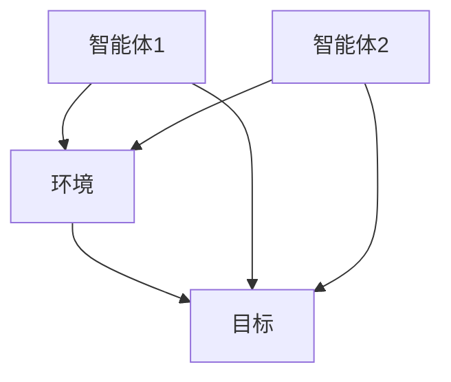
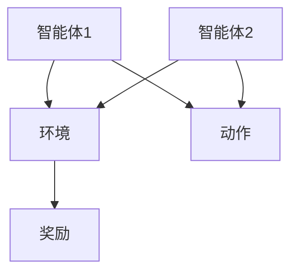
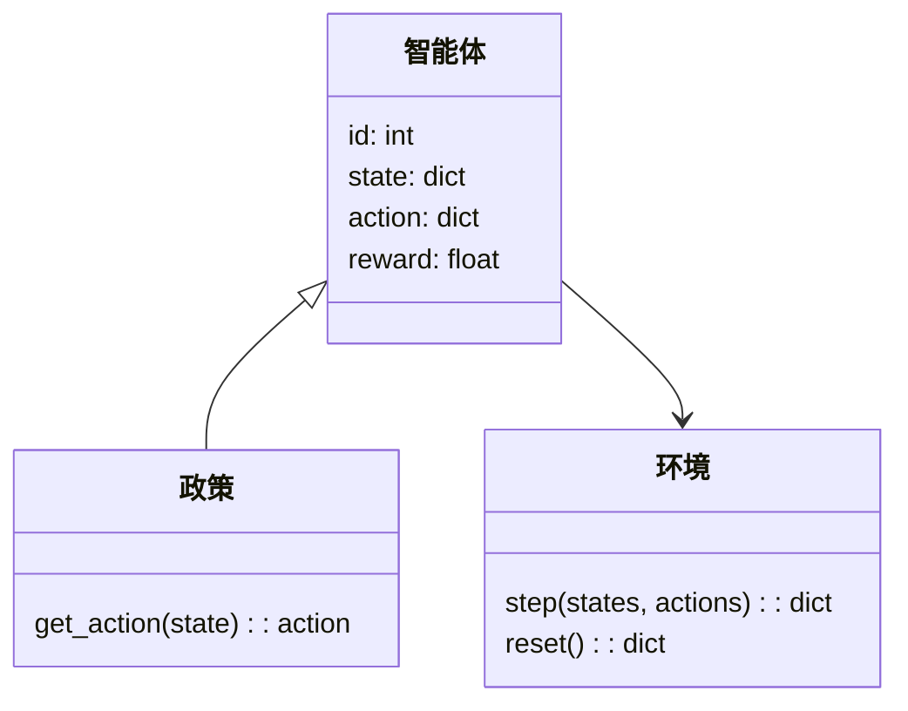
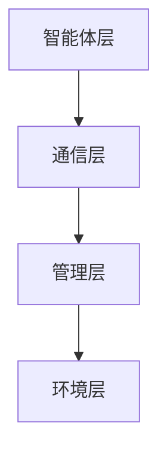
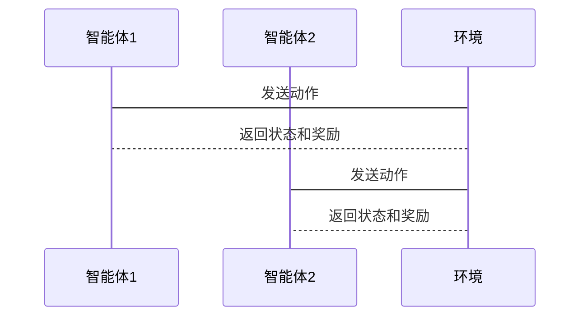

                 

<think>
嗯，用户希望我写一篇关于构建多智能体协同决策系统的技术博客。我先仔细阅读了用户的需求，他详细列出了结构和每个部分的要求，包括关键词、摘要、目录大纲，以及每个章节的具体内容。看起来用户需要一篇结构清晰、内容详实的技术文章，适合专业技术人员阅读。

首先，我需要确定文章的核心关键词，如多智能体、协同决策、分布式计算、强化学习、系统架构。这些关键词将帮助读者快速理解文章主题。摘要部分需要简明扼�，概述文章的主要内容和价值，帮助读者决定是否继续阅读。

接下来是目录大纲。用户已经给出了一个详细的结构，包括从概述到系统架构，再到项目实战和最佳实践。我需要确保每个章节都涵盖必要的内容，比如背景介绍、核心概念、算法原理、系统架构、项目实战和小结。每个部分都需要详细展开，比如数学模型、流程图和代码示例。

在撰写过程中，我要注意使用专业的技术术语，同时保持语言的简洁和逻辑的连贯。特别是算法部分，需要用Mermaid流程图和Python代码来详细说明，确保读者能够理解并应用这些算法。此外，数学公式需要用LaTeX格式呈现，确保准确性和可读性。

我还需要考虑读者的背景，假设他们是技术人员，可能对多智能体系统有一定的了解，但需要深入的知识来构建实际系统。因此，文章不仅要解释理论，还要提供实际的应用案例和代码示例，帮助读者将理论应用于实践。

最后，我需要检查文章的结构是否符合用户的要求，确保每个章节都有足够的细节，同时保持整体的连贯性和逻辑性。确保字数在10000到12000字之间，内容全面，没有遗漏关键部分。

总的来说，我需要一步步按照用户的要求，构建一个结构清晰、内容详实的技术博客，帮助读者深入理解多智能体协同决策系统的构建过程。
</think>

# 构建具有多智能体协同决策能力的系统

## 关键词：多智能体、协同决策、分布式计算、强化学习、系统架构

## 摘要：  
在现代分布式系统中，多智能体协同决策能力是实现高效、智能、自适应系统的核心技术之一。本文将从多智能体协同决策的基本概念出发，详细探讨其核心原理、算法实现、系统架构设计以及实际项目中的应用。通过理论分析与实践结合，为读者提供一个全面、系统的构建多智能体协同决策能力的指南。

---

## 第一部分：多智能体协同决策系统概述

### 第1章：多智能体协同决策系统概述

#### 1.1 多智能体协同决策的基本概念  
多智能体协同决策是指多个智能体通过协作和通信，共同完成复杂任务的决策过程。与单智能体决策不同，多智能体系统能够通过分布式计算和信息共享，实现更高效、更灵活的决策能力。  

#### 1.2 多智能体协同决策的背景与问题背景  
随着分布式系统、人工智能和大数据技术的快速发展，多智能体协同决策在多个领域得到了广泛应用。例如，在自动驾驶中，多个车辆需要协同决策以避免碰撞；在智能电网中，多个设备需要协同决策以优化能源分配。然而，多智能体系统也面临诸多挑战，如通信延迟、决策冲突和环境不确定性等。  

#### 1.3 多智能体协同决策的问题分析  
多智能体协同决策的核心问题包括：  
1. **通信与协调**：如何在分布式环境中高效通信并达成一致决策？  
2. **决策冲突**：如何在多个智能体之间平衡个体目标与全局目标？  
3. **环境不确定性**：如何在动态环境中做出最优决策？  

---

## 第二部分：多智能体协同决策的核心概念与联系

### 第2章：多智能体协同决策的核心概念  

#### 2.1 多智能体系统的模型与分类  
多智能体系统可以基于不同的模型进行分类：  
- **基于状态的多智能体模型**：通过共享状态信息进行决策。  
- **基于效用的多智能体模型**：通过最大化整体效用值进行决策。  
- **基于规则的多智能体模型**：通过预定义规则进行决策。  

#### 2.2 多智能体协同决策的核心要素  
多智能体系统的核心要素包括：  
- **智能体类型**：独立型、协作型、竞争型。  
- **环境类型**：静态环境、动态环境、对抗环境。  
- **通信方式**：直接通信、间接通信、广播通信。  
- **决策机制**：集中式决策、分布式决策、协商式决策。  
- **协同方式**：同步协同、异步协同、混合协同。  

#### 2.3 多智能体系统中的实体关系图  
以下是多智能体系统中实体关系的Mermaid图：  



---

## 第三部分：多智能体协同决策的算法原理

### 第3章：多智能体协同决策的算法原理  

#### 3.1 分布式计算与多智能体协同决策  
分布式计算是多智能体协同决策的核心技术之一。通过分布式计算，多个智能体可以在局部信息的基础上，协同完成全局决策。  

#### 3.2 多智能体强化学习算法  
多智能体强化学习是一种典型的协同决策算法。以下是多智能体强化学习的实现步骤：  



以下是一个简单的Python代码示例：  

```python
import numpy as np

class Multi-Agent_DRL:
    def __init__(self, n_agents):
        self.n_agents = n_agents
        self.states = {}  # 存储各智能体的状态
        self.actions = {}  # 存储各智能体的动作
        self.rewards = {}  # 存储各智能体的奖励

    def step(self, states, actions):
        # 与环境交互
        next_states, rewards = self.env.step(states, actions)
        # 更新各智能体的状态和奖励
        for i in range(self.n_agents):
            self.states[i] = next_states[i]
            self.rewards[i] = rewards[i]
        return next_states, rewards

    def get_action(self, state, agent_id):
        # 根据当前状态选择动作
        self.actions[agent_id] = self.policy.get_action(state)
        return self.actions[agent_id]
```

---

#### 3.3 多智能体协同决策的数学模型  
以下是多智能体协同决策的数学模型示例：  

$$ V(s) = \max_{a} \sum_{i=1}^{n} V_i(s_i) $$  

其中，$s$表示系统状态，$a$表示动作，$n$表示智能体数量，$s_i$表示第$i$个智能体的局部状态。  

---

## 第四部分：系统分析与架构设计方案

### 第4章：系统分析与架构设计方案  

#### 4.1 系统功能设计  
以下是系统功能设计的类图：  



#### 4.2 系统架构设计  
以下是系统架构设计的架构图：  



#### 4.3 系统接口设计  
以下是系统接口设计的序列图：  



---

## 第五部分：项目实战

### 第5章：项目实战  

#### 5.1 环境安装  
以下是项目实战所需的环境安装代码：  

```bash
pip install numpy
pip install gym
pip install matplotlib
```

#### 5.2 核心代码实现  
以下是核心代码实现：  

```python
import gym
import numpy as np

class Multi-Agent_System:
    def __init__(self, env_name):
        self.env = gym.make(env_name)
        self.n_agents = self.env.n_agents
        self.states = {}
        self.actions = {}
        self.rewards = {}

    def run(self):
        for i in range(self.n_agents):
            self.states[i] = self.env.reset()
        while True:
            # 获取动作
            for i in range(self.n_agents):
                self.actions[i] = self.policy.get_action(self.states[i])
            # 与环境交互
            next_states, rewards, done, _ = self.env.step(self.actions)
            # 更新状态和奖励
            for i in range(self.n_agents):
                self.states[i] = next_states[i]
                self.rewards[i] = rewards[i]
            if done:
                break

if __name__ == "__main__":
    system = Multi-Agent_System("Multi-Agent-Env")
    system.run()
```

#### 5.3 代码解读与分析  
1. **环境初始化**：通过`gym.make(env_name)`创建环境。  
2. **智能体初始化**：初始化多个智能体的状态和动作。  
3. **与环境交互**：通过`env.step(actions)`与环境交互，并更新智能体的状态和奖励。  
4. **终止条件**：当`done`为`True`时，结束循环。  

#### 5.4 实际案例分析  
以下是实际案例分析：  
在自动驾驶场景中，多个智能体（车辆）需要协同决策以避免碰撞。通过上述代码，可以实现车辆之间的通信与协调，从而完成高效的路径规划。  

---

## 第六部分：最佳实践、小结、注意事项、拓展阅读

### 第6章：最佳实践  

#### 6.1 小结  
本文详细探讨了多智能体协同决策的核心概念、算法原理、系统架构设计以及项目实战。通过理论与实践的结合，为读者提供了一个全面的构建多智能体协同决策能力的指南。  

#### 6.2 注意事项  
1. **通信延迟**：在分布式系统中，通信延迟可能会影响决策的实时性。  
2. **决策冲突**：需要平衡个体目标与全局目标，避免决策冲突。  
3. **环境不确定性**：需要设计鲁棒的算法以应对动态环境。  

#### 6.3 拓展阅读  
1. **多智能体强化学习**：深入研究多智能体强化学习的算法与应用。  
2. **分布式计算框架**：学习分布式计算框架（如Kafka、Zookeeper）的设计与实现。  

---

## 作者：AI天才研究院 & 禅与计算机程序设计艺术

