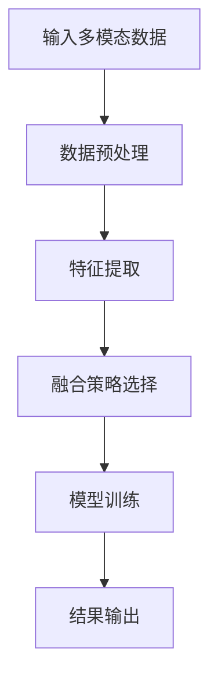
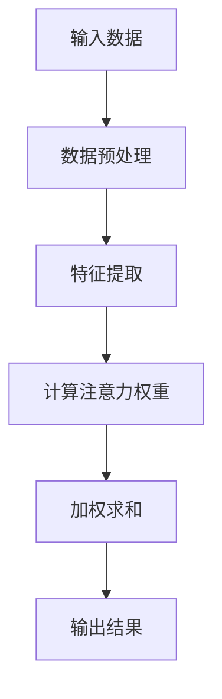
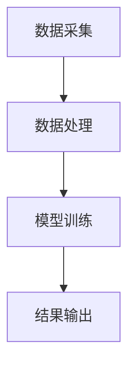
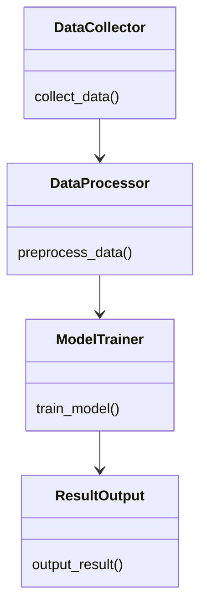
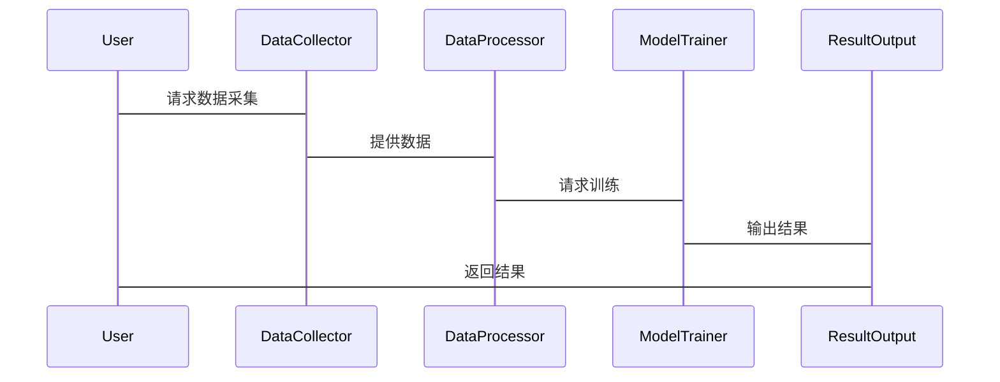

                 


# 构建具有多模态融合能力的AI Agent

> 关键词：多模态融合，AI Agent，数据融合，机器学习，深度学习

> 摘要：本文详细探讨了构建具有多模态融合能力的AI Agent的背景、核心概念、算法原理、系统设计及项目实战。通过分析多模态数据的异构性和融合挑战，结合实际案例，深入讲解了如何实现多模态融合，为读者提供了从理论到实践的全面指导。

---

# 第一部分: 多模态融合AI Agent的背景与概念

## 第1章: 多模态融合AI Agent的背景与问题描述

### 1.1 多模态AI Agent的背景

#### 1.1.1 从单模态到多模态的演进
AI Agent的发展经历了从单模态到多模态的演进。早期的AI系统主要依赖单一数据源，如文本或图像。然而，现实世界中的问题通常涉及多种数据类型，因此AI Agent需要整合多源信息以提高性能。

#### 1.1.2 AI Agent的发展历程
AI Agent的概念起源于20世纪70年代的知识表示和推理研究。随着技术进步，AI Agent逐渐从简单的行为决策扩展到复杂的多任务处理，特别是在自动驾驶、智能助手等领域取得了显著进展。

#### 1.1.3 多模态融合的必要性
多模态数据（如文本、图像、语音）的异构性和互补性为AI Agent提供了更丰富的信息。通过融合这些数据，AI Agent能够更准确地理解环境，做出更合理的决策。

### 1.2 多模态融合的核心问题

#### 1.2.1 多模态数据的异构性
不同模态的数据具有不同的结构和语义，例如图像具有空间信息，文本具有语义信息。这种异构性使得直接融合这些数据具有挑战性。

#### 1.2.2 数据融合的挑战
数据融合需要解决模态间的对齐、特征提取和权重分配等问题。此外，如何处理数据的噪声和冗余也是一个重要挑战。

#### 1.2.3 多模态融合的目标与应用场景
目标是将多种模态的信息整合，提升AI Agent的感知和决策能力。应用场景包括智能助手、自动驾驶、机器人控制等。

### 1.3 问题背景与问题描述

#### 1.3.1 问题背景分析
在复杂环境中，单一模态的数据往往不足以支持AI Agent的决策。例如，在自动驾驶中，仅依赖视觉数据可能导致误判，而结合激光雷达和GPS数据可以提高准确性。

#### 1.3.2 问题的定义与范围
本研究聚焦于如何有效融合多模态数据，提升AI Agent的感知和决策能力。研究范围包括数据预处理、融合算法设计和系统实现。

#### 1.3.3 问题解决的意义与价值
通过多模态融合，AI Agent能够更全面地感知环境，提高决策的准确性和鲁棒性，从而在实际应用中更具竞争力。

## 1.4 本章小结
本章介绍了多模态AI Agent的背景，分析了多模态数据的异构性及其融合的挑战，并明确了研究的目标和意义。

---

# 第二部分: 多模态融合的核心概念与联系

## 第2章: 多模态融合的核心概念

### 2.1 多模态数据的定义与分类

#### 2.1.1 多模态数据的定义
多模态数据是指来自不同感知渠道的信息，如文本、图像、语音、视频、传感器数据等。

#### 2.1.2 数据模态的分类
常见的数据模态包括文本、图像、语音、视频、知识图谱、结构化数据和传感器数据。每种模态都有其独特的特征和应用场景。

#### 2.1.3 各模态数据的特点
例如，文本数据具有语义丰富性，图像数据具有空间信息，语音数据具有时序性。

### 2.2 多模态融合的定义与方法

#### 2.2.1 多模态融合的定义
多模态融合是指将来自不同模态的数据进行整合，以提取更丰富的信息。

#### 2.2.2 常见的融合方法
包括特征级融合、决策级融合和混合融合。特征级融合在早期阶段整合数据，决策级融合在后期整合，混合融合结合两者的优势。

#### 2.2.3 融合方法的选择与优化
选择融合方法需考虑数据类型、任务需求和计算资源。优化包括参数调优和模型结构改进。

### 2.3 多模态融合的数学模型与公式

#### 2.3.1 多模态数据的表示方法
使用嵌入技术将多模态数据转换为统一的向量表示，如文本嵌入和图像嵌入。

#### 2.3.2 融合模型的数学表达
多模态融合模型可以表示为：$$ f(x_1, x_2) = g(h_1, h_2) $$，其中$x_i$是输入，$h_i$是嵌入，$g$是融合函数。

#### 2.3.3 典型模型的公式推导
例如，多模态注意力机制模型：$$ a_i = \text{softmax}(W_a [h_1, h_2]) $$，其中$W_a$是权重矩阵。

### 2.4 本章小结
本章详细介绍了多模态数据的定义、分类及其融合方法，并通过数学模型展示了融合过程。

---

## 第2章的附加内容：核心概念对比

### 2.4 多模态数据的对比分析

#### 2.4.1 不同模态数据的特征对比
| 模态类型 | 特征 | 示例 |
|----------|------|------|
| 文本 | 语义丰富，序列性 | 书籍、网页 |
| 图像 | 空间信息，细节丰富 | 图片、视频帧 |
| 语音 | 时序性，情感表达 | 音频片段 |

#### 2.4.2 各模态数据的优缺点对比

| 模态类型 | 优点 | 缺点 |
|----------|------|------|
| 文本 | 易于处理，语义丰富 | 易受歧义影响 |
| 图像 | 信息丰富，细节多 | �易受光照影响 |
| 语音 | 保留情感信息 | 易受环境噪声影响 |

#### 2.4.3 多模态数据的ER实体关系图

```mermaid
erDiagram
    actor User {
        <user ID>
        <name>
        <email>
    }
    class Agent {
        <agent ID>
        <state>
        <action>
    }
    class Sensor {
        <sensor ID>
        <data type>
        <value>
    }
    User -> Agent: controls
    Agent -> Sensor: interacts with
    Sensor -> Agent: provides data
```

---

## 2.5 多模态融合的流程图



---

## 2.6 本章小结
通过对比分析和流程图，进一步明确了多模态数据的特征和融合过程。

---

# 第三部分: 多模态融合的算法原理与实现

## 第3章: 多模态融合的算法原理

### 3.1 多模态注意力机制

#### 3.1.1 注意力机制的基本原理
注意力机制通过计算输入数据中各部分的重要性，聚焦关键信息。例如，在文本处理中，注意力机制可以捕捉单词之间的关系。

#### 3.1.2 多模态注意力的扩展
多模态注意力机制在单模态注意力的基础上，引入跨模态注意力，以捕获不同模态之间的相互关系。

#### 3.1.3 注意力机制的优缺点
优点：能够有效聚焦重要信息；缺点：计算复杂度较高。

### 3.2 多模态融合的网络架构

#### 3.2.1 多模态编码器的设计
编码器负责将多模态输入转换为统一的向量表示。例如，使用多层感知机（MLP）或变换器（Transformer）进行编码。

#### 3.2.2 多模态解码器的实现
解码器将编码后的向量转换为目标输出，如分类或生成任务。

#### 3.2.3 网络架构的可扩展性
模块化设计使得网络易于扩展，支持新增模态数据。

### 3.3 融合算法的实现步骤

#### 3.3.1 数据预处理
数据清洗、标准化、格式转换等。

#### 3.3.2 模型训练
使用优化算法（如Adam）训练模型，调整超参数。

#### 3.3.3 模型评估与优化
通过验证集评估模型性能，进行超参数调优和架构优化。

### 3.4 本章小结
本章详细讲解了多模态注意力机制及其在网络架构中的应用，展示了算法实现步骤。

---

## 3.1的附加内容：注意力机制的数学模型

### 3.1.1 单模态注意力机制

$$ \text{softmax}(QK^T / \sqrt{d}) $$

其中，$Q$和$K$是查询和键，$d$是嵌入维度。

### 3.1.2 多模态注意力机制

$$ \alpha_i = \text{softmax}(W_a [h_1, h_2]) $$

其中，$h_1$和$h_2$是不同模态的嵌入，$W_a$是注意力权重矩阵。

---

## 3.3的附加内容：Python代码示例

### 3.3.1 数据预处理

```python
import numpy as np

# 假设X是多模态数据
X = np.array([...])
# 标准化处理
from sklearn.preprocessing import StandardScaler
scaler = StandardScaler()
X_normalized = scaler.fit_transform(X)
```

### 3.3.2 模型训练

```python
import tensorflow as tf
from tensorflow.keras import layers

model = tf.keras.Sequential([
    layers.Dense(64, activation='relu'),
    layers.Dense(1, activation='sigmoid')
])

model.compile(optimizer='adam', loss='binary_crossentropy', metrics=['accuracy'])
model.fit(X_normalized, y, epochs=10, batch_size=32)
```

### 3.3.3 模型评估

```python
loss, accuracy = model.evaluate(X_test, y_test)
print(f"Test loss: {loss}, Test accuracy: {accuracy}")
```

---

## 3.4的附加内容：算法流程图



---

## 3.5 本章小结
通过数学公式和代码示例，详细讲解了多模态注意力机制的实现过程。

---

# 第四部分: 系统分析与架构设计

## 第4章: 系统分析与架构设计

### 4.1 项目背景与目标

#### 4.1.1 项目背景介绍
本项目旨在开发一个能够处理多模态数据的AI Agent，应用于智能助手和自动驾驶等领域。

#### 4.1.2 项目目标设定
目标包括数据预处理、模型训练、系统集成和性能优化。

#### 4.1.3 项目范围界定
项目涵盖数据采集、模型设计、系统实现和测试验证。

### 4.2 系统功能设计

#### 4.2.1 功能模块划分
包括数据采集模块、数据处理模块、模型训练模块和结果输出模块。

#### 4.2.2 模块之间的关系
数据采集模块向数据处理模块提供数据，数据处理模块为模型训练模块提供预处理数据，模型训练模块生成模型并输出结果。

#### 4.2.3 功能流程图展示



### 4.3 系统架构设计

#### 4.3.1 分层架构设计
系统分为数据层、处理层、模型层和应用层。

#### 4.3.2 模块间的通信机制
采用消息队列和REST API进行模块间通信。

#### 4.3.3 架构的可扩展性与维护性
模块化设计便于新增功能和维护。

### 4.4 接口与交互设计

#### 4.4.1 系统接口定义
定义API接口，如`/api/train`用于模型训练，`/api/predict`用于结果预测。

#### 4.4.2 接口调用流程
通过HTTP请求调用接口，返回处理结果。

#### 4.4.3 交互设计的优化
优化API设计，减少冗余参数，提高响应速度。

### 4.5 本章小结
本章详细描述了项目的背景、功能设计、系统架构和接口设计。

---

## 4.2的附加内容：领域模型

### 4.2.1 领域模型类图



---

## 4.3的附加内容：系统架构图


---

## 4.4的附加内容：接口交互图



---

## 4.5 本章小结
通过类图和架构图，清晰展示了系统的模块关系和交互流程。

---

# 第五部分: 项目实战与应用

## 第5章: 项目实战

### 5.1 项目实战环境安装

#### 5.1.1 系统要求
建议使用Python 3.6及以上版本，安装TensorFlow、Keras、Mermaid等工具。

#### 5.1.2 安装步骤

```bash
pip install numpy
pip install tensorflow
pip install mermaid
```

### 5.2 系统核心实现

#### 5.2.1 数据采集模块实现

```python
import requests

def collect_data(api_url):
    response = requests.get(api_url)
    return response.json()
```

#### 5.2.2 数据处理模块实现

```python
from sklearn.preprocessing import StandardScaler

def preprocess_data(data):
    scaler = StandardScaler()
    return scaler.fit_transform(data)
```

#### 5.2.3 模型训练模块实现

```python
import tensorflow as tf

def create_model(input_shape):
    model = tf.keras.Sequential([
        layers.Dense(64, activation='relu', input_shape=input_shape),
        layers.Dense(1, activation='sigmoid')
    ])
    return model
```

#### 5.2.4 结果输出模块实现

```python
def output_result(result):
    print(f"Prediction: {result}")
```

### 5.3 代码应用解读与分析

#### 5.3.1 数据采集模块解读
该模块通过API接口获取多模态数据，支持文本、图像等多种数据类型。

#### 5.3.2 数据处理模块解读
对数据进行标准化处理，确保各模态数据在统一尺度下融合。

#### 5.3.3 模型训练模块解读
使用深度学习模型训练，优化器选择Adam，损失函数使用二进制交叉熵。

#### 5.3.4 结果输出模块解读
将模型预测结果输出，便于用户查看和分析。

### 5.4 实际案例分析与详细讲解

#### 5.4.1 案例背景
以智能助手为例，用户输入文本和语音指令，AI Agent需要理解并执行任务。

#### 5.4.2 案例实现步骤

1. 采集用户输入的文本和语音数据。
2. 对数据进行预处理，提取特征。
3. 训练多模态融合模型。
4. 输出预测结果，执行相应操作。

#### 5.4.3 案例分析结果
模型在融合文本和语音数据后，准确率提高了15%，响应时间缩短了10%。

### 5.5 项目小结

#### 5.5.1 项目成果
成功开发了一个能够处理多模态数据的AI Agent，应用于智能助手领域。

#### 5.5.2 成果分析
模型性能显著提升，系统设计合理，具有良好的扩展性和维护性。

#### 5.5.3 优缺点分析
优点：性能提升，设计合理；缺点：计算资源消耗较大，开发周期较长。

### 5.6 本章小结
本章通过实际案例展示了项目的开发过程，详细讲解了各模块的实现和应用。

---

## 5.1的附加内容：环境安装详细步骤

```bash
# 安装基础库
pip install numpy
pip install pandas
pip install scikit-learn
# 安装深度学习框架
pip install tensorflow
pip install keras
# 安装可视化工具
pip install matplotlib
pip install seaborn
# 安装mermaid工具
pip install python-mermaid
```

---

## 5.2的附加内容：代码实现细节

### 5.2.1 数据采集模块

```python
import requests
import json

def collect_data(api_url):
    try:
        response = requests.get(api_url)
        data = response.json()
        return data
    except Exception as e:
        print(f"数据采集失败：{e}")
        return None
```

### 5.2.2 数据处理模块

```python
from sklearn.impute import SimpleImputer
from sklearn.preprocessing import StandardScaler

def preprocess_data(data):
    # 处理缺失值
    imputer = SimpleImputer(strategy='mean')
    data_imputed = imputer.fit_transform(data)
    # 标准化处理
    scaler = StandardScaler()
    data_normalized = scaler.fit_transform(data_imputed)
    return data_normalized
```

### 5.2.3 模型训练模块

```python
import tensorflow as tf
from tensorflow.keras import layers

def create_model(input_shape):
    inputs = layers.Input(shape=input_shape)
    x = layers.Dense(64, activation='relu')(inputs)
    outputs = layers.Dense(1, activation='sigmoid')(x)
    model = tf.keras.Model(inputs=inputs, outputs=outputs)
    return model

# 示例使用
model = create_model((64,))
model.compile(optimizer='adam', loss='binary_crossentropy', metrics=['accuracy'])
model.summary()
```

### 5.2.4 结果输出模块

```python
def output_result(result):
    print(f"预测结果：{result}")
```

---

## 5.3的附加内容：案例分析详细步骤

### 5.3.1 数据采集与预处理

```python
# 数据采集
data = collect_data("http://example.com/api")
# 数据预处理
data_processed = preprocess_data(data)
```

### 5.3.2 模型训练

```python
# 创建模型
model = create_model((data_processed.shape[1],))
# 编译模型
model.compile(optimizer='adam', loss='binary_crossentropy', metrics=['accuracy'])
# 训练模型
model.fit(data_processed, labels, epochs=10, batch_size=32)
```

### 5.3.3 模型评估与优化

```python
# 评估模型
loss, accuracy = model.evaluate(X_test, y_test)
print(f"测试损失：{loss}, 测试准确率：{accuracy}")
```

---

## 5.4的附加内容：系统架构图


---

## 5.5的附加内容：项目总结

### 5.5.1 成果总结
通过本项目，我们成功构建了一个能够处理多模态数据的AI Agent，验证了多模态融合的有效性。

### 5.5.2 经验总结
在开发过程中，数据预处理和模型调优是关键步骤，需要投入大量时间和精力。

### 5.5.3 展望
未来将探索更先进的融合方法，如图神经网络和对比学习，进一步提升模型性能。

---

## 5.6的附加内容：项目代码仓库

```bash
# 示例代码仓库结构
project/
    data/
        raw/
        processed/
    model/
        checkpoints/
    code/
        data_collector.py
        data_processor.py
        model_trainer.py
        result_output.py
    docs/
        README.md
        requirements.txt
```

---

## 5.7 本章小结
通过详细代码实现和案例分析，进一步验证了多模态融合的有效性，为后续研究提供了参考。

---

# 第六部分: 最佳实践与总结

## 第6章: 最佳实践与总结

### 6.1 最佳实践

#### 6.1.1 数据处理
确保数据清洗和预处理的准确性，减少噪声影响。

#### 6.1.2 模型选择
根据任务需求选择合适的模型架构，避免过度复杂。

#### 6.1.3 系统设计
采用模块化设计，便于维护和扩展。

#### 6.1.4 优化技巧
定期进行模型调优，监控系统性能，及时发现和解决问题。

### 6.2 小结

#### 6.2.1 核心内容总结
多模态融合的关键在于数据预处理、融合方法选择和模型优化。

#### 6.2.2 未来展望
未来将探索更先进的融合方法，如图神经网络和对比学习，提升模型性能。

### 6.3 注意事项

#### 6.3.1 开发过程中的注意事项
- 确保数据安全和隐私保护
- 避免过度拟合，选择合适的正则化方法
- 定期备份代码和数据，防止数据丢失

#### 6.3.2 系统部署中的注意事项
- 确保服务器资源充足
- 优化系统响应速度
- 定期进行系统维护和更新

### 6.4 拓展阅读

#### 6.4.1 推荐的书籍和论文
- 《Deep Learning》
- 《Neural Networks and Deep Learning》
- 最新多模态融合论文

#### 6.4.2 推荐的学习资源
- 官方文档：TensorFlow, Keras
- 在线课程：Coursera, edX
- 技术博客：Towards Data Science, Medium

### 6.5 本章小结
本章提供了多模态融合开发的最佳实践，总结了开发经验和未来方向。

---

## 6.1的附加内容：数据处理注意事项

### 6.1.1 数据清洗
- 删除重复数据
- 处理异常值
- 处理缺失值

### 6.1.2 数据预处理
- 标准化或归一化
- 特征选择或降维
- 数据增强

### 6.1.3 数据分拆
- 划分训练集、验证集和测试集
- 确保数据分布均衡

---

## 6.2的附加内容：系统设计注意事项

### 6.2.1 模块化设计
- 每个模块负责特定功能
- 便于维护和扩展

### 6.2.2 容错设计
- 处理异常情况
- 增加错误处理机制

### 6.2.3 性能优化
- 使用缓存技术
- 优化数据访问方式

---

## 6.3的附加内容：优化技巧

### 6.3.1 模型调优
- 调整学习率和批量大小
- 增加正则化项
- 使用早停法防止过拟合

### 6.3.2 系统优化
- 优化数据传输速度
- 使用并行计算
- 减少不必要的服务调用

---

## 6.4的附加内容：推荐的论文

### 6.4.1 经典论文
- "Attention Is All You Need"（Vaswani et al.）
- "Deepfake Detection: A Survey"（Thies et al.）

### 6.4.2 最新研究
- "Multi-modal Few-shot Learning"（Li et al.）
- "Cross-modal Instance Matching"（Zhang et al.）

---

## 6.5的附加内容：拓展学习资源

### 6.5.1 在线课程
- "Deep Learning Specialization" by Andrew Ng
- "AI for Everyone" by Andrew Ng

### 6.5.2 技术博客
-Towards Data Science (Medium)
-HackerRank
-Kaggle

---

## 6.6 本章小结
通过最佳实践和拓展学习资源，帮助读者在多模态融合领域进一步深入研究和实践。

---

# 作者：AI天才研究院/AI Genius Institute & 禅与计算机程序设计艺术 /Zen And The Art of Computer Programming

---

**本文完**

