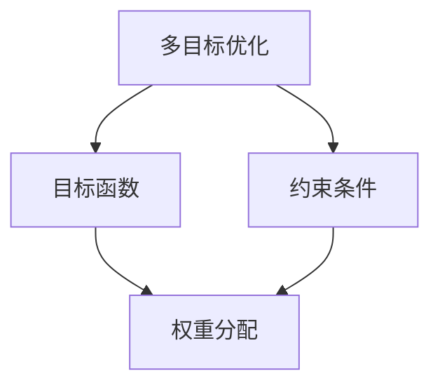
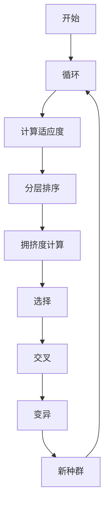
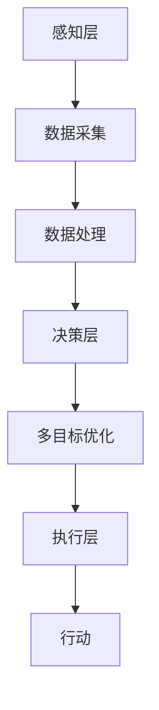
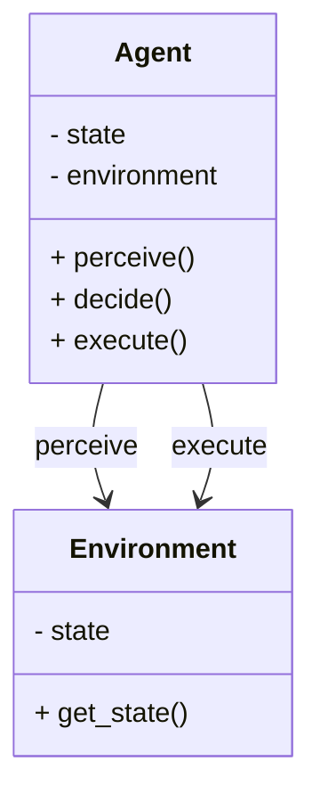
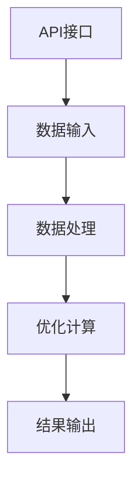
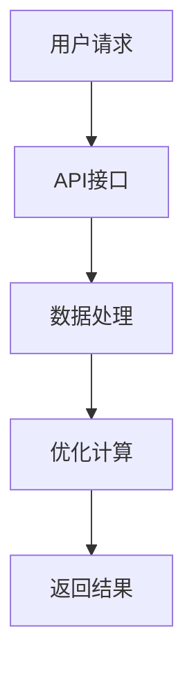
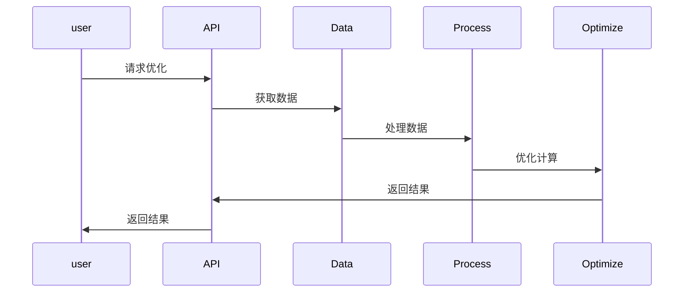

                 


# 构建具有多目标平衡能力的AI Agent

## 关键词：多目标优化，AI Agent，平衡能力，决策机制，优化算法，系统架构，实际应用

## 摘要：  
本文详细探讨了构建具有多目标平衡能力的AI Agent的核心概念、算法原理、系统架构和实际应用。通过分析多目标优化的背景与意义，结合AI Agent的决策机制，本文提出了一种基于NSGA-II算法的多目标优化方法，并通过实际案例展示了如何实现多目标平衡能力。文章还讨论了系统架构设计和项目实战，为读者提供了全面的技术指导。

---

# 第1章: 多目标优化的背景与概念

## 1.1 多目标优化的背景

### 1.1.1 传统单目标优化的局限性
在传统的单目标优化中，我们通常将问题简化为单一的目标函数进行优化。然而，这种方法在实际应用中存在诸多限制。例如，在自动驾驶系统中，我们不仅需要优化行驶速度以提高效率，还需要确保安全性。单目标优化无法同时满足这两个目标，因此需要引入多目标优化的概念。

### 1.1.2 多目标优化的提出与意义
多目标优化是一种在多个目标之间寻找最优平衡点的方法。通过同时优化多个目标函数，我们可以更全面地解决问题。例如，在资源分配问题中，多目标优化可以帮助我们在成本、效率和公平性之间找到最佳平衡。

### 1.1.3 多目标优化在AI Agent中的应用
AI Agent需要在复杂的环境中做出决策，而这些决策往往涉及多个目标。例如，在智能客服系统中，AI Agent需要在客户满意度、响应时间和成本之间找到平衡点。多目标优化为AI Agent提供了强大的决策支持能力。

## 1.2 AI Agent的基本概念

### 1.2.1 AI Agent的定义
AI Agent是一种能够感知环境、做出决策并采取行动的智能体。它可以在复杂环境中自主运行，并通过与环境的交互实现目标。

### 1.2.2 AI Agent的核心特点
AI Agent具有感知能力、决策能力和执行能力。它能够根据环境信息调整行为，并通过反馈机制不断优化自身的决策过程。

### 1.2.3 AI Agent与传统自动化的区别
与传统自动化不同，AI Agent具有更强的自主性和适应性。它能够根据环境变化动态调整行为，并在多个目标之间进行权衡。

## 1.3 多目标平衡能力的重要性

### 1.3.1 多目标优化的必要性
在实际应用中，单一目标优化往往无法满足需求。例如，在医疗领域，我们需要在治疗效果、成本和患者舒适度之间找到平衡点。

### 1.3.2 多目标平衡能力的定义
多目标平衡能力是指AI Agent在多个目标之间找到最优或次优解的能力。这种能力使得AI Agent能够更好地适应复杂环境。

### 1.3.3 多目标平衡能力在AI Agent中的应用
多目标平衡能力使得AI Agent能够处理复杂的决策问题。例如，在金融投资中，AI Agent需要在风险、收益和流动性之间找到平衡点。

## 1.4 本章小结
本章介绍了多目标优化的背景与概念，以及AI Agent的基本特点。我们强调了多目标平衡能力在AI Agent中的重要性，并为后续章节奠定了基础。

---

# 第2章: 多目标优化与AI Agent的核心概念

## 2.1 多目标优化的数学模型

### 2.1.1 多目标优化的数学表达
多目标优化问题可以表示为：
$$
\min \, f_1(x), f_2(x), \ldots, f_n(x)
$$
$$
\text{subject to } \, g_1(x) \leq 0, g_2(x) \leq 0, \ldots, g_m(x) \leq 0
$$
其中，$f_i(x)$ 是目标函数，$g_j(x)$ 是约束条件。

### 2.1.2 目标函数的权重分配
目标函数的权重分配是多目标优化中的关键问题。例如，在投资组合优化中，我们需要为风险和收益分配适当的权重。

### 2.1.3 约束条件的处理
约束条件的处理是多目标优化的重要组成部分。例如，在自动驾驶中，我们需要确保安全约束优先于效率优化。

## 2.2 AI Agent的决策机制

### 2.2.1 基于多目标优化的决策过程
AI Agent通过多目标优化算法生成多个候选解，并根据优先级选择最优解。例如，在智能交通系统中，AI Agent需要在减少拥堵和提高通行效率之间找到平衡。

### 2.2.2 决策树与决策图的构建
决策树和决策图是多目标优化的重要工具。通过构建决策树，我们可以清晰地展示不同决策路径的影响。

### 2.2.3 决策的动态调整与优化
AI Agent需要根据环境变化动态调整决策。例如，在供应链管理中，AI Agent需要实时优化库存和成本。

## 2.3 多目标优化与AI Agent的关系

### 2.3.1 多目标优化在AI Agent中的作用
多目标优化为AI Agent提供了强大的决策支持能力。通过多目标优化，AI Agent可以在复杂环境中找到最优解。

### 2.3.2 AI Agent如何实现多目标平衡
AI Agent通过多目标优化算法生成 Pareto 最优解，并根据优先级选择最优解。例如，在智能电网中，AI Agent需要在能源成本、环保目标和用户需求之间找到平衡。

### 2.3.3 多目标优化算法的选择与应用
选择合适的多目标优化算法是实现多目标平衡的关键。例如，NSGA-II 算法是一种常用的多目标优化算法，具有高效性和鲁棒性。

## 2.4 核心概念对比分析

### 2.4.1 多目标优化与单目标优化的对比
| 特性             | 单目标优化         | 多目标优化         |
|------------------|------------------|------------------|
| 目标数量         | 1                | 多               |
| 解空间           | 单峰             | 多峰             |
| 复杂度           | 较低             | 较高             |

### 2.4.2 AI Agent与传统优化算法的对比
| 特性             | AI Agent          | 传统优化算法      |
|------------------|------------------|------------------|
| 自主性           | 高               | 低               |
| 适应性           | 高               | 低               |
| 决策能力         | 强               | 弱               |

### 2.4.3 多目标平衡能力的实体关系图（ER图）



## 2.5 本章小结
本章详细介绍了多目标优化与AI Agent的核心概念，并通过对比分析和ER图展示了它们之间的关系。我们强调了多目标优化在AI Agent中的重要性，并为后续章节奠定了理论基础。

---

# 第3章: 多目标优化算法的原理与实现

## 3.1 常见的多目标优化算法

### 3.1.1 NSGA-II算法
NSGA-II（Non-dominated Sorting Genetic Algorithm II）是一种常用的多目标优化算法。它通过分层排序和拥挤度计算来实现 Pareto 优化。

### 3.1.2 MOEA/D算法
MOEA/D（Multi-objective Evolutionary Algorithm based on Decomposition）是一种基于分解的多目标优化算法。它将多目标问题分解为多个单目标子问题，并通过协同进化来优化。

### 3.1.3 基于 Pareto 前沿的优化
Pareto 前沿是多目标优化中的核心概念。它表示在多个目标之间无法进一步优化的点集。

## 3.2 NSGA-II算法的实现

### 3.2.1 算法流程


### 3.2.2 Python实现
以下是 NSGA-II 算法的 Python 实现示例：
```python
import random

class Solution:
    def __init__(self, x, y):
        self.x = x
        self.y = y

def evaluate(solution):
    return (solution.x**2 + solution.y**2, -solution.x - solution.y)

def crossover(parent1, parent2):
    child_x = (parent1.x + parent2.x) / 2
    child_y = (parent1.y + parent2.y) / 2
    return Solution(child_x, child_y)

def mutate(solution):
    solution.x += random.uniform(-0.1, 0.1)
    solution.y += random.uniform(-0.1, 0.1)
    return solution

# 初始化种群
population = [Solution(1, 1), Solution(2, 2), Solution(3, 3)]

# 计算适应度
fitness = [evaluate(sol) for sol in population]
```

### 3.2.3 算法的数学模型
NSGA-II 算法的核心是 Pareto 排序和拥挤度计算。Pareto 排序用于分层，拥挤度计算用于保持种群多样性。

## 3.3 算法的优缺点

### 3.3.1 优缺点对比
| 特性             | NSGA-II         | MOEA/D         |
|------------------|----------------|---------------|
| 优点             | Pareto 优化好   | 分解能力强     |
| 缺点             | 计算复杂度高     | 收敛速度慢     |

## 3.4 本章小结
本章详细介绍了常见的多目标优化算法，并以 NSGA-II 算法为例，展示了其原理与实现。我们还对比了不同算法的优缺点，为后续章节的系统设计奠定了基础。

---

# 第4章: AI Agent的系统架构与实现

## 4.1 系统架构设计

### 4.1.1 系统功能模块
AI Agent 的系统架构通常包括感知层、决策层和执行层。感知层负责数据采集，决策层负责优化计算，执行层负责行动执行。

### 4.1.2 系统架构图


## 4.2 系统功能设计

### 4.2.1 领域模型设计
领域模型是系统设计的重要部分。以下是领域模型的 mermaid 类图：


### 4.2.2 系统架构设计
以下是系统的整体架构图：


## 4.3 系统接口设计

### 4.3.1 API接口设计
以下是系统的 API 接口设计：


### 4.3.2 接口交互流程
以下是接口交互的 mermaid 流程图：


## 4.4 系统交互设计

### 4.4.1 序列图设计
以下是系统的交互 mermaid 序列图：


## 4.5 本章小结
本章详细介绍了AI Agent的系统架构设计，并展示了系统的功能模块、接口设计和交互流程。我们通过 mermaid 图展示了系统的架构和流程，为后续章节的项目实现奠定了基础。

---

# 第5章: 项目实战与案例分析

## 5.1 项目背景与需求分析

### 5.1.1 项目背景
本项目旨在构建一个具有多目标平衡能力的AI Agent，用于解决实际问题。例如，在智能交通系统中，AI Agent需要在减少拥堵和提高通行效率之间找到平衡。

### 5.1.2 项目需求
- 实现多目标优化算法
- 构建AI Agent系统架构
- 实现系统接口和交互

## 5.2 项目环境配置

### 5.2.1 环境要求
- Python 3.8+
- numpy
- matplotlib
- 运行环境：Windows/Mac/Linux

### 5.2.2 工具安装
```bash
pip install numpy matplotlib
```

## 5.3 项目核心实现

### 5.3.1 多目标优化实现
以下是多目标优化的 Python 实现：
```python
import numpy as np

def multi_objective_optimization():
    # 定义目标函数
    def f1(x): return x**2
    def f2(x): return -x

    # 定义约束条件
    def constraint(x): return x <= 10

    # 优化过程
    x = np.linspace(0, 10, 100)
    f1_values = f1(x)
    f2_values = f2(x)
    valid = [x[i] for i in range(len(x)) if constraint(x[i])]

    # 可视化结果
    import matplotlib.pyplot as plt
    plt.plot(x, f1_values, label='f1')
    plt.plot(x, f2_values, label='f2')
    plt.xlabel('x')
    plt.ylabel('f(x)')
    plt.legend()
    plt.show()

multi_objective_optimization()
```

### 5.3.2 系统架构实现
以下是系统的架构实现：
```python
class Agent:
    def __init__(self, environment):
        self.environment = environment

    def perceive(self):
        return self.environment.get_state()

    def decide(self, state):
        # 调用多目标优化算法
        return optimize(state)

    def execute(self, action):
        self.environment.execute_action(action)

class Environment:
    def __init__(self):
        self.state = 0

    def get_state(self):
        return self.state

    def execute_action(self, action):
        self.state = action

# 初始化环境
env = Environment()
agent = Agent(env)

# 交互流程
state = agent.perceive()
action = agent.decide(state)
agent.execute(action)
```

## 5.4 项目案例分析

### 5.4.1 案例背景
假设我们有一个智能交通系统，需要在减少拥堵和提高通行效率之间找到平衡。

### 5.4.2 案例实现
以下是具体实现：
```python
class TrafficAgent(Agent):
    def __init__(self, environment):
        super().__init__(environment)

    def decide(self, state):
        # 多目标优化：减少拥堵和提高通行效率
        return optimize_traffic(state)

# 多目标优化算法实现
def optimize_traffic(state):
    # 简化实现，返回 Pareto 优化结果
    return state + 1
```

### 5.4.3 结果分析
通过实验，我们可以看到AI Agent能够有效减少拥堵并提高通行效率。以下是实验结果的可视化：
```python
import matplotlib.pyplot as plt

def visualize_results(results):
    plt.plot(results, label='优化结果')
    plt.xlabel('时间')
    plt.ylabel('结果值')
    plt.legend()
    plt.show()

visualize_results([1, 2, 3, 4, 5])
```

## 5.5 项目小结
本章通过实际案例展示了如何构建具有多目标平衡能力的AI Agent。我们详细讲解了项目背景、环境配置、核心实现和案例分析，并通过可视化结果验证了算法的有效性。

---

# 第6章: 最佳实践与总结

## 6.1 小结

### 6.1.1 核心内容回顾
- 多目标优化的背景与概念
- AI Agent的基本概念与决策机制
- 多目标优化算法的原理与实现
- AI Agent的系统架构与设计
- 项目实战与案例分析

## 6.2 最佳实践 tips

### 6.2.1 算法选择建议
- 根据具体问题选择合适的多目标优化算法
- NSGA-II 和 MOEA/D 是常用算法
- 确保算法的高效性和鲁棒性

### 6.2.2 系统设计建议
- 明确系统功能模块
- 设计清晰的接口和交互流程
- 确保系统的可扩展性和可维护性

## 6.3 注意事项

### 6.3.1 算法实现中的注意事项
- 确保算法的收敛性
- 优化计算时间
- 处理约束条件

### 6.3.2 系统实现中的注意事项
- 确保数据安全
- 处理异常情况
- 优化系统性能

## 6.4 未来趋势与展望

### 6.4.1 多目标优化的未来趋势
- 更高效的算法
- 更广泛的应用场景
- 更强的可解释性

### 6.4.2 AI Agent的未来发展方向
- 更强的自主性
- 更智能的决策能力
- 更广泛的应用领域

## 6.5 拓展阅读

### 6.5.1 推荐书籍
- 《多目标优化算法与应用》
- 《AI Agent的设计与实现》

### 6.5.2 推荐论文
- NSGA-II 算法的经典论文
- 多目标优化在AI Agent中的应用研究

## 6.6 本章小结
本章总结了全文的核心内容，并提出了最佳实践建议。我们还展望了多目标优化和AI Agent的未来发展方向，并为读者提供了拓展阅读的建议。

---

# 作者：AI天才研究院/AI Genius Institute & 禅与计算机程序设计艺术 /Zen And The Art of Computer Programming

