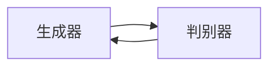

                 


# 构建具有对抗学习能力的AI Agent

---

## 关键词：对抗学习、AI Agent、生成式AI、强化学习、深度学习

---

## 摘要：本文深入探讨了如何构建具有对抗学习能力的AI Agent，从对抗学习的基本原理到实际应用，结合生成式AI和强化学习，通过详细分析和实例，揭示了构建高效、鲁棒的AI Agent的关键步骤和方法。

---

# 第1章: 对抗学习与AI Agent的背景介绍

## 1.1 对抗学习的定义与核心概念

### 1.1.1 什么是对抗学习
对抗学习（Adversarial Learning）是一种机器学习方法，通过两个模型（生成器和判别器）的对抗训练来生成高质量的数据或进行分类。生成器尝试生成与真实数据相似的样本，判别器则试图区分真实数据和生成数据。两者的竞争推动了模型性能的提升。

### 1.1.2 对抗学习的核心要素
- **生成器（Generator）**：负责生成数据，目标是欺骗判别器。
- **判别器（Discriminator）**：负责区分真实数据和生成数据。
- **损失函数**：衡量生成器和判别器的性能。
- **优化过程**：通过交替训练生成器和判别器来优化模型。

### 1.1.3 对抗学习与生成式AI的关系
生成式AI（Generative AI）依赖于对抗学习来生成逼真的数据，如图像、文本等。对抗学习通过生成器和判别器的对抗，提升了生成数据的质量和多样性。

## 1.2 AI Agent的基本概念

### 1.2.1 什么是AI Agent
AI Agent（智能体）是能够感知环境并采取行动以实现目标的实体。它可以是一个软件程序或物理设备，具备自主决策能力。

### 1.2.2 AI Agent的分类与特点
- **简单反射型智能体**：基于当前输入做出反应。
- **基于模型的智能体**：维护环境模型，用于决策。
- **目标驱动型智能体**：根据目标采取行动。
- **实用驱动型智能体**：基于效用函数优化决策。

### 1.2.3 对抗学习在AI Agent中的作用
对抗学习使AI Agent能够更好地适应动态环境，提升其鲁棒性和决策能力。通过与“敌人”或“对手”的对抗训练，AI Agent可以学会预测和应对各种可能的情况。

## 1.3 对抗学习在AI Agent中的应用背景

### 1.3.1 传统AI Agent的局限性
传统AI Agent在面对未知或对抗性环境中表现不佳，容易受到攻击或干扰。

### 1.3.2 对抗学习如何提升AI Agent的能力
对抗学习通过模拟对抗环境，增强AI Agent的适应性和防御能力。

### 1.3.3 对抗学习在AI Agent中的典型应用场景
- **游戏AI**：在游戏对抗中提升策略。
- **网络安全**：检测和防御攻击。
- **自动驾驶**：应对复杂交通环境。

## 1.4 本章小结
本章介绍了对抗学习和AI Agent的基本概念，探讨了对抗学习在AI Agent中的作用和应用背景，为后续内容奠定了基础。

---

# 第2章: 对抗学习的核心原理

## 2.1 对抗学习的基本原理

### 2.1.1 生成器与判别器的对抗过程
生成器尝试生成与真实数据相似的样本，判别器则试图区分真实数据和生成数据。两者的对抗推动了模型的优化。

### 2.1.2 对抗学习的目标函数
- **生成器的目标**：最大化判别器的混淆，使生成数据被误判为真实数据。
- **判别器的目标**：最小化生成数据被误判的风险。

### 2.1.3 对抗学习的训练过程
生成器和判别器交替训练，直到达到纳什均衡，生成器生成的数据与真实数据无法区分。

### 2.1.4 对抗学习的数学模型
- **生成器的损失函数**：$L_G = -\frac{1}{2} \mathbb{E}_{z}[\log D(G(z))]$
- **判别器的损失函数**：$L_D = -\frac{1}{2} (\mathbb{E}_{x}[ \log D(x)] + \mathbb{E}_{z}[ \log (1 - D(G(z)) ) ])$

## 2.2 对抗学习的核心概念与联系

### 2.2.1 生成器与判别器的对比分析
| 属性 | 生成器 | 判别器 |
|------|--------|--------|
| 目标 | 生成与真实数据一致的样本 | 判别生成数据是否为真实数据 |
| 损失函数 | $L_G$ | $L_D$ |
| 优化过程 | 最大化$D$的混淆 | 最小化生成数据的混淆 |

### 2.2.2 生成器与判别器的交互流程图


## 2.3 对抗学习的数学模型与优化

### 2.3.1 生成器和判别器的联合优化
生成器和判别器的目标函数相互关联，共同优化。

### 2.3.2 对抗学习的训练过程
1. 训练生成器：最大化判别器的混淆。
2. 训练判别器：最小化生成数据的混淆。
3. 重复步骤1和2，直到收敛。

## 2.4 本章小结
本章详细讲解了对抗学习的核心原理，包括生成器和判别器的对抗过程，以及它们的目标函数和优化策略。

---

# 第3章: 对抗学习在AI Agent中的系统设计

## 3.1 对抗学习系统的总体架构

### 3.1.1 系统功能设计
- **数据生成模块**：生成器生成数据。
- **数据判别模块**：判别器区分真实数据和生成数据。
- **对抗训练模块**：训练生成器和判别器。

### 3.1.2 系统架构图
```mermaid
graph LR
A[输入数据] --> G[生成器]
G --> D[判别器]
A --> D
D --> 出-- "真实/生成" -->
```

## 3.2 对抗学习系统的实现细节

### 3.2.1 生成器的实现
- 使用深度神经网络，如GAN中的DCGAN结构。

### 3.2.2 判别器的实现
- 使用深度神经网络，如GAN中的判别器结构。

### 3.2.3 对抗训练的实现
- 交替训练生成器和判别器，逐步优化模型。

## 3.3 本章小结
本章详细描述了对抗学习系统的总体架构和实现细节，为后续的项目实战奠定了基础。

---

# 第4章: 项目实战——构建具有对抗学习能力的AI Agent

## 4.1 项目概述

### 4.1.1 项目背景
构建一个能够进行对抗学习的AI Agent，用于生成高质量的数据或进行分类任务。

### 4.1.2 项目目标
- 实现生成器和判别器的对抗训练。
- 验证模型的生成能力和判别能力。

## 4.2 环境安装与配置

### 4.2.1 安装Python环境
使用Anaconda或virtualenv创建独立的Python环境。

### 4.2.2 安装依赖库
安装PyTorch、numpy、matplotlib等库。

## 4.3 代码实现

### 4.3.1 生成器实现
```python
import torch
import torch.nn as nn

class Generator(nn.Module):
    def __init__(self, latent_dim, img_size):
        super(Generator, self).__init__()
        self.latent_dim = latent_dim
        self.img_size = img_size
        self.model = nn.Sequential(
            nn.Linear(latent_dim, 256),
            nn.LeakyReLU(0.2),
            nn.Linear(256, 512),
            nn.LeakyReLU(0.2),
            nn.Linear(512, img_size),
            nn.Tanh()
        )

    def forward(self, x):
        return self.model(x)
```

### 4.3.2 判别器实现
```python
class Discriminator(nn.Module):
    def __init__(self, img_size):
        super(Discriminator, self).__init__()
        self.model = nn.Sequential(
            nn.Linear(img_size, 512),
            nn.LeakyReLU(0.2),
            nn.Linear(512, 256),
            nn.LeakyReLU(0.2),
            nn.Linear(256, 1),
            nn.Sigmoid()
        )

    def forward(self, x):
        return self.model(x)
```

### 4.3.3 对抗训练实现
```python
import torch.optim as optim

# 初始化模型
generator = Generator(latent_dim, img_size)
discriminator = Discriminator(img_size)

# 定义优化器
g_optim = optim.Adam(generator.parameters(), lr=0.0002)
d_optim = optim.Adam(discriminator.parameters(), lr=0.0002)

# 定义损失函数
criterion = nn.BCELoss()

# 训练过程
for epoch in range(num_epochs):
    for _ in range(train_steps):
        # 生成器训练
        gen_labels = torch.ones((batch_size, 1))
        gen_output = generator.randn_input()
        gen_loss = criterion(discriminator(gen_output), gen_labels)
        g_optim.zero_grad()
        gen_loss.backward()
        g_optim.step()

        # 判别器训练
        real_output = discriminator(real_data)
        fake_output = discriminator(gen_output.detach())
        d_loss_real = criterion(real_output, real_labels)
        d_loss_fake = criterion(fake_output, fake_labels)
        total_d_loss = (d_loss_real + d_loss_fake) / 2
        d_optim.zero_grad()
        total_d_loss.backward()
        d_optim.step()
```

## 4.4 项目小结
本章通过实际项目展示了如何构建具有对抗学习能力的AI Agent，详细讲解了环境安装、代码实现和训练过程。

---

# 第5章: 最佳实践与注意事项

## 5.1 最佳实践 tips

### 5.1.1 模型调参技巧
- 合理设置学习率和批量大小。
- 平衡生成器和判别器的训练步数。

### 5.1.2 模型评估方法
- 使用混淆矩阵评估判别器性能。
- 计算生成数据的质量指标，如FID分数。

### 5.1.3 模型优化建议
- 使用Batch Normalization加速训练。
- 引入正则化技术防止过拟合。

## 5.2 注意事项

### 5.2.1 对抗训练的收敛问题
生成器和判别器可能无法同时收敛，需要仔细调整参数。

### 5.2.2 模型的稳定性
对抗训练可能不稳定，需要多次实验和调整。

## 5.3 拓展阅读

### 5.3.1 推荐书籍
- 《Deep Learning》—— Ian Goodfellow
- 《Generative Adversarial Nets》—— Ian Goodfellow

### 5.3.2 推荐论文
- GANs论文：《Generative Adversarial Nets》
- WGAN论文：《Wasserstein GAN》

## 5.4 本章小结
本章提供了对抗学习中的最佳实践和注意事项，帮助读者更好地理解和应用对抗学习。

---

# 作者：AI天才研究院/AI Genius Institute & 禅与计算机程序设计艺术 /Zen And The Art of Computer Programming

---

# 结束语
通过本文的详细讲解，读者可以系统地了解如何构建具有对抗学习能力的AI Agent，从理论到实践，全面掌握对抗学习的核心原理和实际应用。希望本文能为读者在对抗学习和AI Agent领域提供有价值的参考和指导。

