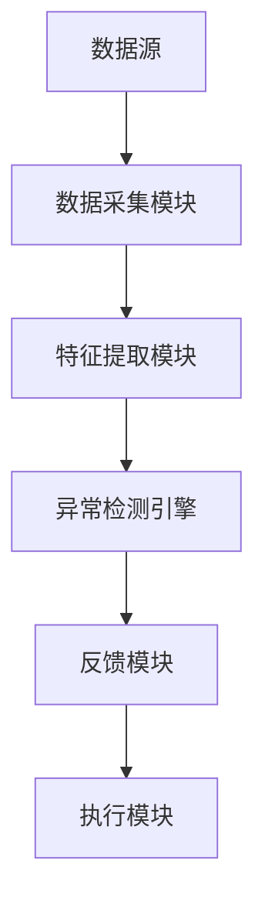

                 


# 构建具有异常检测能力的AI Agent

---

## 关键词：AI Agent, 异常检测, 机器学习, 深度学习, 系统架构

---

## 摘要

本文详细探讨了如何构建一个具有异常检测能力的AI Agent。通过结合AI Agent的核心机制与异常检测技术，我们逐步分析了从基础理论到实际应用的整个过程。文章涵盖了异常检测算法的原理、数学模型、系统架构设计以及实际案例分析，帮助读者全面理解并掌握构建此类AI Agent的方法。通过本文的学习，读者将能够设计并实现一个高效的异常检测系统，提升AI Agent在复杂环境中的智能性和鲁棒性。

---

## 目录

1. [第一章：AI Agent与异常检测概述](#第一章)
2. [第二章：AI Agent的核心机制](#第二章)
3. [第三章：异常检测算法原理](#第三章)
4. [第四章：异常检测的系统架构设计](#第四章)
5. [第五章：异常检测的项目实战](#第五章)
6. [第六章：异常检测的实际挑战与解决方案](#第六章)
7. [第七章：总结与展望](#第七章)

---

## 第一章：AI Agent与异常检测概述

### 1.1 异常检测的基本概念

异常检测是识别数据中偏离常规模式的点或行为的过程。它在金融、医疗、网络安全等领域具有广泛应用。异常点可能表示欺诈、故障或潜在的危险情况。

#### 异常检测的核心问题
- 识别异常点：通过统计或机器学习方法发现异常数据。
- 异常分类：将异常分为孤立点、群落异常等类型。

### 1.2 AI Agent的基本概念

AI Agent是一种能够感知环境、自主决策并执行任务的智能实体。它具备感知、推理、学习和执行能力，广泛应用于推荐系统、自动驾驶等领域。

#### AI Agent的核心功能
- 感知环境：通过传感器或数据源获取信息。
- 决策：基于感知信息做出判断。
- 执行：通过执行机构完成任务。

### 1.3 异常检测在AI Agent中的重要性

在AI Agent中，异常检测用于识别异常行为或数据，从而提高系统的鲁棒性和准确性。例如，在自动驾驶中，检测异常交通状况以避免事故。

---

## 第二章：AI Agent的核心机制

### 2.1 AI Agent的感知模块

感知模块负责数据采集和处理，使用传感器或API获取数据。

#### 数据处理流程
1. 数据采集：通过多种传感器获取原始数据。
2. 数据预处理：清洗和标准化数据，消除噪声。

### 2.2 AI Agent的决策模块

决策模块基于感知数据进行分析和推理。

#### 决策算法
- 基于规则的决策：根据预定义规则做出判断。
- 基于机器学习的决策：使用分类器或回归模型预测结果。

### 2.3 AI Agent的执行模块

执行模块根据决策结果执行相应操作，如发出警报或调整系统参数。

#### 执行策略
- 自动纠正：检测到异常后，自动采取纠正措施。
- 通知人类：将异常情况上报给人类操作员。

---

## 第三章：异常检测算法原理

### 3.1 统计学方法

统计学方法通过分析数据分布来检测异常点。

#### 马尔可夫链模型
- **原理**：利用数据序列中的条件概率建模。
- **公式**：$$ P(A|B) = \frac{P(B|A)P(A)}{P(B)} $$
- **应用**：时间序列数据中的异常检测。

### 3.2 机器学习方法

机器学习方法通过训练模型识别异常模式。

#### One-Class SVM
- **目标函数**：$$ \sum_{i=1}^n \alpha_i y_i + \frac{1}{2} \lambda \|\omega\|^2 $$
- **实现**：使用Scikit-learn库中的OneClassSVM类。

### 3.3 深度学习方法

深度学习方法通过复杂非线性模型捕捉异常特征。

#### 自动编码器（AE）
- **结构**：输入层 → 编码层 → 解码层。
- **实现**：使用Keras构建AE模型，训练时最小化重构误差。

---

## 第四章：异常检测的系统架构设计

### 4.1 系统架构概述

系统由数据采集、特征提取、异常检测引擎和反馈模块组成。

#### 模块划分
1. 数据采集模块：获取实时数据。
2. 特征提取模块：提取关键特征。
3. 异常检测引擎：应用算法检测异常。
4. 反馈模块：输出结果或触发执行模块。

### 4.2 系统架构图



### 4.3 数据流分析

数据从源流向采集模块，经过特征提取后输入检测引擎，结果反馈给执行模块。

---

## 第五章：异常检测的项目实战

### 5.1 环境搭建

#### 工具安装
- Python 3.8+
- NumPy、Pandas、Scikit-learn、Keras

### 5.2 核心模块实现

#### 异常检测引擎代码

```python
from sklearn.svm import OneClassSVM

def detect_outliers(X):
    model = OneClassSVM(nu=0.1)
    model.fit(X)
    return model.predict(X) == -1
```

### 5.3 案例分析

#### 数据分析
- 数据预处理：清洗和标准化。
- 模型训练：使用训练数据训练异常检测模型。
- 模型评估：计算准确率和召回率。

---

## 第六章：异常检测的实际挑战与解决方案

### 6.1 数据质量挑战

解决方法：数据清洗、特征选择和数据增强。

### 6.2 模型泛化能力

解决方法：使用迁移学习、集成学习和数据扩增。

### 6.3 计算效率

解决方法：优化算法、分布式计算和边缘计算。

---

## 第七章：总结与展望

### 7.1 总结

本文详细探讨了构建具有异常检测能力的AI Agent的各个方面，从理论到实践，帮助读者掌握关键技术和方法。

### 7.2 展望

未来，异常检测技术将更加智能化，结合边缘计算和联邦学习，提升实时性和隐私保护。

---

## 作者

作者：AI天才研究院/AI Genius Institute & 禅与计算机程序设计艺术 /Zen And The Art of Computer Programming

