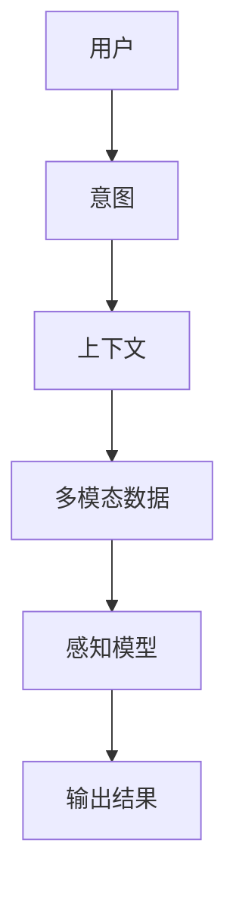

                 

<think>
嗯，用户现在让我以《构建具有情境感知能力的AI Agent》为标题写一篇技术博客文章。看起来他们想要一个结构清晰、内容详尽的专业文章，而且要求很高，包括摘要、目录大纲以及各个章节的详细内容。用户特别提到要使用技术语言，逻辑清晰，逐步分析，这让我想到需要先理解用户的需求，然后一步步构建内容。

首先，我需要明确文章的核心主题是情境感知AI Agent，这意味着这个AI能够理解周围的环境和上下文。因此，文章需要涵盖从基础到高级的各个方面，确保读者能够全面理解这一技术。

用户给出的目录大纲分为七个章节，每个章节都有明确的主题。我需要确保每个章节都包含必要的部分，比如背景介绍、核心概念、算法原理、系统架构、项目实战和总结。此外，用户还要求使用图表和代码示例，这将帮助读者更好地理解内容。

在开始写作之前，我应该先梳理每个章节的主要内容。例如，第一章概述需要介绍AI Agent的基本概念和情境感知的重要性，第二章则深入探讨核心概念和ER图，第三章讲解算法原理并附上代码示例。每个部分都需要详细展开，确保内容丰富且有深度。

接下来，我需要确保语言专业且易懂，使用技术术语但避免过于晦涩。同时，图表和代码示例必须准确无误，能够辅助读者理解复杂的概念。例如，在算法章节中，使用mermaid图展示流程，并附上Python代码，让读者能够实际操作。

我还需要注意文章的结构，确保逻辑连贯，从基础到高级逐步深入。例如，从概述到核心概念，再到算法实现，最后到项目实战和总结，这样的结构有助于读者系统地掌握知识。

另外，用户强调了数学公式的使用，需要用latex格式，并且要独立段落。因此，在讲解算法时，我需要详细推导公式，确保读者能够理解背后的数学原理。例如，在注意力机制中，展示其数学模型，并解释每个部分的作用。

在系统架构部分，用户要求提供类图、架构图和序列图。这部分需要详细设计，展示系统的各个模块及其交互，帮助读者理解整体结构和协作方式。

项目实战部分，我需要选择一个具体的案例，指导读者如何安装环境、编写代码并进行测试。这不仅能够帮助读者理论联系实际，还能增强他们的动手能力。

最后，总结部分需要回顾主要内容，并讨论未来的趋势和挑战，同时给出最佳实践的建议。这将帮助读者巩固所学知识，并在实际应用中避免常见的陷阱。

总之，我需要一步步地构建每个章节的内容，确保每个部分都详细且有条理，同时使用图表和代码示例来辅助讲解。这将帮助读者全面理解构建具有情境感知能力的AI Agent的过程和方法。
</think>

# 构建具有情境感知能力的AI Agent

---

## 关键词：
情境感知、AI Agent、多模态数据、意图识别、上下文推理、实时性、个性化推荐

---

## 摘要：
构建具有情境感知能力的AI Agent是当前人工智能领域的研究热点。本文从情境感知的核心概念出发，系统性地探讨了AI Agent的构建过程，包括感知模型、意图识别、多模态数据处理等关键环节。通过详细的算法原理、系统架构设计和项目实战，本文为读者提供了一套完整的构建方法论，并结合实际案例进行了深入分析。最后，本文总结了当前的研究成果，并展望了未来的发展方向。

---

# 目录大纲：

## 第1章: 情境感知AI Agent概述

### 1.1 情境感知的概念与背景
- 1.1.1 情境感知的定义
- 1.1.2 情境感知的背景与重要性
- 1.1.3 情境感知的应用场景

### 1.2 AI Agent的基本概念
- 1.2.1 AI Agent的定义
- 1.2.2 AI Agent的核心特征
- 1.2.3 AI Agent的分类

### 1.3 情境感知AI Agent的特征
- 1.3.1 情境感知的多模态特征
- 1.3.2 动态适应性
- 1.3.3 个性化与上下文理解

---

## 第2章: 情境感知的核心概念与联系

### 2.1 情境感知模型的原理
- 2.1.1 感知模型的构建
- 2.1.2 意图识别的机制
- 2.1.3 上下文推理的逻辑

### 2.2 核心概念对比分析
- 2.2.1 感知模型与传统模型的对比
- 2.2.2 意图识别与简单分类的差异
- 2.2.3 多模态数据处理的复杂性

### 2.3 ER实体关系图


---

## 第3章: 情境感知AI Agent的算法原理

### 3.1 感知模型的算法实现
- 3.1.1 序列模型
  ```mermaid
  graph LR
  A[输入序列] --> B[编码器]
  B --> C[解码器]
  C --> D[输出结果]
  ```

- 3.1.2 注意力机制
  ```mermaid
  graph LR
  A[输入] --> B[查询]
  B --> C[键值对]
  C --> D[注意力计算]
  D --> E[输出]
  ```

### 3.2 意图识别的算法实现
- 3.2.1 基于深度学习的意图识别
  ```mermaid
  graph LR
  A[输入] --> B[嵌入层]
  B --> C[编码层]
  C --> D[解码层]
  D --> E[输出结果]
  ```

- 3.2.2 模型训练与优化
  ```python
  # 示例代码：意图识别模型训练
  import tensorflow as tf
  model = tf.keras.Sequential([
      tf.keras.layers.Embedding(input_dim=10000, output_dim=16),
      tf.keras.layers.LSTM(64),
      tf.keras.layers.Dense(10, activation='softmax')
  ])
  model.compile(optimizer='adam', loss='sparse_categorical_crossentropy', metrics=['accuracy'])
  model.fit(X_train, y_train, epochs=5)
  ```

### 3.3 上下文推理的算法实现
- 3.3.1 基于图的上下文推理
  ```mermaid
  graph LR
  A[实体1] --> B[关系]
  B --> C[实体2]
  C --> D[实体3]
  ```

- 3.3.2 基于规则的上下文推理
  ```python
  # 示例代码：简单的规则推理
  def infer_context(context):
      if '时间' in context and '地点' in context:
          return '上下文完整'
      else:
          return '上下文不完整'
  ```

---

## 第4章: 情境感知AI Agent的系统架构设计

### 4.1 系统功能设计
- 4.1.1 领域模型设计
  ```mermaid
  classDiagram
  class 用户 {
      id: int
      name: str
      context: str
  }
  class 意图 {
      id: int
      name: str
      confidence: float
  }
  class 上下文 {
      id: int
      content: str
      timestamp: datetime
  }
  ```

- 4.1.2 功能模块划分
  - 输入处理模块
  - 感知模型模块
  - 意图识别模块
  - 上下文推理模块

### 4.2 系统架构设计
- 4.2.1 分层架构
  ```mermaid
  architecture
  Client
  [前端]
  Server
  [后端]
  Database
  [数据存储]
  ```

- 4.2.2 微服务架构
  ```mermaid
  serviceDiagram
  Service1
  [意图识别]
  Service2
  [上下文推理]
  Service3
  [结果输出]
  ```

### 4.3 系统接口设计
- 4.3.1 API接口定义
  - `/api/input`：接收输入数据
  - `/api/process`：处理数据并返回结果
  - `/api/output`：输出结果

- 4.3.2 接口交互流程
  ```mermaid
  sequenceDiagram
  Client -> Service1: 发送输入数据
  Service1 -> Service2: 请求上下文推理
  Service2 -> Service3: 请求意图识别
  Service3 -> Client: 返回最终结果
  ```

---

## 第5章: 情境感知AI Agent的项目实战

### 5.1 项目背景与目标
- 5.1.1 项目背景
- 5.1.2 项目目标
- 5.1.3 项目范围

### 5.2 环境安装与配置
- 5.2.1 安装Python
- 5.2.2 安装深度学习框架（如TensorFlow、PyTorch）
- 5.2.3 安装NLP库（如NLTK、spaCy）

### 5.3 核心代码实现
- 5.3.1 数据预处理
  ```python
  # 示例代码：数据预处理
  import pandas as pd
  df = pd.read_csv('data.csv')
  df['text'] = df['text'].apply(lambda x: x.lower())
  ```

- 5.3.2 模型训练
  ```python
  # 示例代码：模型训练
  import tensorflow as tf
  model = tf.keras.Sequential([
      tf.keras.layers.Embedding(input_dim=10000, output_dim=16),
      tf.keras.layers.LSTM(64),
      tf.keras.layers.Dense(10, activation='softmax')
  ])
  model.compile(optimizer='adam', loss='sparse_categorical_crossentropy', metrics=['accuracy'])
  model.fit(X_train, y_train, epochs=5)
  ```

- 5.3.3 模型推理
  ```python
  # 示例代码：模型推理
  import numpy as np
  input_sequence = np.array([1])
  output = model.predict(input_sequence)
  ```

### 5.4 实际案例分析
- 5.4.1 案例背景
- 5.4.2 数据处理
- 5.4.3 模型训练与推理
- 5.4.4 结果分析

### 5.5 项目小结
- 5.5.1 项目总结
- 5.5.2 项目成果
- 5.5.3 项目经验

---

## 第6章: 情境感知AI Agent的高级主题

### 6.1 情境感知的实时性
- 6.1.1 实时性的重要性
- 6.1.2 实时处理的技术挑战
- 6.1.3 实时性优化方法

### 6.2 多模态数据的融合
- 6.2.1 多模态数据的定义
- 6.2.2 多模态数据的融合方法
- 6.2.3 多模态数据融合的案例

### 6.3 个性化推荐
- 6.3.1 个性化推荐的定义
- 6.3.2 基于情境感知的推荐算法
- 6.3.3 个性化推荐的实现案例

---

## 第7章: 总结与展望

### 7.1 核心内容回顾
- 7.1.1 情境感知的核心概念
- 7.1.2 AI Agent的构建过程
- 7.1.3 算法与系统架构设计

### 7.2 未来研究方向
- 7.2.1 更强的实时性
- 7.2.2 更复杂的多模态融合
- 7.2.3 更个性化的推荐系统

### 7.3 注意事项与最佳实践
- 7.3.1 数据隐私与安全
- 7.3.2 模型的可解释性
- 7.3.3 系统的可扩展性

---

## 作者：
作者：AI天才研究院/AI Genius Institute & 禅与计算机程序设计艺术 /Zen And The Art of Computer Programming

