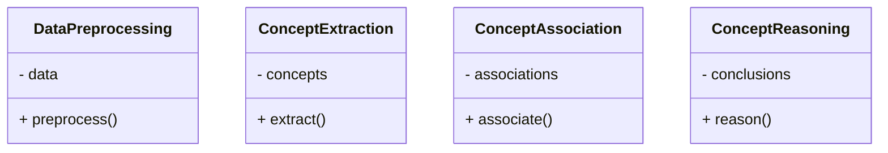
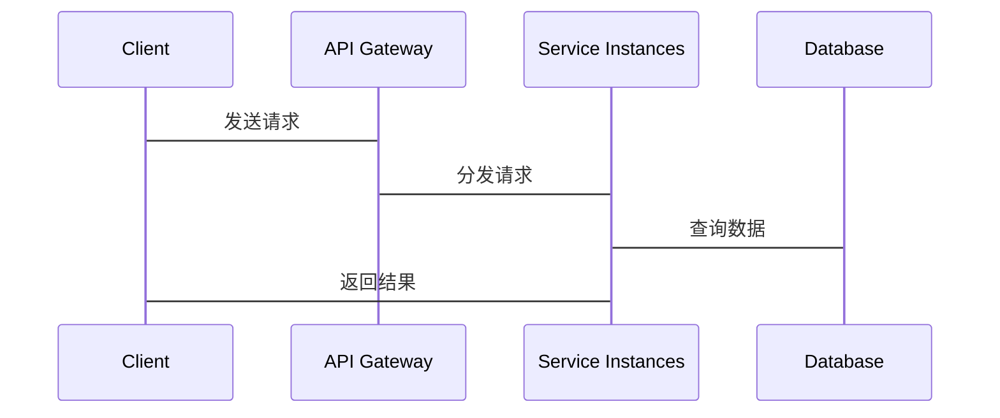

                 


# 《构建具有概念学习能力的AI Agent》

---

## 关键词：AI Agent, 概念学习, 神经符号学习, 系统架构设计, 强化学习, 对比学习

---

## 摘要：  
本文将探讨如何构建具有概念学习能力的AI Agent。文章从AI Agent的基本概念出发，深入分析概念学习的核心原理和其在AI Agent中的重要性。通过对比传统机器学习方法，本文详细阐述了神经符号学习、对比学习和强化学习等概念学习算法的原理，并结合系统架构设计和项目实战，展示了如何实现具有概念学习能力的AI Agent。最后，本文总结了概念学习的优缺点和未来的发展方向。

---

## 第一部分: AI Agent与概念学习的背景介绍

---

### 第1章: AI Agent与概念学习概述

#### 1.1 AI Agent的基本概念  
**AI Agent**（人工智能代理）是指能够感知环境并采取行动以实现目标的智能实体。它可以是一个软件程序、机器人或其他智能系统。AI Agent的核心能力包括感知、推理、决策和执行。

**概念学习**是指AI Agent通过学习数据中的概念结构，理解数据的语义并能够进行概念间的推理和关联。它是实现AI Agent智能化的核心能力之一。

AI Agent与概念学习的关系可以类比为人类通过学习概念来理解世界。AI Agent通过概念学习，能够理解数据的深层含义，并在此基础上进行更高级的推理和决策。

---

#### 1.2 概念学习的重要性  
概念学习在AI Agent中的作用不可忽视。它能够帮助AI Agent从数据中提取出语义信息，并通过概念间的关联进行推理。例如，在自然语言处理中，概念学习可以帮助AI Agent理解词语的含义及其上下文关系。

概念学习的核心要素包括知识表示、概念提取、概念关联和概念推理。这些要素共同构成了AI Agent进行概念学习的基础。

概念学习的挑战在于如何有效地提取和表示概念，并在此基础上实现概念间的推理。与此同时，概念学习也为AI Agent提供了更广泛的应用场景，例如知识图谱构建、智能问答系统等。

---

#### 1.3 概念学习的背景与现状  
AI Agent的发展经历了多个阶段，从简单的规则驱动到复杂的深度学习模型。随着技术的进步，概念学习逐渐成为AI Agent研究的热点。

概念学习的背景可以追溯到知识表示和推理的传统研究领域。近年来，随着深度学习技术的发展，概念学习逐渐从符号化推理转向神经符号学习，即结合神经网络和符号推理的混合方法。

当前，概念学习的技术现状主要包括以下几种方法：  
1. **符号化方法**：通过逻辑推理和知识图谱构建概念。  
2. **深度学习方法**：通过神经网络从数据中学习概念表示。  
3. **神经符号学习方法**：结合符号推理和深度学习的优势，实现概念的自动提取和推理。

---

#### 1.4 构建具有概念学习能力的AI Agent的目标  
构建具有概念学习能力的AI Agent的目标是实现智能化的语义理解与推理能力。具体目标包括：  
1. 实现概念的自动提取与表示。  
2. 建立概念间的关联关系。  
3. 支持基于概念的推理与决策。  

为了实现这些目标，AI Agent需要具备以下能力：  
1. **知识表示能力**：能够将数据中的概念表示为符号或向量形式。  
2. **概念提取能力**：能够从数据中自动提取概念。  
3. **概念推理能力**：能够基于概念进行推理和关联。  

---

#### 1.5 本章小结  
本章从AI Agent的基本概念出发，详细阐述了概念学习的核心概念、重要性及其在AI Agent中的应用。通过对概念学习的背景与现状的分析，明确了构建具有概念学习能力的AI Agent的目标与意义。

---

## 第2章: 概念学习的核心概念与联系  

---

#### 2.1 概念学习的核心概念  
**知识表示**是概念学习的基础，常见的表示方法包括符号表示和向量表示。符号表示通过逻辑规则表示知识，而向量表示通过神经网络学习语义向量。  

**概念提取**是通过数据学习概念的过程，可以采用聚类、分类或无监督学习方法。  

**概念关联**是建立概念之间关系的过程，例如“苹果是一种水果”这一关系。  

**概念推理**是基于概念之间的关系进行推理，例如“所有苹果都是水果，因此苹果是可食用的”。  

---

#### 2.2 概念学习与传统机器学习的对比  

| 对比内容       | 监督学习         | 无监督学习       | 半监督学习       |
|----------------|------------------|------------------|------------------|
| 数据需求       | 标签数据         | 无标签数据       | 少量标签数据     |
| 学习目标       | 预测具体类别     | 发现数据结构     | 部分监督         |
| 适用场景       | 分类任务         | 聚类任务         | 混合任务         |

---

#### 2.3 概念网络的ER实体关系图  

```mermaid
er
actor: 概念
object: 属性
relationship: 属于
```

---

#### 2.4 本章小结  
本章详细讲解了概念学习的核心概念，包括知识表示、概念提取、概念关联和概念推理。通过对概念学习与传统机器学习的对比，明确了概念学习的独特优势。最后，通过ER实体关系图展示了概念网络的结构。

---

## 第3章: 概念学习的算法原理  

---

#### 3.1 神经符号学习算法  

##### 3.1.1 神经符号学习的基本原理  
神经符号学习（Neural-Symbolic Learning）是一种结合了深度学习和符号推理的混合方法。它通过神经网络学习语义表示，并利用符号推理进行概念关联。  

##### 3.1.2 神经符号学习的实现流程  
1. 数据预处理：将数据转换为神经网络的输入格式。  
2. 神经网络训练：通过反向传播训练神经网络，提取语义特征。  
3. 符号推理：基于神经网络提取的概念表示，进行符号推理和关联。  

##### 3.1.3 神经符号学习的优缺点  
**优点**：能够结合深度学习的特征提取能力和符号推理的可解释性。  
**缺点**：实现复杂，需要结合两种不同领域的技术。  

---

#### 3.2 对比学习算法  

##### 3.2.1 对比学习的基本原理  
对比学习（Contrastive Learning）是一种通过对比正样本和负样本来学习数据表示的方法。它通过最大化正样本的相似性，最小化负样本的相似性，实现数据的高效表示。  

##### 3.2.2 对比学习的实现流程  
1. 数据预处理：将数据分为正样本和负样本。  
2. 对比网络训练：通过对比损失函数训练网络，提取数据表示。  

##### 3.2.3 对比学习的优缺点  
**优点**：能够有效捕捉数据的语义信息。  
**缺点**：需要设计合适的正样本和负样本。  

---

#### 3.3 强化学习算法  

##### 3.3.1 强化学习的基本原理  
强化学习（Reinforcement Learning）是一种通过奖励机制来训练智能体的方法。智能体通过与环境交互，学习最优策略。  

##### 3.3.2 强化学习的实现流程  
1. 环境初始化：定义环境和状态空间。  
2. 智能体交互：智能体根据策略采取动作，获得奖励。  
3. 策略更新：通过策略梯度或Q-learning算法更新策略。  

##### 3.3.3 强化学习的优缺点  
**优点**：适用于动态环境和复杂任务。  
**缺点**：需要设计合适的奖励函数。  

---

#### 3.4 算法原理的数学模型与公式  

##### 3.4.1 神经符号学习的数学模型  
神经符号学习的损失函数可以表示为：  
$$ L = L_{\text{神经}} + L_{\text{符号}} $$  
其中，$L_{\text{神经}}$ 是神经网络的损失，$L_{\text{符号}}$ 是符号推理的损失。  

##### 3.4.2 对比学习的数学模型  
对比学习的损失函数可以表示为：  
$$ L = -\log p(x_i, x_j) - \log p(x_k, x_l) $$  
其中，$p(x_i, x_j)$ 是正样本的概率，$p(x_k, x_l)$ 是负样本的概率。  

##### 3.4.3 强化学习的数学模型  
强化学习的Q-learning算法可以表示为：  
$$ Q(s, a) = Q(s, a) + \alpha (r + \max_{a'} Q(s', a') - Q(s, a)) $$  
其中，$\alpha$ 是学习率，$r$ 是奖励，$s'$ 是下一状态。  

---

#### 3.5 本章小结  
本章详细讲解了三种概念学习算法：神经符号学习、对比学习和强化学习。通过对每种算法的原理、实现流程和优缺点的分析，为后续的系统设计和项目实现奠定了基础。

---

## 第4章: 系统分析与架构设计  

---

#### 4.1 问题场景介绍  
本文设计的AI Agent需要具备概念学习能力，能够从数据中提取概念，并进行概念推理。  

#### 4.2 系统功能设计  
系统功能包括：数据预处理、概念提取、概念关联和概念推理。  

##### 4.2.1 领域模型类图  


---

#### 4.3 系统架构设计  


---

#### 4.4 系统交互设计  



---

#### 4.5 本章小结  
本章通过对问题场景的分析，设计了系统的功能模块和架构。通过类图和架构图展示了系统的整体结构和交互流程，为后续的实现奠定了基础。

---

## 第5章: 项目实战  

---

#### 5.1 环境安装  
项目需要以下环境：  
- Python 3.8+  
- TensorFlow 2.5+  
- PyTorch 1.9+  
- Mermaid CLI  

---

#### 5.2 系统核心实现源代码  

##### 5.2.1 数据预处理代码  
```python
def preprocess_data(data):
    # 数据预处理逻辑
    return processed_data
```

##### 5.2.2 概念提取代码  
```python
def extract_concepts(data):
    # 概念提取逻辑
    return concepts
```

##### 5.2.3 概念推理代码  
```python
def reason_concepts(concepts):
    # 概念推理逻辑
    return conclusions
```

---

#### 5.3 代码应用解读与分析  
通过对上述代码的分析，可以看出系统的实现逻辑清晰，各模块分工明确。数据预处理、概念提取和概念推理分别由独立的函数实现，便于后续的优化和扩展。  

---

#### 5.4 实际案例分析  
以自然语言处理任务为例，AI Agent可以通过概念学习理解词语的含义，并进行语义推理。例如，当输入“猫是一种宠物动物”时，AI Agent可以推理出“猫是宠物”。  

---

#### 5.5 项目小结  
本章通过项目实战，展示了如何实现具有概念学习能力的AI Agent。通过对代码的分析和案例的解读，读者可以更好地理解概念学习的实际应用。

---

## 第6章: 最佳实践  

---

#### 6.1 小结  
本文详细讲解了如何构建具有概念学习能力的AI Agent，涵盖了背景介绍、核心概念、算法原理、系统架构设计和项目实战等内容。

---

#### 6.2 注意事项  
在实际应用中，需要注意以下几点：  
1. 确保数据质量，避免噪声干扰。  
2. 合理选择算法，根据任务需求进行优化。  
3. 注意模型的可解释性，避免“黑箱”问题。  

---

#### 6.3 拓展阅读  
推荐以下书籍和论文：  
1. 《Deep Learning》—— Ian Goodfellow  
2. 《Neural-Symbolic Learning: A Survey and Future Directions》—— 李飞飞团队  

---

## 作者：AI天才研究院/AI Genius Institute & 禅与计算机程序设计艺术 /Zen And The Art of Computer Programming  

---

**本文由AI天才研究院出品，转载请注明出处。**

