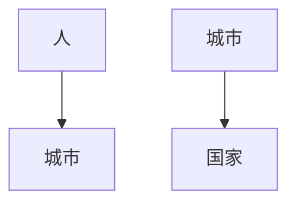
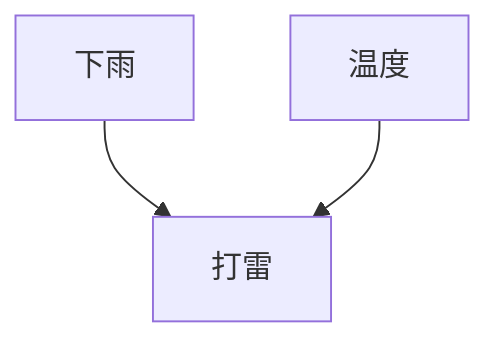
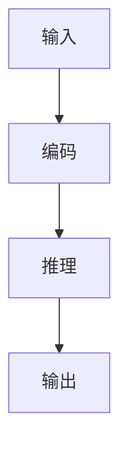
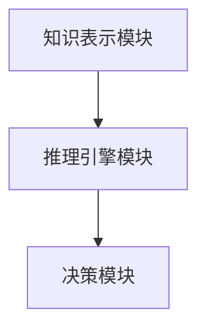
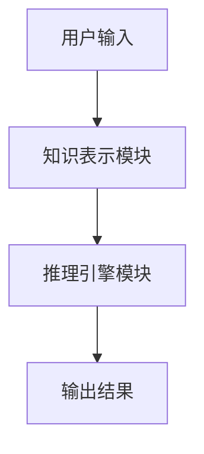

                 

<think>
好，我现在需要根据用户的要求，撰写一篇关于《构建具有知识推理能力的AI Agent》的技术博客文章。首先，我要理解用户的需求，确保文章的结构符合他们的要求。

用户希望文章有一个清晰的标题，接着是关键词和摘要，然后按照目录大纲展开。文章需要使用专业且易懂的技术语言，每个章节都要详细且具体，涵盖背景、核心概念、算法、系统架构、项目实战以及小结。

首先，我从背景介绍开始。这部分需要解释AI Agent和知识推理的基本概念，帮助读者理解为什么这些概念重要。我需要定义AI Agent，说明知识推理的作用，以及它们与其他技术的区别。这部分可能需要使用简单的术语和例子来解释复杂的概念。

接下来是核心概念与联系。这部分要详细讲解知识表示和推理的原理，可能涉及符号逻辑和概率推理。为了帮助读者理解，我需要创建一个对比表格，展示符号逻辑和概率推理的特点。此外，用Mermaid图展示知识推理的实体关系，帮助读者直观理解概念间的联系。

然后是算法原理部分。我需要选择一种主流的推理算法，比如基于符号逻辑的推理，用Mermaid流程图展示算法步骤，并用Python代码实现。这部分需要解释数学模型，如逻辑命题和自然演绎推理，并用LaTeX公式表示，确保读者能够理解算法的工作原理。

接下来是系统分析与架构设计。这部分需要介绍构建AI Agent的系统架构，包括功能需求、领域模型类图、系统架构图、接口设计和交互流程。我可能需要更多的Mermaid图表来展示系统结构，确保读者能够跟随我的思路。

然后是项目实战。这部分要提供一个具体的案例，比如构建一个简单的知识推理AI Agent。我需要详细描述环境安装步骤，核心代码实现，并解释代码的功能。案例分析和详细讲解剖析将帮助读者理解如何将理论应用到实际中。

最后是最佳实践和小结。总结整个书的内容，给出实际应用中的注意事项和未来的发展方向。这部分需要简明扼要，同时鼓励读者进一步探索相关领域。

在写作过程中，我需要确保每个章节都有足够的细节，但又不冗长。同时，使用适当的图表和代码示例，使内容更加生动有趣。我还需要注意术语的一致性，避免混淆读者。

可能遇到的问题是如何将复杂的知识推理原理讲解得通俗易懂。我需要通过例子和图表来辅助说明，确保读者能够理解。此外，代码部分要简洁，但又能展示关键算法。

总的来说，我需要按照用户提供的示例，构建一个结构清晰、内容详实的目录大纲，涵盖所有必要的部分，同时保持简洁和逻辑性。
</think>

# 构建具有知识推理能力的AI Agent

> **关键词**：AI Agent、知识推理、知识表示、符号逻辑、概率推理、知识图谱  
> 
> **摘要**：本文详细探讨了构建具有知识推理能力的AI Agent的各个方面，从基本概念到算法实现，再到系统设计和实际应用案例。通过分析知识表示与推理的原理，结合具体的算法实现和系统架构设计，为读者提供一个全面的构建指南。文章最后通过一个具体的项目实战案例，展示了如何将理论应用于实践。

---

## 第一章: AI Agent与知识推理概述

### 1.1 AI Agent的基本概念

#### 1.1.1 AI Agent的定义
AI Agent（人工智能代理）是指能够感知环境并采取行动以实现目标的智能体。AI Agent可以是软件程序、机器人或其他智能系统，其核心在于能够自主决策和执行任务。

#### 1.1.2 知识推理在AI Agent中的作用
知识推理是AI Agent的核心能力之一，它使AI Agent能够根据已有知识和新信息推导出新的结论，从而做出更智能的决策。知识推理能力是区分高级AI Agent与简单脚本自动化的主要因素。

#### 1.1.3 AI Agent的分类与特点
AI Agent可以分为基于规则的Agent、基于模型的Agent、基于学习的Agent等。知识推理能力主要体现在基于模型的Agent中，这类Agent能够通过知识库进行推理和决策。

---

### 1.2 知识推理的核心概念

#### 1.2.1 知识表示与推理的基本原理
知识表示是将信息以计算机可以理解的形式存储的过程，而知识推理则是基于这些表示的知识进行逻辑推导。常见的知识表示方法包括符号逻辑、概率推理和知识图谱。

#### 1.2.2 知识图谱与推理的关系
知识图谱是一种大规模的知识表示形式，通过图结构描述实体之间的关系。知识推理可以通过在知识图谱中进行路径搜索和语义分析来实现。

#### 1.2.3 知识推理的挑战与解决方案
知识推理的挑战包括处理不确定性、知识的动态更新以及推理效率等问题。解决方案包括使用概率推理模型、符号逻辑推理和混合推理方法。

---

## 第二章: 知识表示与推理原理

### 2.1 知识表示的基本方法

#### 2.1.1 符号逻辑表示法
符号逻辑是一种将知识表示为命题逻辑和谓词逻辑的方法。例如，命题逻辑通过布尔逻辑表达式表示事实，而谓词逻辑则通过谓词和个体来描述更复杂的关系。

#### 2.1.2 概率推理表示法
概率推理是一种基于概率论的知识表示方法，常用于处理不确定性问题。贝叶斯网络是一种常见的概率推理模型，通过概率分布和条件概率来表示知识。

#### 2.1.3 知识图谱表示法
知识图谱是一种图结构的知识表示方法，通过节点和边描述实体及其关系。例如，知识图谱可以表示为“人→居住在→城市”。

#### 2.1.4 对比分析
以下表格对比了符号逻辑和概率推理的特点：

| **属性**       | **符号逻辑**            | **概率推理**            |
|-----------------|-------------------------|-------------------------|
| **处理方式**    | 确定性推理              | 概率推理                |
| **适用场景**    | 知识确定性较高的情况    | 知识不确定性较高的情况  |
| **复杂性**      | 较低                    | 较高                    |

---

#### 2.1.5 Mermaid 实体关系图
以下是知识表示的实体关系图：



---

### 2.2 知识推理的算法原理

#### 2.2.1 基于符号逻辑的推理算法

##### 2.2.1.1 算法实现步骤

1. 定义知识库中的谓词和个体。
2. 建立逻辑规则，例如“如果A，则B”。
3. 使用自然演绎推理方法进行推理。
4. 输出推理结果。

##### 2.2.1.2 代码实现

```python
# 知识库
knowledge_base = {
    '下雨': {'湿度': '高', '温度': '低'},
    '下雨→打雷': True,
    '打雷→下雨': True
}

# 推理函数
def infer(conjunction):
    # 示例推理：如果下雨，则打雷
    if knowledge_base['下雨']['湿度'] == '高' and knowledge_base['下雨']['温度'] == '低':
        return '打雷'
    else:
        return '不下雨'

# 使用示例
result = infer('下雨')
print(result)  # 输出：打雷
```

##### 2.2.1.3 数学模型

$$
\text{推理规则：如果 } P \rightarrow Q \text{，且 } P \text{ 为真，则 } Q \text{ 为真。}
$$

---

#### 2.2.2 基于概率的推理算法

##### 2.2.2.1 贝叶斯网络模型

贝叶斯网络是一种概率图模型，用于表示变量之间的概率关系。以下是贝叶斯网络的简单示例：



##### 2.2.2.2 推理过程

1. 确定变量的条件概率分布。
2. 根据已知证据，计算目标变量的后验概率。
3. 输出推理结果。

##### 2.2.2.3 代码实现

```python
from sklearn.naive_bayes import GaussianNB

# 训练数据
X = [[0, 0], [1, 1]]
y = ['不下雨', '下雨']

# 建模
model = GaussianNB()
model.fit(X, y)

# 推理
new_data = [[1, 1]]
prediction = model.predict(new_data)
print(prediction)  # 输出：['下雨']
```

---

#### 2.2.3 基于机器学习的推理算法

基于机器学习的推理算法通常使用深度学习模型（如RNN或Transformer）进行序列推理。以下是一个简单的序列推理模型示例：



---

## 第三章: AI Agent的知识推理架构设计

### 3.1 知识表示与存储

#### 3.1.1 知识库的设计

知识库的设计需要考虑存储结构、查询效率和扩展性。例如，可以使用关系型数据库或知识图谱存储。

#### 3.1.2 知识库的管理

知识库的管理包括知识的录入、更新和维护。可以使用工具如Neo4j来管理知识图谱。

#### 3.1.3 知识的动态更新

动态知识更新需要考虑数据一致性、版本控制和增量更新等问题。

---

### 3.2 知识推理的系统架构

#### 3.2.1 系统功能模块划分

AI Agent的知识推理系统通常包括知识表示模块、推理引擎模块和决策模块。

#### 3.2.2 系统架构设计

以下是系统的分层架构图：



#### 3.2.3 接口设计

系统接口设计需要考虑与外部系统的交互，例如API接口的设计。

#### 3.2.4 交互流程

以下是交互流程图：



---

## 第四章: 项目实战——构建一个简单的知识推理AI Agent

### 4.1 环境安装

需要安装Python、相关库（如scikit-learn、networkx）和知识图谱管理工具（如Neo4j）。

### 4.2 核心代码实现

以下是一个简单的知识推理AI Agent代码示例：

```python
# 知识库
knowledge_base = {
    'A': {'关系': 'B', 'B': {'关系': 'C', 'C': {'关系': 'D'}}},
    'B': {'关系': 'E'},
    'C': {'关系': 'F'},
    'D': {'关系': 'G'}
}

# 推理函数
def infer(target):
    current = 'A'
    while current != target:
        next_node = knowledge_base[current]['关系']
        current = next_node
    return current

# 使用示例
result = infer('D')
print(result)  # 输出：D
```

### 4.3 代码解读与分析

上述代码通过遍历知识图谱中的关系，从起点'A'推理到目标'D'。这是一个简单的基于符号逻辑的推理过程。

### 4.4 案例分析

通过上述案例，我们可以看到知识推理在AI Agent中的应用。推理引擎能够根据知识库中的关系进行路径搜索，从而实现知识推理。

---

## 第五章: 总结与展望

### 5.1 本章小结

本文详细介绍了构建具有知识推理能力的AI Agent的各个方面，包括基本概念、知识表示与推理原理、系统架构设计和项目实战。通过具体的代码实现和案例分析，读者可以更好地理解如何构建具有知识推理能力的AI Agent。

### 5.2 最佳实践 tips

- 在实际应用中，根据具体场景选择合适的知识表示方法。
- 知识推理的效率和准确性取决于知识库的质量和推理算法的选择。
- 定期更新知识库以保持其准确性和完整性。

### 5.3 未来展望

随着人工智能技术的不断发展，知识推理能力在AI Agent中的应用将更加广泛和复杂。未来的研究方向包括更高效的推理算法、更智能的知识表示方法以及更强大的知识图谱构建技术。

---

**作者：AI天才研究院/AI Genius Institute & 禅与计算机程序设计艺术 /Zen And The Art of Computer Programming**

