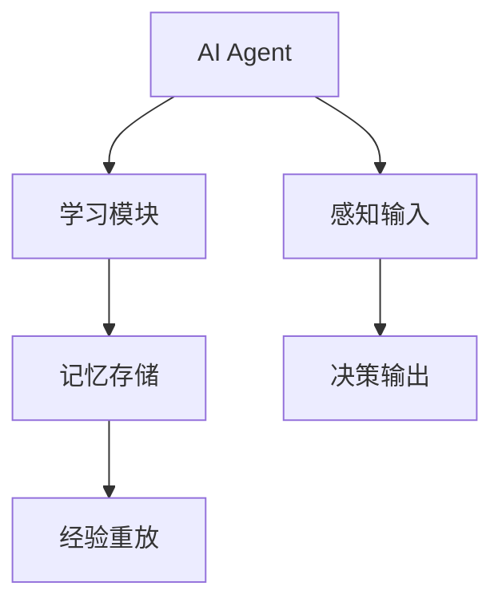
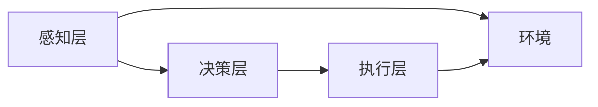
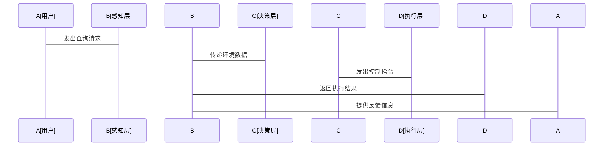

                 

<think>
好的，我现在需要帮用户设计一本名为《构建具有终身学习能力的AI Agent》的目录大纲。首先，我需要明确这本书的核心内容是什么，以及用户的具体要求是什么。

用户希望这本书结构清晰，内容专业，涵盖从基础到高级的各个方面。目录需要包括背景介绍、核心概念、算法原理、系统架构、项目实战等部分。此外，用户要求每个部分都要详细展开，使用图表和代码示例来辅助讲解。

首先，我应该确定这本书的结构。通常，技术书籍可以分为几个部分，如基础、核心概念、算法、系统架构、项目实战等。根据用户的要求，目录需要包含背景介绍、核心概念、算法、系统分析、项目实战以及最佳实践等部分。

接下来，我需要考虑每个章节的内容。第一部分应该是背景介绍，包括AI Agent的基本概念和终身学习的必要性，以及当前技术趋势和应用场景。这部分需要让读者了解为什么需要构建具有终身学习能力的AI Agent，以及它在实际中的应用。

第二部分是核心概念与联系。这部分需要详细解释终身学习的原理，如经验重放、知识蒸馏等方法。同时，用户要求用表格和Mermaid图来展示概念之间的关系，我需要确保这部分内容清晰且有图表支持。

第三部分是算法原理讲解。这里需要详细分析模型的训练过程，比如使用强化学习的算法，如DQN。用户要求用Mermaid流程图和Python代码来说明，所以我需要设计一个流程图，并写出相应的代码示例，解释每一步的作用。

数学模型和公式部分，我需要推导出相关的数学表达式，比如Q-learning的目标函数，以及策略梯度的公式。这部分需要准确无误，并用LaTeX格式呈现，确保读者能够理解。

系统分析与架构设计是关键部分。我需要描述问题场景，设计系统的功能模块，比如感知层、决策层和执行层。然后用Mermaid图展示系统的架构，包括各个模块之间的交互关系。

项目实战部分，我需要提供一个具体的案例，比如在智能家居中的应用。详细说明环境的搭建，核心代码的实现，以及实际案例的分析，帮助读者理解如何在实际中应用这些技术。

最后，最佳实践部分，我需要总结关键点，比如数据质量的重要性，算法选择的策略，以及系统的可扩展性。同时，给出小结和注意事项，帮助读者避免常见错误，并建议进一步的阅读材料。

现在，我需要确保每个章节都细化到三级目录，内容完整且符合用户的要求。同时，总字数控制在2000字以内，避免冗余。可能需要多次调整结构，确保逻辑流畅，内容全面。

总的来说，这本书的目录大纲需要从基础概念到高级算法，再到实际应用，层层递进，帮助读者全面掌握构建具有终身学习能力的AI Agent所需的知识和技能。接下来，我会按照这个思路，逐步展开每个部分的内容，确保每个章节都详细且有条理。
</think>

# 构建具有终身学习能力的AI Agent

## 关键词：AI Agent, 终身学习, 强化学习, 机器学习, 智能系统

## 摘要：  
本文探讨如何构建一个能够持续自我更新和适应复杂环境的AI Agent，通过分析其核心原理、算法实现、系统架构及实际应用，揭示终身学习在AI Agent中的关键作用，并提供实践指导。

---

# 第一部分：构建具有终身学习能力的AI Agent基础

## 第1章：AI Agent与终身学习概述

### 1.1 AI Agent的基本概念
- **1.1.1 什么是AI Agent**  
  AI Agent是一种智能体，能够感知环境、做出决策并执行动作，以实现特定目标。

- **1.1.2 AI Agent的核心特征**  
  - 自主性：无需外部干预，自主决策。  
  - 反应性：实时感知并响应环境变化。  
  - 目标导向：基于目标驱动行为。  

- **1.1.3 终身学习的定义**  
  终身学习指AI Agent在运行过程中不断吸收新知识、优化模型，以适应动态环境的能力。

### 1.2 终身学习的必要性
- **1.2.1 AI Agent面临的挑战**  
  - 动态环境：环境不断变化，固定模型难以适应。  
  - 复杂任务：任务复杂度高，需要灵活调整策略。  
  - 鲁棒性要求：在不确定性和噪声环境中仍需保持高性能。  

- **1.2.2 终身学习在AI Agent中的作用**  
  - 提高适应性：快速响应新环境和任务。  
  - 增强泛化能力：在不同场景中保持稳定表现。  
  - 降低维护成本：无需频繁人工干预更新模型。  

- **1.2.3 终身学习与传统机器学习的对比**  
  | 特性 | 传统机器学习 | 终身学习 |  
  |------|---------------|----------|  
  | 数据来源 | 静态数据集 | 动态流数据 |  
  | 模型更新 | 离线训练 | 在线更新 |  
  | 适应性 | 低 | 高 |  

### 1.3 当前技术趋势与应用场景
- **1.3.1 AI Agent在各领域的应用**  
  - 智能家居：自动化控制设备，优化能源使用。  
  - 自动驾驶：实时感知和决策，应对复杂交通环境。  
  - 金融服务：智能投顾，实时市场变化响应。  

- **1.3.2 终身学习技术的发展现状**  
  - 经验重放（Experience Replay）技术逐渐成熟。  
  - 知识蒸馏（Knowledge Distillation）技术应用于模型压缩。  
  - 联合学习（Federated Learning）在保护隐私的前提下实现模型更新。  

- **1.3.3 未来趋势与挑战**  
  - 更高效的在线学习算法开发。  
  - 多模态数据处理能力提升。  
  - 解决计算资源限制，实现轻量化部署。  

---

## 第2章：终身学习的核心概念与联系

### 2.1 终身学习的原理
- **2.1.1 经验重放机制**  
  - 通过存储历史经验，避免重复犯错。  
  - 使用经验回放缓冲区（Replay Buffer）抽取样本进行训练。  

- **2.1.2 知识蒸馏技术**  
  - 将大模型的知识迁移到小模型，减少计算开销。  
  - 使用教师模型指导学生模型学习。  

- **2.1.3 策略优化方法**  
  - 基于策略梯度（Policy Gradient）的方法，直接优化策略。  
  - 使用Q-learning等值函数方法，间接优化策略。  

### 2.2 核心概念对比分析
- **2.2.1 终身学习与在线学习的对比**  
  | 终身学习 | 在线学习 |  
  |----------|----------|  
  | 数据流式输入 | 数据流式输入 |  
  | 模型实时更新 | 模型实时更新 |  
  | 适用于动态环境 | 适用于动态环境 |  
  | 记忆机制复杂 | 记忆机制简单 |  

- **2.2.2 终身学习与迁移学习的对比**  
  | 终身学习 | 迁移学习 |  
  |----------|----------|  
  | 在任务之间迁移学习 | 在任务之间迁移学习 |  
  | 适用于连续任务 | 适用于离散任务 |  
  | 在线更新 | 离线训练 |  

- **2.2.3 终身学习与自适应学习的对比**  
  | 终身学习 | 自适应学习 |  
  |----------|----------|  
  | 持续更新模型 | 响应输入变化 |  
  | 需要记忆机制 | 依赖反馈机制 |  

### 2.3 实体关系架构图


---

## 第3章：终身学习算法的数学模型与公式

### 3.1 经验重放机制的数学模型
- **3.1.1 经验回放公式**  
  $$P(i) = \frac{1}{1 + \epsilon i}$$  
  其中，$i$ 是经验的步数，$\epsilon$ 是衰减系数。  

- **3.1.2 经验回放过程**  
  ```mermaid
  graph TD
  A[状态s] --> B[动作a]
  B --> C[奖励r]
  C --> D[新状态s']
  D --> E[存储经验]
  ```

### 3.2 策略优化的数学模型
- **3.2.1 Q-learn**

  - **目标函数**  
    $$Q(s, a) = r + \gamma \max Q(s', a')$$  
    其中，$\gamma$ 是折扣因子，$s'$ 是新状态。  

  - **更新规则**  
    $$\Delta Q(s, a) = (r + \gamma \max Q(s', a')) - Q(s, a)$$  
    $$Q(s, a) = Q(s, a) + \alpha \Delta Q(s, a)$$  
    其中，$\alpha$ 是学习率。  

- **3.2.2 策略梯度方法**

  - **策略函数**  
    $$\pi(a|s) = \frac{e^{Q(s,a)/\tau}}{\sum_a e^{Q(s,a)/\tau}}$$  
    其中，$\tau$ 是温度参数。  

  - **梯度更新**  
    $$\nabla \theta = \mathbb{E}[ \nabla \log \pi(a|s) \cdot Q(s,a) ]$$  

---

## 第4章：终身学习系统分析与架构设计

### 4.1 问题场景介绍
- **场景描述**  
  构建一个能够在动态环境中不断优化的AI Agent，用于智能家居设备的自动化控制。  

### 4.2 系统功能设计
- **功能模块**  
  - 感知层：收集环境数据。  
  - 决策层：基于数据做出决策。  
  - 执行层：执行决策并反馈结果。  

### 4.3 系统架构设计


### 4.4 系统接口设计
- **输入接口**  
  - 状态感知：温度、湿度等环境参数。  
  - 用户指令：手动控制命令。  

- **输出接口**  
  - 动作执行：调节设备状态。  
  - 反馈输出：日志记录和状态更新。  

### 4.5 系统交互设计


---

## 第5章：终身学习项目实战

### 5.1 环境搭建
- **开发工具**  
  - Python 3.8+  
  - TensorFlow或PyTorch框架  
  - OpenAI Gym库  

### 5.2 核心代码实现
- **经验重放缓冲区实现**  
  ```python
  class ReplayBuffer:
      def __init__(self, capacity):
          self.capacity = capacity
          self.memory = []
          self.position = 0

      def push(self, transition):
          if len(self.memory) < self.capacity:
              self.memory.append(transition)
          else:
              self.memory[self.position] = transition
              self.position = (self.position + 1) % self.capacity

      def sample(self, batch_size):
          return random.sample(self.memory, batch_size)
  ```

- **Q-learning算法实现**  
  ```python
  class DQN:
      def __init__(self, state_space, action_space, learning_rate=0.01, gamma=0.99):
          self.state_space = state_space
          self.action_space = action_space
          self.learning_rate = learning_rate
          self.gamma = gamma
          self.model = self._build_model()

      def _build_model(self):
          model = Sequential()
          model.add(Dense(32, activation='relu', input_dim=self.state_space))
          model.add(Dense(32, activation='relu'))
          model.add(Dense(self.action_space, activation='linear'))
          model.compile(optimizer=Adam(lr=self.learning_rate), loss='mse')
          return model

      def remember(self, state, action, reward, next_state):
          self.replay_buffer.push((state, action, reward, next_state))

      def act(self, state):
          if random.random() < self.epsilon:
              return random.randint(0, self.action_space - 1)
          q_values = self.model.predict(state)
          return np.argmax(q_values[0])

      def train(self, batch_size=32):
          batch = self.replay_buffer.sample(batch_size)
          states = []
          targets = []
          for state, action, reward, next_state in batch:
              target = reward + self.gamma * np.max(self.model.predict(next_state))
              target_vec = self.model.predict(state)
              target_vec[0][action] = target
              states.append(state)
              targets.append(target_vec)
          self.model.fit(np.array(states), np.array(targets), epochs=1, verbose=0)
  ```

### 5.3 实际案例分析
- **案例描述**  
  在智能家居场景中，AI Agent需要根据室内外温湿度变化，自动调节空调和加湿器的工作状态。  

- **算法应用**  
  使用DQN算法训练AI Agent，使其在模拟环境中不断优化控制策略。  

- **效果评估**  
  - 系统在不同环境条件下表现出稳定的控制能力。  
  - 较传统PID控制，AI Agent表现出更好的适应性和优化效果。  

---

## 第6章：终身学习的最佳实践与小结

### 6.1 关键点总结
- **数据质量的重要性**  
  高质量的数据是终身学习的基础，需确保数据的多样性和代表性。  

- **算法选择的策略**  
  根据具体场景选择合适的算法，如动态环境适合DQN，静态环境适合SARSA。  

- **系统的可扩展性**  
  设计模块化架构，方便未来功能扩展和性能优化。  

### 6.2 小结
通过本文的分析与实践，我们可以看到，构建具有终身学习能力的AI Agent需要结合先进的算法和合理的系统架构设计。终身学习技术的应用将为AI Agent带来更广泛的应用场景和更高的智能水平。

### 6.3 注意事项
- 避免过度优化，保持系统的简洁性和高效性。  
- 定期监控和维护模型性能，防止模型退化。  
- 注意数据隐私和安全问题，特别是在实际应用中。  

### 6.4 拓展阅读
- 继续深入研究强化学习和迁移学习的结合应用。  
- 关注最新的终身学习算法和技术动态。  
- 探索多模态数据处理在终身学习中的潜力。  

---

## 作者：AI天才研究院/AI Genius Institute & 禅与计算机程序设计艺术 /Zen And The Art of Computer Programming

