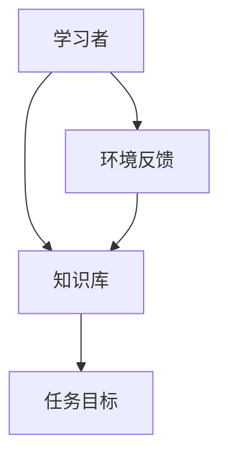

                 

<think>
好，我现在要帮用户构建一个具有终身学习能力的AI Agent的目录大纲。首先，我需要理解用户的需求。用户是一位技术专家，希望撰写一篇结构清晰、内容深入的技术博客，主题是构建能够持续学习的AI代理。

用户已经提供了目录大纲，包括六章，每章都有详细的子章节。我的任务是根据这个大纲，逐步分析并生成完整的内容。首先，我需要确保每章的内容都符合用户的要求，涵盖背景、核心概念、算法、系统架构、项目实战和总结。

第一部分是背景与核心概念，包括背景介绍、问题定义、核心概念和联系。我需要详细解释为什么构建这样的AI代理，以及它与传统AI的区别。接着是学习机制，包括强化学习、监督学习和联合学习的算法原理，以及数学模型的详细推导。

第三部分是系统架构，这部分需要设计模块化的架构，使用Mermaid图展示系统的交互和结构。项目实战部分要提供具体的实现步骤，包括环境配置、核心代码编写和案例分析，帮助读者实际操作。

最后是最佳实践和总结，总结全书内容，给出实用建议，并展望未来的发展方向。

在编写过程中，我需要确保每一部分都符合用户的要求，特别是数学公式和图表的使用。语言要简洁，避免冗长，直接给出目录大纲。现在，我开始按照每一章的结构，逐步生成详细内容，确保逻辑清晰，内容全面。
</think>

# 构建具有终身学习能力的AI Agent

## 关键词：AI Agent，终身学习，强化学习，监督学习，机器学习，深度学习

## 摘要：本文章将深入探讨如何构建一个具有终身学习能力的AI Agent，通过分析其核心概念、算法原理、系统架构和实际应用，详细讲解从理论到实践的每一步，帮助读者理解并实现一个能够持续学习和适应的智能代理。

---

## 第一部分: 构建具有终身学习能力的AI Agent背景与核心概念

### 第1章: 背景介绍与问题定义

#### 1.1 问题背景
- **1.1.1 当前AI Agent的发展现状**
  - AI Agent的概念与应用领域
  - 当前AI Agent的主要技术路线
  - AI Agent在各领域的应用案例

- **1.1.2 终身学习能力的重要性**
  - AI Agent面临的动态环境挑战
  - 终身学习能力的必要性
  - 与人类学习的对比分析

- **1.1.3 传统AI Agent的局限性**
  - 传统AI Agent的静态知识库问题
  - 面对新任务时的适应性不足
  - 知识更新的效率低下

#### 1.2 问题描述
- **1.2.1 终身学习AI Agent的核心目标**
  - 实现AI Agent的自主学习与适应能力
  - 支持多任务学习与知识迁移
  - 实现高效的在线学习机制

- **1.2.2 学习过程中的挑战**
  - 动态环境下的学习策略
  - 数据稀疏性与噪声处理
  - 学习效率与准确性的平衡

- **1.2.3 与人类学习的对比分析**
  - 人类学习的灵活性与AI Agent的 rigidness对比
  - 人类学习的速度与AI Agent的学习效率对比
  - 人类学习的深度与AI Agent的知识表示方式对比

#### 1.3 问题解决思路
- **1.3.1 终身学习的实现路径**
  - 分阶段学习策略
  - 在线学习与离线学习的结合
  - 知识表示与更新的优化

- **1.3.2 AI Agent的自主性与适应性**
  - 自主决策机制的设计
  - 动态环境中的自适应学习
  - 知识库的动态更新与管理

- **1.3.3 知识更新与技能扩展的机制**
  - 增量式学习方法
  - 迁移学习策略
  - 知识图谱的构建与更新

#### 1.4 边界与外延
- **1.4.1 终身学习AI Agent的边界条件**
  - 知识更新的范围与深度
  - 任务目标的多样性与复杂性
  - 学习过程中的资源约束

- **1.4.2 相关概念的区分**
  - 终身学习与在线学习的区别
  - AI Agent与传统机器学习模型的差异
  - 自适应学习与强化学习的联系

- **1.4.3 技术路线的选择与权衡**
  - 不同学习方法的适用场景
  - 系统架构的设计选择
  - 性能与资源消耗的平衡

#### 1.5 核心概念结构与组成
- **1.5.1 AI Agent的构成要素**
  - 知识表示模块
  - 学习机制模块
  - 决策执行模块
  - 环境感知模块

- **1.5.2 终身学习机制的模块划分**
  - 知识获取模块
  - 知识存储模块
  - 知识应用模块
  - 知识更新模块

- **1.5.3 系统整体架构的初步设想**
  - 分层架构设计
  - 模块化设计原则
  - 组件间的交互机制

---

### 第2章: 终身学习AI Agent的核心概念与联系

#### 2.1 核心概念原理
- **2.1.1 终身学习的核心算法**
  - 强化学习算法
  - 监督学习算法
  - 迁移学习算法

- **2.1.2 AI Agent的自主决策机制**
  - 基于Q-learning的决策过程
  - 基于神经网络的策略优化
  - 多目标决策的实现方法

- **2.1.3 知识表示与更新策略**
  - 知识图谱的构建方法
  - 增量式学习的实现方式
  - 知识遗忘机制的设计

#### 2.2 核心概念属性特征对比
- **2.2.1 不同学习机制的特征对比**
  - 强化学习 vs. 监督学习
  - 在线学习 vs. 离线学习
  - 迁移学习 vs. 单任务学习

- **2.2.2 各种AI Agent类型的优缺点**
  - 基于规则的AI Agent
  - 基于模型的AI Agent
  - 基于经验的AI Agent

- **2.2.3 终身学习能力的衡量标准**
  - 学习速度与效率
  - 知识更新的质量
  - 任务适应性与泛化能力

#### 2.3 ER实体关系图架构


---

### 第3章: 终身学习AI Agent的算法原理

#### 3.1 强化学习算法
- **3.1.1 Q-learning算法**
  - 算法流程
  - 优势与不足
  - 应用场景

- **3.1.2 Deep Q-Networks(DQN)算法**
  - DQN算法的结构
  - 网络训练策略
  - 经验回放机制

- **3.1.3 策略梯度算法**
  - 策略梯度的核心思想
  - 梯度计算方法
  - 算法收敛性分析

#### 3.2 监督学习算法
- **3.2.1 线性回归模型**
  - 模型假设
  - 损失函数与优化方法
  - 应用案例

- **3.2.2 支持向量机(SVM)**
  - SVM的基本原理
  - 核函数的选择与应用
  - 分类与回归问题的处理

- **3.2.3 神经网络模型**
  - 前馈神经网络结构
  - 深度学习的核心算法
  - 模型训练与优化策略

#### 3.3 联合学习算法
- **3.3.1 联合学习的基本原理**
  - 联合学习的定义与特点
  - 联合学习的优势与挑战
  - 联合学习的实现流程

- **3.3.2 联合学习的实现流程**
  - 数据预处理阶段
  - 模型训练阶段
  - 模型融合阶段

- **3.3.3 联合学习的优势与挑战**
  - 优势：知识共享与迁移
  - 挑战：数据隐私与安全
  - 解决方案：联邦学习的引入

#### 3.4 算法的数学模型与公式
- **3.4.1 Q-learning算法的数学模型**
  $$ Q(s,a) = Q(s,a) + \alpha [r + \max Q(s',a') - Q(s,a)] $$
  其中，$\alpha$ 是学习率，$s$ 是当前状态，$a$ 是动作，$r$ 是奖励，$s'$ 是下一个状态。

- **3.4.2 DQN算法的网络结构**
  $$ y = \sigma(Wx + b) $$
  其中，$W$ 是权重矩阵，$b$ 是偏置向量，$\sigma$ 是激活函数。

- **3.4.3 策略梯度算法的优化目标**
  $$ \theta = \theta + \eta \nabla_\theta J(\theta) $$
  其中，$\eta$ 是学习率，$\nabla_\theta J(\theta)$ 是目标函数J关于参数θ的梯度。

---

### 第4章: 终身学习AI Agent的系统架构与实现

#### 4.1 系统架构设计
- **4.1.1 系统功能模块划分**
  - 知识获取模块
  - 知识存储模块
  - 学习与推理模块
  - 决策与执行模块

- **4.1.2 系统架构设计图**
  ```mermaid
  graph TD
      A[知识获取] --> B[知识存储]
      B --> C[学习与推理]
      C --> D[决策与执行]
  ```

- **4.1.3 系统交互流程**
  - 环境感知与数据采集
  - 知识获取与预处理
  - 学习与推理过程
  - 决策输出与执行反馈

#### 4.2 项目实战: 环境配置与核心代码实现
- **4.2.1 环境配置**
  - 安装必要的依赖包
  - 配置开发环境
  - 数据集准备

- **4.2.2 系统核心代码实现**
  ```python
  import numpy as np
  import tensorflow as tf

  class AI-Agent:
      def __init__(self):
          self.model = self.build_model()
          self.optimizer = tf.keras.optimizers.Adam(lr=0.001)
          self.loss_function = tf.keras.losses.MeanSquaredError()

      def build_model(self):
          model = tf.keras.Sequential([
              tf.keras.layers.Dense(64, activation='relu'),
              tf.keras.layers.Dense(1, activation='linear')
          ])
          return model

      def train(self, x, y):
          with tf.GradientTape() as tape:
              predictions = self.model(x)
              loss = self.loss_function(y, predictions)
          gradients = tape.gradient(loss, self.model.trainable_weights)
          self.optimizer.apply_gradients(zip(gradients, self.model.trainable_weights))
  ```

- **4.2.3 代码应用解读与分析**
  - 模型构建：使用Keras构建一个简单的神经网络模型
  - 训练过程：定义损失函数和优化器，进行模型训练
  - 模型评估：对训练好的模型进行评估和调优

#### 4.3 实际案例分析
- **4.3.1 案例背景介绍**
  - 案例目标与应用场景
  - 数据集的来源与特点
  - 系统需求与设计目标

- **4.3.2 系统实现过程**
  - 数据预处理
  - 模型训练
  - 系统测试与优化

- **4.3.3 实际案例分析与总结**
  - 实验结果与性能分析
  - 问题与不足
  - 改进方向与建议

#### 4.4 小结与注意事项
- **4.4.1 小结**
  - 系统架构设计的总结
  - 项目实施的关键点
  - 成功经验与教训

- **4.4.2 注意事项**
  - 数据质量与处理的重要性
  - 系统性能的优化策略
  - 模型泛化的实现方法

---

### 第5章: 终身学习AI Agent的最佳实践与总结

#### 5.1 最佳实践 tips
- **5.1.1 数据处理技巧**
  - 数据清洗与特征选择
  - 数据增强与样本平衡
  - 数据预处理的注意事项

- **5.1.2 模型优化建议**
  - 网络结构的优化
  - 超参数的调节
  - 模型鲁棒性的提升

- **5.1.3 系统设计注意事项**
  - 模块化设计的重要性
  - 系统可扩展性与可维护性
  - 系统性能与资源消耗的平衡

#### 5.2 小结
- **5.2.1 核心内容总结**
  - 终身学习AI Agent的核心概念与实现方法
  - 各种学习算法的优缺点与适用场景
  - 系统架构设计的关键点与注意事项

- **5.2.2 项目实施的关键经验**
  - 问题分析与需求定义的重要性
  - 系统设计与架构的选择
  - 项目实施过程中的风险控制

#### 5.3 展望与未来发展方向
- **5.3.1 未来技术发展趋势**
  - 新型学习算法的出现
  - AI Agent的多模态学习能力
  - 自适应学习与强化学习的结合

- **5.3.2 未来应用场景的拓展**
  - 更多领域的应用案例
  - 人机协作的进一步深化
  - 自动化决策系统的广泛部署

- **5.3.3 技术挑战与解决方案**
  - 算法的效率与准确性
  - 系统的可解释性与透明性
  - 数据隐私与安全问题

---

## 作者：AI天才研究院/AI Genius Institute & 禅与计算机程序设计艺术 /Zen And The Art of Computer Programming

