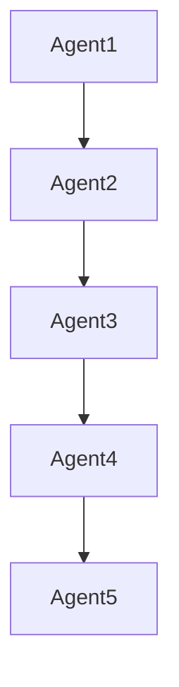
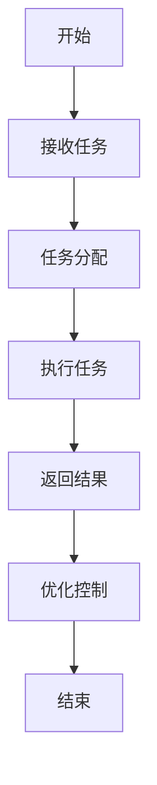
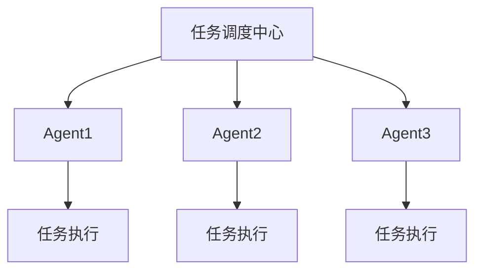

                 

<think>
嗯，我现在要帮用户写一篇关于构建具有群体智能的多Agent协作系统的技术博客。用户希望文章结构清晰，内容专业且有深度。首先，我需要理解用户的需求，他是一位技术专家，希望文章逻辑严谨，有详细的分析和实例。

用户给了一个大纲，我需要按照这个大纲来组织内容。文章的标题是《构建具有群体智能的多Agent协作系统》，关键词包括多Agent系统、群体智能、分布式计算、协作算法、系统架构。摘要部分要简明扼要，概述文章的核心内容。

接下来，我需要详细分析每一部分。首先是背景介绍，包括多Agent系统和群体智能的基本概念，应用背景，挑战和机遇。这部分需要让读者明白为什么多Agent协作系统和群体智能是重要的，以及它们的应用场景。

然后是核心概念与联系，我需要详细解释Agent和群体智能的核心原理，使用表格和Mermaid图来对比不同算法，展示实体关系。这部分需要清晰的逻辑，让读者理解不同概念之间的联系。

算法原理部分，我需要选择几个典型的群体智能算法，比如遗传算法、模拟退火和蚁群算法，用Mermaid流程图展示其工作流程，并提供Python代码实现。同时，用数学公式解释算法的原理，结合例子帮助读者理解。

系统分析与架构设计部分，我需要描述如何构建一个基于群体智能的多Agent系统，包括问题场景、系统功能设计、架构设计、接口设计和交互序列图。这部分需要展示系统的整体结构和各个部分如何协同工作。

项目实战部分，我需要提供一个具体的案例，比如任务调度系统，包括环境安装、核心代码实现、代码解读和案例分析。这部分需要让读者能够实际操作，理解理论在实践中的应用。

最后，最佳实践部分需要总结整个系统的构建过程，给出小结、注意事项和未来的发展方向，并提供拓展阅读的建议。这部分帮助读者巩固所学知识，并引导他们进一步深入学习。

在写作过程中，我需要确保每个章节之间有逻辑上的连贯性，从基础概念到算法实现，再到系统设计和项目实战，层层递进。同时，每个章节的三级目录要具体，确保读者能够逐步深入理解主题。

现在，我需要检查是否遗漏了用户要求的任何部分，比如Mermaid图和Python代码的使用，以及数学公式的正确展示。确保每个部分都有足够的细节，并且内容完整且逻辑清晰。

总之，我需要按照用户的要求，逐步分析和构建这篇文章，确保每一部分都符合要求，同时保持整体结构的合理性和内容的深度。
</think>

# 《构建具有群体智能的多Agent协作系统》

> **关键词**：多Agent系统、群体智能、分布式计算、协作算法、系统架构  
>
> **摘要**：  
> 本文深入探讨了构建具有群体智能的多Agent协作系统的理论基础、算法实现与系统设计。通过分析多Agent系统的背景、核心概念与算法原理，结合实际案例，详细讲解了如何利用群体智能算法优化多Agent协作过程。文章还提供了系统架构设计与实现方案，帮助读者全面理解并掌握构建此类系统的关键技术。

---

## 第1章: 多Agent协作系统与群体智能基础

### 1.1 多Agent系统的基本概念

#### 1.1.1 Agent的定义与特征
**Agent**（智能体）是指在计算环境中能够感知环境并采取行动以实现目标的实体。Agent的核心特征包括：
- **自主性**：能够在无外部干预的情况下独立运作。
- **反应性**：能够感知环境并实时调整行为。
- **主动性**：主动采取行动以实现目标。
- **社会性**：能够与其他Agent或人类进行交互与协作。

#### 1.1.2 多Agent系统的分类
多Agent系统可以根据多个维度进行分类：
- **按智能体类型**：分为简单反射型Agent、基于模型的反射型Agent、目标驱动型Agent、效用驱动型Agent等。
- **按协作方式**：分为松耦合系统和紧耦合系统。
- **按应用场景**：分为分布式计算、机器人协作、分布式控制等领域。

#### 1.1.3 多Agent协作的重要性
在复杂问题中，单个Agent难以独立完成任务，因此需要通过协作来实现全局目标。多Agent协作能够提高系统的灵活性、可靠性和适应性。

---

### 1.2 群体智能的定义与特点

#### 1.2.1 群体智能的基本概念
群体智能（Swarm Intelligence）是指通过大量简单个体（Agent）的协作，实现复杂问题求解的智能形式。其核心在于通过局部交互实现全局优化。

#### 1.2.2 群体智能的核心特征
- **分布式性**：个体之间通过局部交互完成全局任务。
- **自主性**：每个个体独立感知并采取行动。
- **涌现性**：全局智能并非由单个个体产生，而是通过协作自然涌现。

#### 1.2.3 群体智能与多Agent系统的联系
群体智能是多Agent协作的一种高级形式，通过模拟生物群体的行为，实现复杂问题的分布式优化。

---

### 1.3 多Agent协作系统的应用背景

#### 1.3.1 当前多Agent系统的发展趋势
随着计算能力的提升和分布式系统的普及，多Agent系统在多个领域的应用日益广泛。

#### 1.3.2 群体智能在实际问题中的应用
群体智能算法广泛应用于路径规划、资源分配、任务调度等领域。

#### 1.3.3 多Agent协作系统的挑战与机遇
- **挑战**：通信开销、同步问题、安全性。
- **机遇**：提高系统的灵活性和适应性。

---

## 第2章: 群体智能的核心概念与联系

### 2.1 群体智能的核心原理

#### 2.1.1 分布式计算与协作
群体智能通过分布式计算实现协作，每个个体仅与局部邻居交互，但能够完成全局任务。

#### 2.1.2 自组织与自适应机制
群体智能系统具有自组织能力，能够在无中心控制的情况下实现任务分配和协作。

#### 2.1.3 基于Agent的群体智能模型
基于Agent的群体智能模型通过模拟生物群体的行为，实现复杂问题的分布式求解。

---

### 2.2 群体智能算法的对比分析

#### 2.2.1 群体智能算法的分类
常见的群体智能算法包括：
- 遗传算法（Genetic Algorithm，GA）
- 模拟退火算法（Simulated Annealing，SA）
- 蚁群算法（Ant Colony Optimization，ACO）
- 粒子群优化（Particle Swarm Optimization，PSO）

#### 2.2.2 不同算法的特征对比

| 算法名称 | 进化机制 | 适应度函数 | 搜索策略 |
|----------|----------|------------|----------|
| GA       | 选择、交叉、变异 | 单点评估 | 全局搜索 |
| SA       | 温度降低 | 单点评估 | 局部搜索 |
| ACO      | 信息素更新 | 单点评估 | 局部搜索 |
| PSO      | 群体协作 | 单点评估 | 全局搜索 |

#### 2.2.3 群体智能算法的实体关系图



---

## 第3章: 群体智能算法的实现原理

### 3.1 遗传算法（Genetic Algorithm）

#### 3.1.1 算法流程图

```mermaid
graph TD
    A[开始] --> B[初始化种群]
    B --> C[计算适应度]
    C --> D[选择父代]
    D --> E[进行交叉]
    E --> F[进行变异]
    F --> G[新种群]
    G --> H[判断是否满足终止条件]
    H --> I[结束] 或者 H --> B[继续迭代]
```

#### 3.1.2 遗传算法的数学模型
- **适应度函数**：$f(x) = x^2$
- **选择操作**：基于适应度值进行选择。
- **交叉操作**：单点交叉或均匀交叉。
- **变异操作**：随机变异。

---

### 3.2 模拟退火算法（Simulated Annealing）

#### 3.2.1 算法流程图

```mermaid
graph TD
    A[开始] --> B[初始化当前解]
    B --> C[计算适应度]
    C --> D[判断是否接受解]
    D --> E[降温]
    E --> B[继续迭代]
    或者 D --> F[结束]
```

#### 3.2.2 模拟退火算法的数学模型
- **适应度函数**：$f(x) = \sin(x)$
- **降温策略**：逐渐降低温度，减少接受劣解的概率。

---

### 3.3 蚁群算法（Ant Colony Optimization）

#### 3.3.1 算法流程图

```mermaid
graph TD
    A[开始] --> B[初始化信息素]
    B --> C[蚂蚁遍历路径]
    C --> D[更新信息素]
    D --> E[判断是否满足终止条件]
    E --> F[结束] 或者 E --> B[继续迭代]
```

#### 3.3.2 蚁群算法的数学模型
- **信息素更新**：$\tau_{ij} = \tau_{ij} + \Delta\tau_{ij}$
- **路径选择概率**：$p_{ij} = \frac{\tau_{ij}}{\sum \tau_{ij}}$

---

## 第4章: 系统分析与架构设计

### 4.1 问题场景介绍

#### 4.1.1 问题背景
假设我们有一个分布式任务调度系统，需要通过多Agent协作优化任务分配。

#### 4.1.2 项目介绍
本项目旨在设计一个基于群体智能的多Agent协作系统，实现任务的最优分配。

---

### 4.2 系统功能设计

#### 4.2.1 系统功能模块
- **任务分配模块**：负责将任务分配给不同的Agent。
- **协作通信模块**：实现Agent之间的信息交互。
- **优化控制模块**：基于群体智能算法优化任务分配。

#### 4.2.2 系统功能流程图



---

### 4.3 系统架构设计

#### 4.3.1 系统架构图



---

## 第5章: 项目实战

### 5.1 环境安装

#### 5.1.1 系统需求
- Python 3.8+
- Mermaid工具
-基本的编程环境

#### 5.1.2 安装依赖
```bash
pip install mermaid
```

---

### 5.2 系统核心实现

#### 5.2.1 核心代码实现
```python
def genetic_algorithm(population_size, fitness_func):
    # 初始化种群
    population = [random个体 for _ in range(population_size)]
    while not 终止条件：
        # 计算适应度
        fitness = [fitness_func(individual) for individual in population]
        # 选择父代
        selected = select_parents(population, fitness)
        # 交叉
        offspring = crossover(selected)
        # 变异
        new_population = mutate(offspring)
        population = new_population
    return population
```

---

### 5.3 代码解读与分析

#### 5.3.1 群体智能算法的实现细节
- 遗传算法的核心在于适应度函数的设计和种群的进化策略。
- 蚁群算法的关键在于信息素的更新规则。

---

## 第6章: 最佳实践与总结

### 6.1 本章小结
本文详细介绍了构建具有群体智能的多Agent协作系统的理论基础、算法实现与系统设计。通过实际案例，展示了如何利用群体智能优化多Agent协作过程。

### 6.2 注意事项
- 群体智能算法的参数设置对系统性能影响较大，需要根据具体问题进行调整。
- 系统设计中需要考虑通信开销和同步问题。

### 6.3 未来展望
群体智能与多Agent协作系统的结合将推动分布式计算的发展，未来的研究方向包括更高效的算法设计和更复杂的系统架构。

---

**作者：AI天才研究院/AI Genius Institute & 禅与计算机程序设计艺术 /Zen And The Art of Computer Programming**

