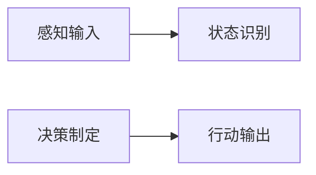
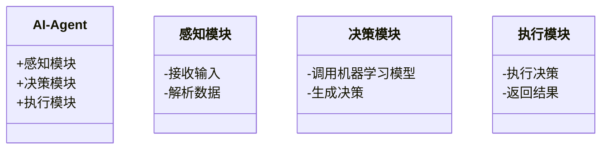

                 


# 构建具有自动机器学习能力的AI Agent

> 关键词：AI Agent, 自动机器学习, 深度学习, 算法, 系统架构

> 摘要：本文将详细介绍如何构建一个具有自动机器学习能力的AI Agent。首先，我们将探讨自动机器学习和AI Agent的核心概念及其重要性。接着，我们分析相关的算法原理，并通过实际案例展示如何设计和实现一个AI Agent系统。最后，我们将讨论系统架构和最佳实践，确保AI Agent能够高效运行并适应各种应用场景。

---

# 第一部分: 自动机器学习与AI Agent概述

# 第1章: 背景介绍

## 1.1 问题背景

在人工智能快速发展的今天，传统的AI系统已经逐渐显现出一些局限性。这些系统通常依赖于人工设定的规则和预定义的模型，难以应对复杂多变的环境和任务。例如，在客服系统中，传统的规则引擎可能无法有效处理用户的多样化需求，也无法自适应地优化服务质量。

### 1.1.1 传统AI系统的局限性
- **规则依赖性**：传统AI系统依赖于人工设计的规则，缺乏灵活性。
- **适应性不足**：面对环境变化，系统难以自动调整策略。
- **数据利用率低**：无法有效利用新数据进行优化。

### 1.1.2 自动机器学习的需求
- **数据驱动**：通过大量数据训练模型，实现自动优化。
- **动态适应**：能够根据反馈调整模型，适应新任务。
- **高效率**：快速迭代模型，提高处理效率。

### 1.1.3 AI Agent在实际场景中的应用
- **智能客服**：通过自动学习提升客户满意度。
- **推荐系统**：根据用户行为动态调整推荐策略。
- **游戏AI**：在复杂游戏中实现自我优化。

## 1.2 问题描述

AI Agent的核心目标是实现自主决策和动态优化，而自动机器学习则是其实现这一目标的关键技术。问题的关键在于如何将机器学习模型嵌入到AI Agent中，使其能够自主学习和适应新任务。

### 1.2.1 AI Agent的核心目标
- **自主决策**：在没有外部干预的情况下，做出合理决策。
- **动态优化**：根据环境反馈，优化自身行为。
- **高效学习**：快速从数据中提取有用信息，提高任务效率。

### 1.2.2 自动机器学习的关键问题
- **模型选择**：如何自动选择合适的机器学习模型。
- **数据预处理**：如何高效处理和清洗数据。
- **模型部署**：如何将模型无缝集成到AI Agent中。

### 1.2.3 问题的边界与外延
- **边界**：自动机器学习仅关注模型训练和部署，不涉及数据收集和环境交互。
- **外延**：AI Agent的设计不仅包括机器学习部分，还涉及决策逻辑和行为规划。

## 1.3 问题解决

### 1.3.1 自动机器学习的解决方案
- **自动化数据处理**：使用工具如Pandas进行数据清洗和特征工程。
- **自动模型选择**：通过网格搜索或自动选择算法选择最优模型。
- **模型部署**：将训练好的模型集成到AI Agent中，实现实时推理。

### 1.3.2 AI Agent的设计思路
- **模块化设计**：将AI Agent划分为感知、决策和执行模块。
- **数据驱动决策**：利用机器学习模型生成决策建议。
- **动态调整**：根据反馈不断优化模型参数。

### 1.3.3 问题解决的可行性分析
- **技术可行性**：现代机器学习框架如TensorFlow和PyTorch已经提供了丰富的工具。
- **资源可行性**：云计算提供了强大的计算资源，支持模型训练和部署。
- **人员可行性**：需要具备机器学习和AI开发经验的人员。

## 1.4 核心概念与联系

### 1.4.1 核心概念原理
- **自动机器学习**：通过自动化工具和算法，实现模型的自动训练和部署。
- **AI Agent**：具备自主决策和学习能力的智能体，能够与环境交互并完成任务。

### 1.4.2 核心概念属性对比表

| 概念       | 属性           | 描述                                                         |
|------------|----------------|----------------------------------------------------------|
| 自动机器学习 | 数据驱动       | 依赖大量数据进行模型训练                                   |
|            | 自动优化       | 系统自动调整模型参数                                       |
|            | 高效性         | 提高模型训练和部署效率                                       |
| AI Agent   | 自主性         | 能够自主决策和行动                                         |
|            | 智能性         | 具备理解和推理能力                                         |
|            | 动态适应性     | 根据环境反馈调整行为                                       |

### 1.4.3 ER实体关系图

```mermaid
graph LR
A[自动机器学习] --> B[AI Agent]
C[数据输入] --> B
D[模型输出] <-- B
```

---

# 第2章: 核心概念与联系

## 2.1 核心概念原理

### 2.1.1 自动机器学习的原理
- **数据预处理**：清洗数据，提取特征。
- **模型训练**：使用算法训练模型。
- **模型部署**：将模型集成到AI Agent中，实时进行预测。

### 2.1.2 AI Agent的核心机制
- **感知**：通过传感器或接口获取环境信息。
- **决策**：基于感知信息，利用机器学习模型生成决策。
- **执行**：根据决策结果采取行动。

### 2.1.3 两者结合的逻辑关系
- 自动机器学习为AI Agent提供决策模型。
- AI Agent为自动机器学习提供数据和环境反馈，形成闭环。

## 2.2 核心概念属性对比

### 2.2.1 自动机器学习与传统机器学习对比

| 特性             | 自动机器学习          | 传统机器学习         |
|------------------|-----------------------|----------------------|
| 数据处理         | 自动化处理            | 手动处理             |
| 模型选择         | 自动选择最优模型      | 手动选择             |
| 部署效率         | 快速部署              | 部署过程复杂          |

### 2.2.2 AI Agent与传统AI系统对比

| 特性             | AI Agent              | 传统AI系统           |
|------------------|-----------------------|----------------------|
| 自主性           | 高度自主              | 依赖外部指令          |
| 适应性           | 能够动态调整          | 适应性有限           |
| 智能性           | 具备学习和推理能力     | 仅执行预定义规则      |

## 2.3 ER实体关系图

```mermaid
graph LR
A[自动机器学习] --> B[AI Agent]
C[数据输入] --> B
D[模型输出] <-- B
```

---

# 第3章: 算法原理讲解

## 3.1 算法原理概述

### 3.1.1 自动机器学习的算法特点
- **高效性**：算法能够快速收敛，减少训练时间。
- **自适应性**：算法能够根据数据自动调整参数。
- **鲁棒性**：算法能够处理噪声和异常数据。

### 3.1.2 AI Agent的算法框架
- **感知层**：利用传感器或API获取环境信息。
- **决策层**：基于感知信息，利用机器学习模型生成决策。
- **执行层**：根据决策结果采取行动。

## 3.2 算法流程图

### 3.2.1 自动机器学习流程图

```mermaid
graph LR
A[数据预处理] --> B[特征提取]
C[模型训练] --> D[模型优化]
E[模型部署] <-- D
```

### 3.2.2 AI Agent算法流程图



## 3.3 算法实现代码

### 3.3.1 Python代码实现

```python
def automatic_ml_agent(data):
    # 数据预处理
    preprocessed_data = preprocess(data)
    # 特征提取
    features = extract_features(preprocessed_data)
    # 模型训练
    model = train_model(features)
    # 模型优化
    optimized_model = optimize_model(model, features)
    # 模型部署
    result = deploy_model(optimized_model, features)
    return result
```

## 3.4 数学模型

### 3.4.1 强化学习模型

$$ Q-learning公式：Q(s, a) = r + \gamma \max Q(s', a') $$

其中：
- \( Q(s, a) \) 表示状态 \( s \) 下采取行动 \( a \) 的价值。
- \( r \) 表示奖励。
- \( \gamma \) 表示折扣因子。
- \( Q(s', a') \) 表示下一个状态 \( s' \) 下采取行动 \( a' \) 的价值。

### 3.4.2 监督学习模型

$$ 误差函数：L = \frac{1}{n}\sum_{i=1}^{n}(y_i - \hat{y}_i)^2 $$

其中：
- \( y_i \) 表示真实值。
- \( \hat{y}_i \) 表示预测值。
- \( n \) 表示数据点数量。

---

# 第4章: 系统分析与架构设计方案

## 4.1 系统分析

### 4.1.1 问题场景介绍
- **客服系统**：AI Agent自动处理客户咨询，提高服务质量。
- **推荐系统**：根据用户行为动态调整推荐策略。

## 4.2 系统功能设计

### 4.2.1 领域模型



### 4.2.2 系统架构设计


## 4.3 系统接口设计

### 4.3.1 API接口

| 接口名称 | 输入 | 输出 |
|----------|------|------|
| processInput | 用户输入 | 处理结果 |
| getModel | 模型参数 | 模型 |
| deployModel | 模型信息 | 部署结果 |

### 4.3.2 交互流程图


---

# 第5章: 项目实战

## 5.1 环境安装

### 5.1.1 安装Python

```bash
python --version
```

### 5.1.2 安装机器学习库

```bash
pip install numpy scikit-learn tensorflow
```

## 5.2 系统核心实现

### 5.2.1 核心代码实现

```python
def preprocess(data):
    # 数据清洗和特征工程
    return processed_data

def train_model(features):
    # 训练机器学习模型
    return model

def optimize_model(model, features):
    # 模型优化
    return optimized_model

def deploy_model(model, features):
    # 模型部署
    return prediction
```

### 5.2.2 代码应用解读

- **preprocess**：对输入数据进行清洗和特征提取，确保模型输入的正确性。
- **train_model**：训练机器学习模型，选择最优算法。
- **optimize_model**：对模型进行调优，提高预测准确性。
- **deploy_model**：将优化后的模型部署到AI Agent中，实时进行预测。

## 5.3 实际案例分析

### 5.3.1 案例分析


### 5.3.2 案例解读

- **用户咨询**：用户向AI Agent提出问题。
- **感知模块**：解析用户输入，提取关键信息。
- **决策模块**：调用机器学习模型生成回复。
- **执行模块**：输出回复，完成咨询。

## 5.4 项目总结

通过以上步骤，我们成功构建了一个具备自动机器学习能力的AI Agent。该系统能够自主处理用户咨询，提高服务质量，展现了自动机器学习的强大能力。

---

# 第6章: 最佳实践

## 6.1 小结

- **自动机器学习**：通过自动化工具和算法，实现模型的自动训练和部署。
- **AI Agent**：具备自主决策和学习能力的智能体，能够与环境交互并完成任务。

## 6.2 注意事项

- **数据质量**：确保数据的准确性和完整性，避免噪声干扰。
- **模型选择**：根据任务需求选择合适的算法，避免过度拟合。
- **系统维护**：定期更新模型，确保系统的持续优化。

## 6.3 拓展阅读

- **《机器学习实战》**：深入理解机器学习算法和实践。
- **《深度学习》**：掌握深度学习的核心原理和技术。

---

# 附录

## 附录A: API文档

### AI Agent API接口

| 方法 | 路径           | 描述             |
|------|----------------|------------------|
| POST | /api/process   | 处理用户输入     |
| GET  | /api/model     | 获取当前模型     |
| POST | /api/deploy   | 部署新模型       |

## 附录B: 工具推荐

### 开发工具

- **Python**：编程语言。
- **TensorFlow**：深度学习框架。
- **Keras**：深度学习API。

---

作者：AI天才研究院/AI Genius Institute & 禅与计算机程序设计艺术 /Zen And The Art of Computer Programming

