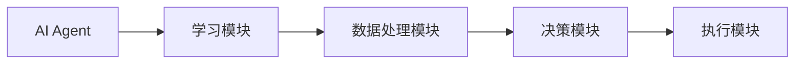
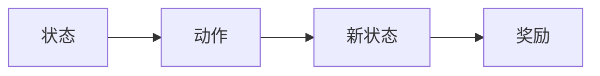
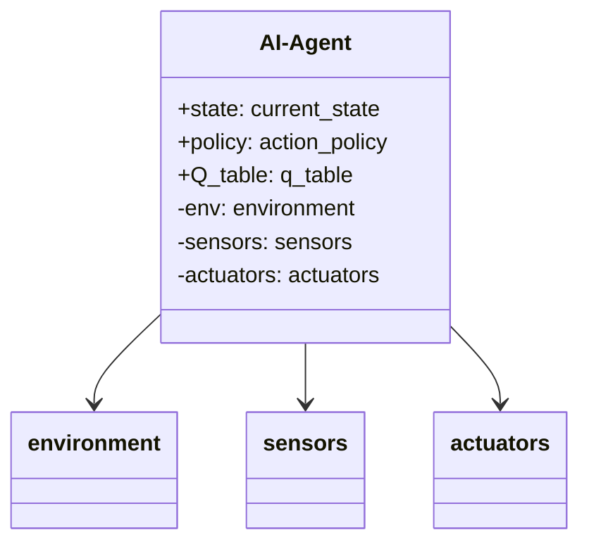
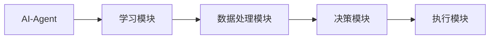
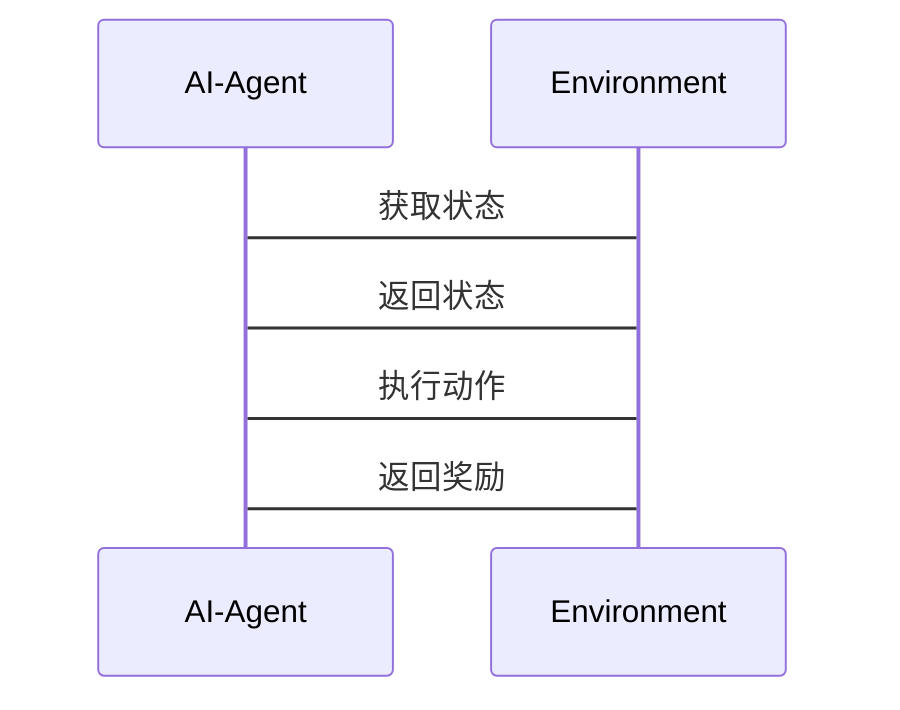

                 

<think>
嗯，用户让我写一篇关于《构建具有自动机器学习能力的AI Agent》的技术博客文章，而且需要按照特定的结构和要求来写。首先，我需要明确用户的需求，确保我理解所有的要求。

用户希望文章的结构包括标题、关键词、摘要，然后是详细的内容，分为几个部分，每个部分有小节。文章需要使用markdown格式，字数在10000到12000字左右。同时，内容要详细，每个小节都要有丰富的讲解，包括背景介绍、核心概念与联系、算法原理、系统分析与架构设计、项目实战以及最佳实践等部分。

我注意到用户特别强调了每个部分的具体要求，比如背景介绍部分需要涵盖问题背景、问题描述、边界与外延，以及核心要素。核心概念部分需要有对比表和ER图，用Mermaid画出来。算法原理部分需要详细讲解Q-learning算法，包括流程图和Python代码示例。系统架构部分需要用Mermaid画出类图、架构图和序列图。项目实战部分需要包括环境安装、代码实现和案例分析。最后，还要有小结和注意事项。

现在，我需要按照这些要求一步步构建文章。首先，确定文章标题和关键词。标题已经给定，关键词可能包括AI Agent、自动机器学习、强化学习、自适应系统等。摘要部分需要简洁地总结文章的核心内容，即构建AI Agent的自动机器学习能力的方法和实现。

接下来是正文部分，从背景介绍开始。这部分需要详细解释为什么需要AI Agent，传统AI的局限性，以及自动机器学习的重要性。然后，描述问题，说明自动机器学习在AI Agent中的应用，包括目标、范围和边界。最后，介绍核心要素，如学习模块、数据处理模块等。

核心概念与联系部分，我需要比较自动机器学习与其他学习方法，制作对比表格，并绘制ER图，展示各个模块之间的关系。算法原理部分，重点讲解Q-learning算法，包括流程图和代码示例。数学公式需要用Latex表示，确保准确无误。

系统分析与架构设计部分，需要介绍应用场景，设计系统功能，用Mermaid画出类图和架构图。接口和交互设计用序列图展示。项目实战部分，详细指导环境安装，提供代码实现，分析案例，并总结经验。最后，最佳实践部分给出注意事项和拓展阅读建议。

在写作过程中，我需要确保每个部分都详细且结构清晰，同时使用markdown格式，保持整体的美观和可读性。最后，加上作者信息，确保文章完整。

现在，我需要一步步按照这些要求编写文章，确保每个部分都符合用户的要求，并且内容详实，结构合理。这可能需要多次修改和调整，以确保最终的文章既专业又易于理解。
</think>

# 构建具有自动机器学习能力的AI Agent

> **关键词**: AI Agent, 自动机器学习, 强化学习, 自适应系统, 算法实现, 系统架构

> **摘要**: 本文详细探讨了构建具有自动机器学习能力的AI Agent的理论基础、算法实现、系统架构设计及实际应用。通过结合强化学习与自适应算法，本文提出了一种创新的解决方案，为AI Agent在复杂动态环境中的自主学习和决策提供了新的思路。

---

# 第一部分: 背景介绍

## 第1章: 自动机器学习与AI Agent的背景介绍

### 1.1 问题背景

#### 1.1.1 传统AI Agent的局限性
传统AI Agent通常依赖于预定义的规则和静态知识库，难以在动态变化的环境中进行自适应调整。这种 rigidity限制了AI Agent在复杂场景中的应用能力。

#### 1.1.2 自动机器学习的需求与挑战
随着应用场景的复杂化，AI Agent需要具备自动学习和自适应能力，以应对未知的挑战。自动机器学习的实现需要解决数据处理、算法选择和模型优化等技术难题。

#### 1.1.3 问题解决的必要性
通过引入自动机器学习能力，AI Agent可以实现自我改进和优化，提升其在动态环境中的适应性和决策能力。

### 1.2 问题描述

#### 1.2.1 AI Agent的核心功能
AI Agent需要具备感知环境、学习知识、做出决策和执行任务的能力。

#### 1.2.2 自动机器学习的目标与范围
自动机器学习的目标是让AI Agent能够自主优化其行为策略，减少对外部干预的依赖。

#### 1.2.3 边界与外延
本文的研究范围主要集中在强化学习和监督学习的结合应用，暂时不涉及无监督学习。

### 1.3 概念结构与核心要素

#### 1.3.1 AI Agent的基本组成
- **感知模块**: 用于获取环境信息。
- **学习模块**: 负责知识的获取和更新。
- **决策模块**: 基于当前状态做出决策。
- **执行模块**: 执行具体操作。

#### 1.3.2 自动机器学习的实现要素
- **数据流**: 包括输入数据、特征提取和数据预处理。
- **算法选择**: 包括强化学习、监督学习和自适应算法。
- **模型优化**: 包括超参数调整和模型迭代。

---

## 第2章: 核心概念与联系

### 2.1 自动机器学习的原理

#### 2.1.1 强化学习与监督学习的对比
| 特性       | 强化学习                     | 监督学习                     |
|------------|------------------------------|------------------------------|
| 数据类型    | 状态和奖励                   | 标签数据                     |
| 目标函数   | 最大化累计奖励                | 最小化预测误差                |
| 应用场景    | 动态环境中的决策问题         | 静态数据的分类或回归问题      |

#### 2.1.2 自适应算法的核心机制
自适应算法通过调整模型参数和策略，实现在动态环境中的最优行为选择。

#### 2.1.3 算法选择的策略
- **基于性能的策略**: 根据算法表现动态调整。
- **基于环境的策略**: 根据环境特性选择合适算法。

### 2.2 ER实体关系图



---

## 第3章: 算法原理与实现

### 3.1 强化学习算法

#### 3.1.1 Q-learning算法

##### 3.1.1.1 算法流程图



##### 3.1.1.2 算法实现代码

```python
import numpy as np

class QLearning:
    def __init__(self, state_space, action_space):
        self.q_table = np.zeros((state_space, action_space))
    
    def choose_action(self, state, epsilon=0.1):
        if np.random.random() < epsilon:
            return np.random.randint(action_space)
        else:
            return np.argmax(self.q_table[state])
    
    def update_q_table(self, current_state, action, reward, next_state, learning_rate=0.1, gamma=0.9):
        self.q_table[current_state, action] = self.q_table[current_state, action] + learning_rate * (reward + gamma * np.max(self.q_table[next_state]) - self.q_table[current_state, action])
```

##### 3.1.1.3 数学模型

Q-learning的更新公式如下：

$$ Q(s, a) = Q(s, a) + \alpha \left[r + \gamma \max Q(s', a') - Q(s, a)\right] $$

其中：
- \( \alpha \) 是学习率。
- \( \gamma \) 是折扣因子。

---

## 第4章: 系统分析与架构设计

### 4.1 问题场景介绍

#### 4.1.1 应用场景
本文的系统设计应用于一个动态环境中的AI Agent，例如自动驾驶或智能客服系统。

#### 4.1.2 项目介绍
本项目旨在构建一个能够自主学习的AI Agent，能够在复杂环境中自适应优化其行为。

### 4.2 系统功能设计

#### 4.2.1 领域模型



#### 4.2.2 系统架构设计



#### 4.2.3 系统接口设计



---

## 第5章: 项目实战

### 5.1 环境安装

#### 5.1.1 安装Python和必要的库
```bash
pip install numpy
pip install matplotlib
pip install gym
```

### 5.2 核心代码实现

#### 5.2.1 Q-learning实现

```python
import numpy as np
import gym

class QLearningAgent:
    def __init__(self, env):
        self.env = env
        self.state_space = env.observation_space.n
        self.action_space = env.action_space.n
        self.q_table = np.zeros((self.state_space, self.action_space))
    
    def choose_action(self, state, epsilon=0.1):
        if np.random.random() < epsilon:
            return np.random.randint(self.action_space)
        else:
            return np.argmax(self.q_table[state])
    
    def update_q_table(self, current_state, action, reward, next_state, learning_rate=0.1, gamma=0.9):
        self.q_table[current_state, action] = self.q_table[current_state, action] + learning_rate * (reward + gamma * np.max(self.q_table[next_state]) - self.q_table[current_state, action])
    
    def run_episode(self, epsilon=0.1):
        total_reward = 0
        state = self.env.reset()
        while True:
            action = self.choose_action(state, epsilon)
            next_state, reward, done, _ = self.env.step(action)
            self.update_q_table(state, action, reward, next_state)
            total_reward += reward
            state = next_state
            if done:
                break
        return total_reward
```

#### 5.2.2 训练与测试

```python
env = gym.make('CartPole-v0')
agent = QLearningAgent(env)
for _ in range(1000):
    reward = agent.run_episode()
    print(f"Episode Reward: {reward}")
```

---

## 第6章: 最佳实践与小结

### 6.1 小结

通过本文的介绍，我们详细探讨了构建具有自动机器学习能力的AI Agent的理论基础、算法实现和系统架构设计。结合Q-learning算法和强化学习的思想，我们提出了一种创新的解决方案。

### 6.2 注意事项

在实际应用中，需要注意以下几点：
1. 数据质量对模型性能的影响。
2. 算法的收敛速度和稳定性。
3. 系统的安全性和鲁棒性。

### 6.3 拓展阅读

建议读者深入研究强化学习的其他算法，如Deep Q-Network（DQN）和策略梯度方法（Policy Gradient）。

---

# 结语

构建具有自动机器学习能力的AI Agent是一个复杂而有趣的任务，需要结合理论知识和实际应用。通过本文的探讨，我们希望能够为读者提供有价值的参考和启发。

---

**作者：AI天才研究院/AI Genius Institute & 禅与计算机程序设计艺术 /Zen And The Art of Computer Programming**

