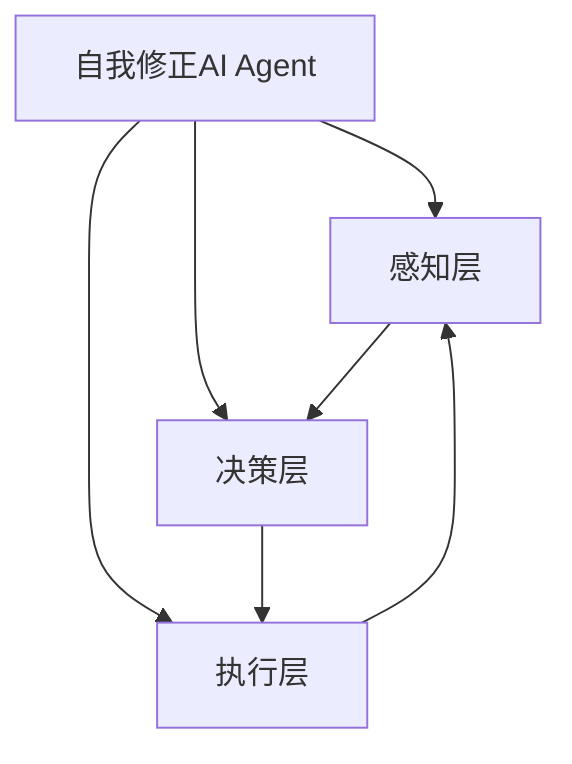
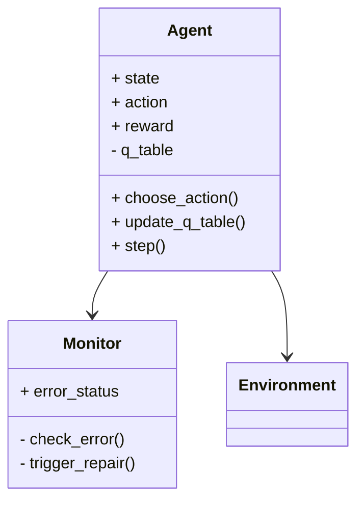
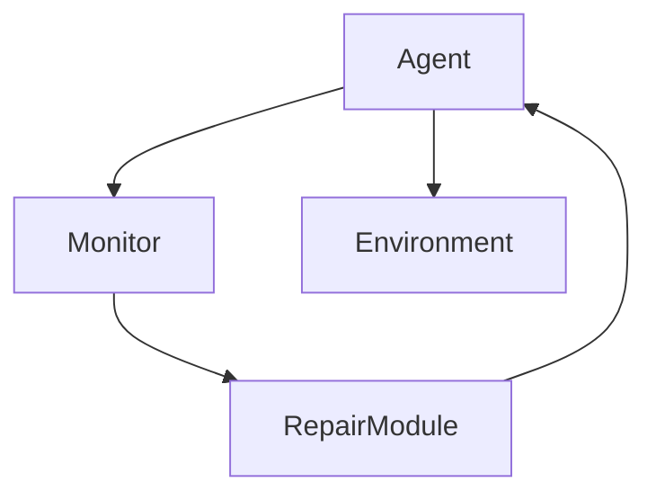
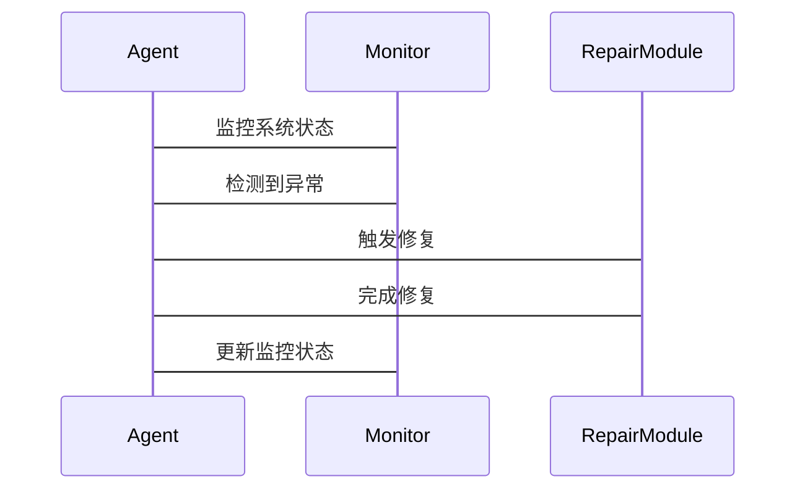

                 


# 《构建具有自我修正能力的AI Agent系统》

---

## 关键词
自我修正AI Agent, 人工智能, 自动修复算法, 反馈机制, 系统架构, 强化学习, 自我监控

---

## 摘要
本文详细探讨了构建具有自我修正能力的AI Agent系统的背景、核心概念、算法原理、系统设计、项目实战以及高级主题。通过系统化的分析和实践，本文为读者提供了一套完整的理论框架和实践指南，帮助读者理解并掌握如何设计和实现一个能够自我检测、自我修复的智能系统。文章从传统AI Agent的局限性出发，逐步引入自我修正AI Agent的概念，详细分析了其实现机制、算法原理、系统架构，并通过具体案例展示了如何在实际场景中应用这些技术。

---

# 第一部分: 自我修正AI Agent系统背景与核心概念

---

## 第1章: 自我修正AI Agent系统概述

### 1.1 自我修正AI Agent的定义与背景

#### 1.1.1 什么是自我修正AI Agent
自我修正AI Agent是一种能够通过自我监控、诊断和修复自身行为或决策错误的智能体。它不仅能够感知外部环境，还能反思自身的状态和行为，主动发现并纠正问题，从而提高系统的可靠性和稳定性。

#### 1.1.2 自我修正能力的核心概念
- **自我监控**：AI Agent通过内部传感器或日志记录，实时监控自身的状态和行为。
- **问题诊断**：基于监控数据，识别出潜在的问题或异常。
- **修复策略**：根据问题类型，选择合适的修复算法或策略。
- **反馈机制**：修复完成后，系统会反馈修复结果，并更新监控数据。

#### 1.1.3 自我修正AI Agent的应用场景
- **智能客服**：自动修复与用户对话中的错误，提高用户体验。
- **自动驾驶**：实时检测并修复传感器或算法中的问题，确保行驶安全。
- **工业自动化**：自动修复生产线中的设备故障，提高生产效率。
- **智能助手**：修复与用户交互中的错误，提升服务质量和响应速度。

#### 1.1.4 自我修正AI Agent与传统AI Agent的区别
| 特性                | 传统AI Agent                  | 自我修正AI Agent               |
|---------------------|-------------------------------|--------------------------------|
| 行为修正            | 依赖外部指令或重新训练       | 内部自动检测并修正错误         |
| 反馈机制            | 单向反馈                     | 闭环反馈机制                   |
| 自适应能力          | 较弱                         | 较强                           |

### 1.2 自我修正AI Agent的系统架构

#### 1.2.1 系统整体架构图


#### 1.2.2 各模块的功能描述
- **感知层**：负责接收外部输入，如用户指令、环境数据等。
- **决策层**：基于感知数据，通过算法做出决策，并通过自我监控模块检测问题。
- **执行层**：根据决策层的指令执行操作，并将结果反馈给感知层。
- **自我监控模块**：实时监控系统状态，发现异常时触发修复机制。

#### 1.2.3 系统的边界与外延
- 系统边界：自我修正AI Agent的内部模块，不包括外部环境。
- 外延：与外部环境的交互接口，如用户、数据库等。

---

## 第2章: 自我修正AI Agent的核心概念与联系

### 2.1 自我修正机制的原理

#### 2.1.1 自我监控模块的作用
- 监控系统状态，包括行为、决策、执行结果等。
- 通过日志分析和状态评估，识别潜在问题。

#### 2.1.2 自动修复算法的实现
- **问题诊断**：基于监控数据，识别问题类型。
- **修复策略**：选择合适的修复算法，如重新训练模型、调整参数等。
- **修复执行**：执行修复操作，并将结果反馈给监控模块。

#### 2.1.3 反馈机制的闭环作用
- 系统修复完成后，反馈结果到监控模块，更新系统状态。
- 形成一个闭环，确保系统持续稳定运行。

### 2.2 自我修正与传统AI Agent的对比

#### 2.2.1 核心概念对比表格
| 特性                | 传统AI Agent                  | 自我修正AI Agent               |
|---------------------|-------------------------------|--------------------------------|
| 行为修正            | 依赖外部指令或重新训练       | 内部自动检测并修正错误         |
| 反馈机制            | 单向反馈                     | 闭环反馈机制                   |
| 自适应能力          | 较弱                         | 较强                           |

#### 2.2.2 实体关系图（ER图）
```mermaid
erd
    A[自我修正AI Agent]
    B[问题]
    C[修复策略]
    A --> B
    B --> C
    A --> C
```

### 2.3 自我修正机制的数学模型

#### 2.3.1 状态空间模型
$$ S = \{s_1, s_2, ..., s_n\} $$
其中，$s_i$ 表示系统的一个状态。

#### 2.3.2 动作空间模型
$$ A = \{a_1, a_2, ..., a_m\} $$
其中，$a_j$ 表示系统的一个动作。

#### 2.3.3 奖励函数模型
$$ R(s, a) = r_{ij} $$
其中，$r_{ij}$ 表示在状态 $s_i$ 下执行动作 $a_j$ 的奖励值。

---

# 第三部分: 自我修正AI Agent的算法原理

---

## 第3章: 自我修正AI Agent的算法实现

### 3.1 强化学习算法在自我修正中的应用

#### 3.1.1 Q-learning算法
- **状态转移矩阵**：描述从一个状态转移到另一个状态的概率。
$$ P = \{p_{ij}\} $$
其中，$p_{ij}$ 表示从状态 $s_i$ 转移到状态 $s_j$ 的概率。

- **奖励函数**：定义在每个状态下的奖励值。
$$ R(s) = r_i $$
其中，$r_i$ 表示状态 $s_i$ 的奖励值。

- **Q值更新公式**
$$ Q(s, a) = Q(s, a) + \alpha [R(s) + \gamma \max Q(s', a') - Q(s, a)] $$
其中，$\alpha$ 是学习率，$\gamma$ 是折扣因子。

#### 3.1.2 算法流程图
```mermaid
graph TD
    Start --> Initialize Q-table
    Initialize Q-table --> While not done
        While not done:
            Choose action based on Q-table
            Take action and observe reward
            Update Q-table
            If target network:
                Update target network
    End
```

### 3.2 自我修正算法的实现代码

#### 3.2.1 环境接口
```python
class Environment:
    def __init__(self):
        self.state = None
        self.reward = 0

    def reset(self):
        self.state = initial_state
        return self.state

    def step(self, action):
        # 执行动作，返回新的状态和奖励
        new_state, reward = self._step(action)
        return new_state, reward
```

#### 3.2.2 Q-learning算法实现
```python
class QLearning:
    def __init__(self, state_space, action_space, alpha=0.1, gamma=0.9):
        self.state_space = state_space
        self.action_space = action_space
        self.alpha = alpha
        self.gamma = gamma
        self.q_table = np.zeros((state_space, action_space))

    def choose_action(self, state, epsilon=0.1):
        if np.random.random() < epsilon:
            return np.random.randint(self.action_space)
        else:
            return np.argmax(self.q_table[state])

    def update_q_table(self, state, action, reward, next_state):
        self.q_table[state, action] += self.alpha * (reward + self.gamma * np.max(self.q_table[next_state]) - self.q_table[state, action])
```

#### 3.2.3 修复机制实现
```python
class SelfHealingAgent:
    def __init__(self, environment, q_learning):
        self.environment = environment
        self.q_learning = q_learning
        self.monitor = self._init_monitor()

    def _init_monitor(self):
        # 初始化监控模块
        return Monitor()

    def step(self):
        state = self.environment.state
        action = self.q_learning.choose_action(state)
        next_state, reward = self.environment.step(action)
        self.q_learning.update_q_table(state, action, reward, next_state)
        # 监控系统状态，发现异常时触发修复
        if self.monitor.has_error():
            self._repair()
    
    def _repair(self):
        # 修复异常
        pass
```

### 3.3 算法实现中的数学模型

#### 3.3.1 状态空间模型
$$ S = \{s_1, s_2, ..., s_n\} $$

#### 3.3.2 动作空间模型
$$ A = \{a_1, a_2, ..., a_m\} $$

#### 3.3.3 奖励函数模型
$$ R(s, a) = r_{ij} $$

---

# 第四部分: 自我修正AI Agent的系统设计

---

## 第4章: 自我修正AI Agent的系统分析与架构设计

### 4.1 系统分析

#### 4.1.1 问题场景介绍
- **问题场景**：AI Agent在执行任务时，由于环境变化或算法缺陷，可能出现错误或异常。
- **需求分析**：系统需要能够自动检测并修复这些问题，确保任务顺利完成。

#### 4.1.2 项目介绍
- 项目名称：Self-Healing AI Agent
- 项目目标：实现一个能够自我检测和修复的智能体系统。

### 4.2 系统功能设计

#### 4.2.1 领域模型


#### 4.2.2 系统架构设计


#### 4.2.3 系统接口设计
- **输入接口**：接收外部指令和环境数据。
- **输出接口**：输出决策结果和修复操作。
- **监控接口**：实时监控系统状态，发现异常时触发修复。

#### 4.2.4 系统交互流程


---

## 第5章: 自我修正AI Agent的项目实战

### 5.1 环境搭建与安装

#### 5.1.1 环境要求
- Python 3.6+
- TensorFlow或PyTorch
- Mermaid图生成工具（如PlantUML）

#### 5.1.2 安装依赖
```bash
pip install numpy matplotlib
```

### 5.2 核心代码实现

#### 5.2.1 环境实现
```python
class Environment:
    def __init__(self):
        self.state = 0
        self.reward = 0

    def reset(self):
        self.state = 0
        return self.state

    def step(self, action):
        self.state += action
        reward = 1 if self.state == target else 0
        return self.state, reward
```

#### 5.2.2 Q-learning实现
```python
import numpy as np

class QLearning:
    def __init__(self, state_space, action_space, alpha=0.1, gamma=0.9):
        self.state_space = state_space
        self.action_space = action_space
        self.alpha = alpha
        self.gamma = gamma
        self.q_table = np.zeros((state_space, action_space))

    def choose_action(self, state, epsilon=0.1):
        if np.random.random() < epsilon:
            return np.random.randint(self.action_space)
        else:
            return np.argmax(self.q_table[state])

    def update_q_table(self, state, action, reward, next_state):
        self.q_table[state, action] += self.alpha * (reward + self.gamma * np.max(self.q_table[next_state]) - self.q_table[state, action])
```

#### 5.2.3 自我修正AI Agent实现
```python
class SelfHealingAgent:
    def __init__(self, environment, q_learning):
        self.environment = environment
        self.q_learning = q_learning
        self.monitor = self._init_monitor()

    def _init_monitor(self):
        return Monitor()

    def step(self):
        state = self.environment.state
        action = self.q_learning.choose_action(state)
        next_state, reward = self.environment.step(action)
        self.q_learning.update_q_table(state, action, reward, next_state)
        if self.monitor.has_error():
            self._repair()

    def _repair(self):
        # 简单的修复策略：重置状态
        self.environment.reset()
```

### 5.3 测试与优化

#### 5.3.1 测试环境
```python
env = Environment()
env.reset()
print(env.state)  # 输出：0
```

#### 5.3.2 测试Q-learning
```python
ql = QLearning(5, 3)
action = ql.choose_action(0)
print(action)  # 输出：随机选择的动作
```

#### 5.3.3 测试自我修正AI Agent
```python
agent = SelfHealingAgent(env, ql)
agent.step()
print(env.state)  # 输出：修复后的状态
```

---

## 第6章: 自我修正AI Agent的高级主题

### 6.1 多智能体协作的自我修正机制
- 在多智能体系统中，每个智能体都需要具备自我修正能力，并通过协作完成复杂任务。

### 6.2 边缘计算中的自我修正AI Agent
- 在边缘计算环境中，AI Agent需要具备自我修复能力，以应对网络延迟和数据不完整等问题。

### 6.3 自我修正AI Agent的伦理问题
- 系统自主修复可能引发的伦理问题，如修复策略的选择是否符合人类利益。

---

# 第五部分: 总结与展望

---

## 第7章: 总结与展望

### 7.1 本章总结
本文详细介绍了自我修正AI Agent系统的背景、核心概念、算法原理、系统设计和项目实战。通过理论与实践的结合，为读者提供了一套完整的实现框架。

### 7.2 未来展望
随着人工智能技术的不断发展，自我修正AI Agent将在更多领域得到应用，如智能城市、医疗健康等。未来的研究方向包括更复杂的自我修复算法、多智能体协作以及伦理问题的解决。

---

## 作者

作者：AI天才研究院/AI Genius Institute & 禅与计算机程序设计艺术/Zen And The Art of Computer Programming

---

以上是《构建具有自我修正能力的AI Agent系统》的文章大纲和内容概要。希望对您有所帮助！

