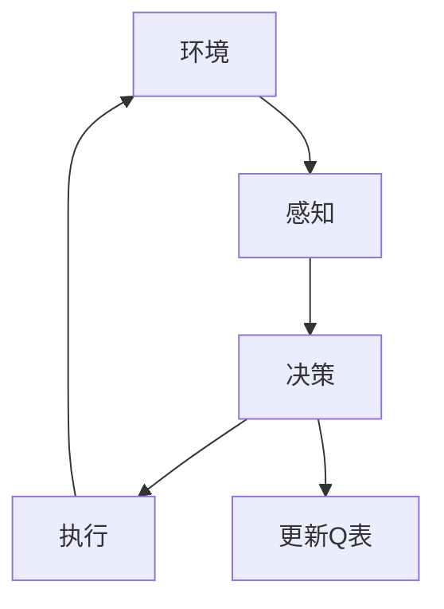
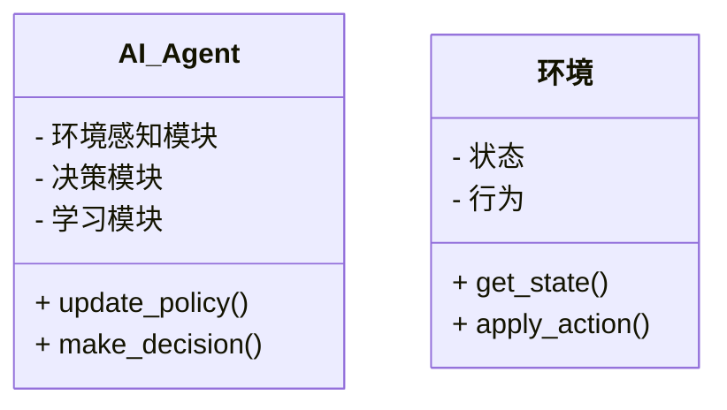
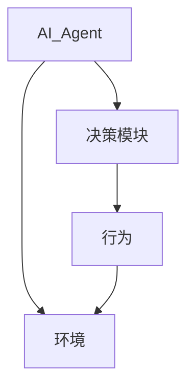
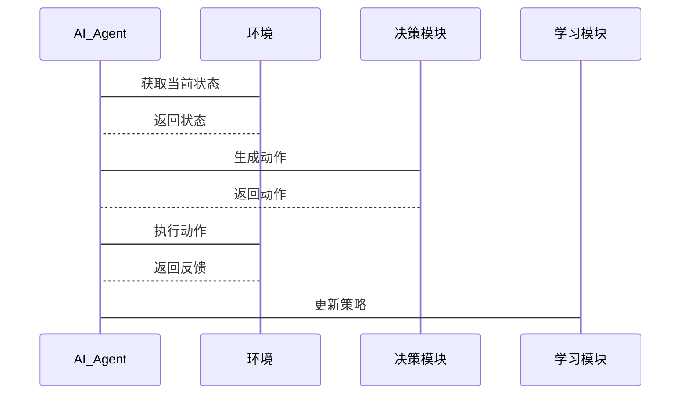

                 


# 构建具有自我学习能力的AI Agent

## 关键词：AI Agent，自我学习，机器学习，强化学习，深度学习，自然语言处理

## 摘要：  
本文详细探讨了构建具有自我学习能力的AI Agent的理论基础、算法原理和实现方法。通过分析AI Agent的核心概念、自我学习机制以及与强化学习和监督学习的结合，展示了如何通过系统设计和项目实践来实现具备自我学习能力的AI Agent。文章还提供了实际案例和代码示例，帮助读者更好地理解和应用相关技术。

---

# 第1章 AI Agent的基本概念与背景

## 1.1 AI Agent的定义与特点
### 1.1.1 AI Agent的定义  
AI Agent（人工智能代理）是指能够感知环境、做出决策并采取行动以实现目标的智能体。它能够通过与环境的交互来优化自身的行为，从而完成特定任务。  

### 1.1.2 AI Agent的核心特点  
1. **自主性**：AI Agent能够在没有外部干预的情况下自主运行。  
2. **反应性**：能够实时感知环境并做出相应的反应。  
3. **目标导向**：具有明确的目标，并通过行动来最大化目标的实现。  
4. **学习能力**：能够通过经验或数据不断优化自身的算法和策略。  

### 1.1.3 自我学习能力的必要性  
自我学习能力使AI Agent能够适应动态变化的环境，并在缺乏明确指导的情况下自主改进性能。这对于复杂场景（如自动驾驶、智能客服等）的应用至关重要。  

---

## 1.2 自我学习AI Agent的背景与应用
### 1.2.1 当前AI Agent的发展现状  
随着人工智能技术的快速发展，AI Agent已在多个领域得到广泛应用，如智能助手、游戏AI、机器人等。然而，大多数AI Agent仍依赖于预定义的规则或外部数据，缺乏真正的自我学习能力。  

### 1.2.2 自我学习在AI Agent中的作用  
自我学习能力使AI Agent能够从经验中提取知识，不断优化自身的算法和决策策略。这种能力在处理复杂、动态的环境中尤为重要。  

### 1.2.3 自我学习AI Agent的实际应用场景  
1. **自动驾驶**：通过自我学习优化路径规划和障碍物避让策略。  
2. **智能客服**：通过自我学习提高对话理解和客户满意度。  
3. **游戏AI**：通过自我学习提升游戏策略和应对复杂场景的能力。  

---

# 第2章 自我学习AI Agent的核心概念

## 2.1 自我学习的定义与原理
### 2.1.1 自我学习的定义  
自我学习是指AI Agent在没有外部监督或指导的情况下，通过与环境的交互来优化自身算法和策略的能力。  

### 2.1.2 自我学习的原理与机制  
自我学习的核心在于通过不断试错和经验积累，找到最优的行为策略。其机制通常包括感知、决策、执行和反馈四个环节。  

### 2.1.3 自我学习与监督学习的区别  
| 对比维度 | 自我学习 | 监督学习 |  
|----------|----------|----------|  
| 数据来源 | 环境交互 | 标签数据 |  
| 目标 | 优化行为策略 | 分类或回归 |  

---

## 2.2 AI Agent的感知与决策机制
### 2.2.1 感知模块的功能与实现  
感知模块负责从环境中获取信息，通常包括视觉、听觉或传感器数据。通过这些数据，AI Agent可以理解当前环境的状态。  

### 2.2.2 决策模块的逻辑与算法  
决策模块基于感知到的信息，结合预设的目标和策略，生成行动指令。常用的算法包括强化学习、Q-learning等。  

### 2.2.3 感知与决策的协同工作  
感知模块为决策模块提供输入数据，决策模块根据这些数据生成行动指令，最终通过执行模块完成行动。  

---

## 2.3 自我学习与AI Agent的结合
### 2.3.1 自我学习在AI Agent中的应用  
自我学习使AI Agent能够通过与环境的交互，不断优化自身的决策策略。例如，在游戏中，AI Agent可以通过自我学习提升游戏水平。  

### 2.3.2 自我学习与AI Agent的相互作用  
自我学习依赖于AI Agent的感知和决策能力，而AI Agent的性能又依赖于自我学习的优化能力。两者相辅相成，共同提升AI Agent的能力。  

### 2.3.3 自我学习对AI Agent性能的提升  
通过自我学习，AI Agent能够更快地适应环境变化，提高任务完成效率和准确性。  

---

## 2.4 核心概念对比表
| 对比维度 | 自我学习 | 监督学习 | 无监督学习 |  
|----------|----------|----------|------------|  
| 数据来源 | 环境交互 | 标签数据 | 无标签数据 |  
| 学习目标 | 优化行为策略 | 分类或回归 | 数据分组或聚类 |  

---

## 2.5 ER实体关系图
```mermaid
erd
  实体: AI Agent
  实体: 环境
  实体: 行为
  实体: 状态
  实体: 反馈
  关系: AI Agent与环境通过状态和行为进行交互
  关系: 反馈用于优化AI Agent的行为策略
```

---

# 第3章 自我学习AI Agent的算法原理

## 3.1 强化学习算法
### 3.1.1 强化学习的基本概念  
强化学习是一种通过试错机制来优化决策策略的方法。AI Agent通过与环境交互，获得奖励或惩罚信号，从而学习最优策略。  

### 3.1.2 Q-learning算法的实现  
Q-learning是一种经典的强化学习算法，通过维护Q表来记录状态-动作对的价值。  



### 3.1.3 Deep Q-Networks的原理  
Deep Q-Networks（DQN）通过神经网络近似Q函数，能够处理高维状态空间和动作空间。  

---

## 3.2 监督学习与无监督学习的结合
### 3.2.1 监督学习的基本原理  
监督学习通过标签数据训练模型，使其能够对新数据进行分类或回归预测。  

### 3.2.2 无监督学习的基本原理  
无监督学习通过聚类或降维等方法，发现数据中的潜在结构。  

### 3.2.3 监督与无监督学习的结合  
在某些场景下，可以结合监督和无监督学习，例如使用监督学习进行分类，同时利用无监督学习发现新的特征。  

---

## 3.3 自我学习算法的数学模型
### 3.3.1 Q-learning的数学模型  
$$ Q(s, a) = r + \gamma \max_{a'} Q(s', a') $$  

### 3.3.2 Deep Q-Networks的数学模型  
$$ Q(s) = \theta \cdot \phi(s) $$  

---

## 3.4 算法实现的Python代码示例
### 3.4.1 Q-learning算法的Python实现  
```python
import numpy as np

def q_learning(env, num_episodes=1000):
    Q = defaultdict(lambda: np.zeros(env.action_space.n))
    for episode in range(num_episodes):
        state = env.reset()
        while not done:
            action = np.argmax(Q[state])
            next_state, reward, done, _ = env.step(action)
            Q[state][action] += reward + gamma * np.max(Q[next_state])
    return Q
```

---

# 第4章 系统分析与架构设计

## 4.1 系统分析
### 4.1.1 问题场景介绍  
以自动驾驶为例，AI Agent需要通过感知环境（如车道线、障碍物等）做出决策（如转向、加速或减速）。  

### 4.1.2 项目介绍  
本项目旨在构建一个能够通过自我学习优化驾驶策略的AI Agent。  

---

## 4.2 系统功能设计
### 4.2.1 领域模型类图  


---

## 4.3 系统架构设计
### 4.3.1 系统架构图  


---

## 4.4 系统接口设计
### 4.4.1 接口描述  
AI Agent与环境之间的接口用于传递状态、动作和反馈信息。  

---

## 4.5 系统交互序列图


---

# 第5章 项目实战

## 5.1 环境安装
### 5.1.1 安装Python与相关库  
安装Python 3.8及以上版本，并安装以下库：  
- `numpy`  
- `pandas`  
- `matplotlib`  
- `seaborn`  
- `tensorflow`  

---

## 5.2 系统核心实现源代码
### 5.2.1 AI Agent的核心代码  
```python
import numpy as np
import tensorflow as tf

class AI_Agent:
    def __init__(self, state_space, action_space):
        self.state_space = state_space
        self.action_space = action_space
        self.model = self._build_model()

    def _build_model(self):
        model = tf.keras.Sequential([
            tf.keras.layers.Dense(64, activation='relu', input_dim=self.state_space),
            tf.keras.layers.Dense(self.action_space, activation='linear')
        ])
        model.compile(optimizer='adam', loss='mse')
        return model

    def make_decision(self, state):
        state = np.array([state])
        prediction = self.model.predict(state)
        return np.argmax(prediction[0])
```

---

## 5.3 代码应用解读与分析
### 5.3.1 代码功能分析  
上述代码定义了一个AI Agent类，包含构建神经网络模型和决策方法。  

### 5.3.2 代码优化建议  
可以通过增加经验回放机制和目标网络更新来优化算法性能。  

---

## 5.4 实际案例分析
### 5.4.1 案例背景  
以一个简单的迷宫导航问题为例，AI Agent需要通过自我学习找到出口。  

### 5.4.2 案例分析  
通过训练，AI Agent能够逐步优化路径，最终找到最优解。  

---

## 5.5 项目小结
通过本项目的实践，我们了解了如何将理论应用于实际，同时发现了自我学习算法在实现中的挑战和优化方向。

---

# 第6章 总结与展望

## 6.1 本章小结  
本文详细探讨了构建具有自我学习能力的AI Agent的理论基础、算法实现和系统设计，通过实际案例展示了其应用价值。  

---

## 6.2 未来展望  
随着深度学习和强化学习技术的进步，自我学习AI Agent将在更多领域得到应用，其性能和能力也将不断提升。未来的研究方向包括更高效的算法设计和更广泛的应用场景探索。  

---

# 附录

## 附录A 参考文献  
1. Sutton, R. S., & Barto, A. G. (2018). Introduction to reinforcement learning.  
2. Mnih, V., et al. (2016). Deep Q-Networks: Learning to play Atari games from scratch.  

## 附录B 工具与资源  
- Python官方文档：[https://docs.python.org/](https://docs.python.org/)  
- TensorFlow官方文档：[https://tensorflow.org/](https://tensorflow.org/)  

---

# 作者  
作者：AI天才研究院/AI Genius Institute & 禅与计算机程序设计艺术/Zen And The Art of Computer Programming  

--- 

感谢您的阅读！

